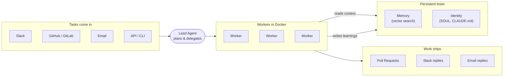
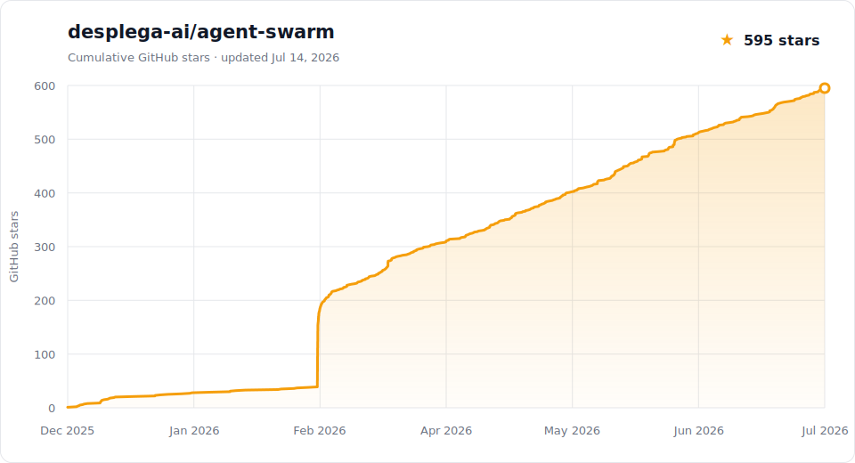

<p align="center">
  <a href="https://github.com/desplega-ai/agent-swarm/stargazers"></a>
  <a href="https://github.com/desplega-ai/agent-swarm/blob/main/LICENSE"></a>
  <a href="https://github.com/desplega-ai/agent-swarm/pulls"></a>
</p>

<p align="center">
  <b>An engine to make your company AI Native</b><br/>
  <sub>Built by <a href="https://desplega.sh">desplega.sh</a> — by builders, for builders.</sub>
</p>

> [!TIP]
> **This repo evolves every single day.** [Watch now →](https://github.com/desplega-ai/agent-swarm/subscription)

<p align="center">
  <video src="https://github.com/user-attachments/assets/e220712e-c54d-4f46-b059-bac04639d229" controls muted playsinline width="720"></video>
</p>
<p align="center">
  <sub>▸ <a href="./assets/agent-swarm.mp4">daily evolution</a> · <a href="./assets/agent-swarm-slack-to-pr.mp4">slack → pr</a> · <a href="./assets/video-source">Making of</a></sub>
</p>

<p align="center">
  <a href="https://agent-swarm.dev">
    
  </a>
  <a href="https://docs.agent-swarm.dev">
    
  </a>
  <a href="https://app.agent-swarm.dev">
    
  </a>
  <a href="https://discord.gg/KZgfyyDVZa">
    
  </a>
  <a href="https://x.com/desplegalabs">
    
  </a>
  <a href="https://www.linkedin.com/company/desplega-labs/">
    
  </a>
</p>

> **Agent Swarm is your Company's Compounding Intelligence Layer. A system of AI agents that remember, reason, act and get better with every task.**

> AI-Native · Compounds · Presence · Harness & LLM-Agnostic · Your Infra · Your Memory · 

## What it does

Agent Swarm runs a team of AI agents that coordinate autonomously. A **lead agent** receives tasks (from Slack, GitHub, GitLab, Linear, Jira, email, or the API), breaks them down, and delegates to **worker agents** running in isolated environments (Docker). Workers execute tasks, ship solutions, and write their learnings back to a shared memory so the whole swarm gets smarter every session.

You can run agents for Marketing, Product, UX, Engineering, Support, Operations, HR, Finance, or any role you can think of. A centralized Lead coordinates them, and they share the learnings horizontally. That's the true difference between [*AI First*](https://www.pleasedontdeploy.com/i/197193364/ai-first) and [*AI Native*](https://www.pleasedontdeploy.com/i/197193364/third-the-ai-native-metamorphosis).

Agent Swarm is the shared cloud brain and muscle that makes your whole company better every day.

Sometimes humans are the blocker. We can help you. Contact us [contact@desplega.sh](mailto:contact@desplega.sh).

Learn more in the [architecture overview](https://docs.agent-swarm.dev/docs/architecture/overview).



## Known Use Cases

Use cases that are used daily by ourselves and others.
Each playbook contains: the agents, the tools & skills, and workflows & schedules behind it. **[Browse all playbooks →](https://docs.agent-swarm.dev/docs/playbooks)**

- **[Feature Development](https://docs.agent-swarm.dev/docs/playbooks/feature-development)** — Integrated with Linear and GitHub to take feature requests from Slack and turn them into pull requests.
- **[Lead Prospecting](https://docs.agent-swarm.dev/docs/playbooks/lead-prospecting)** — Integrate your prospecting tools with the swarm and let agents handle outreach, scheduling, and follow-up.
- **[Content Generation](https://docs.agent-swarm.dev/docs/playbooks/content-generation)** — Generate engagement tools, blog posts, manage social media presence, update your website, and more.
- **[UX Command Center](https://docs.agent-swarm.dev/docs/playbooks/ux-command-center)** — Agents that keep your product usable: record agentic sessions, enforce your design system, and mine user logs to detect and propose UX improvements.
- **[Proactive Customer Support](https://docs.agent-swarm.dev/docs/playbooks/proactive-customer-support)** — Agents that oversee your top accounts, prepare scheduled reports, and leverage everything they know about your platform to keep those accounts up to date.
- **[Code Health & Alert Management](https://docs.agent-swarm.dev/docs/playbooks/code-health-alert-management)** — Datadog, New Relic, Sentry, or any alerting tool can kick off fixes or new proposals. Monitor code health and propose improvements weekly, daily, or hourly.
- **[Reports from Multiple Sources](https://docs.agent-swarm.dev/docs/playbooks/reports-multiple-sources)** — Integrate your data warehouse to generate tailored reports and answer the key questions your team has, with fresh data. Your BI tool may be a thing of the past.
- **[Self-Documenting & Release Reports](https://docs.agent-swarm.dev/docs/playbooks/self-documenting-release-reports)** — Update your docs and use frameworks like [Remotion](https://www.remotion.dev/), [qa-use](https://github.com/qa-use/qa-use), and [browser-use](https://github.com/browser-use/browser-use) to generate release videos and rich documentation in seconds, at the cadence you need.
- Do you have a cool playbook to share? Send us a PR!

> **The patterns that compound.** Five recipes show up in nearly every playbook — they're how the swarm stays reliable as it scales:
> **[Litmus Tests](https://docs.agent-swarm.dev/docs/playbooks/patterns/litmus-tests)** (LLM-as-judge quality gates) ·
> **[Drain Loops](https://docs.agent-swarm.dev/docs/playbooks/patterns/drain-loops)** (one ticket → a chain of reviewable PRs) ·
> **[HITL Gates](https://docs.agent-swarm.dev/docs/playbooks/patterns/hitl-gates)** (pause for human approval on irreversible steps) ·
> **[Per-Customer Working Directories](https://docs.agent-swarm.dev/docs/playbooks/patterns/per-customer-working-directories)** (context that compounds per account) ·
> **[No-op Workflows](https://docs.agent-swarm.dev/docs/playbooks/patterns/no-op-workflows)** (skip silently when nothing changed).
> **[See all patterns →](https://docs.agent-swarm.dev/docs/playbooks/patterns)**

Check [our templates](https://templates.agent-swarm.dev) for a quick start.

## Highlights

- **Lead/worker orchestration in Docker** — isolated dev environments, priority queues, pause/resume across deploys. [Architecture →](https://docs.agent-swarm.dev/docs/architecture/overview)
- **Compounding memory & persistent identity** — agents remember past sessions and evolve their own persona, expertise, and notes. [Memory →](https://docs.agent-swarm.dev/docs/architecture/memory) · [Agents →](https://docs.agent-swarm.dev/docs/architecture/agents)
- **Hybrid + graph-linked memory recall** — memory retrieval can blend vector and full-text ranking, expand through linked memories, surface usefulness readouts, and let agents correct an existing memory without losing its ID or history. [Memory →](https://docs.agent-swarm.dev/docs/architecture/memory) · [MCP tools →](https://docs.agent-swarm.dev/docs/reference/mcp-tools#memory-tools)
- **Multi-channel inputs** — Slack, GitHub, GitLab, email, WhatsApp, Linear, Jira, and the HTTP API all create tasks. [Integrations](#integrations)
- **Workflow engine with Human-in-the-Loop** — DAG-based automation with approval gates, retries, and structured I/O. [Workflows →](https://docs.agent-swarm.dev/docs/concepts/workflows)
- **Scheduled & recurring tasks** — cron-based automation for standing work, with schedules that can target agent tasks, workflows, or catalog scripts. [Scheduling →](https://docs.agent-swarm.dev/docs/concepts/scheduling)
- **Asset namespaces** — group tasks, workflows, schedules, pages, and mapped files under canonical shared or personal keys, with inheritance, subtree filtering, audited moves, and cross-entity discovery. [Asset namespaces →](https://docs.agent-swarm.dev/docs/guides/asset-namespaces)
- **Durable script workflows** — launch background script runs, inspect their journals, and track them from the dashboard when a one-shot `script-run` is too small. [Guide →](https://docs.agent-swarm.dev/docs/guides/script-workflow-runs)
- **Scripts-only MCP mode (code-mode)** — reduce the external MCP surface to eight script tools while retaining the full swarm SDK through `script-run`, cutting tool-schema context for capable coordinator models. [Guide →](https://docs.agent-swarm.dev/docs/guides/scripts-only-mode)
- **Scripts as external APIs** — expose a saved script as a public `POST /api/x/script/<id>` endpoint with optional bearer auth, typed input validation, and per-endpoint usage tracking. [Guide →](https://docs.agent-swarm.dev/docs/guides/scripts-external-apis)
- **Typed script API connections** — lead-managed OpenAPI, GraphQL, and MCP connections generate `ctx.api.*` / `ctx.mcp.*` clients for scripts, with credential bindings and OAuth-backed auth kept server-side. [Guide →](https://docs.agent-swarm.dev/docs/guides/script-connections)
- **E2B-backed eval harness** — run a scenario × harness-config matrix against real swarm stacks, capture transcripts/artifacts, and grade outcomes with deterministic checks plus LLM or agentic judges. [Guide →](https://docs.agent-swarm.dev/docs/guides/evals-harness)
- **Harness & LLM agnostic** — run with Claude Code, Claude Bridge, OpenAI Codex, pi-mono (Anthropic, OpenRouter, or Amazon Bedrock), Devin, Claude Managed Agents, raw LLMs, or opencode. Tasks, schedules, and workflow agent-task nodes can use portable `modelTier` intent (`smol`, `regular`, `smart`, `ultra`), and operators can set per-agent reasoning effort (`off` → `max`, where supported) without changing task payloads. [Harness config →](https://docs.agent-swarm.dev/docs/guides/harness-configuration) · [Add a new provider →](https://docs.agent-swarm.dev/docs/guides/harness-providers)
- **OpenTelemetry traces plus OTLP cost/token metrics** — export API + worker traces and finalized session cost/token counters through the same OTLP pipeline for dashboarding in SigNoz, Datadog, Tempo, or another compatible backend. [Observability →](https://docs.agent-swarm.dev/docs/guides/observability-opentelemetry)
- **Follow-up continuity across all harnesses** — child tasks inherit a bounded prior-task context preamble built from the task chain, so continuity survives restarts and works the same across every provider. [Task lifecycle →](https://docs.agent-swarm.dev/docs/concepts/task-lifecycle)
- **Skills & MCP servers** — reusable procedural knowledge, bundled skill reference files, and per-agent MCP servers with scope cascade. [MCP tools →](https://docs.agent-swarm.dev/docs/reference/mcp-tools)
- **External tool-router access** — the `x` command and `swarm_x` MCP tool let humans and agents execute approved third-party routes such as Composio without baking bespoke MCP servers first. [CLI →](https://docs.agent-swarm.dev/docs/reference/cli) · [Composio →](https://docs.agent-swarm.dev/docs/integrations/composio)
- **Config-driven metrics dashboards** — define read-only SQL widgets, version them, and render them in the dashboard without shipping custom frontend code. [Metrics API →](https://docs.agent-swarm.dev/docs/api-reference/stats)
- **DB-backed pages** — agents publish HTML or JSON pages (reports, dashboards, action specs) via `create_page`, remove stale pages with `delete-page`, and share them with public / authed / password modes, version history, view counters, diff helpers, and PDF export. [MCP tools → Pages](https://docs.agent-swarm.dev/docs/reference/mcp-tools#pages-tools)
- **KV store** — Redis-like namespaced key/value store with auto-scoped context (Slack thread / PR / Linear issue / page). [MCP tools → KV](https://docs.agent-swarm.dev/docs/reference/mcp-tools#kv-tools)
- **Real-time dashboard + task attachments** — monitor agents, tasks, and inter-agent chat, filter Pages, Approval Requests, and workflow definitions with URL-backed search/facets, create tasks with uploaded files from the sessions composer, and preview task attachments inline above session prompts. [app.agent-swarm.dev →](https://app.agent-swarm.dev)

## Quick Start

Need help? Contact us at [contact@desplega.sh](mailto:contact@desplega.sh).

**Prerequisites:** [Docker](https://docker.com) and at least one supported harness credential. The default quick start assumes a [Claude Code](https://docs.anthropic.com/en/docs/claude-code) OAuth token (`claude setup-token`), but pi-mono / Bedrock, Codex, Devin, and other provider setups are also supported.

The fastest way is the onboarding wizard — it collects credentials, picks presets, and generates a working `docker-compose.yml`:

```bash
bunx @desplega.ai/agent-swarm onboard
npx @desplega.ai/agent-swarm onboard
```

Prefer manual setup? Clone and run with Docker Compose:

```bash
git clone https://github.com/desplega-ai/agent-swarm.git
cd agent-swarm
cp .env.docker.example .env
# edit .env — set API_KEY plus the credential for your chosen harness (for example CLAUDE_CODE_OAUTH_TOKEN)
docker compose -f docker-compose.example.yml --env-file .env up -d
```

The API runs on port `3013`, with interactive docs at `http://localhost:3013/docs` and an OpenAPI 3.1 spec at `http://localhost:3013/openapi.json`.

<details>
<summary><strong>Other setups</strong></summary>

- **Local API + Docker workers** — run the API on your host, workers in Docker. See [Getting Started](https://docs.agent-swarm.dev/docs/getting-started).
- **Claude Code as the lead agent** — `bunx @desplega.ai/agent-swarm connect` (or `npx @desplega.ai/agent-swarm connect`), then tell Claude Code to register as the lead.

</details>

## How It Works

```
You (Slack / GitHub / Email / CLI)
        |
   Lead Agent  ←→  MCP API Server  ←→  SQLite DB
        |
   ┌────┼────┐
Worker  Worker  Worker
(Docker containers with full dev environments)
```

1. A task arrives via Slack DM, GitHub @mention, email, or the API.
2. The lead plans and delegates subtasks to workers.
3. Workers execute in isolated Docker containers (git, Node.js, Python, etc.).
4. Progress streams to the dashboard, Slack threads, or the API.
5. Results ship back out as PRs, custom pages, issue replies, or Slack messages.
6. Session learnings are extracted and become memory for future tasks.

More detail in the [task lifecycle docs](https://docs.agent-swarm.dev/docs/concepts/task-lifecycle).

## Integrations

Missing one? Ask the swarm to build it.

| Integration | What it does | Setup |
|---|---|---|
| **Slack** | DM or @mention the bot to create tasks; workers reply in threads | [Guide](https://docs.agent-swarm.dev/docs/guides/slack-integration) |
| **GitHub App** | @mention or assign the bot on issues/PRs; CI failures create follow-up tasks | [Guide](https://docs.agent-swarm.dev/docs/guides/github-integration) |
| **GitLab** | Same model as GitHub — webhooks on issues/MRs, `glab` preinstalled in workers | [Guide](https://docs.agent-swarm.dev/docs/guides/gitlab-integration) |
| **AgentMail** | Give each agent an inbox; emails become tasks or lead messages | [Guide](https://docs.agent-swarm.dev/docs/guides/agentmail-integration) |
| **Kapso (WhatsApp)** | Native inbound WhatsApp webhook routing; agents reply over WhatsApp with MCP tools or the `kapso-whatsapp` skill | [Guide](https://docs.agent-swarm.dev/docs/integrations/kapso) |
| **Composio** | Route approved third-party app operations through `agent-swarm x composio ...` or the `swarm_x` MCP tool | [Guide](https://docs.agent-swarm.dev/docs/integrations/composio) |
| **Linear** | Bidirectional ticket sync via OAuth + webhooks | [Guide](https://docs.agent-swarm.dev/docs/guides/linear-integration) |
| **Jira Cloud** | OAuth 3LO ticket sync — assignee/comment events create tasks; lifecycle posts comments back | [Guide](https://docs.agent-swarm.dev/docs/guides/jira-integration) |
| **Sentry** | Workers can triage Sentry issues with the `/investigate-sentry-issue` command | [Guide](https://docs.agent-swarm.dev/docs/guides/sentry-integration) |
| **Devin** | Devin can be a node in your swarm — keep your existing configuration | [Guide](https://docs.agent-swarm.dev/docs/guides/harness-configuration#supported-providers) |

## Dashboard

Real-time monitoring of agents, tasks, and inter-agent chat. Use the hosted version at [app.agent-swarm.dev](https://app.agent-swarm.dev), or run locally:

```bash
cd apps/ui && bun install && bun run dev
```

Opens at `http://localhost:5274`.

## [CLI](https://docs.agent-swarm.dev/docs/reference/cli)

```bash
bunx @desplega.ai/agent-swarm <command>
npx @desplega.ai/agent-swarm <command>
```

| Command | Description |
|---------|-------------|
| `onboard` | Set up a new swarm from scratch (Docker Compose wizard) |
| `connect` | Connect this project to an existing swarm |
| `api`     | Start the API + MCP HTTP server |
| `worker`  | Run a worker agent |
| `lead`    | Run a lead agent |
| `e2b`     | Build E2B templates and launch/manage grouped API + lead + worker swarms |
| `x`       | Execute approved external routes such as Composio |
| `docs`    | Open documentation (`--open` to launch in browser) |

## Deployment

For production deployments (Docker Compose with multiple workers, systemd for the API, graceful shutdown, integration config), see [DEPLOYMENT.md](./DEPLOYMENT.md) and the [deployment guide](https://docs.agent-swarm.dev/docs/guides/deployment).

## Documentation

Everything lives at **[docs.agent-swarm.dev](https://docs.agent-swarm.dev)**. Good starting points:

- [Getting Started](https://docs.agent-swarm.dev/docs/getting-started) — install, configure, and run your first task
- [Architecture overview](https://docs.agent-swarm.dev/docs/architecture/overview) — how the swarm is wired together
- [Playbooks](https://docs.agent-swarm.dev/docs/playbooks) — eight production flows we use to run Desplega, plus the patterns behind them
- [CLI reference](https://docs.agent-swarm.dev/docs/reference/cli) and [Environment variables](https://docs.agent-swarm.dev/docs/reference/environment-variables)
- [API reference](https://docs.agent-swarm.dev/docs/api-reference) — every HTTP endpoint

## Contributing

We love contributions! Whether it's bug reports, feature requests, docs improvements, or code — all are welcome.

See [CONTRIBUTING.md](./CONTRIBUTING.md) to get started. The quickest way to contribute:

1. Fork the repo
2. Create a branch (`git checkout -b my-feature`)
3. Make your changes
4. Open a PR

Join our [Discord](https://discord.gg/KZgfyyDVZa) if you have questions or want to discuss ideas.

> Are you an agent? Go to [agent-swarm.dev/skill.md](https://www.agent-swarm.dev/skill.md).

## Star History

<picture>
  <source media="(prefers-color-scheme: dark)" srcset="./assets/star-history-dark.svg" />
  <source media="(prefers-color-scheme: light)" srcset="./assets/star-history-light.svg" />
  
</picture>

The charts are generated from timestamped GitHub stargazer data and refreshed weekly through a reviewable pull request.

## License

[MIT](./LICENSE) — 2025-2026 [desplega.sh](https://desplega.sh)
