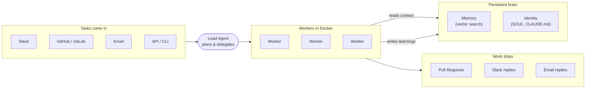

<p align="center"><a href="https://github.com/desplega-ai/agent-swarm/stargazers"></a> <a href="https://github.com/desplega-ai/agent-swarm/blob/main/LICENSE"></a> <a href="https://github.com/desplega-ai/agent-swarm/pulls"></a></p>
<p align="center"><b>An engine to make your company AI Native</b><br/><sub>Built by <a href="https://desplega.sh">desplega.sh</a>.</sub></p>

> [!TIP]
> **This repo evolves every single day.** [Watch now →](https://github.com/desplega-ai/agent-swarm/subscription)
<p align="center"><video src="https://github.com/user-attachments/assets/e220712e-c54d-4f46-b059-bac04639d229" controls muted playsinline width="720"></video></p>
<p align="center"><sub>▸ <a href="./assets/agent-swarm.mp4">daily evolution</a> · <a href="./assets/agent-swarm-slack-to-pr.mp4">slack → pr</a> · <a href="./assets/video-source">Making of</a></sub></p>
<p align="center"><a href="https://agent-swarm.dev"></a> <a href="https://docs.agent-swarm.dev"></a> <a href="https://app.agent-swarm.dev"></a> <a href="https://discord.gg/KZgfyyDVZa"></a> <a href="https://x.com/desplegalabs"></a> <a href="https://www.linkedin.com/company/desplega-labs/"></a> <a href="https://www.youtube.com/@desplega-labs/videos"></a></p>

agent-swarm.dev is an open-source operating system for AI work. A lead agent delegates goals to workers such as Claude Code or Codex. Isolated containers, shared memory, tools, schedules, and review gates preserve work across sessions.

## What you get

- A lead agent that receives work from Slack, repositories, issue trackers, email, or the API
- [Schema-validated task results](./MCP.md#send-task) for callers that need structured JSON output
- [Deferred tasks](./MCP.md#defer-task) that wake when all or any watched tasks reach an outcome, or a deadline arrives
- [Dashboard file attachments](https://docs.agent-swarm.dev/docs/ui#file-attachments) by paste, drag-and-drop, or file picker
- Workers in isolated Docker containers with development environments
- Memory and identity that persist across sessions
- Workflows, schedules, scripts, and apps for recurring work
- [Extensions](https://docs.agent-swarm.dev/docs/guides/extensions) for trusted TypeScript hooks, installed as drafts and activated by a trusted lead or operator
- [Realtime rooms](./runbooks/realtime-rooms.md) for shared page state, presence, and live channels
- Your choice of harness and models: Claude Code, Codex, pi, opencode, Devin, or ACP agents


```mermaid
flowchart LR
    subgraph IN["Tasks come in"]
        direction TB
        S["Slack"]
        G["GitHub / GitLab"]
        E["Email"]
        A["API / CLI"]
    end

    LEAD(["Lead Agent<br/>plans &amp; delegates"])

    subgraph WORKERS["Workers in Docker"]
        direction TB
        W1["Worker"]
        W2["Worker"]
        W3["Worker"]
    end

    subgraph BRAIN["Persistent brain"]
        direction TB
        MEM["Memory<br/>(vector search)"]
        ID["Identity<br/>(SOUL, CLAUDE.md)"]
    end

    subgraph OUT["Work ships"]
        direction TB
        PR["Pull Requests"]
        REPLY["Slack replies"]
        EMAIL["Email replies"]
    end

    IN --> LEAD --> WORKERS
    WORKERS -->|reads context| BRAIN
    WORKERS -->|writes learnings| BRAIN
    WORKERS --> OUT
```

## Quick Start

Give your coding agent the operator skill for Docker Compose or Kubernetes:

```bash
npx skills add desplega-ai/agent-swarm
```

Or install it as a plugin in your harness:

| Harness | Command |
|---|---|
| Claude Code | `/plugin marketplace add desplega-ai/agent-swarm` then `/plugin install agent-swarm@agent-swarm` |
| Codex | `codex plugin add https://github.com/desplega-ai/agent-swarm` (or use `npx skills` above) |
| Cursor | `/add-plugin desplega-ai/agent-swarm` |
| Gemini CLI | `gemini extensions install https://github.com/desplega-ai/agent-swarm` |
| Antigravity / Factory Droid | `droid plugin marketplace add https://github.com/desplega-ai/agent-swarm` then `droid plugin install agent-swarm@agent-swarm` |
| OpenCode, pi, Devin, Kimi, others | `npx skills add desplega-ai/agent-swarm` |

The plugin's [privacy](https://www.agent-swarm.dev/privacy) and
[terms](https://www.agent-swarm.dev/terms) links describe the Agent Swarm website and
Cloud service. The self-hosted software remains covered by the [MIT License](./LICENSE).

Or use the examples directly:

```bash
git clone https://github.com/desplega-ai/agent-swarm.git && cd agent-swarm
cp .env.docker.example .env  # Set API_KEY, a harness credential, and all eight agent UUIDs.
openssl rand -base64 32 > encryption_key
chmod 600 .env encryption_key
docker compose -f docker-compose.example.yml --env-file .env up -d
```

Read the [Compose checklist](./skills/agent-swarm/references/compose.md) before starting. API: http://localhost:3013, with `/docs` and `/openapi.json`. [Dashboard](https://app.agent-swarm.dev): connect it to your API.
Kubernetes: [install the OCI Helm chart](./charts/agent-swarm/README.md).

## Integrations

Slack · GitHub · GitLab · Linear · Jira · AgentMail · WhatsApp (Kapso) · Composio · Sentry · Devin · [Serply search](https://docs.agent-swarm.dev/docs/integrations/serply). [Integration guides](https://docs.agent-swarm.dev/docs/integrations).

## Learn more

- [Getting started](https://docs.agent-swarm.dev/docs/getting-started) · [Architecture](https://docs.agent-swarm.dev/docs/architecture/overview) · [Playbooks](https://docs.agent-swarm.dev/docs/playbooks) · [CLI](https://docs.agent-swarm.dev/docs/reference/cli) · [API reference](https://docs.agent-swarm.dev/docs/api-reference)
- [Agent templates](https://templates.agent-swarm.dev)
- Help: [contact@desplega.sh](mailto:contact@desplega.sh) · [Discord](https://discord.gg/KZgfyyDVZa)

## Contributing

Read [CONTRIBUTING.md](./CONTRIBUTING.md), fork the repository, create a branch, and open a PR. Discuss ideas on [Discord](https://discord.gg/KZgfyyDVZa).
> Are you an agent? Run `npx skills add desplega-ai/agent-swarm` or read the [operator skill](./skills/agent-swarm/SKILL.md).

## Star History

<picture><source media="(prefers-color-scheme: dark)" srcset="https://api.desplega.agent-swarm.dev/p/e3473addceb348c0bed6cb93bd5aa532" /> <source media="(prefers-color-scheme: light)" srcset="https://api.desplega.agent-swarm.dev/p/4b5cdc17c45e4a63845fb0a71ed9609c" /> </picture>

## License

[MIT](./LICENSE) · 2025-2026 [desplega.sh](https://desplega.sh)

### Feature defaults

Fresh deployments enable Slack thread renderer v2, queued Slack steering to the lead,
task steering, multi-runtime workers, RBAC, and task-tool preloading. Hybrid memory
search and graph expansion are also enabled. Explicit environment/config overrides
remain supported; see the [environment reference](https://docs.agent-swarm.dev/docs/reference/environment-variables).
When upgrading older workers, keep `MULTI_RUNTIME_ENABLED=false` until they support
runtime identities. Slack delegation rendering remains opt-in, and database retention
continues to default to dry-run.
