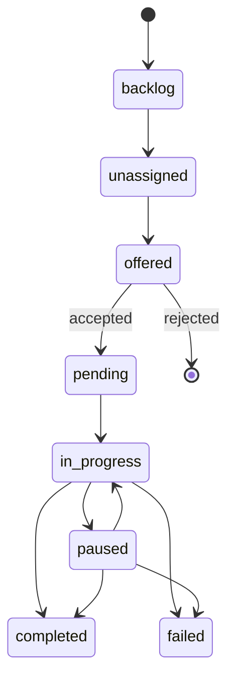

Tasks are the fundamental unit of work in Agent Swarm. Understanding the task lifecycle is essential for working with the system effectively.

## Task States



### State Descriptions

| State | Description |
|-------|-------------|
| `backlog` | Task is in the backlog, not yet ready for assignment |
| `unassigned` | Task is in the pool, available for any worker to claim |
| `offered` | Task has been offered to a specific agent, awaiting accept/reject |
| `pending` | Task has been accepted/assigned but work hasn't started yet |
| `in_progress` | Worker is actively executing the task |
| `paused` | Task was paused (e.g., during container restart) and can be resumed |
| `completed` | Task finished successfully |
| `failed` | Task could not be completed |
| `cancelled` | Task was cancelled by the lead or creator |

## Task Creation

Tasks can be created in several ways:

### Direct Assignment

The lead sends a task directly to a specific worker:

```
send-task(task: "Fix the login bug", agentId: "worker-uuid")
```

### Task Pool

Tasks can be created without assignment, going into a shared pool:

```
task-action(action: "create", task: "Review PR #42")
```

Workers claim tasks from the pool:

```
task-action(action: "claim", taskId: "task-uuid")
```

### Offer Mode

Tasks can be offered to a worker who must accept or reject:

```
send-task(task: "Refactor auth module", agentId: "worker-uuid", offerMode: true)
```

### External Sources

Tasks are automatically created from:
- **Slack** — Direct messages to the bot
- **GitHub** — @mentions, issue assignments, PR review requests
- **Email** — Messages to registered AgentMail inboxes
- **Schedules** — Cron-based recurring tasks

## Task Dependencies

Tasks can depend on other tasks:

```
send-task(
  task: "Deploy to production",
  dependsOn: ["build-task-id", "test-task-id"]
)
```

A task with dependencies won't be offered or claimable until all dependencies are completed. If an upstream task fails, is cancelled, or is superseded, its dependents are now cascade-failed with a descriptive reason instead of staying blocked forever.

## Task Properties

| Property | Description |
|----------|-------------|
| `task` | Description of what needs to be done |
| `priority` | 0-100 (default: 50). Higher priority tasks are processed first |
| `tags` | Labels for filtering (e.g., `['urgent', 'frontend']`) |
| `taskType` | Classification (e.g., `bug`, `feature`, `review`) |
| `dependsOn` | Array of task IDs that must complete first; non-success terminal parents cascade-fail their dependents |
| `parentTaskId` | For follow-up continuity — child tasks inherit a bounded prior-task context preamble rebuilt from the task chain, so continuity survives restarts and works the same across every harness |
| `followUpConfig` | Optional control over the lead follow-up created when this task completes or fails. Useful for long-running flows that need custom completion instructions or no follow-up at all |
| `dir` | Working directory (absolute path) for the agent to start in. Falls back to repo clone path or default cwd |
| `model` | Model override: `haiku`, `sonnet`, or `opus`. Priority: task > `MODEL_OVERRIDE` config > `opus` |
| `scheduleId` | Back-reference to the originating schedule (set automatically for schedule-created tasks) |
| `contextKey` | Uniform ingress-scoped key populated automatically at every ingress site. See [Context Keys](#context-keys) below |

## Context Keys

Every task created through an ingress path gets a `contextKey` stamped on it so related tasks can be grouped across channels. The format is `task:<source>:<identifiers>`:

| Source | Format | Example |
|--------|--------|---------|
| Slack | `task:slack:{channelId}:{threadTs}` | `task:slack:C0ABC:1700000000.000100` |
| AgentMail | `task:agentmail:{threadId}` | `task:agentmail:thr_abc123` |
| GitHub | `task:trackers:github:{owner}:{repo}:{issue\|pr}:{number}` | `task:trackers:github:desplega-ai:agent-swarm:pr:357` |
| GitLab | `task:trackers:gitlab:{projectId}:{mr\|issue}:{iid}` | `task:trackers:gitlab:42:mr:7` |
| Linear | `task:trackers:linear:{issueIdentifier}` | `task:trackers:linear:DES-37` |
| Schedule | `task:schedule:{scheduleId}` | `task:schedule:b9fe33cb-...` |
| Workflow | `task:workflow:{workflowRunId}` | `task:workflow:f8d42a10-...` |

Child tasks created via `parentTaskId` (including `send-task` delegations) automatically inherit their parent's `contextKey`. This enables sibling-task awareness: when a worker starts a task, its prompt surfaces recent siblings sharing the same `contextKey` so related work across ingress paths isn't missed.

In addition, follow-up tasks now receive a bounded **context preamble** built from the parent chain before execution begins. The immediate parent contributes inline task/output/artifact detail, older ancestors are included as pointers only, and the whole block is capped by `CONTEXT_PREAMBLE_MAX_TOKENS` (default: 2000) so continuity works across every harness without unbounded context growth.

The column is indexed as `(contextKey, status)` for fast sibling lookup. Historical rows remain `null` — no backfill is performed.

## Progress Tracking

Workers report progress using the `store-progress` tool:

```
store-progress(taskId: "...", progress: "Fixed the auth check, running tests now")
```

When done:

```
store-progress(taskId: "...", status: "completed", output: "PR #42 created")
```

Or on failure:

```
store-progress(taskId: "...", status: "failed", failureReason: "Tests still failing after 3 attempts")
```

For automatic or recurring tasks (schedules, heartbeat, monitors, digests), completion memories are skipped unless the task explicitly opts in with `persistMemory: true` on its final `store-progress` call.

## Graceful Shutdown & Resume

When a worker container receives SIGTERM:

1. **Grace period** — Worker waits for active tasks to complete (default: 30s)
2. **Tasks paused** — Any tasks still running are marked as `paused`
3. **State preserved** — Progress is saved to the database
4. **On restart** — Worker automatically resumes paused tasks with full context

This enables zero-downtime deployments.

## Stalled Task Auto-Remediation

The heartbeat system automatically detects and recovers stalled tasks — tasks that remain `in_progress` but whose worker has become unresponsive. When the lead agent starts up, it triggers an immediate heartbeat sweep to catch any tasks that stalled while the swarm was down.

Stalled task detection uses the heartbeat's code-level triage: if a task has been `in_progress` for longer than expected without progress updates and its assigned worker is offline, the heartbeat can reassign or fail the task as appropriate.

### Crash Recovery & Graceful Resume — Same-Agent Pin + Lead Fallback

When the heartbeat classifies a task as crashed (its worker has gone unresponsive), or when a worker is paused during graceful shutdown and needs a follow-up resume, the recovery task is **pinned back to the original agent** instead of being released to the role-blind unassigned pool. Agent IDs are stable across a restart and the original agent row survives, so the resume is reclaimed when that same agent comes back — and no wrong-specialization worker can pick it up in the meantime.

If the agent never returns, the resume stays `pending`. After `HEARTBEAT_RESUME_PIN_GRACE_MIN` (default ~10 minutes, measured from crash detection) a heartbeat reaper concludes the agent is gone and escalates: it creates a Lead-owned `task.reroute.decision` follow-up. The Lead then re-delegates the work to an explicitly chosen agent via `send-task` — the work is never returned to the pool. A resume that has already been retried up to `HEARTBEAT_MAX_RESUME_GENERATIONS` times is failed instead of escalated, to bound a flapping task.

<Callout type="info">
  Three environment variables gate this behavior:

  - `HEARTBEAT_RESUME_PIN_GRACE_MIN` (default `10`) — minutes a pinned resume waits to be reclaimed before the reaper escalates it to the Lead. Set to `0` to disable the reaper.
  - `HEARTBEAT_PIN_CRASH_RESUME` (default on) — set to `0` to restore the previous behavior, where crash-recovery resumes fall back to the unassigned pool instead of pinning to their original agent.
  - `HEARTBEAT_PIN_GRACEFUL_RESUME` (default on) — set to `0` to restore the previous behavior for graceful-shutdown resumes, sending them back through the pool instead of pinning them to the original agent.
</Callout>

## Related

- [Scheduled Tasks](/docs/concepts/scheduling) — Automate recurring task creation
- [Architecture Overview](/docs/architecture/overview) — How the task system fits into the overall architecture
- [Deployment Guide](/docs/guides/deployment) — Graceful shutdown and task resume in production
- [Tasks API Reference](/docs/api-reference/tasks) — REST API endpoints for creating, querying, and managing tasks
