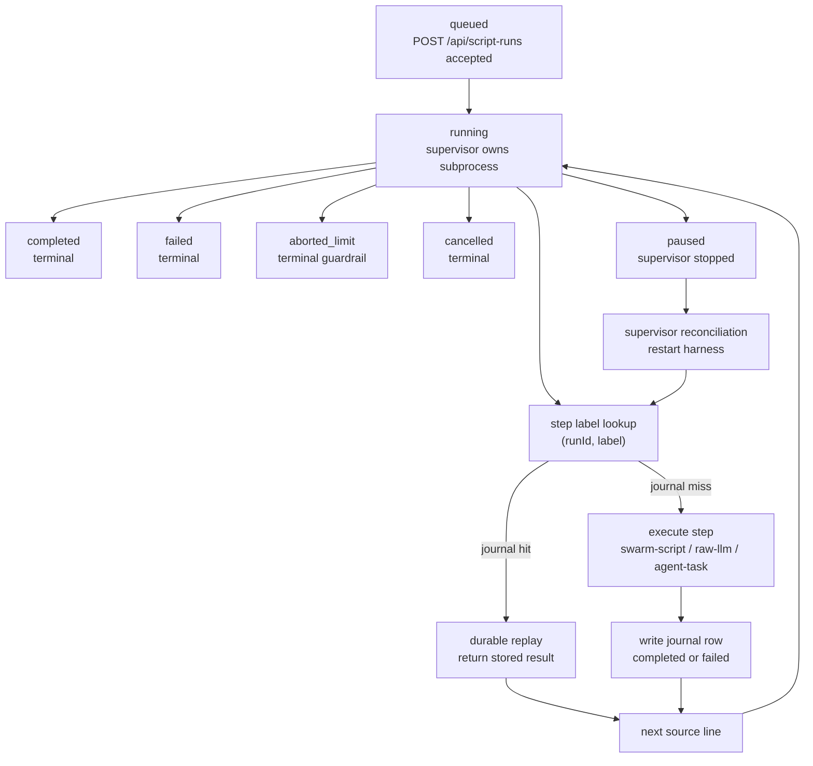

One-off Script Workflow runs give agents a workflow-shaped execution surface for ad-hoc jobs. Use them when a task needs durable multi-step execution, but the work is not yet worth turning into a named workflow definition.

They run TypeScript source, persist a `script_runs` row, execute in the background through the script-workflow supervisor, and journal each durable step in `script_run_journal`. The journal is the contract: if the process restarts or the source is re-executed from the top, completed steps are replayed by label instead of run again.

## When to use this

Use a one-off Script Workflow run when the job has more shape than a single `script-run`, for example:

- call a catalog script to gather context
- summarize or classify the result with a raw LLM call
- spawn an agent task for review or follow-up work
- inspect the run later from the dashboard, MCP tools, SDK, or API

If the job should recur on a schedule, be versioned as a product workflow, or be edited by operators, use a normal workflow definition instead.

## Launch from MCP

Load the tools with `ToolSearch` if they are not visible:

```text
launch-script-run
get-script-run
list-script-runs
```

Then launch TypeScript source:

```ts
export default async function main(args, ctx) {
  const recalled = await ctx.step.swarmScript("recall-task-context", {
    name: "task-context-gathering",
    scope: "global",
    args: {
      taskId: args.taskId,
      queries: [
        "script workflows durable runs",
        "DES-541 QA journal replay",
        "swarm scripts catalog",
      ],
    },
    intent: "script-workflow-guide-context",
  });

  const summary = await ctx.step.rawLlm("summarize-context", {
    prompt: `Summarize this task context for an operator:\n${JSON.stringify(recalled)}`,
  });

  return { recalled, summary };
}
```

Call `launch-script-run` with:

```json
{
  "scriptName": "task-context-summary",
  "idempotencyKey": "task-context-summary:20f2842c",
  "args": { "taskId": "20f2842c-dca8-4c60-be2b-b97344be940d" },
  "source": "export default async function main(args, ctx) { /* ... */ }"
}
```

The tool calls `POST /api/script-runs` with `background: true`, preserves the invoking agent identity, and returns the run ID plus dashboard URL.

## Inspect from MCP

Use `get-script-run` for a single run:

```json
{ "id": "e557714e-1e36-4a5b-b19f-8fabfc062ca8" }
```

The response includes the `run` object and `journal` entries. Each journal entry has:

- `stepKey` - the durable label
- `stepType` - `swarm-script`, `raw-llm`, or `agent-task`
- `config` - the step config recorded for audit/debugging
- `status` - `completed` or `failed`
- `result` or `error`
- timestamps

Use `list-script-runs` to find recent runs:

```json
{ "status": "completed", "agentId": "38d36438-58a0-45b5-8602-a5d52b07c2f1", "limit": 25 }
```

`status`, `agentId`, `limit`, and `offset` map directly to the list API.

## Copy-paste workflow patterns

Taras pointed at Thariq Shihipar's dynamic workflows post, ["A harness for every task"](https://x.com/trq212/status/2061907337154367865), as the motivation: use a workflow-shaped harness when a single context window is likely to drift, stop early, or verify its own work too generously. These examples adapt the post's patterns to one-off Script Workflow runs.

For each example, paste the TypeScript into `launch-script-run.source`, set the shown `args`, and give the run an `idempotencyKey` if you might launch it twice.

### Classify-and-act triage

Use this when an inbound item needs a cheap classifier before it spends agent time.

```ts
export default async function main(args, ctx) {
  const classification = await ctx.step.rawLlm("classify-item", {
    schema: {
      type: "object",
      properties: {
        kind: { type: "string", enum: ["bug", "docs", "question", "ops"] },
        urgency: { type: "string", enum: ["low", "medium", "high"] },
        nextAction: { type: "string" },
      },
      required: ["kind", "urgency", "nextAction"],
      additionalProperties: false,
    },
    prompt: `Classify this item and choose the next action:\n${args.item}`,
  });

  const result = classification.result;
  if (result.urgency !== "high") {
    return { classification: result, createdTask: false };
  }

  const followUp = await ctx.step.agentTask("high-urgency-follow-up", {
    task: `Handle this ${result.kind} item.\n\nItem:\n${args.item}\n\nRecommended action:\n${result.nextAction}`,
    priority: 80,
    tags: ["script-workflow", "triage"],
  });

  return { classification: result, createdTask: true, followUp };
}
```

Launch args:

```json
{
  "scriptName": "classify-and-act-triage",
  "idempotencyKey": "classify-and-act-triage:support-1842",
  "args": {
    "item": "Customer reports that script runs disappear from the dashboard after refresh."
  }
}
```

### Fan-out-and-synthesize verification

Use this when a post, report, or PR description has multiple claims that should be checked independently before one synthesis step.

```ts
export default async function main(args, ctx) {
  const checks = [];

  for (const [index, claim] of args.claims.entries()) {
    checks.push(
      await ctx.step.agentTask(`verify-claim-${index + 1}`, {
        task: `Verify this claim against the repo or linked source. Return pass/fail and concise evidence.\n\nClaim: ${claim}`,
        tags: ["script-workflow", "claim-check"],
        outputSchema: {
          type: "object",
          properties: {
            pass: { type: "boolean" },
            evidence: { type: "string" },
          },
          required: ["pass", "evidence"],
          additionalProperties: false,
        },
      }),
    );
  }

  const synthesis = await ctx.step.rawLlm("synthesize-verification", {
    prompt: `Summarize these independent claim checks. Call out any failed or weak claims.\n${JSON.stringify(checks, null, 2)}`,
  });

  return { checks, synthesis };
}
```

Launch args:

```json
{
  "scriptName": "fan-out-claim-verification",
  "idempotencyKey": "fan-out-claim-verification:script-workflows-post-v1",
  "args": {
    "claims": [
      "Script Workflow runs journal every ctx.step.* call by label.",
      "A repeated durable label replays the first journaled result.",
      "SCRIPT_RUN_MAX_AGENT_TASKS defaults to 50."
    ]
  }
}
```

### Loop-until-done refinement

Use this when the stop condition is qualitative and you want the run to keep a durable audit trail of each pass.

```ts
export default async function main(args, ctx) {
  let draft = args.startingDraft;
  const maxPasses = args.maxPasses ?? 3;

  for (let pass = 1; pass <= maxPasses; pass++) {
    const revision = await ctx.step.rawLlm(`revise-pass-${pass}`, {
      prompt: `Revise this draft against the rubric.\n\nRubric:\n${args.rubric}\n\nDraft:\n${draft}`,
    });
    draft = revision.result;

    const review = await ctx.step.rawLlm(`review-pass-${pass}`, {
      schema: {
        type: "object",
        properties: {
          done: { type: "boolean" },
          feedback: { type: "string" },
        },
        required: ["done", "feedback"],
        additionalProperties: false,
      },
      prompt: `Decide whether this draft satisfies the rubric.\n\nRubric:\n${args.rubric}\n\nDraft:\n${draft}`,
    });

    if (review.result.done) {
      return { done: true, pass, draft, feedback: review.result.feedback };
    }
  }

  return { done: false, passes: maxPasses, draft };
}
```

Launch args:

```json
{
  "scriptName": "loop-until-done-copy-review",
  "idempotencyKey": "loop-until-done-copy-review:homepage-hero-v1",
  "args": {
    "maxPasses": 3,
    "rubric": "Clear, specific, no invented claims, under 120 words.",
    "startingDraft": "Agent Swarm lets teams run durable agent workflows and inspect each step."
  }
}
```

### SDK launch wrapper

From a normal swarm script, launch the same source through the SDK and inspect the durable journal later:

```ts
export default async function main(args, ctx) {
  const source = `export default async function main(args, ctx) {
    const recalled = await ctx.step.swarmScript("recall", {
      name: "smart-recall",
      scope: "global",
      args: { queries: args.queries },
      intent: "sdk-launch-wrapper"
    });

    const summary = await ctx.step.rawLlm("summarize", {
      prompt: "Summarize these recalled memories for the operator:\\n" + JSON.stringify(recalled)
    });

    return { recalled, summary };
  }`;

  const launched = await ctx.swarm.script_launchRun({
    scriptName: "sdk-launched-memory-summary",
    idempotencyKey: `sdk-launched-memory-summary:${args.topic}`,
    args: { queries: [`${args.topic} gotchas`, `${args.topic} previous fixes`] },
    source,
  });

  return launched;
}
```

## SDK methods

Inside a swarm script, the same tools are exposed as SDK methods:

```ts
await ctx.swarm.script_launchRun({
  scriptName: "memory-search-as-code",
  source,
  args: { query: "DES-541 script workflows" },
  idempotencyKey: "memory-search-as-code:DES-541",
});

await ctx.swarm.script_getRun({ id });

await ctx.swarm.script_listRuns({
  status: "aborted_limit",
  limit: 10,
});
```

The SDK names use underscores/camel case because they are TypeScript method names. They proxy to the MCP tools:

| SDK method | MCP tool |
|---|---|
| `ctx.swarm.script_launchRun` | `launch-script-run` |
| `ctx.swarm.script_getRun` | `get-script-run` |
| `ctx.swarm.script_listRuns` | `list-script-runs` |

## API flow

The public launch/inspect API is:

- `POST /api/script-runs` - create a run and, with `background: true`, start the supervisor subprocess
- `GET /api/script-runs` - list runs, optionally filtered by `status` and `agentId`
- `GET /api/script-runs/{id}` - return the run and journal
- `DELETE /api/script-runs/{id}` - cancel a running run; terminal runs are left unchanged

The internal journal flow is:

1. The launch endpoint creates a `script_runs` row with status `running`.
2. The supervisor starts the harness subprocess and records `pid` plus `lastHeartbeatAt`.
3. `ctx.step.*` checks `GET /api/internal/script-runs/{runId}/steps/{stepKey}` before executing.
4. If a journal entry exists, the step returns the stored result.
5. If no journal entry exists, the step executes and writes through `POST /api/internal/script-runs/{runId}/steps`.
6. When the subprocess exits, the supervisor marks the run `completed` or `failed`.

This is why step labels matter. A label is not display text. It is the durability key for that logical step.

## Step types

`ctx.step.rawLlm(label, config)` runs one raw LLM call and journals the response.

`ctx.step.swarmScript(label, config)` calls the reusable scripts runtime. It can run a named catalog script:

```ts
await ctx.step.swarmScript("daily-ops-snapshot", {
  name: "compound-insights",
  scope: "global",
  args: { hours: 24 },
});
```

or an inline script:

```ts
await ctx.step.swarmScript("normalize-records", {
  source: "export default async function main(args) { return args.rows.map((row) => row.id); }",
  args: { rows },
  intent: "normalize-records",
});
```

`ctx.step.agentTask(label, config)` creates or waits for a swarm task as a durable step. The output of the task becomes the journaled result.

`ctx.step.humanInTheLoop()` exists in the type surface but is stubbed in Script Workflows v1.

## Lifecycle

The persisted run lifecycle is a small state machine, while each `ctx.step.*` call follows the journal lookup path shown inside `running`.



Persisted statuses:

| Status | Meaning |
|---|---|
| `running` | The run is active or waiting for the supervisor to resume it. |
| `paused` | The run was stopped and can be resumed by supervisor reconciliation. |
| `completed` | The script finished and `output` may be present. |
| `failed` | The script ended with an error. |
| `cancelled` | The run was cancelled before completion. |
| `aborted_limit` | A runtime guardrail stopped the run. |

Terminal statuses are `completed`, `failed`, `cancelled`, and `aborted_limit`.

`label_lint_violation` is not a persisted run status. It is a launch-time rejection from `POST /api/script-runs` when the source contains an obvious repeated literal step label inside a loop.

## Durability and replay

Every `ctx.step.*` call follows the same durable pattern:

```text
look up journal row by (runId, label)
if found: return stored result
if missing: execute step, write result or error, return/throw
```

In live QA, a run called `ctx.step.swarmScript("durable-double", ...)` twice with different source. The second call returned the first journaled result, and the run kept exactly one `durable-double` journal row. That behavior is intentional: label reuse means "this is the same logical step", not "run another step with the same name".

For loops, include an item identifier in the label:

```ts
for (const item of args.items) {
  await ctx.step.agentTask(`review-${item.id}`, {
    task: `Review ${item.name}`,
  });
}
```

Do not do this:

```ts
for (const item of args.items) {
  await ctx.step.agentTask("review", {
    task: `Review ${item.name}`,
  });
}
```

That pattern is rejected at launch with `label_lint_violation` when the lint can detect the repeated literal label.

## Guardrails

Script Workflow runs are intended for bounded one-off work. The runtime enforces limits:

| Guardrail | Default | Effect |
|---|---:|---|
| `SCRIPT_RUN_MAX_STEPS` | `1000` | Maximum total journal entries for one run. |
| `SCRIPT_RUN_MAX_AGENT_TASKS` | `50` | Maximum `agent-task` journal entries for one run. |
| `SCRIPT_RUN_MAX_WALL_MS` | `86400000` | Maximum wall-clock runtime before supervisor abort. |

When a run exceeds a limit, the supervisor records `aborted_limit` and stores the limit message in `run.error`. The deployed QA path confirmed the `SCRIPT_RUN_MAX_AGENT_TASKS` default by writing the 51st `agent-task` journal row and ending the run with `SCRIPT_RUN_MAX_AGENT_TASKS exceeded (51/50)`.

## Dashboard

The dashboard has a Script Runs section at `/script-runs`.

Use the list view to scan recent runs by status, script name, agent, start time, and journal count. Open a run to inspect the source, args, output/error, heartbeat, and each journaled step.

## Related

- [Scripts runtime](/docs/guides/scripts-runtime)
- [Workflows](/docs/concepts/workflows)
- [Receipts](/docs/receipts)
- [Script Runs API reference](/docs/api-reference/script-runs)
- [MCP tools reference](/docs/reference/mcp-tools)
