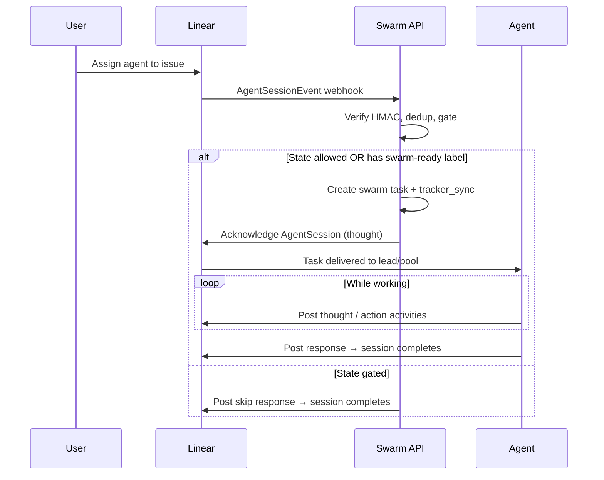

Agent Swarm integrates with [Linear](https://linear.app) as an inbound issue-tracker source: assigning the agent to a Linear issue creates a swarm task and a Linear AgentSession. Activity flows back into the AgentSession as `thought` / `action` / `response` / `error` events.

<Callout type="info">
**Sync direction is INBOUND-ONLY** (Linear → swarm). Inbound webhooks create and update swarm tasks. Outbound state changes (e.g. moving an issue to "Done", adding labels, posting plain comments outside an AgentSession) are **not** automatic — see [Outbound updates](#outbound-updates) below.
</Callout>

## What it does

- **Inbound on assignment.** When a user assigns the Linear agent integration to an issue, Linear fires an `AgentSession` webhook. The handler creates a swarm task linked to the session.
- **State-gated task creation.** Only issues whose `WorkflowState.type` is in the configured allowlist trigger a task. By default that's `unstarted, started, completed, canceled` — i.e. everything except `triage` and `backlog`. Skipped assignments leave a comment on the AgentSession explaining how to retry.
- **Label override.** A label on the issue (default `swarm-ready`, configurable) bypasses the state gate so users can pre-stage backlog issues to auto-trigger when assigned.
- **AgentSession activity stream.** The agent posts thoughts, actions, responses, and errors back to the AgentSession in real time. A `response` activity auto-completes the session.
- **Webhook signing + dedup.** Inbound webhooks are HMAC-SHA256 verified and deduped by the `Linear-Delivery` header (5-minute TTL).
- **Dashboard linking.** `externalUrls` on each session link to the swarm dashboard's task page.

## Setup

### 1. Create a Linear OAuth App

1. Go to **Linear → Settings → API → Applications** and create a new application:
   - **Actor**: Application
   - **Callback URL**: `<MCP_BASE_URL>/api/trackers/linear/callback`
   - **Webhook URL**: `<MCP_BASE_URL>/api/trackers/linear/webhook`
2. Enable **Agent session events** in the webhook settings.

<Callout type="info">
These URLs are built from `PUBLIC_MCP_BASE_URL` when it is set, falling back to `MCP_BASE_URL` otherwise. In split deploys where `MCP_BASE_URL` is an internal/cluster address, set `PUBLIC_MCP_BASE_URL` to the public ingress origin so Linear can reach the callback and webhook.
</Callout>

3. Copy the Client ID, Client Secret, and Webhook Signing Secret.

### 2. Configure environment

Add to your `.env`:

```bash
# Required — OAuth + webhook auth
LINEAR_CLIENT_ID=your-client-id
LINEAR_CLIENT_SECRET=your-client-secret
LINEAR_REDIRECT_URI=http://localhost:3013/api/trackers/linear/callback
LINEAR_SIGNING_SECRET=your-webhook-signing-secret

# Optional — gate config (defaults shown)
LINEAR_ALLOWED_STATES=unstarted,started,completed,canceled
LINEAR_SWARM_READY_LABEL=swarm-ready

# Optional — disable the integration entirely
# LINEAR_DISABLE=true
```

With portless dev mode (`bun run dev:http`):

```bash
LINEAR_REDIRECT_URI=https://api.swarm.localhost:1355/api/trackers/linear/callback
```

### 3. Complete OAuth

Start the server and visit `<MCP_BASE_URL>/api/trackers/linear/authorize` in a browser to complete the OAuth flow. The token is encrypted at rest in `swarm_config`.

## How it works

### Inbound flow



### State gate

When an issue is assigned, the handler resolves the issue's `WorkflowState.type` and label list. The decision is:

| Condition | Result |
|---|---|
| Issue has the `swarm-ready` label (or your `LINEAR_SWARM_READY_LABEL` value) | **Create** — label override |
| `state.type` ∈ `LINEAR_ALLOWED_STATES` | **Create** — ready |
| `state.type` is unset / null | **Create** — fail-open |
| `state.type` ∉ allowlist | **Skip** — post a response on the AgentSession explaining how to retry |

`LINEAR_ALLOWED_STATES` is a comma-separated list of Linear `WorkflowState.type` values. The full enum is `triage, backlog, unstarted, started, completed, canceled`. Whitespace and case are normalized.

Examples:

```bash
# Default: skip Backlog and Triage
LINEAR_ALLOWED_STATES=unstarted,started,completed,canceled

# Only trigger when actively in progress
LINEAR_ALLOWED_STATES=started

# Open the gate completely (skip everything → only label override works)
LINEAR_ALLOWED_STATES=
```

The Linear `AgentSessionEvent` payload doesn't include state or labels, so the handler issues a small GraphQL query (`issue.state.type` + `labels.nodes.name`) to resolve them. If the OAuth token is missing, the gate fails open.

### Skip message

When the gate skips an assignment, the agent posts a `response` activity to the AgentSession (which auto-completes it):

> Agent Swarm received the assignment but skipped — this issue is in Backlog.
>
> To trigger work, move it to an allowed workflow state (e.g. **Todo** or **In Progress**), or add the `swarm-ready` label and re-assign the agent.

This is a deliberate design choice: silent no-ops on assignments are confusing. Always leave a trace.

### Issue updates

Linear `Issue` updates that target a tracked issue refresh the swarm task's tracker metadata. State transitions:

| Linear state | Swarm action |
|---|---|
| `Backlog` | log only, no status change |
| `Todo` | log only |
| `In Progress` | log only |
| `Done` | log only — agent decides when work is done |
| `Canceled` / `Cancelled` | cancel the swarm task |
| Issue deleted | cancel the swarm task |

### Follow-up messages

When a user sends a message in the Linear agent chat after the original task is done:

1. Linear fires a `prompted` AgentSessionEvent.
2. The handler creates a new swarm task with the follow-up context, repointing the existing `tracker_sync` to it.
3. The agent processes the follow-up via the normal task lifecycle.

If the original task is still in flight, the handler posts a `thought` activity acknowledging the message but does **not** create a new task — the message is folded into the existing run.

### Stop signal

If the user clicks the stop button in Linear, the agent activity carries `signal: "stop"`. The handler cancels the active swarm task and ends the session with a "Task cancelled by user." response.

## Outbound updates

The webhook integration is one-way. To **push** updates back to Linear from the swarm — creating issues, transitioning states, posting comments outside an AgentSession — use the [`linear-interaction` skill](#related-skills--references). The skill wraps the Linear GraphQL API:

```graphql
mutation IssueCreate($input: IssueCreateInput!) {
  issueCreate(input: $input) { issue { id identifier } }
}

mutation IssueUpdate($id: String!, $input: IssueUpdateInput!) {
  issueUpdate(id: $id, input: $input) { success }
}

mutation CommentCreate($input: CommentCreateInput!) {
  commentCreate(input: $input) { comment { id } }
}
```

Authentication uses the swarm's OAuth token from `swarm_config` (stored encrypted under `LINEAR_OAUTH_TOKEN`). The lead agent fetches it via `db-query`; worker agents request it from the lead.

For activity within an existing AgentSession (the agent's running task), use the helpers in `src/linear/sync.ts` — `postAgentSessionResponse`, `postAgentSessionThought`, `postAgentSessionAction`, `postAgentSessionError`. These don't need the skill; they're called directly from the worker session.

## MCP tools

| Tool | Description |
|---|---|
| `tracker-status` | Check tracker connection status |
| `tracker-link-task` | Link a swarm task to a Linear issue |
| `tracker-unlink` | Remove a tracker link |
| `tracker-sync-status` | View sync status for linked items |
| `tracker-map-agent` | Map a swarm agent to a Linear user for assignment routing |

## Architecture

The integration sits on top of a generic tracker abstraction shared with Jira and (eventually) others:

- `src/oauth/` — Reusable OAuth module with `oauth_apps` / `oauth_tokens` tables and PKCE support.
- `src/be/db-queries/tracker.ts` — Generic `tracker_sync` and `tracker_agent_mapping` tables.
- `src/linear/` — Linear-specific webhook handler (`webhook.ts`), AgentSession sync (`sync.ts`), state gate (`gate.ts`), and prompt templates (`templates.ts`).

The state gate is exposed as a pure function (`shouldCreateTaskFromLinearEvent` in `src/linear/gate.ts`) so it can be unit-tested without spinning up the API.

## Related skills & references

- **`linear-interaction` skill** — canonical procedure for pushing outbound updates (create issues, change status, comment) via the Linear GraphQL API. Invoke with the `Skill` tool.
- **[Linear API docs](https://developers.linear.app/docs)** — GraphQL schema and authentication reference.
- **[`@linear/sdk`](https://github.com/linear/linear/tree/master/packages/sdk)** — official TypeScript SDK; the swarm uses raw `fetch` against the GraphQL endpoint, but the SDK's type definitions are the canonical reference for payload shapes.

## Related docs

- [Environment Variables](/docs/reference/environment-variables) — full env reference
- [Task Lifecycle](/docs/concepts/task-lifecycle) — how tasks created from Linear flow through the swarm
- [Architecture Overview](/docs/architecture/overview) — system architecture including integrations
