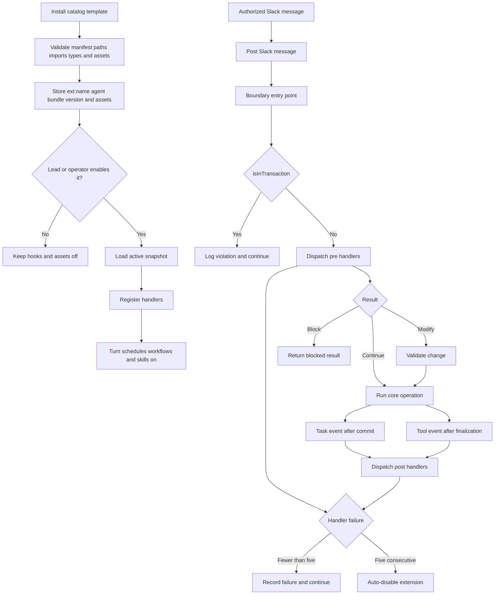

# Extension system

Operator guide: [docs-site guides/extensions.mdx](../docs-site/content/docs/(documentation)/guides/extensions.mdx).

Extensions are trusted TypeScript hooks that run inside the API server.
Each extension bundle contains a manifest and the files it references.
A bundle has one API runtime hooks file (`assets.hooks`) and can also ship scripts, schedules, workflows, and skills.
Extensions install only from the predefined catalog in `templates/extensions/`.

## Lead activation and trust

Extensions are trusted in-process code with no host isolation. A lead that can
both install and activate a bundle has code execution with API-server-process
privileges, including its filesystem, network, and secrets. Import checks,
TypeScript checks, SDK permissions, and handler timeouts are not a sandbox.

`EXTENSION_ALLOW_LEAD_ACTIVATION` defaults to `true` to preserve autonomous lead
lifecycle control. Operators who do not accept that trust must set
`EXTENSION_ALLOW_LEAD_ACTIVATION=false` (or `0`) in the **API server deployment
environment** and restart every API replica. This restores operator/dashboard-user-only
`extension.activate` access for enable, disable, and activate-version, across REST,
MCP, and the script SDK. It also denies lead-equivalent extension identities.
Any authenticated agent can install a draft, recorded under its `createdByAgentId`.
Workers can update and delete only their own extensions; enable, disable, and
activate-version remain denied to workers. Leads retain access to all bundles. This reserved key cannot be set through `swarm_config`, `set-config`,
or the dashboard; agents cannot turn the gate back on through those APIs.

The default accepts server-process execution by trusted leads as part of the
requested lifecycle feature. Restricting activation to a lead's own bundles would
not prevent execution of code that lead installed. The switch is an admission
control, not containment or revocation: already-enabled code continues to run,
including on restart, and existing code/configuration update paths remain available.
To stop existing extensions, an operator must disable them; imported modules can
retain side effects, so review the installation and restart the API as needed.

With permission auditing enabled, `permission_audit` records allow/deny decisions
for `extension.activate` with the calling agent in `principalId`. The batched
permission writer is best-effort and can be disabled via `RBAC_AUDIT_DISABLED`.
Agent lifecycle requests also write `lifecycle.enable.requested`,
`lifecycle.disable.requested`, or `lifecycle.activate-version.requested` to
`extension_runs`, with the calling `agentId` and target version, before lifecycle
side effects. These are request records, not success receipts; load failures get
separate `load-error` records. The run log retains only the newest 500 entries and
is deleted on uninstall. Neither log is tamper-proof against in-process code.

## Ownership and drafts

`extension.write` is resource-scoped: workers may create bundles, stage new
versions of their own bundles, and PATCH or DELETE their own disabled extensions.
Leads, operators, and dashboard users keep access to all bundles. Reinstalling a
name owned by another agent (or by an operator) does not transfer ownership.
`createdByAgentId` stays the original creator; every version records its writer as
`changedByAgentId`. GET and `extension-list` expose the creator. The separate
`agentId` belongs to the extension's runtime identity, not its owner.

A new install has `enabled=false` and `status=disabled`. Its `ext:<name>` runtime
agent exists but stays offline. Validation typechecks source without importing it,
so the hooks stay inert until a lead, operator, or dashboard user enables them.
Bundled scripts are live from install. Bundled schedules, workflows, and skills stay off until enable; see [Assets](#assets). An agent's subsequent version stays
inactive until explicitly activated. For enabled extensions, workers cannot PATCH
or change config/priority through reinstall: those changes reload live code.
They can stage code-only versions without replacing the active snapshot.

## Lifecycle

### Install from the catalog

`POST /api/extensions/install` takes only `{ template, priority?, config? }`.
`template` names a directory in `templates/extensions/`.
A body with `manifest` or `files` returns 400 `inline_install_disabled`.
An unknown template returns 404 `extension_template_not_found`.
`GET /api/extensions/catalog` and the `extension-catalog` MCP tool list the templates with asset counts, README, and installed state.
The dashboard catalog page is `/settings/extensions/new`.

The install route performs these checks:

1. Look up the template in the embedded catalog.
2. Authorize the creator or owner.
3. Parse the manifest with `ExtensionManifestSchema`. Reject unsafe bundle paths, missing referenced files, and unreferenced files. A skill directory may hold only `SKILL.md` and `files/**`.
4. Reject the worker runtime.
5. Reject relative, unapproved, and computed imports in the hooks file.
6. Typecheck the hooks file against `swarm-extension.d.ts`.
7. Preflight every asset outside any transaction. Scripts: import allowlist, typecheck, signature, and args schema. Schedules: timing. Workflows: parse with `ExtensionWorkflowFileSchema`, check the name prefix, and run `validateDefinition` against the executor registry. Skills: parse the `SKILL.md` frontmatter and check the name prefix.
8. In one transaction, create the `ext:<name>` agent, recheck worker ownership, and store the bundle and an immutable version snapshot. Write the assets in the same transaction when the installed version is active.

Any failure writes nothing.
An asset name that already belongs to a script, schedule, workflow, or skill outside this extension fails install with 400 `extension_validation_failed`.
The skill check covers every scope, so an extension skill never shadows an agent or swarm skill.
The response adds `assets: { created, updated, skipped, deleted, detached }`.
`assets` is `null` when the installed version is staged, not active.

An MCP install uses the same REST route.
A new install stores a disabled draft. Agent updates store inactive versions of existing bundles.
A lead, operator, or dashboard user can enable the draft with `extension-enable`.
The MCP and script SDK surfaces also expose `extension-disable`, `extension-activate-version`, and `extension-delete`.
Deletion requires disabling the extension first; workers may delete their own disabled bundles.

### Manifest format

A template directory holds exactly one `manifest.yaml`, `manifest.yml`, or `manifest.json`.
`src/extensions/manifest-format.ts` parses YAML with `Bun.YAML.parse`.
The directory name must equal the manifest `name`.
Every file the manifest references must exist.
The generator embeds the directory's `README.md`.

`templates/extensions/manifest.schema.json` is the JSON Schema for editors.
A YAML manifest references it with `# yaml-language-server: $schema=../manifest.schema.json`.
A JSON manifest references it with `"$schema": "../manifest.schema.json"`.

The manifest can declare four asset lists besides `hooks`:

- `assets.scripts[]`: `name`, `file`, `description`, and optional `intent` (defaults to `description`).
- `assets.schedules[]`: `name`, optional `description`, `script`, exactly one of `cronExpression` or `intervalMs`, optional `timezone` (default `UTC`), and optional `args`.
- `assets.workflows[]`: `file`, the bundle path of a YAML or JSON workflow file.
- `assets.skills[]`: `dir`, a bundle directory that holds `SKILL.md` and optional `files/**`.

A workflow file matches `ExtensionWorkflowFileSchema`: optional `$schema`, `name`, optional `description`, `definition`, and optional `triggers`, `cooldown`, `input`, and `triggerSchema`.
The name comes from the file, not the manifest.
A skill's name comes from the `SKILL.md` frontmatter.
Each file under `<dir>/files/` becomes a skill file, with its path relative to `files/`.

`ExtensionManifestSchema` adds refinements on top of the shape:

- Every script and schedule name starts with `<extension name>-`.
- A schedule's `script` must be declared in `assets.scripts`.
- A schedule sets exactly one of `cronExpression` or `intervalMs`.
- Names do not repeat within a kind.

The workflow `name` and the `SKILL.md` frontmatter `name` must also start with `<extension name>-`.
Those names live in the asset files, so the manifest schema cannot check them.
The catalog generator (`src/extensions/catalog-build.ts`) and install preflight check them instead.
The JSON Schema does not contain any of these rules.
The catalog generator and install enforce them.

### Add a predefined extension

1. Create `templates/extensions/<name>/` with one manifest, the hooks file, any script, workflow, and skill files, and a `README.md`.
2. Add the `$schema` reference to the manifest.
3. Start every script, schedule, workflow, and skill name with `<name>-`.
4. Run `bun scripts/extensions/install-template.ts <name> --validate-only` to check the working-tree template.
5. Run `bun run build:extension-catalog` and commit `src/extensions/catalog.generated.json`.
6. Add a row to `templates/extensions/README.md`.
7. Rebuild the API. The binary embeds the catalog and never reads `templates/` at runtime.

`templates/extensions/task-digest/` is the reference bundle with assets.
It ships the `task-digest-collect` script and the `task-digest-daily` schedule (cron `0 9 * * *`, UTC).
It also ships the `task-digest-report` workflow (`workflows/report.yaml`) and the `task-digest-guide` skill (`skills/task-digest-guide/`).
The workflow has one `swarm-script` node that calls `task-digest-collect` and no triggers, so you trigger it by hand.
The skill bundles `files/example-output.json`.

### Generated files

| File | Source | Build | CI check |
|---|---|---|---|
| `src/extensions/catalog.generated.json` | `templates/extensions/*/` | `bun run build:extension-catalog` | `bun run check:extension-catalog` |
| `templates/extensions/manifest.schema.json` | `ExtensionManifestSchema` in `src/types.ts` | `bun run build:extension-schema` | `bun run check:extension-schema` |

The Lint and Type Check job runs both checks.
Never hand-edit either file.

### Assets

`src/be/extensions/assets.ts` owns asset writes.
Migration `159_extension_assets.sql` adds the `extension_assets` provenance table: one row per asset the extension created.
`seededHash` is the hash of what install wrote, without the enabled flag.
A live asset whose hash still matches is pristine. Otherwise a user edited it.
`enabledBefore` holds the schedule, workflow, or skill state to restore at the next enable.

Each kind is an adapter in `assets.ts`. The hash covers these fields:

| Kind | Hash covers |
|---|---|
| Script | Source |
| Schedule | Name, description, script, timing, timezone, and args |
| Workflow | Name, description, definition, triggers, cooldown, input, and `triggerSchema` |
| Skill | `SKILL.md` content and every bundled file |

Scripts are global and owned by the `ext:<name>` agent (`createdByAgentId`).
Scripts have no enabled state.
They are live and callable from install, and `script-run` does not check extension state.
Schedules use `targetType: script` and run as the `ext:<name>` agent.

Workflows are created with `enabled: false` (`createWorkflow` takes an optional `enabled`) and `createdByAgentId` set to the `ext:<name>` agent.
A disabled workflow ignores its triggers, and a manual trigger returns 400 `Workflow is disabled`.
A `swarm-script` node can call the extension's own scripts, because reconcile writes scripts first in the same transaction.

Skills are created with `scope: "global"`, `type: "personal"`, `ownerAgentId` set to the `ext:<name>` agent, `systemDefault: false`, and `isEnabled: false` (`SkillInsert` takes an optional `isEnabled`).
Bundled files are written with `upsertSkillFiles`.
The scope is global, not swarm, on purpose.
A swarm-scope skill resolves for every agent.
A global skill resolves for an agent only when it is installed on that agent (`agent_skills`) and enabled (`getAgentSkills` in `src/be/db.ts`).
So enabling an extension never changes which skills an agent sees.
Extensions do not install their skills on agents.
The operator enables the extension, then installs the skill on each agent with the existing skill tools (`skill-install`).
`skill-install` refuses a disabled skill, so enable the extension first.

| Action | Scripts | Schedules, workflows, and skills |
|---|---|---|
| Install (active version) | Created and callable at once | Created disabled |
| Install (staged version) | No change until activation | No change until activation |
| Enable | No change | First enable turns them on. Later enables restore the state recorded at disable, so an asset a user turned off stays off. |
| Disable | No change; still callable | Turned off. The live state is recorded first. |
| Upgrade | Pristine scripts update. Edited ones stay and report as `skipped`. | Same rule. A new asset turns on at the next enable. |
| Upgrade, asset dropped from the manifest | Deleted if pristine, detached if edited | Same rule |
| Uninstall (disabled only) | Deleted if pristine, detached if edited | Same rule |

An upgrade is `activate-version` or an install that activates the new version.
It applies the seed runner's three-way rule (`src/be/seed/runner.ts`).
Detach keeps the live asset and drops its `extension_assets` row.
Writes run in dependency order: scripts, schedules, workflows, skills.
Removal runs in reverse: skills, workflows, schedules, scripts.
`DELETE /api/extensions/{id}` returns `{ deleted: true, assets: { deleted, detached } }`.

### Extensions installed inline

Extensions installed from inline bundles before the catalog keep loading, enabling, disabling, and uninstalling.
They have no asset rows.
They cannot receive new inline versions.
Installing a catalog template with the same name appends a version to the existing extension.

### Load and reload

Install creates the `ext:<name>` system agent. Enable ensures it exists.
The agent row keeps `isLead: false`, so lead selection never picks it.
On load the dispatcher registers the agent in `src/rbac/elevated-agents.ts`, and the legacy policy treats it as a lead for tool calls (Slack posting, task creation, and other lead-only verbs). Dispose revokes it.
The system agent stays offline and has a zero task limit.
The loader writes the active snapshot to a process-specific temporary directory.
It creates runtime shims and imports the TypeScript module in process.
It validates `configJson` against the optional exported Zod schema.
It then registers the module's handlers.
Enable turns the schedules, workflows, and skills on only after the hooks load, so a load error leaves them off.

Enable and disable update the local registry immediately.
An operator install reloads an enabled extension immediately.
An authorized lead/operator/dashboard-user PATCH reloads an enabled extension immediately.
Version activation reloads the extension when it is enabled.
A 30-second poll detects database changes from another API process.
This poll does not provide coordinated multi-replica execution.

Disable turns off the schedules, workflows, and skills, removes all registered handlers, and marks the system agent offline.
Uninstall requires a disabled extension. It deletes its stored history, deletes pristine assets, and detaches edited ones.



## Dispatch contract

`src/extensions/contract.ts` defines every event payload and modification shape.
`src/extensions/dispatcher.ts` owns ordering, handler limits, result handling, and run records.
Each run record stores the event, action, duration, message, the acting agent id when the event carries one, and a short secret-scrubbed subject (tool name, task origin and description snippet, Slack channel, or task id). Full payloads are never stored.
Boundary code calls `dispatchPre` or `dispatchPost`.
Boundary code never reads the registry.

Call `dispatchPre` only at an entry point before a transaction starts. When the task must be created inside a transaction (schedule firing, deferred waits), call `prepareTaskWithSiblingAwareness` outside it and pass the result in.
The dispatcher calls `isInTransaction()` as a defensive guard.
If the guard detects a transaction, the dispatcher logs the event and returns `continue`.

Handlers run in ascending priority order.
The extension name resolves equal priorities.
Each valid modification becomes the next handler's input.
The first block result stops the chain.
Each boundary validates a modification against a schema before it applies the change (`validateModify`). An invalid modification is recorded as an extension error and ignored, and the core operation continues.

Task event bus handlers run after commit.
The post bridge reads the current task and then calls `dispatchPost`.
Tool post events run after tool result finalization.
The Slack post event runs after authorization and before route dispatch.

## Failure handling

The default handler limit is 5 seconds.
`EXTENSION_HANDLER_TIMEOUT_MS` can change that limit.
A throw, timeout, invalid result, or invalid modification fails open.
The dispatcher records an `error` or `timeout` run and continues the core operation.

Each failure increments the extension's consecutive failure count.
Any successful handler resets the count.
`EXTENSION_MAX_CONSECUTIVE_FAILURES` controls the limit and defaults to 5.
The final failure sets `status` to `auto-disabled`, unregisters the extension, and pauses its schedules, workflows, and skills through `setAssetsEnabled(id, false)`.
A lead or operator must enable the extension again, which restores them.

The run log keeps the newest 500 records per extension.
The boot path and reload poll prune older records.
All emitted error text passes through `scrubSecrets`.

## Handler context and identity

`buildCtx` provides six fields:

- `swarm` provides the script SDK through loopback HTTP.
- `state` provides namespaced KV operations under `ext:<name>:`.
- `config` contains validated operator configuration.
- `log` emits scrubbed messages.
- `signal` aborts when the handler reaches its time limit. Registration removal surfaces as a thrown `ExtensionAbortedError` on the next `ctx` call.
- `event` identifies the event, extension version, and dispatch time.

The extension identity is the system agent `ext:<name>`.
Every `ctx.swarm` call uses that agent ID.
The server assigns `callOrigin: "extension"` only when the request carries both the registered `ext:<name>` agent ID and the per-process bridge token (`X-Extension-Token`, held only by the in-process SDK). An agent header alone yields the ordinary `script-sdk` origin.
Extension-originated calls bypass `pre.tool.call` and `post.tool.call`.
This rule prevents tool-hook recursion.

Task creation also maps the creator agent back to its extension.
The boundary skips that extension during its own task creation.

## Configuration and read safety

The database stores the raw `configJson` value.
REST and MCP read paths call `scrubSecrets` before they return it.
PATCH accepts previously returned `[REDACTED:name]` placeholders at any depth (objects and arrays).
The route restores each matching stored value before it validates the configuration.

Handlers never receive a database client.
They use `ctx.state` and `ctx.swarm` for state and swarm operations.

## Add an event

1. Add the event and types to `src/extensions/contract.ts`.
2. Run `bun run build:extension-types`.
3. Add one `dispatchPre` or `dispatchPost` call at the entry point.
4. Keep a pre-event call outside every database transaction.
5. Revalidate each pre-event modification at the boundary.
6. Add a fixture under `src/tests/fixtures/extensions/`.
7. Add focused tests under `src/tests/extensions-*.test.ts`.
8. Add the event row to the operator guide (`docs-site/content/docs/(documentation)/guides/extensions.mdx`).

Run the extension test set:

```bash
bun run test:root -- src/tests/extensions-*.test.ts
bun run build:extension-types
bun run check:script-types
bun run e2e:tsc
bun run e2e --only extensions
```

## Version 1 boundaries

- Tool events cover agent-facing MCP calls only.
- Slack route events cover the Slack message handler only.
- Heartbeat events cover remediation after stall classification only.
- Worker runtime hooks do not run.
- Extensions install only from the catalog. Inline bundles are rejected.
- Asset kinds are scripts, schedules, workflows, and skills. `hooks` is still required.
- No connections, config defaults, KV seeds, pages, apps, prompt templates, task templates, or `requires.repos`.
- No `lifecycle.setup` or `lifecycle.teardown`, and no `permissions`.
- No marketplace or remote install.
- Schedules can target only a `script`.
- Skills are never swarm-scope, and extensions do not install them on agents.
- The dashboard has no upgrade drift view. Skipped assets appear only in the API response.
- Scheduled script runs do not check extension hook state.
- The loader supports only one hooks file and no relative imports.
- Bun retains imported modules in its registry after source disposal.
