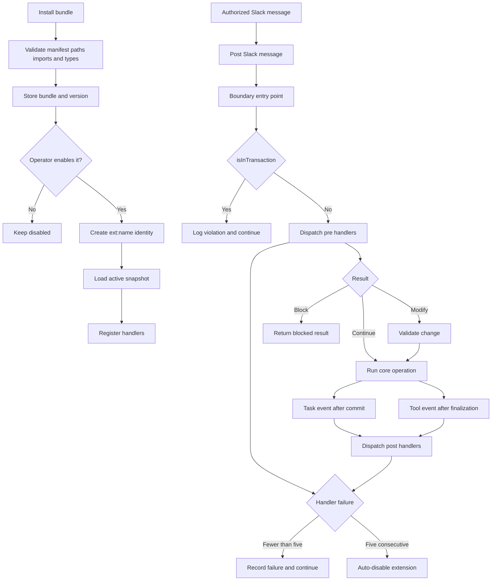

# Extension system

Operator guide: [docs-site guides/extensions.mdx](../docs-site/content/docs/(documentation)/guides/extensions.mdx).

Extensions are trusted TypeScript hooks that run inside the API server.
Each extension bundle contains a manifest and a files map.
Version 1 supports one API runtime file through `assets.hooks`.

## Lifecycle

The REST install route performs these checks:

1. Parse the manifest with `ExtensionManifestSchema`.
2. Reject unsafe bundle paths.
3. Reject the worker runtime and reserved asset kinds.
4. Reject relative, unapproved, and computed imports.
5. Typecheck the hooks file against `swarm-extension.d.ts`.
6. Store the current bundle and an immutable version snapshot.

An MCP install uses the same REST route.
It always stores a disabled draft.
An operator or dashboard user can enable the draft.

Enable creates or updates the `ext:<name>` system agent.
The agent row keeps `isLead: false`, so lead selection never picks it.
On load the dispatcher registers the agent in `src/rbac/elevated-agents.ts`, and the legacy policy treats it as a lead for tool calls (Slack posting, task creation, and other lead-only verbs). Dispose revokes it.
The system agent stays offline and has a zero task limit.
The loader writes the active snapshot to a process-specific temporary directory.
It creates runtime shims and imports the TypeScript module in process.
It validates `configJson` against the optional exported Zod schema.
It then registers the module's handlers.

Enable and disable update the local registry immediately.
An operator install reloads an enabled extension immediately.
PATCH reloads an enabled extension immediately.
Version activation reloads the extension when it is enabled.
A 30-second poll detects database changes from another API process.
This poll does not provide coordinated multi-replica execution.

Disable removes all registered handlers and marks the system agent offline.
Uninstall requires a disabled extension and deletes its stored history.



## Dispatch contract

`src/extensions/contract.ts` defines every event payload and modification shape.
`src/extensions/dispatcher.ts` owns ordering, handler limits, result handling, and run records.
Boundary code calls `dispatchPre` or `dispatchPost`.
Boundary code never reads the registry.

Call `dispatchPre` only at an entry point before a transaction starts. When the task must be created inside a transaction (schedule firing, deferred waits), call `prepareTaskWithSiblingAwareness` outside it and pass the result in.
The dispatcher calls `isInTransaction()` as a defensive guard.
If the guard detects a transaction, the dispatcher logs the event and returns `continue`.

Handlers run in ascending priority order.
The extension name resolves equal priorities.
Each valid modification becomes the next handler's input.
The first block result stops the chain.
Each boundary validates a modification against a schema before it applies the change (`validateModify`). An invalid modification is recorded as an extension error and ignored, and the core operation continues.

Task event bus handlers run after commit.
The post bridge reads the current task and then calls `dispatchPost`.
Tool post events run after tool result finalization.
The Slack post event runs after authorization and before route dispatch.

## Failure handling

The default handler limit is 5 seconds.
`EXTENSION_HANDLER_TIMEOUT_MS` can change that limit.
A throw, timeout, invalid result, or invalid modification fails open.
The dispatcher records an `error` or `timeout` run and continues the core operation.

Each failure increments the extension's consecutive failure count.
Any successful handler resets the count.
`EXTENSION_MAX_CONSECUTIVE_FAILURES` controls the limit and defaults to 5.
The final failure sets `status` to `auto-disabled` and unregisters the extension.
An operator must enable the extension again.

The run log keeps the newest 500 records per extension.
The boot path and reload poll prune older records.
All emitted error text passes through `scrubSecrets`.

## Handler context and identity

`buildCtx` provides six fields:

- `swarm` provides the script SDK through loopback HTTP.
- `state` provides namespaced KV operations under `ext:<name>:`.
- `config` contains validated operator configuration.
- `log` emits scrubbed messages.
- `signal` aborts when the handler reaches its time limit. Registration removal surfaces as a thrown `ExtensionAbortedError` on the next `ctx` call.
- `event` identifies the event, extension version, and dispatch time.

The extension identity is the system agent `ext:<name>`.
Every `ctx.swarm` call uses that agent ID.
The server assigns `callOrigin: "extension"` only when the request carries both the registered `ext:<name>` agent ID and the per-process bridge token (`X-Extension-Token`, held only by the in-process SDK). An agent header alone yields the ordinary `script-sdk` origin.
Extension-originated calls bypass `pre.tool.call` and `post.tool.call`.
This rule prevents tool-hook recursion.

Task creation also maps the creator agent back to its extension.
The boundary skips that extension during its own task creation.

## Configuration and read safety

The database stores the raw `configJson` value.
REST and MCP read paths call `scrubSecrets` before they return it.
PATCH accepts previously returned `[REDACTED:name]` placeholders at any depth (objects and arrays).
The route restores each matching stored value before it validates the configuration.

Handlers never receive a database client.
They use `ctx.state` and `ctx.swarm` for state and swarm operations.

## Add an event

1. Add the event and types to `src/extensions/contract.ts`.
2. Run `bun run build:extension-types`.
3. Add one `dispatchPre` or `dispatchPost` call at the entry point.
4. Keep a pre-event call outside every database transaction.
5. Revalidate each pre-event modification at the boundary.
6. Add a fixture under `src/tests/fixtures/extensions/`.
7. Add focused tests under `src/tests/extensions-*.test.ts`.
8. Add the event row to the operator guide (`docs-site/content/docs/(documentation)/guides/extensions.mdx`).

Run the extension test set:

```bash
bun run test:root -- src/tests/extensions-*.test.ts
bun run build:extension-types
bun run check:script-types
bun run e2e:tsc
bun run e2e --only extensions
```

## Version 1 boundaries

- Tool events cover agent-facing MCP calls only.
- Slack route events cover the Slack message handler only.
- Heartbeat events cover remediation after stall classification only.
- Worker runtime hooks do not run.
- Skills, workflows, and schedules cannot install as extension assets.
- The loader supports only one hooks file and no relative imports.
- Bun retains imported modules in its registry after source disposal.
