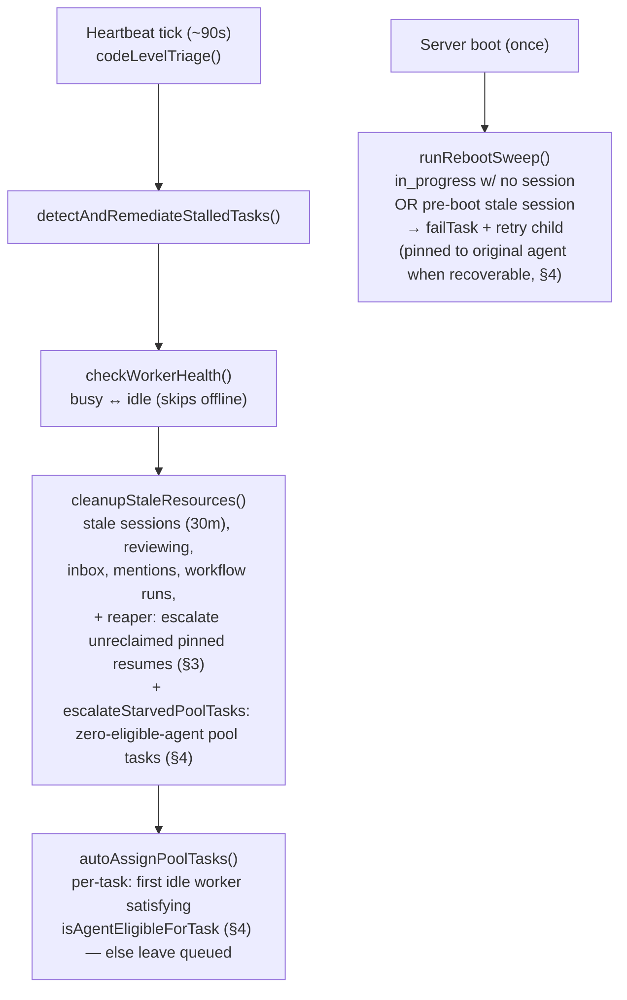
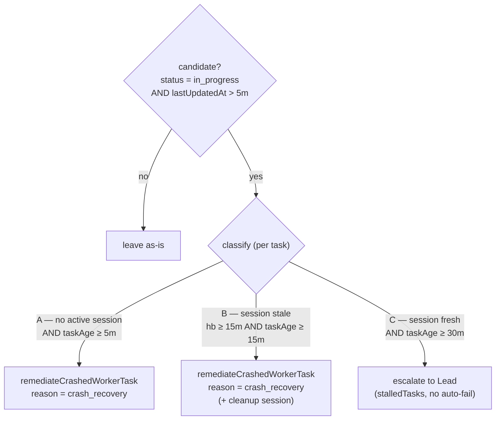
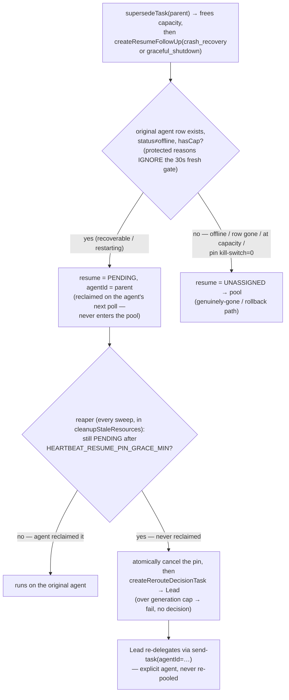
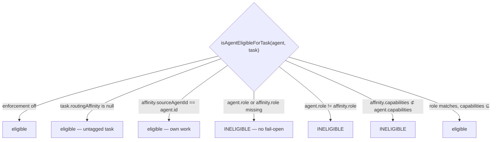

# Heartbeat & Crash-Recovery Flow

> **Maintained doc — current logic only (no history).** This runbook is the canonical reference for the heartbeat sweep, the stalled-task classifier, and the crash-recovery routing heuristic. Keep the diagrams + pseudocode in sync with the code: when you change any of this logic, update this file in the same PR (enforced by the CLAUDE.md rule). It documents *current* behavior — do not turn it into a changelog.

Owner code: `src/heartbeat/heartbeat.ts`, `src/tasks/worker-follow-up.ts`, plus the assignment/claim path in `src/http/poll.ts`, `src/tools/task-action.ts`, `src/tools/send-task.ts`, and `src/be/db.ts`.

---

## 1. The heartbeat sweep (every ~90s)

`runHeartbeatSweep` → `codeLevelTriage` runs on `DEFAULT_INTERVAL_MS` (90s, env `HEARTBEAT_INTERVAL_MS`):



- **Reboot sweep liveness predicate** (`runRebootSweep`): a session is considered "live, skip" only if `lastHeartbeatAt >= bootEpoch - 5s` (boot epoch parsed from `globalThis.__runId` = `run_<epochMs>`). Sessions with pre-boot heartbeats are stale artifacts that survived the WAL-mode SQLite restart and are treated as absent → auto-fail + retry child. If `__runId` is missing/unparseable, falls back to the legacy behavior (session exists → skip) — never more aggressive than before. This is **concurrency-safe**: a worker with N concurrent tasks keeps fresh (post-boot) heartbeats on its live sessions; only genuinely stale ones get classified.
- The **boot-triage seed script** (`src/be/seed-scripts/catalog/boot-triage.ts`) mirrors this logic: it flags `in_progress` tasks that are on an offline agent OR whose session's `lastHeartbeatAt` is older than `stuckMinutes` ago (no fresh session heartbeat).
- `autoAssignPoolTasks` and `claimTask`/`assignUnassignedTaskPending` are gated by the **routing-affinity eligibility check** (§4, `isAgentEligibleForTask`) — a pooled task tagged with a `routingAffinity` snapshot (from a resume/retry, or an explicit `requiredCapabilities` on a fresh `send-task`) can only go to a role/capability-matching agent. Untagged tasks are unaffected — assignment stays open to any idle (non-lead) worker, exactly as before. `autoAssignPoolTasks` **does** skip idle workers whose `emptyPollCount >= MAX_EMPTY_POLLS` (the poll gate) — assigning to them would just have them exit on their next poll. The filter reads `emptyPollCount` off the rows `getIdleWorkersWithCapacity()` already returns (no per-worker re-query). Note the poll gate is cleared on a genuine `waiting_for_credentials -> ready` recovery (`updateAgentCredentialState`) and on re-register, but **not** by routine post-task `ready:true` credential reports.
- `checkWorkerHealth` only flips `busy↔idle` (it pre-filters `offline`) and never sets `offline`. The **lead stays `idle`**: the busy-flip lives in the worker-only `poll-task` tool, and the lead is structurally excluded from assignment (`getIdleWorkersWithCapacity` and the pool dispatch query filter `isLead=0`). The **only** writer of `offline` is the graceful `POST /close` handler (`src/http/core.ts`); a hard-crashed (SIGKILL) worker is never auto-offlined.

## 2. The stalled-task classifier (`detectAndRemediateStalledTasks`)



- Candidate set = `getStalledInProgressTasks(STALL_THRESHOLD_NO_SESSION_MIN)` → `status='in_progress' AND lastUpdatedAt > 5m`. Tasks in `pending`/`offered` are **not** seen by this sweep.
- An **active_session** = one worker-*run* process for a task (`active_sessions`, `UNIQUE(taskId)`), created lazily *after* the provider process spawns, heartbeated by **tool activity** (throttled ~5s; no wall-clock ping between tool calls). "No active session" is AND-gated with `lastUpdatedAt > 5m`, so it means *"no live run **and** no task progress in 5 min."* It can false-positive on a long-but-quiet live worker; the resume-generation budget (`MAX_RESUME_GENERATIONS`) bounds the blast radius.
- Thresholds (env-overridable): `STALL_THRESHOLD_NO_SESSION_MIN=5` (`HEARTBEAT_STALL_NO_SESSION_MIN`), `STALL_THRESHOLD_STALE_HEARTBEAT_MIN=15`, `STALL_THRESHOLD_MINUTES=30`, `STALE_CLEANUP_THRESHOLD_MINUTES=30`.

## 3. Protected resume routing heuristic (`remediateCrashedWorkerTask` / shutdown → `createResumeFollowUp` → reaper)



**Heuristic (current):** `crash_recovery` and `graceful_shutdown` resumes are **pinned back to their own (stable-ID) agent**. `createResumeFollowUp` sets `agentId = parent.agentId` whenever the agent row still exists, is not `offline`, and has capacity — *regardless of the 30s `WORKER_LIVENESS_WINDOW_SECONDS` freshness*. The agent ID survives both crash recovery and deploy/SIGTERM graceful shutdown, so "stale" usually means "restarting", not "gone". The resume is `pending` and reclaimed on the agent's next poll; it **never enters the role-blind pool**, so no wrong-specialization worker can grab it (DES-523). It falls back to the pool only when the agent is genuinely gone (`offline`), its row is absent, capacity is full, or the reason-specific rollback switch is `0` (`HEARTBEAT_PIN_CRASH_RESUME` for crash recovery, `HEARTBEAT_PIN_GRACEFUL_RESUME` for graceful shutdown). Other reasons (`context_limits` / `manual_supersede`) still require `fresh`.

A pin **never reclaimed within `HEARTBEAT_RESUME_PIN_GRACE_MIN`** (the agent that looked recoverable never returned) is escalated by the **reaper** (`escalateUnreclaimedResumes`, run inside `cleanupStaleResources` on *every* sweep, including the post-reboot sweep): it atomically cancels the still-`pending` resume (skipping if the agent reclaimed it in the gap — TOCTOU-safe) and creates a Lead-owned `task.reroute.decision` follow-up. The Lead re-delegates via `send-task` with an **explicit `agentId`** — the work is never re-pooled. A resume already at the generation cap (`MAX_RESUME_GENERATIONS`) is failed instead of escalated, bounding a flapping task. Net: protected pinned reasons touch the unassigned pool **zero times** unless a fail-open guard or rollback switch sends them there.

### Pseudocode (current)

```text
# detector → on Case A / B:
supersedeTask(parent)                      # frees the agent's in_progress slot
resume = createResumeFollowUp(parent, reason = crash_recovery | graceful_shutdown):
    preferredAgentId = undefined
    if parent.agentId:
        cand = getAgentById(parent.agentId)
        if cand and cand.status != "offline" and activeCount(cand) < cand.maxTasks:
            isCrash = (reason == crash_recovery) and HEARTBEAT_PIN_CRASH_RESUME
            isGraceful = (reason == graceful_shutdown) and HEARTBEAT_PIN_GRACEFUL_RESUME
            isFreshReason = (reason != graceful_shutdown) and (now - cand.lastActivityAt < 30s)
            if isCrash or isGraceful or isFreshReason:   # protected reasons IGNORE the fresh gate
                preferredAgentId = cand.id
    tags = [auto-resume, reason:<r>, resume-generation:<n>]
    if reason == crash_recovery and preferredAgentId: tags += [crash-recovery-pin]   # mark a GENUINE pin
    if reason == graceful_shutdown and preferredAgentId: tags += [graceful-shutdown-pin]
    createTaskExtended(resume, agentId = preferredAgentId, tags = tags)
    #   agentId set  → status = pending  (PINNED to the original agent)
    #   agentId none → status = unassigned (pool — only genuinely-gone / rollback)

# every sweep, inside cleanupStaleResources:
escalateUnreclaimedResumes():
    for r in getStalePinnedResumes(grace):    # tagged crash-recovery-pin OR graceful-shutdown-pin, status=pending, createdAt < now-grace
        if getResumeGeneration(r) >= MAX_RESUME_GENERATIONS:
            failPendingResumeIfUnclaimed(r, "failed", budget_exhausted); continue   # bound flapping
        if no lead: continue                          # leave pending — nothing to escalate to
        transaction:                                  # atomic: all-or-nothing, else roll back + retry next sweep
            if not failPendingResumeIfUnclaimed(r, "cancelled", …): abort  # agent reclaimed it in the gap → skip
            repointTrackerSyncBySwarmId(r.id, original.id)    # return the external-tracker link
            createRerouteDecisionTask(original, staleResume = r) → Lead    # Lead re-delegates via send-task(agentId=…)
```

> The `crash-recovery-pin` and `graceful-shutdown-pin` tags are the reaper's scoping keys: only genuine same-agent pins carry them, so a *pooled* resume that `autoAssignPoolTasks` later flips to `pending` (keeping its old `createdAt`) is never mistaken for a stale pin and reaped.

## 4. Routing affinity — role/capability gate on every pool consumer

**Goal:** a task interrupted by ANY event (crash, graceful shutdown, reboot, pool redispatch) must only ever land on an agent whose role matches the original assignee's role — and, where declared, whose capabilities cover the task's requirements. When no eligible agent exists, the task queues and is escalated to the Lead — it never falls to an arbitrary idle worker. Kill-switch: `POOL_AFFINITY_ENFORCEMENT=0` restores the pre-affinity, role-blind pool behavior verbatim; untagged tasks (no `routingAffinity`) are always unaffected.

`agent_tasks.routingAffinity` (migration 113) is a nullable JSON snapshot — `{ sourceAgentId?, role?, capabilities: string[], harnessProvider? }` (`RoutingAffinitySchema`, `src/types.ts`). `harnessProvider` is informational only (native session resume is deprecated — see §3's model-inheritance note) and never enforced.



Every consumer of the `unassigned` pool calls the **same** `isAgentEligibleForTask` predicate (`src/be/db.ts`) — there is no second implementation to drift out of sync:

- `claimTask` / `assignUnassignedTaskPending` — pre-check before the atomic `UPDATE … WHERE status='unassigned'` (static per (agent, task), so it doesn't reopen the claim race). Rejection logs a distinct `task_claim_rejected_affinity` event and returns `null` — same shape as "already claimed by someone else", so existing callers (poll auto-claim, `task-action claim`) degrade safely.
- `getUnassignedTaskIdsForAgent` (replaces the unfiltered `getUnassignedTaskIds` on the poll auto-claim path in `src/http/poll.ts`) — pages through the pool in `max(limit * 5, ELIGIBILITY_SCAN_BATCH_SIZE)`-row windows, filtering each through the predicate, until `limit` eligible IDs are found or the pool is exhausted (capped at `ELIGIBILITY_SCAN_CAP` rows scanned), so an ineligible task is never even offered to the budget-admission gate. Before this paginated scan (PR #954 review), a single fixed window meant more than `~25` ineligible affinity-tagged tasks at the head of the priority order could hide all eligible work behind them, no matter how many times this was called.
- `autoAssignPoolTasks` — pages through the pool in `POOL_SCAN_BATCH_SIZE`-row windows (via `getUnassignedPoolTasks(limit, offset)`); for each task in a window (priority/creation order), picks the first idle worker that has capacity **and** passes the predicate. Continues to the next window until it has assigned `MAX_AUTO_ASSIGN_PER_SWEEP` tasks or exhausted the pool (capped at `POOL_SCAN_CAP` rows scanned this sweep); a task with no eligible worker anywhere in the scanned pool is left queued (not blindly assigned to the next worker in line). Same PR #954 fix: a single bounded fetch of `MAX_AUTO_ASSIGN_PER_SWEEP` rows used to mean a run of high-priority ineligible affinity tasks could suppress lower-priority eligible work indefinitely — every sweep re-fetched the same ineligible head-of-line rows, so the starvation never self-resolved even as idle eligible workers came and went.
- `task-action` `claim` — same predicate, with a human-readable rejection ("requires role X; yours is Y") so an agent can self-correct instead of retry-looping.

**Where a `routingAffinity` snapshot comes from** (`buildRoutingAffinityFromAgent(agentId)` snapshots an agent's current `role`/`harnessProvider`/`capabilities`; `createTaskExtended` auto-inherits a parent's `routingAffinity` on `parentTaskId` when the child doesn't set its own — same treatment as `vcsRepo`/`contextKey`):

1. **`createResumeFollowUp`** (§3) stamps a fresh snapshot from `parent.agentId` on **every** leg — pinned AND pool-fallback — so even a resume that falls to the pool (agent offline/gone/at-capacity, or a pin kill-switch off) is gated. Falls back to the parent's own inherited snapshot when the agent row is already gone.
2. **`runRebootSweep`**'s retry-child creation (§1) now applies the *same* recoverability gate `createResumeFollowUp` uses for its same-agent pin (row exists, not `offline`, has capacity — via the shared `getPinCandidateAgent` helper) — a recoverable retry is pinned `pending` to the original agent and tagged `reboot-retry-pin`; otherwise it falls to the pool with the snapshot stamped anyway. `getStalePinnedResumes`'s reaper scope (§3) now also covers `reboot-retry-pin`, so an unreclaimed reboot pin escalates to the Lead exactly like a crash/graceful pin (retry children are fresh tasks with no `resume-generation` tag, so the generation budget is 0 at first escalation — expected).
3. **`send-task`** / **`task-action create`** accept an optional `requiredCapabilities: string[]` — written into a fresh pool task's `routingAffinity` with `role` left unset. Per the predicate above, a capabilities-only snapshot (no `role`) is eligible for nobody but its declaring agent (n/a here — there is none), so such a task always ends up escalated to the Lead by §4's starvation check below; it's a way to *record* a requirement for the Lead's judgment, not to auto-route today.

**Starvation escalation** (`escalateStarvedPoolTasks`, wired into `cleanupStaleResources` — runs every sweep): an `unassigned` task carrying a `routingAffinity`, queued longer than `POOL_AFFINITY_ESCALATION_MIN`, with **zero eligible registered agents** (any status — an offline-but-matching agent still counts as "not starved"; this is "nobody of that role exists", not "everyone's busy right now") gets a Lead `task.pool.starved.decision` follow-up (`createPoolStarvationDecisionTask`, same `taskType: "reroute-decision"` discriminator and idempotency check as §3's `createRerouteDecisionTask` — no `staleResume`/generation budget since the task was never pinned).

### Pseudocode (current)

```text
isAgentEligibleForTask(agent, task):
    if not POOL_AFFINITY_ENFORCEMENT: return true
    a = task.routingAffinity
    if not a: return true                                 # untagged — unchanged behavior
    if a.sourceAgentId == agent.id: return true            # own work always eligible
    if not agent.role or not a.role: return false           # missing role data — no fail-open
    if agent.role != a.role: return false                   # exact match, v1 (no roleClass taxonomy)
    if a.capabilities not ⊆ agent.capabilities: return false
    return true

# reboot-sweep retry child (runRebootSweep, on each auto-failed in_progress task):
preferredAgentId = undefined
cand = getPinCandidateAgent(task.agentId)                   # row exists, not offline
if cand and activeCount(cand) < cand.maxTasks:
    preferredAgentId = cand.id
createTaskExtended(task.task, parentTaskId=task.id, agentId=preferredAgentId,
                    tags=[reboot-retry, auto-generated, (reboot-retry-pin if preferredAgentId)],
                    routingAffinity=buildRoutingAffinityFromAgent(task.agentId))
#   agentId set  → status = pending  (PINNED — never enters the pool)
#   agentId none → status = unassigned (pool — but still routingAffinity-gated)

# autoAssignPoolTasks, per heartbeat sweep — paginated pool scan (PR #954 fix):
assignedCount, offset = 0, 0
while assignedCount < MAX_AUTO_ASSIGN_PER_SWEEP and offset < POOL_SCAN_CAP:
    batch = getUnassignedPoolTasks(POOL_SCAN_BATCH_SIZE, offset)   # priority DESC, createdAt ASC, rowid ASC
    if batch is empty: break
    for task in batch:
        if assignedCount >= MAX_AUTO_ASSIGN_PER_SWEEP: break
        worker = first idle worker w/ capacity where isAgentEligibleForTask(w, task)
        if worker: assign(task, worker); assignedCount += 1        # else: leave queued, keep scanning
    offset += len(batch)
    if len(batch) < POOL_SCAN_BATCH_SIZE: break                    # pool exhausted

# every sweep, inside cleanupStaleResources:
escalateStarvedPoolTasks():
    for task in getStaleUnassignedAffinityTasks(now - POOL_AFFINITY_ESCALATION_MIN):
        if any(isAgentEligibleForTask(agent, task) for agent in getAllAgents() if not agent.isLead):
            continue                                        # someone (any status) matches — keep queued
        createPoolStarvationDecisionTask(original=task) → Lead
```

---

## Quick reference — env knobs

| Const | Default | Env |
|---|---|---|
| Heartbeat cadence | 90s | `HEARTBEAT_INTERVAL_MS` |
| No-session stall (Case A) | 5 min | `HEARTBEAT_STALL_NO_SESSION_MIN` |
| Stale-heartbeat stall (Case B) | 15 min | `HEARTBEAT_STALL_STALE_HB_MIN` |
| Lead-escalation stall (Case C) | 30 min | `HEARTBEAT_STALL_THRESHOLD_MIN` |
| Stale-resource cleanup | 30 min | `HEARTBEAT_STALE_CLEANUP_MIN` |
| Same-agent liveness window | 30s | `WORKER_LIVENESS_WINDOW_SECONDS` |
| Resume-generation cap | 3 | `HEARTBEAT_MAX_RESUME_GENERATIONS` |
| Resume-pin grace, reaper (`0` = off) | 10 min | `HEARTBEAT_RESUME_PIN_GRACE_MIN` |
| Same-agent crash pin, rollback (`0` = off) | on | `HEARTBEAT_PIN_CRASH_RESUME` |
| Same-agent graceful-shutdown pin, rollback (`0` = off) | on | `HEARTBEAT_PIN_GRACEFUL_RESUME` |
| Routing-affinity pool eligibility gate, rollback (`0` = off) | on | `POOL_AFFINITY_ENFORCEMENT` |
| Pool-starvation escalation grace | 15 min | `POOL_AFFINITY_ESCALATION_MIN` |
| `autoAssignPoolTasks` pool-scan page size | 50 | `HEARTBEAT_POOL_SCAN_BATCH_SIZE` |
| `autoAssignPoolTasks` pool-scan hard cap (rows/sweep) | 500 | `HEARTBEAT_POOL_SCAN_CAP` |
| `getUnassignedTaskIdsForAgent` eligibility-scan page size | 25 | `ELIGIBILITY_SCAN_BATCH_SIZE` |
| `getUnassignedTaskIdsForAgent` eligibility-scan hard cap (rows/call) | 500 | `ELIGIBILITY_SCAN_CAP` |
