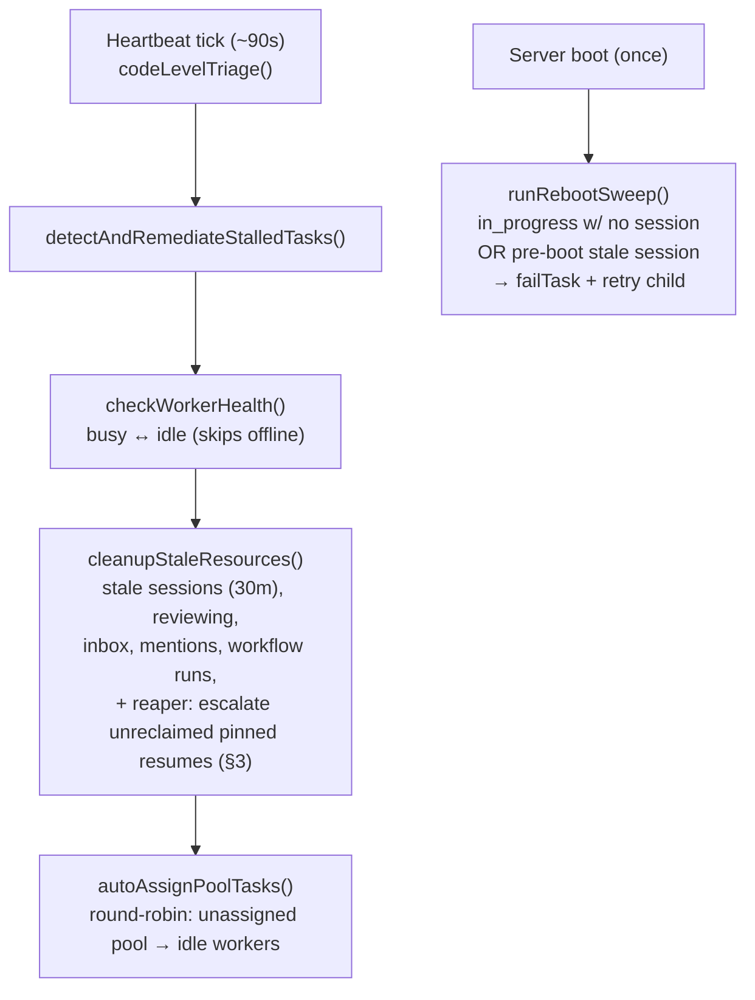
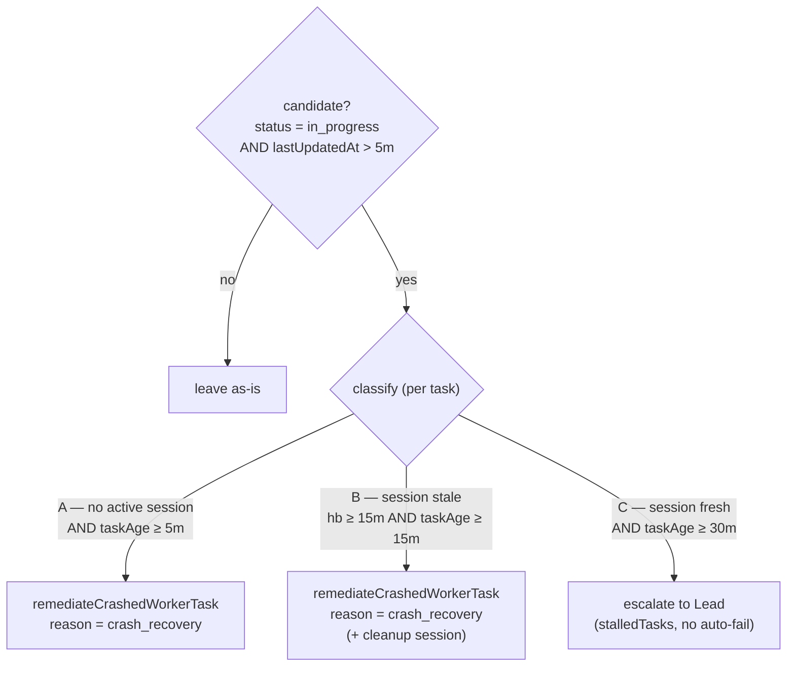
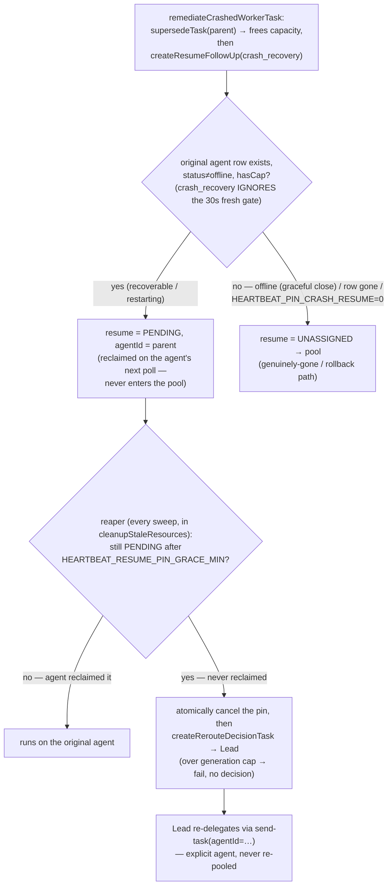

# Heartbeat & Crash-Recovery Flow

> **Maintained doc — current logic only (no history).** This runbook is the canonical reference for the heartbeat sweep, the stalled-task classifier, and the crash-recovery routing heuristic. Keep the diagrams + pseudocode in sync with the code: when you change any of this logic, update this file in the same PR (enforced by the CLAUDE.md rule). It documents *current* behavior — do not turn it into a changelog.

Owner code: `src/heartbeat/heartbeat.ts`, `src/tasks/worker-follow-up.ts`, plus the assignment/claim path in `src/http/poll.ts` + `src/be/db.ts`.

---

## 1. The heartbeat sweep (every ~90s)

`runHeartbeatSweep` → `codeLevelTriage` runs on `DEFAULT_INTERVAL_MS` (90s, env `HEARTBEAT_INTERVAL_MS`):



- **Reboot sweep liveness predicate** (`runRebootSweep`): a session is considered "live, skip" only if `lastHeartbeatAt >= bootEpoch - 5s` (boot epoch parsed from `globalThis.__runId` = `run_<epochMs>`). Sessions with pre-boot heartbeats are stale artifacts that survived the WAL-mode SQLite restart and are treated as absent → auto-fail + retry child. If `__runId` is missing/unparseable, falls back to the legacy behavior (session exists → skip) — never more aggressive than before. This is **concurrency-safe**: a worker with N concurrent tasks keeps fresh (post-boot) heartbeats on its live sessions; only genuinely stale ones get classified.
- The **boot-triage seed script** (`src/be/seed-scripts/catalog/boot-triage.ts`) mirrors this logic: it flags `in_progress` tasks that are on an offline agent OR whose session's `lastHeartbeatAt` is older than `stuckMinutes` ago (no fresh session heartbeat).
- `autoAssignPoolTasks` is the **role-blind round-robin** that lets any idle (non-lead) worker receive a pooled (`status='unassigned'`) task. There is **no role/capability/specialization filter** on assignment or on `claimTask` (the worker self-claim path guards only `status='unassigned'`).
- `checkWorkerHealth` only flips `busy↔idle` (it pre-filters `offline`) and never sets `offline`. The **lead stays `idle`**: the busy-flip lives in the worker-only `poll-task` tool, and the lead is structurally excluded from assignment (`getIdleWorkersWithCapacity` and the pool dispatch query filter `isLead=0`). The **only** writer of `offline` is the graceful `POST /close` handler (`src/http/core.ts`); a hard-crashed (SIGKILL) worker is never auto-offlined.

## 2. The stalled-task classifier (`detectAndRemediateStalledTasks`)



- Candidate set = `getStalledInProgressTasks(STALL_THRESHOLD_NO_SESSION_MIN)` → `status='in_progress' AND lastUpdatedAt > 5m`. Tasks in `pending`/`offered` are **not** seen by this sweep.
- An **active_session** = one worker-*run* process for a task (`active_sessions`, `UNIQUE(taskId)`), created lazily *after* the provider process spawns, heartbeated by **tool activity** (throttled ~5s; no wall-clock ping between tool calls). "No active session" is AND-gated with `lastUpdatedAt > 5m`, so it means *"no live run **and** no task progress in 5 min."* It can false-positive on a long-but-quiet live worker; the resume-generation budget (`MAX_RESUME_GENERATIONS`) bounds the blast radius.
- Thresholds (env-overridable): `STALL_THRESHOLD_NO_SESSION_MIN=5` (`HEARTBEAT_STALL_NO_SESSION_MIN`), `STALL_THRESHOLD_STALE_HEARTBEAT_MIN=15`, `STALL_THRESHOLD_MINUTES=30`, `STALE_CLEANUP_THRESHOLD_MINUTES=30`.

## 3. Crash-recovery routing heuristic (`remediateCrashedWorkerTask` → `createResumeFollowUp` → reaper)



**Heuristic (current):** a `crash_recovery` resume is **pinned back to its own (stable-ID) agent**. `createResumeFollowUp` sets `agentId = parent.agentId` whenever the agent row still exists, is not `offline`, and has capacity — *regardless of the 30s `WORKER_LIVENESS_WINDOW_SECONDS` freshness*. The agent ID survives a crash, so "stale at the ~5-min detection mark" means "restarting", not "gone". The resume is `pending` and reclaimed on the agent's next poll; it **never enters the role-blind pool**, so no wrong-specialization worker can grab it (DES-523). It falls back to the pool only when the agent is genuinely gone (graceful close → `offline`) or its row is absent — or when the `HEARTBEAT_PIN_CRASH_RESUME` rollback switch is `0` (then `crash_recovery` requires `fresh`, restoring the pre-DES-523 behavior). Other reasons (`context_limits` / `manual_supersede`) still require `fresh`; `graceful_shutdown` always pools.

A pin **never reclaimed within `HEARTBEAT_RESUME_PIN_GRACE_MIN`** (the agent that looked recoverable never returned) is escalated by the **reaper** (`escalateUnreclaimedResumes`, run inside `cleanupStaleResources` on *every* sweep, including the post-reboot sweep): it atomically cancels the still-`pending` resume (skipping if the agent reclaimed it in the gap — TOCTOU-safe) and creates a Lead-owned `task.reroute.decision` follow-up. The Lead re-delegates via `send-task` with an **explicit `agentId`** — the work is never re-pooled. A resume already at the generation cap (`MAX_RESUME_GENERATIONS`) is failed instead of escalated, bounding a flapping task. Net: the crash path touches the unassigned pool **zero times**.

### Pseudocode (current)

```text
# detector → on Case A / B:
supersedeTask(parent)                      # frees the agent's in_progress slot
resume = createResumeFollowUp(parent, reason = crash_recovery):
    preferredAgentId = undefined
    if parent.agentId and reason != graceful_shutdown:
        cand = getAgentById(parent.agentId)
        if cand and cand.status != "offline" and activeCount(cand) < cand.maxTasks:
            isCrash = (reason == crash_recovery) and HEARTBEAT_PIN_CRASH_RESUME
            if isCrash or (now - cand.lastActivityAt < 30s):   # crash_recovery IGNORES the fresh gate
                preferredAgentId = cand.id
    tags = [auto-resume, reason:<r>, resume-generation:<n>]
    if reason == crash_recovery and preferredAgentId: tags += [crash-recovery-pin]   # mark a GENUINE pin
    createTaskExtended(resume, agentId = preferredAgentId, tags = tags)
    #   agentId set  → status = pending  (PINNED to the original agent)
    #   agentId none → status = unassigned (pool — only genuinely-gone / rollback)

# every sweep, inside cleanupStaleResources:
escalateUnreclaimedResumes():
    for r in getStalePinnedResumes(grace):    # tagged crash-recovery-pin, status=pending, createdAt < now-grace
        if getResumeGeneration(r) >= MAX_RESUME_GENERATIONS:
            failPendingResumeIfUnclaimed(r, "failed", budget_exhausted); continue   # bound flapping
        if no lead: continue                          # leave pending — nothing to escalate to
        transaction:                                  # atomic: all-or-nothing, else roll back + retry next sweep
            if not failPendingResumeIfUnclaimed(r, "cancelled", …): abort  # agent reclaimed it in the gap → skip
            repointTrackerSyncBySwarmId(r.id, original.id)    # return the external-tracker link
            createRerouteDecisionTask(original, staleResume = r) → Lead    # Lead re-delegates via send-task(agentId=…)
```

> The `crash-recovery-pin` tag is the reaper's scoping key: only genuine same-agent pins carry it, so a *pooled* resume that `autoAssignPoolTasks` later flips to `pending` (keeping its old `createdAt`) is never mistaken for a stale pin and reaped.

---

## Quick reference — env knobs

| Const | Default | Env |
|---|---|---|
| Heartbeat cadence | 90s | `HEARTBEAT_INTERVAL_MS` |
| No-session stall (Case A) | 5 min | `HEARTBEAT_STALL_NO_SESSION_MIN` |
| Stale-heartbeat stall (Case B) | 15 min | `HEARTBEAT_STALL_STALE_HB_MIN` |
| Lead-escalation stall (Case C) | 30 min | `HEARTBEAT_STALL_THRESHOLD_MIN` |
| Stale-resource cleanup | 30 min | `HEARTBEAT_STALE_CLEANUP_MIN` |
| Same-agent liveness window | 30s | `WORKER_LIVENESS_WINDOW_SECONDS` |
| Resume-generation cap | 3 | `HEARTBEAT_MAX_RESUME_GENERATIONS` |
| Resume-pin grace, reaper (`0` = off) | 10 min | `HEARTBEAT_RESUME_PIN_GRACE_MIN` |
| Same-agent crash pin, rollback (`0` = off) | on | `HEARTBEAT_PIN_CRASH_RESUME` |
