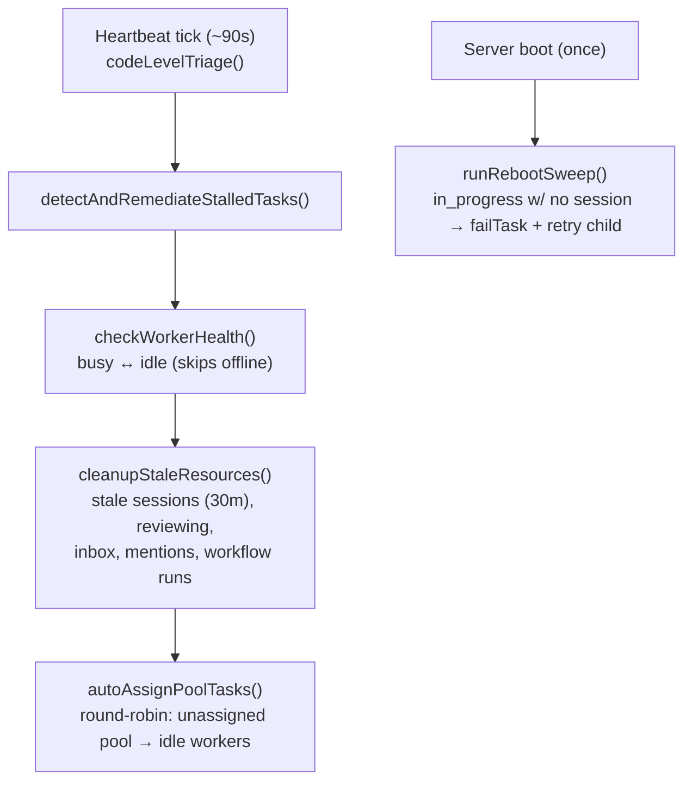
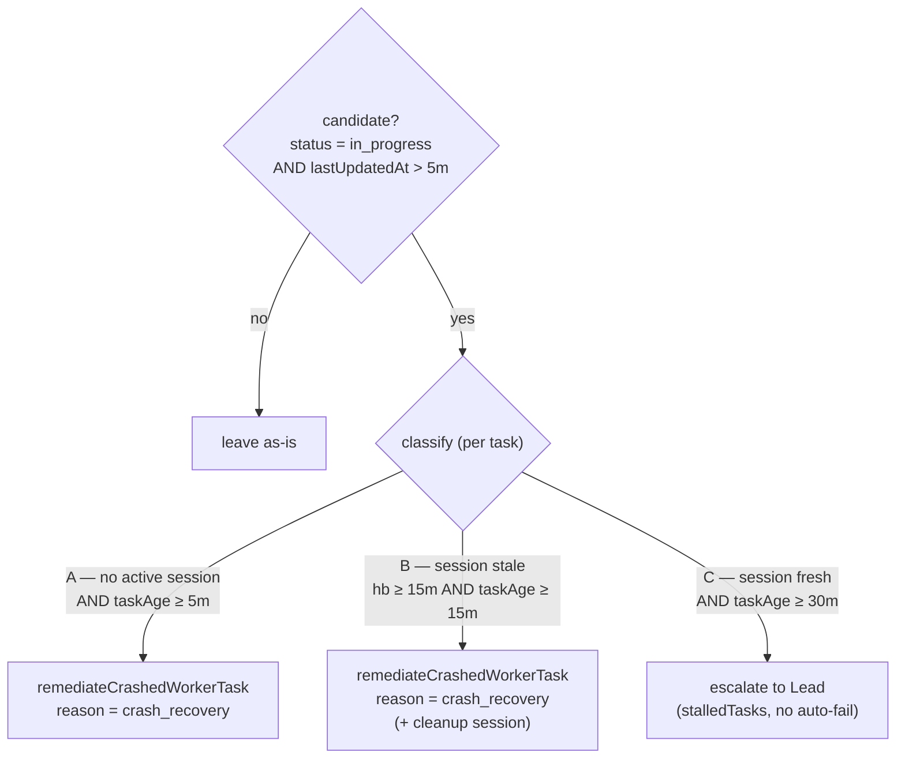
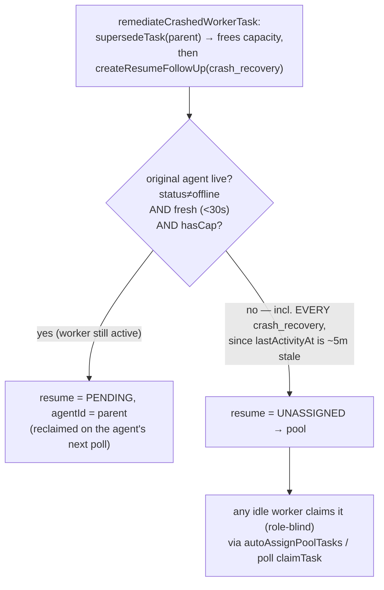

# Heartbeat & Crash-Recovery Flow

> **Maintained doc — current logic only (no history).** This runbook is the canonical reference for the heartbeat sweep, the stalled-task classifier, and the crash-recovery routing heuristic. Keep the diagrams + pseudocode in sync with the code: when you change any of this logic, update this file in the same PR (enforced by the CLAUDE.md rule). It documents *current* behavior — do not turn it into a changelog.

Owner code: `src/heartbeat/heartbeat.ts`, `src/tasks/worker-follow-up.ts`, plus the assignment/claim path in `src/http/poll.ts` + `src/be/db.ts`.

---

## 1. The heartbeat sweep (every ~90s)

`runHeartbeatSweep` → `codeLevelTriage` runs on `DEFAULT_INTERVAL_MS` (90s, env `HEARTBEAT_INTERVAL_MS`):



- `autoAssignPoolTasks` is the **role-blind round-robin** that lets any idle (non-lead) worker receive a pooled (`status='unassigned'`) task. There is **no role/capability/specialization filter** on assignment or on `claimTask` (the worker self-claim path guards only `status='unassigned'`).
- `checkWorkerHealth` only flips `busy↔idle` (it pre-filters `offline`) and never sets `offline`. The **lead stays `idle`**: the busy-flip lives in the worker-only `poll-task` tool, and the lead is structurally excluded from assignment (`getIdleWorkersWithCapacity` and the pool dispatch query filter `isLead=0`). The **only** writer of `offline` is the graceful `POST /close` handler (`src/http/core.ts`); a hard-crashed (SIGKILL) worker is never auto-offlined.

## 2. The stalled-task classifier (`detectAndRemediateStalledTasks`)



- Candidate set = `getStalledInProgressTasks(STALL_THRESHOLD_NO_SESSION_MIN)` → `status='in_progress' AND lastUpdatedAt > 5m`. Tasks in `pending`/`offered` are **not** seen by this sweep.
- An **active_session** = one worker-*run* process for a task (`active_sessions`, `UNIQUE(taskId)`), created lazily *after* the provider process spawns, heartbeated by **tool activity** (throttled ~5s; no wall-clock ping between tool calls). "No active session" is AND-gated with `lastUpdatedAt > 5m`, so it means *"no live run **and** no task progress in 5 min."* It can false-positive on a long-but-quiet live worker; the resume-generation budget (`MAX_RESUME_GENERATIONS`) bounds the blast radius.
- Thresholds (env-overridable): `STALL_THRESHOLD_NO_SESSION_MIN=5` (`HEARTBEAT_STALL_NO_SESSION_MIN`), `STALL_THRESHOLD_STALE_HEARTBEAT_MIN=15`, `STALL_THRESHOLD_MINUTES=30`, `STALE_CLEANUP_THRESHOLD_MINUTES=30`.

## 3. Crash-recovery routing heuristic (`remediateCrashedWorkerTask` → `createResumeFollowUp`)



**Heuristic (current):** the resume prefers the original agent only if it was active within `WORKER_LIVENESS_WINDOW_SECONDS` (30s, env `WORKER_LIVENESS_WINDOW_SECONDS`) **and** has capacity **and** is not `offline`. Because crash detection fires at ~5 min of inactivity, the `fresh` gate is *always false* for `crash_recovery`, so the resume is created **unassigned** and lands in the role-blind pool — where any worker (regardless of role/specialization) can claim it.

### Pseudocode (current)

```text
# detector → on Case A / B:
supersedeTask(parent)                      # frees the agent's in_progress slot
resume = createResumeFollowUp(parent, reason = crash_recovery):
    preferredAgentId = undefined
    if parent.agentId and reason != graceful_shutdown:
        cand = getAgentById(parent.agentId)
        if cand and cand.status != "offline"
           and now - cand.lastActivityAt < 30s          # ← FRESH gate (fails at the 5m mark)
           and activeCount(cand) < cand.maxTasks:
            preferredAgentId = cand.id
    createTaskExtended(resume, agentId = preferredAgentId)
    #   agentId set  → status = pending  (pinned to agent)
    #   agentId none → status = unassigned (POOL)  ← crash_recovery always lands here

# later: autoAssignPoolTasks / worker poll → any idle worker claims the unassigned resume (role-blind).
```

> ⚠️ **Planned change (DES-523):** a proposal to pin crash-recovery resumes back to their own (stable-ID) agent and fall back to a templated Lead-decision (instead of the role-blind pool) is planned — see `thoughts/taras/plans/2026-06-18-heartbeat-crash-recovery-same-agent.md`. When that lands, update §3 (diagram + heuristic + pseudocode) here to the new behavior and remove this callout.

---

## Quick reference — env knobs

| Const | Default | Env |
|---|---|---|
| Heartbeat cadence | 90s | `HEARTBEAT_INTERVAL_MS` |
| No-session stall (Case A) | 5 min | `HEARTBEAT_STALL_NO_SESSION_MIN` |
| Stale-heartbeat stall (Case B) | 15 min | `HEARTBEAT_STALL_STALE_HB_MIN` |
| Lead-escalation stall (Case C) | 30 min | `HEARTBEAT_STALL_THRESHOLD_MIN` |
| Stale-resource cleanup | 30 min | `HEARTBEAT_STALE_CLEANUP_MIN` |
| Same-agent liveness window | 30s | `WORKER_LIVENESS_WINDOW_SECONDS` |
| Resume-generation cap | 3 | `HEARTBEAT_MAX_RESUME_GENERATIONS` |
