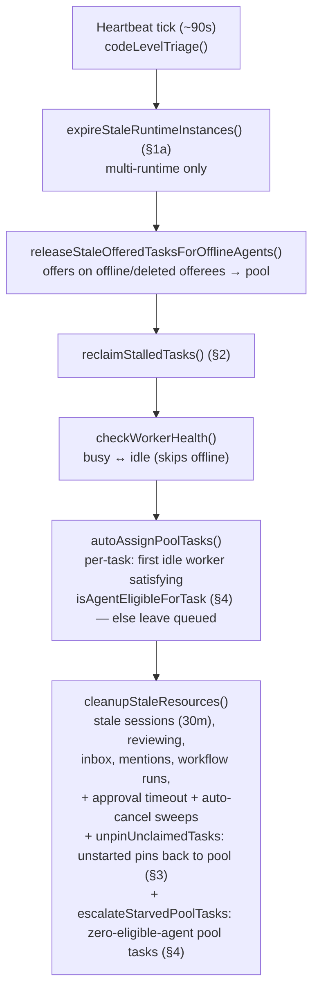
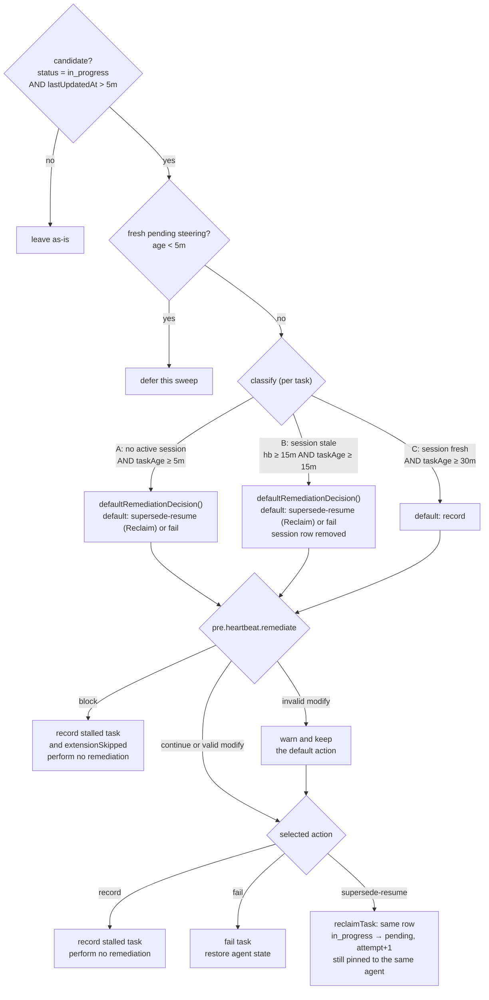
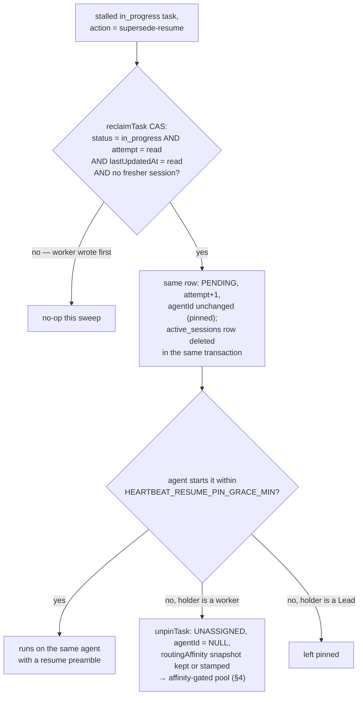
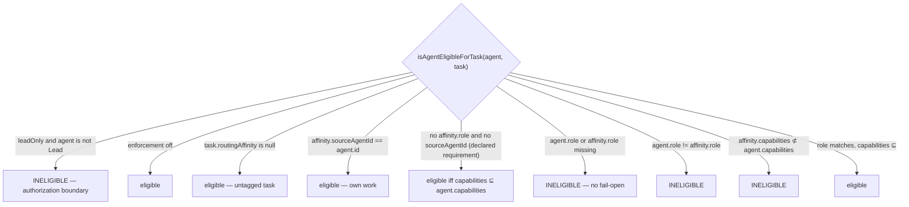

# Heartbeat & Crash-Recovery Flow

> **Maintained doc — current logic only (no history).** This runbook is the canonical reference for the heartbeat sweep, the stalled-task classifier, and the crash-recovery routing heuristic. Keep the diagrams + pseudocode in sync with the code: when you change any of this logic, update this file in the same PR (enforced by the CLAUDE.md rule). It documents *current* behavior — do not turn it into a changelog.

Owner code: `src/heartbeat/heartbeat.ts`, `src/be/db/tasks/write.ts` (`reclaimTask`, `unpinTask`, `failTask`), `src/tasks/worker-follow-up.ts`, plus the assignment/claim path in `src/http/poll.ts`, `src/tools/task-action.ts`, `src/tools/send-task.ts`, and `src/be/db.ts`.

Queue-pickup liveness alarm: `src/queue-stall-alarm.ts`.

---

## 1. The heartbeat sweep (every ~90s)

`runHeartbeatSweep` → `codeLevelTriage` runs on `DEFAULT_INTERVAL_MS` (90s, env `HEARTBEAT_INTERVAL_MS`):


```mermaid
flowchart TD
  tick["Heartbeat tick (~90s)<br/>codeLevelTriage()"] --> expire["expireStaleRuntimeInstances() (§1a)<br/>multi-runtime only"]
  expire --> offers["releaseStaleOfferedTasksForOfflineAgents()<br/>offers on offline/deleted offerees → pool"]
  offers --> detect["reclaimStalledTasks() (§2)"]
  detect --> health["checkWorkerHealth()<br/>busy ↔ idle (skips offline)"]
  health --> assign["autoAssignPoolTasks()<br/>per-task: first idle worker satisfying<br/>isAgentEligibleForTask (§4) — else leave queued"]
  assign --> cleanup["cleanupStaleResources()<br/>stale sessions (30m), reviewing,<br/>inbox, mentions, workflow runs,<br/>+ approval timeout + auto-cancel sweeps<br/>+ unpinUnclaimedTasks: unstarted pins back to pool (§3)<br/>+ escalateStarvedPoolTasks: zero-eligible-agent pool tasks (§4)"]
```

- **No boot-time sweep.** The API does not scan `in_progress` tasks at boot. After an API restart, an orphaned `in_progress` task is handled by the normal sweep: once its thresholds pass, §2 reclaims it. Workers run in their own containers and outlive an API restart, so a live worker keeps its task.
- **Worker side** (`src/commands/runner.ts`): the worker registers its active session (POST `/api/active-sessions`, keyed on the per-task runner session id) *before* it starts the provider spawn, and fills in the provider session id on `session_init`. So the window in which an `in_progress` task has no session row is one HTTP round trip, not the whole spawn. On spawn failure the worker fails the task and then removes the row.
- The **boot-triage seed script** (`src/be/seed-scripts/catalog/boot-triage.ts`) mirrors this logic: it flags `in_progress` tasks that are on an offline agent OR whose session's `lastHeartbeatAt` is older than `stuckMinutes` ago (no fresh session heartbeat).
- `autoAssignPoolTasks` and `claimTask`/`assignUnassignedTaskPending` are gated by the **routing-affinity eligibility check** (§4, `isAgentEligibleForTask`) — a pooled task tagged with a `routingAffinity` snapshot (from a resume, an Unpin, or an explicit `requiredCapabilities` on a fresh `send-task`) can only go to a role/capability-matching agent. Untagged tasks are unaffected — assignment stays open to any idle (non-lead) worker, exactly as before. `autoAssignPoolTasks` **does** skip idle workers whose `emptyPollCount >= MAX_EMPTY_POLLS` (the poll gate) — assigning to them would just have them exit on their next poll. The filter reads `emptyPollCount` off the rows `getIdleWorkersWithCapacity()` already returns (no per-worker re-query). Note the poll gate is cleared on a genuine `waiting_for_credentials -> ready` recovery (`updateAgentCredentialState`) and on re-register, but **not** by routine post-task `ready:true` credential reports.
- `checkWorkerHealth` only flips `busy↔idle` (it pre-filters `offline`) and never sets `offline`. A successful `/api/poll` dispatch updates the agent to `busy` in the same transaction that starts a pre-assigned task or claims a pool task; the worker-only `poll-task` tool does the same for its direct pending-task path. The heartbeat sweep remains the reconciliation backstop for any other task-state transition that leaves `agents.status` stale. Leads can become `busy` while running a directly assigned task, but remain structurally excluded from pool assignment (`getIdleWorkersWithCapacity` and the pool dispatch query filter `isLead=0`). `offline` has two writers: the graceful `POST /close` handler (`src/http/core.ts`), and — only when `MULTI_RUNTIME_ENABLED` is enabled — the stale-runtime expiry in §1a. With the flag explicitly off, a hard-crashed (SIGKILL) worker is still never auto-offlined.

### Workflow recovery

Every cleanup sweep invokes `recoverIncompleteRuns`, also used at server startup.
Its recovery count is logged only when nonzero; it does not mean the engine or
container restarted. Running runs with a live graph walk in this API process are
skipped, including while an executor is awaiting a long script or checkpointing
its result. Ownership lasts until all overlapping walks settle and is released
on errors too. Runs without a live walk reconstruct active edges from each
completed node's latest persisted step and selected `nextPort`, using the same
routing helper as the live walker. Readiness follows those active edges, so
untaken ports cannot start sibling branches or replay a completed downstream
node. Steps without a selected port retain the live walker's default successor
behavior. Waiting runs reconcile finished tasks, approvals, and durable waits.

This ownership guard is process-local, not a distributed lease. It assumes one
API workflow engine owns the database; multiple worker runtimes do not create
multiple API engines. Separate API processes sharing a database would need
cross-process workflow ownership before recovery could safely distinguish their
live work from interrupted work.

### Approval request sweeps

After `recoverIncompleteRuns`, every cleanup sweep runs 2 approval sweeps from
`src/be/approval-sweeps.ts`. Each one guards its write on `status = 'pending'`,
so a concurrent human answer, the recovery pass, or the other sweep wins cleanly.

```
# every sweep, inside cleanupStaleResources, after recoverIncompleteRuns:
timeoutExpiredApprovalRequests():
  for each pending request with expiresAt < now (any workflow run state):
    transaction:
      resolveApprovalRequest(status = timeout, reason = "Timed out by the approval sweep: ...")
      if standalone and source task not terminal: create hitl.timeout follow-up task
    # a failed row rolls back alone and stays pending for the next tick
  # a waiting run whose request became timeout routes on its timeout port
  # on the next tick through getStuckApprovalRuns

autoCancelStaleApprovalRequests():
  days = APPROVAL_REQUEST_AUTO_CANCELLATION_DAYS (default 7; 0 = off)
  for each pending request with expiresAt IS NULL and createdAt < now - days:
    transaction:
      cancelApprovalRequestById(reason = "Auto-cancelled by the approval sweep after <days> days ...")
      if its workflow run is running/waiting:
        cancelWorkflowRunRows(runId, reason)   # steps, linked tasks, run → cancelled
      afterCommit: post "no longer actionable" to each recorded Slack thread (claimed once)
    # a failed row rolls back alone and stays pending for the next tick
```

`recoverApprovalWaitingRuns` writes `timeout` for an expired pending request,
re-reads the request, and claims the step in 1 transaction. It routes on the
re-read status, so a request cancelled after the `getStuckApprovalRuns`
snapshot never reaches a port.

A request with `expiresAt` is never auto-cancelled. A `cancelled` request never
routes to a workflow port. The counts land in `staleCleanup.approvalTimedOut`
and `staleCleanup.approvalAutoCancelled` and add to `stale_cleanup=` in the
sweep log line.

## 1a. Runtime liveness (`MULTI_RUNTIME_ENABLED` only)

With multi-runtime mode enabled, one logical agent may be served by several
worker processes, each recorded in `runtime_instances`. Workers send their per-boot `X-Runtime-Instance-ID` on `POST /ping` and on
`GET /api/poll`; either refreshes that row's `last_seen_at`, so liveness
tracks actual worker traffic rather than one endpoint's cadence — a worker
sitting inside the long-poll loop keeps itself fresh. `POST /close` retires
just that row. Neither can revive a retired or expired runtime: the refresh
only matches a row that is already live, and registration is the sole path
back to `active`.

A crashed, OOM-killed, or network-partitioned process never reaches `/close`,
so status alone would leave it `active` forever and keep its agent falsely
available. Liveness is therefore the conjunction of `status = 'active'` and a
`last_seen_at` newer than `RUNTIME_STALE_THRESHOLD_MIN` (default 5 min, well
above the worker's poll/ping traffic interval, so an idle-but-healthy worker
is never expired):

- `countActiveRuntimeInstancesForAgent` counts only live rows, so a surviving
  runtime's `/close` takes the agent offline immediately when its siblings are
  already stale rather than waiting for a sweep.
- `expireStaleRuntimeInstances` runs **first in the sweep**, before
  `autoAssignPoolTasks`. Assigning before expiry would hand a pool task to an
  agent the same sweep is about to mark offline, stranding it — nothing would
  be left to poll for it. `autoAssignPoolTasks` additionally skips agents that
  have runtime rows but none live.
- Credential readiness is recorded per runtime, and the logical agent's status
  is derived from its live runtimes: offline when none are live, otherwise
  `waiting_for_credentials` only when no live runtime is ready, else the normal
  busy/idle from active work. Task remediation follows the same rule — it never
  returns an agent to idle while no runtime is serving it.
- Expiry retires stale runtimes and marks any agent with no live runtime left
  `offline`. It deliberately does **not** delete active sessions: runtime
  liveness answers "may this process acquire NEW work?", not "is its current
  work dead?". Sessions are heartbeated by tool activity only (§2 note), so a
  healthy worker inside a long model call or shell command can be quiet past
  the runtime cutoff — and runtime rows freeze entirely while the flag is off,
  so re-enabling it must not read every healthy worker as crashed. Crash
  classification stays owned by the stalled-task classifier (§2 Case B:
  session heartbeat **and** task both past its stronger threshold), which
  cleans the session when it remediates; the sweep's 30-minute stale-session
  cleanup backstops any leftover row. The worker's next re-registration
  restores its runtime row.
- Retired rows are **deleted, not kept**. Runtime identity is per boot, so
  retaining them would add one row per boot per agent indefinitely; nothing
  reads a runtime once it stops being live.
- The whole mechanism is inert while the flag is off. After a rollback workers
  stop refreshing their rows, and expiring them would offline agents that are
  running fine under legacy semantics.

Registration is the only path that sets a runtime back to `active`, so a
delayed ping from a retired or unknown runtime cannot resurrect it.

Startup session cleanup is disabled in this mode: several processes share one
agent id, and a booting worker has no evidence that distinguishes its crashed
predecessor's session from a live-but-quiet sibling's (sessions heartbeat on
tool activity only, and a live worker's runtime may have no row at all during
the activation window). A crashed boot's task is reclaimed by the stalled-task
classifier (§2 Case B) once both its session heartbeat and the task go stale;
the sweep's stale-session cleanup backstops leftover rows. With the flag off,
boot cleanup keeps its legacy behavior (one process per agent, so every
session of the agent is a dead predecessor's).

## 2. The stalled-task classifier (`reclaimStalledTasks`)


```mermaid
flowchart TD
  cand{"candidate?<br/>status = in_progress<br/>AND lastUpdatedAt > 5m"} -- no --> skip["leave as-is"]
  cand -- yes --> steer{"fresh pending steering?<br/>age < 5m"}
  steer -- yes --> defer["defer this sweep"]
  steer -- no --> cls{"classify (per task)"}
  cls -->|"A: no active session<br/>AND taskAge ≥ 5m"| decA["defaultRemediationDecision()<br/>default: supersede-resume (Reclaim) or fail"]
  cls -->|"B: session stale<br/>hb ≥ 15m AND taskAge ≥ 15m"| decB["defaultRemediationDecision()<br/>default: supersede-resume (Reclaim) or fail<br/>session row removed"]
  cls -->|"C: session fresh<br/>AND taskAge ≥ 30m"| decC["default: record"]
  decA --> hook{"pre.heartbeat.remediate"}
  decB --> hook
  decC --> hook
  hook -->|"block"| blocked["record stalled task<br/>and extensionSkipped<br/>perform no remediation"]
  hook -->|"continue or valid modify"| action{"selected action"}
  hook -->|"invalid modify"| keep["warn and keep<br/>the default action"]
  keep --> action
  action -->|"record"| record["record stalled task<br/>perform no remediation"]
  action -->|"fail"| fail["fail task<br/>restore agent state"]
  action -->|"supersede-resume"| resume["reclaimTask: same row<br/>in_progress → pending, attempt+1<br/>still pinned to the same agent"]
```

- Candidate set = `getStalledInProgressTasks(STALL_THRESHOLD_NO_SESSION_MIN)` → `status='in_progress' AND lastUpdatedAt > 5m`. Tasks in `pending`/`offered` are **not** seen by this sweep. A candidate with a pending steering message newer than `STEERING_STALL_GRACE_MIN` is deferred for that sweep; once the bounded grace expires, normal classification and remediation resume.
- An **active_session** = one worker-*run* process for a task (`active_sessions`, `UNIQUE(taskId)`), registered by the runner *before* it spawns the provider process (§1), heartbeated by **tool activity** (throttled ~5s; no wall-clock ping between tool calls). "No active session" is AND-gated with `lastUpdatedAt > 5m`, so it means *"no live run **and** no task progress in 5 min."* It can false-positive on a long-but-quiet live worker; the reclaim budget (`HEARTBEAT_MAX_RESUME_GENERATIONS`, compared against `attempt`) bounds the blast radius.
- The classifier emits `no-session`, `stale-session`, or `fresh-stalled` only after a task crosses its existing threshold. Extensions cannot change thresholds or classify a healthy task as stalled.
- `defaultRemediationDecision` keeps the default recovery policy. It selects `fail` for workflow steps (reason `superseded_workflow_task`; the workflow engine's retry policy owns them), for control-plane task types (`SKIP_RECLAIM_TYPES`: heartbeat-checklist, boot-triage, heartbeat, ...), and when `attempt + 1 > HEARTBEAT_MAX_RESUME_GENERATIONS` (reason `resume_budget_exhausted`). It otherwise selects `supersede-resume`, the extension-contract name for Reclaim. A fresh-session stall defaults to `record`.
- `pre.heartbeat.remediate` receives the task, optional session, classification, proposed action, reason, and age values before any remediation write. An extension can select `supersede-resume` (Reclaim), `fail`, or `record`. The action name is kept for contract compatibility. A block records the stalled task and an `extensionSkipped` finding, then performs no remediation during that sweep. An invalid action logs a scrubbed warning and keeps the original proposal.
- Thresholds (env-overridable): `STALL_THRESHOLD_NO_SESSION_MIN=5` (`HEARTBEAT_STALL_NO_SESSION_MIN`), `STALL_THRESHOLD_STALE_HEARTBEAT_MIN=15`, `STALL_THRESHOLD_MINUTES=30`, `STEERING_STALL_GRACE_MIN=5` (`HEARTBEAT_STEERING_GRACE_MIN`), `STALE_CLEANUP_THRESHOLD_MINUTES=30`.

Task creation records the origin of each routing reason as `routingSource`: `declared` for a caller-supplied reason, `engine_default` for reasons chosen by recovery, scheduling, integration, or other engine paths. Historical rows remain unknown (SQL NULL, omitted from task responses). MCP `send-task` calls with an explicit `agentId` require a `routingNote` of at least 10 characters after trim and at most 200 characters; REST creation keeps notes optional.

## 3. Reclaim and Unpin (`reclaimTask` / `unpinUnclaimedTasks`)

The model is `specs/tla/heartbeat/HeartbeatSimple.tla` (actions `Reclaim` and `Unpin`).


```mermaid
flowchart TD
  entry["stalled in_progress task,<br/>action = supersede-resume"] --> cas{"reclaimTask CAS:<br/>status = in_progress AND attempt = read<br/>AND lastUpdatedAt = read<br/>AND no fresher session?"}
  cas -->|"no — worker wrote first"| noop["no-op this sweep"]
  cas -->|"yes"| pin["same row: PENDING, attempt+1,<br/>agentId unchanged (pinned);<br/>active_sessions row deleted<br/>in the same transaction"]
  pin --> poll{"agent starts it within<br/>HEARTBEAT_RESUME_PIN_GRACE_MIN?"}
  poll -->|"yes"| ok["runs on the same agent<br/>with a resume preamble"]
  poll -->|"no, holder is a worker"| unpin["unpinTask: UNASSIGNED, agentId = NULL,<br/>routingAffinity snapshot kept or stamped<br/>→ affinity-gated pool (§4)"]
  poll -->|"no, holder is a Lead"| lead["left pinned"]
```

**Reclaim.** `reclaimTask` is one compare-and-swap `UPDATE` on the task row. It sets `status = pending` and `attempt = attempt + 1`. It matches only when the row is still `in_progress`, `attempt` and `lastUpdatedAt` equal the values the sweep read, and no `active_sessions` row has a heartbeat newer than the one the sweep saw. The same transaction deletes the task's `active_sessions` row. The row keeps its `agentId`, so the same agent picks it up on its next poll. No new task row is created. Pending steering stays on the same row; nothing is promoted.

**Fence.** Every start of an attempt (`startTask` from `/api/poll` or `poll-task`, `claimTask`, `resumeTask`) stamps the starting runtime's `X-Runtime-Instance-ID` as `attemptRuntimeId`. `staleAttemptWriteReason` (`src/tasks/attempt-fence.ts`, spec predicate `Fenced`) is evaluated on a fresh read inside the same transaction as each worker write, and rejects:

- any non-lead write to a non-terminal row with `attempt > 0` that is not `in_progress` on the caller's agent (reclaimed and not yet restarted, back in the pool, or started by another agent);
- a write to an `in_progress` row owned by the caller's agent from a runtime other than `attemptRuntimeId` (the replacement attempt runs in another runtime of the same agent).

It guards `store-progress`, `defer-task` (before the schedule insert and the terminal write, in one transaction), the runner's `/finish`, `/pause`, `/supersede` and `/progress`, and `task-action release` (on a reclaimed `pending` row too). `DELETE /api/active-sessions/by-task/:id` deletes only a row the caller registered, so an old run's cleanup cannot remove the replacement's session (see below for the reclaimed-row rule); the heartbeat's own delete is a separate server-side function that takes no caller identity. Leads keep their override on rows they do not own.

A caller that sends no `X-Runtime-Instance-ID` is rejected on a reclaimed row (`attempt > 0`) that a runtime restarted: it cannot prove it holds the current attempt. On a never-reclaimed row (one attempt only) it keeps the status + agent check, so remote harnesses such as `claude-managed` (static MCP headers) keep working; after a reclaim their tool writes are refused and the runner's `/finish` settles the task. An attempt started without a runtime id (`attemptRuntimeId` NULL) falls back to the status + agent check. `/pause` and `/supersede` re-read the row and run the fence inside their write transaction. `/progress` follows the same rule: the runner sends `X-Agent-ID` and its runtime id, so it is fenced like the other writes; a caller that names no agent (an older runner, an artifact page) keeps the write on a never-reclaimed row and is refused with 403 on a reclaimed live one (`attempt > 0`), because it cannot prove it holds the current attempt. Session cleanup follows the same scoping: on a reclaimed live row `DELETE /api/active-sessions/by-task/:id` needs both `X-Agent-ID` and `X-Runtime-Instance-ID` and matches the session's runtime exactly, so an older runner's agent-only cleanup fails closed (`deleted: false`; the sweep's stale-session cleanup removes the row); on a never-reclaimed or finished row it keeps the agent match-or-unset-runtime scope. `claude-managed` is unaffected on both routes: its local runner sends the agent and runtime ids on every progress and cleanup call, and the cloud sandbox only reaches `/mcp`. The session heartbeat (`PUT /api/active-sessions/heartbeat/:taskId`) and the provider-session update use the same scope: a stale runtime's heartbeat would otherwise keep the replacement's session fresh and hide its stall, so on a reclaimed live row they update only the session the caller's agent and runtime registered, and a caller naming no runtime updates nothing (`updated: false`). Every heartbeat sender (the Claude hook through its MCP headers, the codex/claude-managed/pi event handlers through `apiHeaders`) sends `X-Agent-ID` and `X-Runtime-Instance-ID`.

**Runner.** When the reclaimed row comes back to an agent that still runs the earlier attempt, the runner keeps the running copy and does not start a second one. When it starts a row with `attempt > 0`, it injects a resume preamble built from the task's own id (its earlier attempts' session logs).

**Unpin.** `unpinUnclaimedTasks` runs inside `cleanupStaleResources` on every sweep. `getUnclaimedPins` returns `pending` rows with an `agentId` whose `lastUpdatedAt` is older than `HEARTBEAT_RESUME_PIN_GRACE_MIN`, limited to reclaimed rows (`attempt > 0`) and legacy resume pins (`crash-recovery-pin`, `graceful-shutdown-pin`, `reboot-retry-pin` tags). Lead-held pins are excluded in SQL. One sweep unpins at most 100 pins, oldest first (`UNPIN_BATCH_SIZE`); a larger backlog drains over the next sweeps. For each pin, `unpinTask` does a CAS on `status = pending AND lastUpdatedAt = read` and sets `status = unassigned`, `agentId = NULL`. It keeps an existing `routingAffinity`, or stamps a snapshot of the previous holder. The task then routes through the affinity-gated pool and starvation escalation (§4). Grace `0` disables Unpin.

**Graceful shutdown.** A worker that shuts down calls the supersede route (`POST /api/tasks/:id/supersede`). It still uses `supersedeTask` plus `createResumeFollowUp(graceful_shutdown | context_limits | manual_supersede)`, and both run with `backfillSupersedeTaskResumeTaskId` in ONE transaction: a crash or throw before the resume child is written rolls the supersede back, the task stays `in_progress`, and §2 reclaims it. A superseded row therefore always has its resume child, except when `createResumeFollowUp` returns `skipped` (no eligible agent or Lead), which is logged. Dependents of the superseded task wait until the same transaction settles them (`settleSupersededTaskDependents`): `backfillSupersedeTaskResumeTaskId` re-points never-started dependents (`dependsOn` names the superseded id) to the resume child and cascade-fails the rest; the `skipped` case settles with no resume, so every dependent cascade-fails. No heartbeat repair remains for a gap between the writes, because there is none. `createResumeFollowUp` pins the resume child to the same agent when its row exists, it is not `offline`, and it has capacity (`HEARTBEAT_PIN_GRACEFUL_RESUME`, default on). A `leadOnly` parent may only pin to a Lead. Otherwise the child goes to the pool with a `routingAffinity` snapshot. An unstarted graceful-shutdown pin is returned to the pool by Unpin.

### Pseudocode (current)

```text
# stalled-task detector, after pending-steering grace:
if task has pending steering newer than STEERING_STALL_GRACE_MIN:
    defer this sweep

classification = no-session | stale-session | fresh-stalled
if classification == fresh-stalled:
    proposed = { action: record, reason: fresh-session stall }
else:
    proposed = defaultRemediationDecision(task, classification)
    #   workflow step                          → fail, superseded_workflow_task
    #   taskType in SKIP_RECLAIM_TYPES         → fail
    #   attempt + 1 > MAX_RESUME_GENERATIONS   → fail, resume_budget_exhausted
    #   else                                   → supersede-resume (Reclaim)

extensionResult = dispatchPre(pre.heartbeat.remediate, task, session,
                              classification, proposed, taskAge, sessionHeartbeatAge)
if extensionResult blocks:
    stalledTasks += task
    extensionSkipped += task + extension + reason
    continue
if extensionResult modifies to a valid action:
    proposed.action = extensionResult.proposedAction
if proposed.action == record:
    stalledTasks += task
    continue
if proposed.action == fail:
    failTask(task.id, proposed.reason, expectedLastUpdatedAt = task.lastUpdatedAt,
             observedSessionHeartbeatAt)
    delete the active session when one was observed
    restore agent idle if it has no active tasks
    continue

# proposed.action == supersede-resume (Reclaim), HeartbeatSimple.tla Reclaim:
transaction:
    UPDATE agent_tasks SET status = pending, attempt = attempt + 1
     WHERE id = task.id AND status = in_progress
       AND attempt = task.attempt AND lastUpdatedAt = task.lastUpdatedAt
       AND no active_sessions row with lastHeartbeatAt > observedSessionHeartbeatAt
    if no row: return                           # worker wrote after the read
    DELETE FROM active_sessions WHERE taskId = task.id
# agentId unchanged: same agent, next poll. Steering stays on the row.
restore agent idle if it has no active tasks

# every sweep, inside cleanupStaleResources (HeartbeatSimple.tla Unpin):
unpinUnclaimedTasks():
    if HEARTBEAT_RESUME_PIN_GRACE_MIN <= 0: return
    for t in getUnclaimedPins(grace, 100):      # pending, agentId set, lastUpdatedAt < now-grace,
                                                # attempt > 0 OR legacy resume/reboot pin tag,
                                                # holder not Lead; oldest first, max 100 per sweep
        if holder is Lead: continue             # defensive; the query already excludes Lead
        affinity = t.routingAffinity ?? buildRoutingAffinityFromAgent(holder)
        unpinTask(t.id, expectedLastUpdatedAt = t.lastUpdatedAt, affinity)
        #   status = unassigned, agentId = NULL → affinity-gated pool (§4)

# attempt fence (src/tasks/attempt-fence.ts), same transaction as the write:
# store-progress, defer-task, /finish, /pause, /supersede, /progress, task-action release
start (poll / claim / resume):  task.attemptRuntimeId = caller X-Runtime-Instance-ID (or NULL)
worker write (caller agent, caller runtime):
    if task is terminal: fall through to the terminal-result guard
    if task.attempt > 0 and caller is not Lead
       and not (task.status == in_progress and task.agentId == caller):
        reject                                  # reclaimed, not restarted by this agent
    if task.agentId == caller and task.status == in_progress and task.attemptRuntimeId:
        if caller runtime and it differs:
            reject                              # replacement attempt runs in another runtime
        if no caller runtime and task.attempt > 0:
            reject                              # fail closed on a reclaimed row
# /progress from a caller naming no agent: reject if task.attempt > 0 (live row), else legacy write
# session cleanup:
DELETE /api/active-sessions/by-task/:id, PUT .../heartbeat/:taskId, PUT .../provider-session/:taskId
    (one predicate inside the statement, so the check and the write are atomic)
    if task.attempt > 0 and task is not terminal:      # reclaimed live row
        WHERE taskId AND agentId = caller AND runtimeInstanceId = caller runtime
        (no caller agent or runtime: nothing matches)
    else:                                              # legacy scope
        WHERE taskId AND agentId = caller           (no caller agent: taskId only, as before)
              AND (runtime unknown OR row runtime = caller runtime)
```

## 4. Routing affinity — producer/consumer contract

**Goal:** a task interrupted by ANY event (crash, graceful shutdown, reboot, pool redispatch) must only ever land on an agent whose role matches the original assignee's role — and, where declared, whose capabilities cover the task's requirements. When no eligible agent exists, the task queues and is escalated to the Lead — it never falls to an arbitrary idle worker. Kill-switch: `POOL_AFFINITY_ENFORCEMENT=0` restores the pre-affinity, role-blind pool behavior verbatim; untagged tasks (no `routingAffinity`) are always unaffected.

`agent_tasks.routingAffinity` (migration 113) is a nullable JSON snapshot — `{ sourceAgentId?, role?, capabilities: string[], harnessProvider?, leadOnly: boolean }`. `leadOnly` is an explicit caller-supplied authorization constraint for merges and other privileged operations; the platform never infers it from prompt text. It is enforced for direct assignment, offers, pool claims, fallback dispatch, and recovery. (`RoutingAffinitySchema`, `src/types.ts`). `harnessProvider` is informational only (native session resume is deprecated) and never enforced.


```mermaid
flowchart TD
  gate{"isAgentEligibleForTask(agent, task)"}
  gate -->|"leadOnly and agent is not Lead"| no0["INELIGIBLE — authorization boundary"]
  gate -->|"enforcement off"| yes1["eligible"]
  gate -->|"task.routingAffinity is null"| yes2["eligible — untagged task"]
  gate -->|"affinity.sourceAgentId == agent.id"| yes3["eligible — own work"]
  gate -->|"no affinity.role and no sourceAgentId (declared requirement)"| cap["eligible iff capabilities ⊆ agent.capabilities"]
  gate -->|"agent.role or affinity.role missing"| no1["INELIGIBLE — no fail-open"]
  gate -->|"agent.role != affinity.role"| no2["INELIGIBLE"]
  gate -->|"affinity.capabilities ⊄ agent.capabilities"| no3["INELIGIBLE"]
  gate -->|"role matches, capabilities ⊆"| yes4["eligible"]
```

The production inventory is enforced by `src/tests/routing-affinity-inventory.test.ts`. It parses every non-test TypeScript source file and classifies every `routingAffinity` property write/read site. Adding a producer without adding an executable dispatch proof fails CI instead of relying on another manual search.

| Producer class | Affinity written | Intended destination |
| --- | --- | --- |
| `createTaskExtended` parent inheritance | Parent provenance or requirement; Lead-only requirements ratchet | Ordinary continuation destination, subject to create-time authorization |
| `createResumeFollowUp` | Fresh source-agent snapshot, falling back to inherited parent affinity | Original agent when recoverable; otherwise eligible pool or Lead recovery |
| `unpinUnclaimedTasks` | Keeps existing affinity, else a fresh snapshot of the previous holder | Eligible pool |
| `sendTaskHandler` | Explicit `{ leadOnly, capabilities }` requirement | Explicit assignee/offer, or starvation escalation for a capability-only pool task |
| `taskActionHandler` create | Explicit `{ leadOnly, capabilities }` requirement | Pool claim or starvation escalation |
| `createPoolStarvationDecisionTask` | New Lead-only control-plane authorization | Current Lead |

The decision producer is not a continuation of the original execution requirements. It passes `inheritParentRoutingAffinity: false` and declare `{ leadOnly: true, capabilities: [] }`; otherwise a replacement Lead can be rejected by the exact requirement that made the original task unrecoverable. Every other child inherits normally, and a Lead-only parent's capabilities remain a one-way ratchet.

The consumer cross-product has three distinct policies. Pool selection always applies the full predicate. Direct assignments and established offers apply the full predicate when created, then re-check only corrupt affinity and the Lead-only authorization boundary when dispatched. Recovery selection applies the full predicate before pinning or rerouting.

| Consumer surface | Policy |
| --- | --- |
| `createTaskExtended` direct assignment/offer | Full eligibility for caller-declared requirements; inherited provenance does not veto an explicit destination |
| `getPendingTaskForAgent` | Re-check invalid affinity and Lead-only authorization; do not reinterpret ordinary provenance |
| `acceptTask` / `claimOfferedTask` | Re-check invalid affinity and Lead-only authorization on the established offer |
| `claimTask` / `assignUnassignedTaskPending` | Full eligibility before the atomic pool claim |
| `getUnassignedTaskIdsForAgent` / HTTP poll | Filter by full eligibility before budget admission and claim |
| `autoAssignPoolTasks` | Select only idle, capable workers that pass full eligibility |
| `resolveLeadOnlyRecoveryAssignment` | Full eligibility for the source candidate and replacement Lead |

Every consumer of the `unassigned` pool calls the **same** `isAgentEligibleForTask` predicate (`src/be/db.ts`) — there is no second implementation to drift out of sync:

- `claimTask` / `assignUnassignedTaskPending` — pre-check before the atomic `UPDATE … WHERE status='unassigned'` (static per (agent, task), so it doesn't reopen the claim race). Rejection logs a distinct `task_claim_rejected_affinity` event and returns `null` — same shape as "already claimed by someone else", so existing callers (poll auto-claim, `task-action claim`) degrade safely.
- `getUnassignedTaskIdsForAgent` (replaces the unfiltered `getUnassignedTaskIds` on the poll auto-claim path in `src/http/poll.ts`) — pages through the pool in `max(limit * 5, ELIGIBILITY_SCAN_BATCH_SIZE)`-row windows, filtering each through the predicate, until `limit` eligible IDs are found or the pool is exhausted (capped at `ELIGIBILITY_SCAN_CAP` rows scanned), so an ineligible task is never even offered to the budget-admission gate. Before this paginated scan (PR #954 review), a single fixed window meant more than `~25` ineligible affinity-tagged tasks at the head of the priority order could hide all eligible work behind them, no matter how many times this was called.
- `autoAssignPoolTasks` — pages through the pool in `POOL_SCAN_BATCH_SIZE`-row windows (via `getUnassignedPoolTasks(limit, offset)`); for each task in a window (priority/creation order), picks the first idle worker that has capacity **and** passes the predicate. Continues to the next window until it has assigned `MAX_AUTO_ASSIGN_PER_SWEEP` tasks or exhausted the pool (capped at `POOL_SCAN_CAP` rows scanned this sweep); a task with no eligible worker anywhere in the scanned pool is left queued (not blindly assigned to the next worker in line). Same PR #954 fix: a single bounded fetch of `MAX_AUTO_ASSIGN_PER_SWEEP` rows used to mean a run of high-priority ineligible affinity tasks could suppress lower-priority eligible work indefinitely — every sweep re-fetched the same ineligible head-of-line rows, so the starvation never self-resolved even as idle eligible workers came and went.
- `task-action` `claim` — same predicate, with a human-readable rejection ("requires role X; yours is Y") so an agent can self-correct instead of retry-looping.

**Where a `routingAffinity` snapshot comes from** (`buildRoutingAffinityFromAgent(agentId)` snapshots an agent's current `role`/`harnessProvider`/`capabilities`; `createTaskExtended` auto-inherits a parent's `routingAffinity` on `parentTaskId` when the child doesn't set its own, except for the explicit control-plane opt-out above):

1. **`createResumeFollowUp`** (§3) stamps a fresh snapshot from `parent.agentId` on **every** leg — pinned AND pool-fallback — so even a resume that falls to the pool (agent offline/gone/at-capacity, or a pin kill-switch off) is gated. Falls back to the parent's own inherited snapshot when the agent row is already gone.
2. **`unpinUnclaimedTasks`** (§3) keeps a row's existing `routingAffinity`, or stamps a snapshot of the agent that held the pin, when it returns the row to the pool. A reclaimed task therefore only reaches a role-matching agent.
3. **`send-task`** / **`task-action create`** accept an optional `requiredCapabilities: string[]` — written into a fresh pool task's `routingAffinity` with `role` left unset. Per the predicate above, a capabilities-only snapshot (no `role`) is eligible for nobody but its declaring agent (n/a here — there is none), so such a task always ends up escalated to the Lead by §4's starvation check below; it's a way to *record* a requirement for the Lead's judgment, not to auto-route today.

**Starvation escalation** (`escalateStarvedPoolTasks`, wired into `cleanupStaleResources` — runs every sweep): an `unassigned` task carrying a `routingAffinity`, queued longer than `POOL_AFFINITY_ESCALATION_MIN`, with **zero eligible registered agents** (any status — an offline-but-matching agent still counts as "not starved"; this is "nobody of that role exists", not "everyone's busy right now") gets a Lead `task.pool.starved.decision` follow-up (`createPoolStarvationDecisionTask`, `taskType: "reroute-decision"`, idempotent per original task).

### Pseudocode (current)

```text
isAgentEligibleForTask(agent, task):
    if task.routingAffinityInvalid: return false             # corrupt data — fail closed
    a = task.routingAffinity
    if not a: return true                                 # untagged — unchanged behavior
    if a.leadOnly: return agent.isLead and capabilities match # authorization ignores kill-switch
    if not POOL_AFFINITY_ENFORCEMENT: return true
    if a.sourceAgentId == agent.id: return true            # own work always eligible
    if not a.role and not a.sourceAgentId:                 # caller-declared requirement (send-task/task-action)
        return a.capabilities ⊆ agent.capabilities          # capability match only (#1601)
    if not agent.role or not a.role: return false           # missing role data — no fail-open
    if agent.role != a.role: return false                   # exact match, v1 (no roleClass taxonomy)
    if a.capabilities not ⊆ agent.capabilities: return false
    return true


# autoAssignPoolTasks, per heartbeat sweep — paginated pool scan (PR #954 fix):
assignedCount, offset = 0, 0
while assignedCount < MAX_AUTO_ASSIGN_PER_SWEEP and offset < POOL_SCAN_CAP:
    batch = getUnassignedPoolTasks(POOL_SCAN_BATCH_SIZE, offset)   # priority DESC, createdAt ASC, rowid ASC
    if batch is empty: break
    for task in batch:
        if assignedCount >= MAX_AUTO_ASSIGN_PER_SWEEP: break
        worker = first idle worker w/ capacity where isAgentEligibleForTask(w, task)
        if worker: assign(task, worker); assignedCount += 1        # else: leave queued, keep scanning
    offset += len(batch)
    if len(batch) < POOL_SCAN_BATCH_SIZE: break                    # pool exhausted

# every sweep, inside cleanupStaleResources:
escalateStarvedPoolTasks():
    for task in getStaleUnassignedAffinityTasks(now - POOL_AFFINITY_ESCALATION_MIN):
        if any(isAgentEligibleForTask(agent, task) for agent in getAllAgents() if not agent.isLead):
            continue                                        # someone (any status) matches — keep queued
        createPoolStarvationDecisionTask(original=task) → Lead
```

---

## 5. Worker completion follow-ups

`createWorkerTaskFollowUp` skips workflow tasks, Lead-owned tasks, disabled follow-ups, and tasks without a Lead. It renders the completion or failure summary before task creation.

The function dispatches `pre.task.followUp` before it creates the follow-up task. An extension can block creation or modify the description, assignee, priority, and `followUpConfig`.

The resulting task also dispatches `pre.task.create` with origin `followUp`. Both extension events run before any database transaction begins.

### `followUpConfig` inheritance

A task's `followUpConfig` (its creator's `onCompleted` / `onFailed` / `disabled`) belongs to one piece of work, not to the thread. `createTaskExtended` copies it from the parent only when the caller passes `inheritParentFollowUpConfig: true`; an explicit `followUpConfig` always wins.

| Creator | Inherits? | Why |
|---------|-----------|-----|
| `createResumeFollowUp` (crash recovery, graceful shutdown, `POST /api/tasks/{id}/supersede`) | Yes | Same work, new session |
| Heartbeat reclaim (stalled or reboot-interrupted task) | n/a | No child is created: the same row goes back to `pending`, so its `followUpConfig` is never copied |
| `defer-task` wake-up (`schedule.taskType === "deferred"`) | Yes | Continues the deferred work |
| `send-task` with `taskType: "resume"` (reroute-decision re-delegation) | Yes | Continues the crashed work |
| `createWorkerTaskFollowUp` (Lead follow-up) | No | Would re-fire the finished task's instructions on the Lead's next delegation |
| `send-task` without `taskType: "resume"` | No | New work |
| Everything else with a `parentTaskId` (Slack/AgentMail/VCS thread replies, steering promotion, reroute/pool-starvation decisions, `POST /tasks`, scripts) | No | New work in the same thread |

---

## Quick reference: env knobs

All of these are read **dynamically** — `heartbeat.ts` exposes them as getter
functions (`stallThresholdMinutes()`, `maxAutoAssignPerSweep()`,
`maxResumeGenerations()`, …) rather than module-level `const`s. Module-level
capture ran before `loadGlobalConfigsIntoEnv()` hydrated `swarm_config` into
`process.env`, so a value saved from the dashboard's Configuration page was
ignored even across a restart. Because the sweep re-reads them, a config reload
now applies immediately to every threshold below **except** the two that size
the `setInterval` itself (`HEARTBEAT_INTERVAL_MS`, and `HEARTBEAT_DISABLE`
which decides whether the interval is created at all) — those are read once in
`src/http/index.ts` after hydration, so they need a restart.

Rollback switches accept `0`/`false` interchangeably (both parse through
`parseEnvFlag` in `src/utils/env-flag.ts`); `HEARTBEAT_PIN_CRASH_RESUME` and
`POOL_AFFINITY_ENFORCEMENT` previously honoured only `0`.

| Const | Default | Env |
|---|---|---|
| Heartbeat cadence (restart required) | 90s | `HEARTBEAT_INTERVAL_MS` |
| No-session stall (Case A) | 5 min | `HEARTBEAT_STALL_NO_SESSION_MIN` |
| Stale-heartbeat stall (Case B) | 15 min | `HEARTBEAT_STALL_STALE_HB_MIN` |
| Lead-escalation stall (Case C) | 30 min | `HEARTBEAT_STALL_THRESHOLD_MIN` |
| Pending-steering stall grace | 5 min | `HEARTBEAT_STEERING_GRACE_MIN` |
| Stale-resource cleanup | 30 min | `HEARTBEAT_STALE_CLEANUP_MIN` |
| Runtime liveness window (§1a) | 5 min | `RUNTIME_STALE_THRESHOLD_MIN` |
| Same-agent liveness window | 30s | `WORKER_LIVENESS_WINDOW_SECONDS` |
| Reclaim budget (max `attempt`) | 3 | `HEARTBEAT_MAX_RESUME_GENERATIONS` |
| Unpin grace (`0` = Unpin off) | 10 min | `HEARTBEAT_RESUME_PIN_GRACE_MIN` |
| Same-agent `crash_recovery` resume pin in `createResumeFollowUp`, rollback (`0` = off) | on | `HEARTBEAT_PIN_CRASH_RESUME` |
| Same-agent graceful-shutdown pin, rollback (`0` = off) | on | `HEARTBEAT_PIN_GRACEFUL_RESUME` |
| Routing-affinity pool eligibility gate, rollback (`0` = off) | on | `POOL_AFFINITY_ENFORCEMENT` |
| Pool-starvation escalation grace | 15 min | `POOL_AFFINITY_ESCALATION_MIN` |
| `autoAssignPoolTasks` pool-scan page size | 50 | `HEARTBEAT_POOL_SCAN_BATCH_SIZE` |
| `autoAssignPoolTasks` pool-scan hard cap (rows/sweep) | 500 | `HEARTBEAT_POOL_SCAN_CAP` |
| `getUnassignedTaskIdsForAgent` eligibility-scan page size | 25 | `ELIGIBILITY_SCAN_BATCH_SIZE` |
| `getUnassignedTaskIdsForAgent` eligibility-scan hard cap (rows/call) | 500 | `ELIGIBILITY_SCAN_CAP` |
| `HEARTBEAT.md` checklist tick (restart required; `0` = recurring tick off, boot triage still runs) | 30 min | `HEARTBEAT_CHECKLIST_INTERVAL_MS` |
| Checklist tick + boot triage kill switch (restart required; `true`/`1` = off, `false`/`0` = on) | off | `HEARTBEAT_CHECKLIST_DISABLE` |

---

## Queue-pickup stall alarm (API process)

The queue alarm is deliberately outside the worker runner, swarm scheduler, and heartbeat checklist task. `startQueueStallAlarm` starts directly in the API process after Slack connects, including when `HEARTBEAT_DISABLE` is set. Every five minutes it queries ready `pending`/`unassigned` rows and alerts `SLACK_ALERTS_CHANNEL` when the oldest claimable task has waited at least 30 minutes.

The non-empty queue is the denominator: an empty queue never alarms merely because there were zero pickups. DAG nodes with incomplete dependencies are excluded. The alert includes the claimable count, oldest task ID/age, and the number of `pending|unassigned → in_progress` transitions in the same 30-minute window. Delivery is direct through the API process's Slack client—no agent task is created or claimed. One alert is sent per stall episode, followed by a recovery notice; a failed delivery does not arm the dedup state, so the next tick retries.
