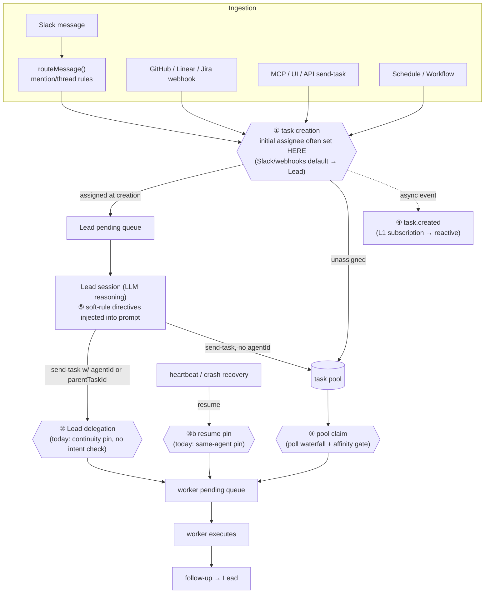

# Swarm extensibility & routing/delegation — Brainstorm

## Context

**Prompt:** Make the swarm easy to extend and customize using primitives we already have, with customer routing/delegation pain as the concrete driver.

**Customer conversation (Daniel @ Catches, 2026-07-20):**
- Routing logic is too complex: multiple fallback checks, hard to reason about.
- Concrete failure: a research task got re-delegated to the researcher agent (not a worker) because the lead "wanted to maintain session continuity" — even though the task's intent had changed. Result: a Notion write implemented with Fable unnecessarily.
- Desired: trigger-based routing rules at the lead level ("task from GTM Slack channel → GTM agent"), per-agent input decision trees, a global best-effort fallback; a separate rule/config file at the lead level for conditions and priorities.
- Connection to Airbag (RBAC): routing rules govern lead-to-subagent delegation, same domain as what Airbag governs for humans-on-behalf-of-agents.
- Side benefit: correct routing fixes tone/style problems — non-tech users currently get overly technical replies because the lead routes to a coder. New agents (customer support, GTM) could carry their own communication style.
- Urgency: Catches is scaling non-tech usage; Daniel doesn't want to keep manually monitoring/correcting delegation.
- Outcome: dedicated follow-up call planned on this topic.

**Extension-system state (draft PR #980, `spike/extension-system`):**
- Layer 1 — event subscriptions: `subscriptions` table binds event-name glob (`task.*`, `github.**`) + optional payload filter to a target (global catalog script with event as `args.event`, or workflow via `triggerType: "subscription"`). Durable at-least-once outbox delivery, 3 attempts, dedupe. New Linear/Jira emitters on the bus. MCP tools `create/list/patch/delete-subscription`, RBAC verb `subscription.write`, exposed to scripts SDK (`subscription_*`) so scripts can self-subscribe.
- Layer 3 — script-backed tools: leads publish a global catalog script as a named MCP tool (`tool.publish` verb, collision guard). Registered per session in `createServer()`; script's Zod `argsSchema` is the validation boundary.
- Measured: sandbox spawn p50 179ms — fine for cold paths, rules out naive per-tool-call sync hooks for future Layer 2 (interception) without matcher-gating or a warm pool.
- Not in scope yet: Layer 2 (interception hook points), Layer 4 (swarm-pack manifest/installer). 13 new tests, full suite green; manual E2E + UI/docs surfaces pending.

**Codebase research findings (2026-07-21, condensed):**

*Routing today — deterministic side:*
- Poll/claim is a 6-branch waterfall per tick (`src/http/poll.ts:137-434`): offered → pending+budget → mentions → lead triggers → worker pool auto-claim → Slack channel-activity. 11 separate env knobs govern fallback thresholds (`runbooks/heartbeat-crash-recovery.md:176-195`) — direct evidence for the "hard to reason about" complaint.
- The only real role concept: `isAgentEligibleForTask` (`src/be/db.ts:1052`) matches a task's `routingAffinity` snapshot (`role` free-text exact match + `capabilities[]`) against the agent. `routingAffinity` is set only on continuation paths (crash-resume, reboot retries, optional `requiredCapabilities` on send-task) — never at fresh task creation by policy.
- Task `source` (`mcp|slack|api|ui|github|linear|jira|…`) is stamped but **never consulted by any routing code**. No channel→agent mapping exists anywhere; Slack router (`src/slack/router.ts:26-97`) is purely mention/thread-based, defaults to Lead.
- Fallback for "nobody eligible" = escalate to Lead as a manual `reroute-decision` task; no configurable fallback policy.

*Routing today — prompt/LLM side (explains Daniel's failure):*
- The Lead's delegation is free LLM reasoning guided by prose (`src/prompts/session-templates.ts:68-90`). `parentTaskId` is framed purely as "session continuity — auto-routes to the same worker" (`src/tools/send-task.ts:62-68`) with **no check that the new task's intent still matches the worker's role**. The affinity gate doesn't protect Lead-issued `send-task` continuations at all — different mechanism from the heartbeat resume machinery.

*Reusable primitives:*
- **Subscriptions (L1, PR #980):** `task.created` glob + payload filter → script that calls `send-task` would implement "GTM channel → GTM agent" with zero new machinery — but it's reactive: create-then-re-route (two-step, history noise, race window), can't veto inline.
- **Script-backed tools (L3, PR #980):** could publish a `route-task` decision tool the Lead calls — auditable routing primitive vs raw reasoning.
- **Workflows:** `property-match`/`code-match` node chains are already a mini decision-tree engine; per-agent decision trees could be authored as workflow DAGs.
- **Scripts catalog + connections:** a rules evaluator is naturally a versioned sandboxed script; scripts can already call `task_create`.
- **swarm_config** (scope `global|agent|repo`) could hold a rules blob but has no schema validation/condition querying. Prompt-template resolver already has the repo>agent>global scope-precedence model a rules feature would copy.
- **Agent config:** `role` (free text), `capabilities[]`, four 64KB markdown blobs (`soulMd`/`identityMd`/`toolsMd`/`heartbeatMd`). No agent tags, no structured "communication style" field.

*Gaps:*
1. No pre-assignment hook (`task.before_assign`) — the literal Layer-2 hook a rule engine needs to run inline; subscriptions only react after the fact.
2. Source/channel/repo recorded but never matched; no `routing_rules` table or rule-file loader anywhere.
3. No configurable global fallback ("if no rule matches → X") short of Lead escalation.
4. No RBAC verbs for routing-rule authorship.
5. Sandbox spawn p50 179ms — inline sync hooks need matcher-gating or a warm pool.

## Exploration

### Q: Where should routing rules take effect (rule locus)?
**All four selected:** ingestion-time mapping (source/channel → agent, Lead skipped), Lead-level rules (advisory + hard gate on send-task), claim-time hook (`task.before_assign`, Layer 2), reactive re-route via subscriptions (ships now on PR #980).

**Insights:** Taras treats the loci as complementary layers of one system, not alternatives — which implies the real design object is a single rule representation that all four loci consume, rather than four separate features. Sequencing note: reactive re-route is available today; ingestion mapping is a small deterministic patch; Lead-gating fixes Daniel's actual failure; Layer 2 is the general long-term hook.

### Q: What is the canonical rule representation all loci consume?
**Scripts as first-class citizens** — but as a "special" type of script (a routing kind), and the open design question is what to add to the `ctx` for routing scripts.

**Insights:** This is consistent with the extension-system stance (server-side extension code runs in the scripts sandbox; the sandbox is the differentiator) and with Layer 2's proposed typed hook results (`continue | {assignTo} | {block, reason}`). A "special script type" fits existing machinery well: scripts already have `argsSchema` + `tsc` typecheck on upsert, so a declared `kind: "routing"` could get a generated, typed `RoutingCtx` in `swarm-sdk.d.ts` and be type-enforced at author time. Declarative rules, if wanted later, become sugar that compiles to/wraps a routing script — not a parallel system.

### Q: What should the routing `ctx` contain (v1)?
**All four:** task + origin envelope (source/channel/repo/team — the stamped-but-unused metadata), candidate agents + live load, continuity/history (parent chain, who worked the thread, their role), and a `ctx.classify()` structured-output LLM helper.

**Insights:** With all four, a routing script can express Daniel's failure fix directly: "classify intent; if intent ≠ previous worker's role, break continuity." `ctx.classify()` must follow the established internal-AI-abstraction rule — a reusable structured-output helper, not a one-off; it also introduces latency/cost into routing paths, which matters for the inline (claim-time / ingestion) loci — sandbox spawn is already p50 179ms, an LLM call adds ~1s+. Suggests classify-bearing scripts may be better suited to async loci (reactive/Lead-level) or need explicit budget/timeouts.

### Q: How do routing scripts compose across the swarm?
**Edge-scoped registration, pi-mono style.** Scripts should be related to where they run — bound to the type of edge they execute on, like pi-mono's `.on(...)` handler model.

**Insights:** This collapses the design into the extension system proper: each of the four loci becomes a named *edge* (e.g. `task.ingest` / `task.before_assign` / `send-task.before` / `task.created`), and "routing scripts" are just the first family of Layer-2 hook handlers — each edge with its own typed ctx and typed result. Layer 1 subscriptions are the async/durable `.on(...)`; Layer 2 hooks are the sync/intercepting `.on(...)` — one registration surface, two delivery semantics. Routing stops being a standalone feature and becomes the proving use case for Layer 2, which is exactly the "extend the swarm with primitives we already have" framing. Per-agent scoping (Daniel's decision trees) then falls out of edge + filter (e.g. `.on("task.before_assign", { agent: "gtm" })`) rather than a separate composition model.

### Q: Failure semantics for intercepting routing handlers?
**Fail-open + audit event.** Handler error/timeout/garbage → proceed with today's default flow (Lead best-effort), emit a `routing.handler_failed` bus event so subscriptions/UI can alert.

**Insights:** Routing never becomes an availability risk, and the audit event reuses Layer 1 as the observability channel — hooks and subscriptions feed each other. Flag for later: when Airbag/permission rules ride the same edges, those likely need fail-closed; the "per-edge declared default" option was noted as the probable end state, with fail-open as the routing-edge default now.

### Q: Who may register handlers on routing edges (Airbag connection)?
**RBAC verb per edge family** — e.g. `hook.write`/`routing.write` following the `subscription.write` / `tool.publish` precedent; lead + human admins by default, grantable to agents via roles. Airbag remains the layer deciding WHO may install/change rules; routing edges are governed surface.

**Insights:** This keeps the Airbag connection clean without betting on the bigger "Airbag rules ARE hooks" unification yet — that stays an open question. The verb-per-family pattern means each new edge family ships with its own authorship story, consistent with how PR #980 already added `subscription.write` and `tool.publish`.

### Q: What ships first?
**Build one real intercepting edge: `task.before_assign`** (typed ctx/result, fail-open). Taras notes Daniel's canonical example — "specific Slack channels → always route to specific agents" — and suggests the mechanism could also be "a prompt overwrite or something."

**Insights:** The "prompt overwrite" remark widens the handler result beyond `{assignTo}` — pointing at handlers that can also mutate the task (prepend/override prompt content, tags, affinity). That connects directly to the research's proposed `prompt.compose` anchor AND to Daniel's tone/style side-benefit: the same edge that routes a GTM-channel task could inject "non-technical audience, GTM voice" into the task prompt. Needs pinning down: what may a before_assign handler return/mutate?

### Q: What may a before_assign handler's typed result do (v1)?
**All four capabilities:** assign/continue, prompt injection (prepend/override — audience/tone/channel conventions), task mutation (tags, affinity, modelTier, priority), block/escalate. **Caveat from Taras:** he does not fully love the idea of skipping the Lead — wants to think that part through more.

**Insights:** The full result surface makes one mechanism cover routing, tone, tier policy ("never Fable for Notion writes"), and veto. The block/escalate + fail-open combination has a known sharp edge (an erroring blocker silently opens) — reinforces the eventual per-edge-default model. The Lead-skipping hesitation is a real architectural value: the Lead as single accountable router is part of the swarm's identity; deterministic rules threaten to fork accountability.

### Q: What is the Lead's place relative to deterministic rules?
**Hard rules opt-in bypass.** Default posture: rules advise/constrain the Lead (task still flows through it). A rule may be explicitly marked `hard` to route at ingestion without the Lead — reserved for boring, high-volume, obviously-mechanical cases like channel→agent. Bypassing the Lead is a per-rule conscious choice.

**Insights:** This resolves the accountability tension: the Lead remains the default router and single point of judgment; determinism is opt-in per rule, not a parallel routing system. It also gives a natural migration path — a rule starts soft (advisory), and gets promoted to `hard` once its track record shows the Lead never usefully deviates.

### Q: How does a rule actually get written (authoring UX)?
**Agent-assisted authoring first** — tell the Lead conversationally ("always route #gtm to the GTM agent"); the Lead authors the routing script via RBAC-gated MCP tools with plain-language readback. **Plus a UI to see the routes:** visualize the task lifecycle as a React-Flow-style graph, with each edge showing the routing/handlers applied on it.

**Insights:** The lifecycle-graph UI reframes observability: edges of the task lifecycle (ingest → lead → assign → claim → follow-up) become first-class visual objects, and hooks/subscriptions are annotations ON those edges. That's a strong product surface for the whole extension system, not just routing — the same graph can later show subscriptions, script-tools, and Airbag gates. Authoring stays conversational; the graph is the trust/verification layer for non-tech admins.

### Q: Observability — how is "why did this task land here?" answered?
**All four:** per-task routing trace (handlers fired, results, soft-rule directives, Lead deviation — on task detail page), bus events per decision (`routing.matched/applied/lead_deviated/handler_failed` — so a subscription can replace Daniel's babysitting), per-rule hit/miss/deviated/errored stats (feeding the graph edges + the soft→hard promotion decision), and a dry-run/replay tool (also needed for authoring readback).

**Insights:** The soft→hard promotion loop is now closed by data: stats show the Lead never deviates from a rule → promote to hard. Deviation events make the Lead's judgment itself observable — the swarm can learn which rules to trust. Dry-run doubles as the authoring confirmation step, so it's not optional scope.

### Q: Where does per-audience voice live (comms-style side benefit)?
**soulMd + routing injection.** The agent's durable voice stays in `soulMd`/`identityMd` prose (a GTM agent is born with a GTM voice); routing handlers additionally inject per-channel/audience directives via `promptPrepend` when context demands. No new fields — two existing surfaces composed.

**Insights:** Style is solved as a composition of already-locked decisions (correct routing × prompt-injection result capability), confirming the "extend with existing primitives" thesis — no style subsystem needed. Prompt injection must flow through the prompt-template registry per repo rule.

### Q: Blocking + Airbag — v1 failure stance?
**Per-result-type semantics.** Fail-open applies to assign/mutate/prompt handlers; handlers that declare blocking intent (`guard`-flavored) fail closed (error → hold + escalate). Semantics keyed to what the handler does, not the edge it's on. Airbag-on-edges remains a future decision but slots in cleanly as guard handlers.

**Insights:** This dissolves the earlier "per-edge declared default" open question — the axis is handler intent, not edge. A handler therefore declares its flavor (`route` vs `guard`) at registration, which also gives RBAC a natural cut: `routing.write` vs a stricter future `guard.write`/Airbag verb.

### Q: Where may `ctx.classify()` run, given LLM latency on inline edges?
**Allow inline with budget.** classify works on any edge under a strict timeout (~3s); on timeout the handler falls back to `continue` (fail-open). Rationale: the claim path is poll-driven at seconds cadence anyway, so bounded latency is tolerable; cost scales with handler count, watched via stats.

**Insights:** Simpler than an ingestion-time intent-stamping pipeline; if classify cost/latency shows up in the stats later, "stamp intent once at ingestion and cache on the task envelope" remains the natural optimization — an implementation evolution, not a contract change.

### Q: (Iron-out round) Airbag unification — final stance?
**Defer with contract.** Design the guard-handler result type now so it matches what Airbag checks would need (subject, action, resource, allow/deny + reason), but decide whether Airbag actually rides the edges only after the next Airbag increment ships. No premature coupling, no door closed.

### Q: (Iron-out round) Env-knob migration for default handlers?
**Knobs become handler config.** Built-ins ship as pre-installed default handlers whose behavior reads the existing env knobs as initial config — zero behavior change on upgrade. Knobs marked deprecated in docs; removed only after handler-level config (editable via MCP/UI) proves out.

### Q: (Iron-out round) Edge taxonomy — one assignment edge with `ctx.via`, or four named edges?
Taras asked for a visualization before deciding. Task lifecycle with every point where an assignee is chosen/written (hook sites circled):

①, ②, ③, ③b are all the same act — "an assignee is about to be written" — reached via different paths. ④ is async-after-the-fact (Layer 1). ⑤ is prompt composition, not assignment.

- **Option 1 (one edge + companions):** `task.before_assign` fires at ①②③③b with `ctx.via ∈ {creation, delegation, claim, resume}`; ⑤ is a `prompt.compose`-style companion edge for soft directives; ④ stays L1.
- **Option 2 (four named edges):** ① `task.ingest`, ② `delegation.before`, ③/③b `task.before_assign`, ④ `task.created` — four separate ctx/result contracts.

Note: under either option the Slack hard rule ("#gtm → GTM agent") runs at ① — `routeMessage()` itself stays untouched, which dissolves the earlier "Slack bypass mechanics" open question.

**Taras's corrections on the diagram:** (a) there is a **sixth assignment site — ⑥ completion follow-up**: when a worker finishes, `createWorkerTaskFollowUp` automatically creates a follow-up task assigned to the Lead — that write is also routable (e.g. "completion of GTM tasks → follow-up to GTM reviewer agent, not the Lead"). (b) Clarifying question raised: does the one-edge model limit us to a single script for ALL vias?

**Clarification (answered):** No — an edge accepts **N registered handlers**, each = script + declarative matcher filter (`via`, `source`, `channel`, `agent`, …) + flavor (`route`/`guard`) + `soft`/`hard`. Matcher-gating (decided above) already implies per-handler filters; a handler that only cares about delegation registers `{via: "delegation"}`. "One edge" means one ctx/result *contract*, not one script. What it does introduce: multiple handlers can match the same task → need explicit resolution semantics.

**Decision — edge model: one edge + `ctx.via`.** `task.before_assign` covers ① creation, ② Lead delegation, ③ pool claim, ③b resume pin, ⑥ completion follow-up, with `ctx.via ∈ {creation, delegation, claim, resume, completion}`; N filtered handlers per edge; `prompt.compose` companion carries soft Lead directives; `task.created` stays Layer 1 (async/reactive).

**Decision — multi-match resolution: priority + first decisive.** Handlers run in explicit priority order; mutations and prompt-injections COMPOSE (all applied in order); the first DECISIVE result (assign / block) wins and stops the chain. Guard handlers always run before route handlers. The per-task trace records the full chain.

### Q: (Iron-out round) Remaining smalls
- **Spawn latency:** matcher-gating v1 — handlers declare a cheap declarative filter (same expression language as subscriptions); sandbox spawns only on filter match, so tasks matching zero handlers pay zero cost. Warm pool deferred until stats prove need.
- **`swarm_events` vs telemetry `events` fold:** keep separate, ship PR #980 as-is — different jobs (durable bus journal w/ delivery semantics vs telemetry); note the decision in the PR, revisit only if duplication hurts.
- **Slack bypass mechanics:** dissolved — hard channel rules run at site ① inside task-creation assignment; `routeMessage()` untouched. (6-branch waterfall, 11 env knobs, continuity pin)?
**Defaults become visible handlers.** The built-in policies (session-continuity pin, affinity gate, pool fallback) are reimplemented as pre-installed default handlers on the same edges — visible on the lifecycle graph, overridable per swarm, env knobs deprecated over time. Rules don't add a layer on top of the opaque one; they replace it.

**Insights:** This is the strongest identity statement of the session: the initiative isn't "a rule engine bolted onto routing," it's "routing policy becomes legible." The lifecycle graph then shows *all* routing behavior — built-in defaults and customer rules in the same visual language — which is the real answer to "hard to reason about." It also means Daniel's continuity-pin failure gets fixed by *editing a visible default handler*, not by another env knob. Practically, migration will still be edge-by-edge (poll.ts/heartbeat can't be rewritten in one PR), but the end state is committed.

## Synthesis

**One-line thesis:** Routing becomes the proving use case for Layer 2 of the extension system — task-lifecycle *edges* with typed, sandboxed script handlers — and the long arc makes ALL routing policy (including today's built-ins) legible as visible, overridable handlers on a lifecycle graph.

### Key Decisions
- **All four loci in scope** (ingestion, Lead-level, claim-time, reactive), unified as *edges* of one system rather than four features.
- **Edge model: ONE assignment edge.** `task.before_assign` fires at every site where an assignee is written — creation, Lead delegation, pool claim, resume pin, completion follow-up — distinguished by `ctx.via`; `prompt.compose` companion for soft Lead directives; `task.created` (L1) for reactive. One ctx/result contract, N filtered handlers.
- **Multi-match resolution: priority + first decisive** — mutations/prompt-injections compose in order; first assign/block stops the chain; guards before routes; chain recorded in the trace.
- **Scripts are the rule substrate** — a special handler registration on catalog scripts, pi-mono-style `.on(edge)`, with per-edge typed `ctx` and typed result. Declarative rules, if ever, are sugar over scripts. Handlers declare a cheap matcher filter (matcher-gating: sandbox spawns only on match).
- **Routing `ctx` (v1):** task + origin envelope (source/channel/repo/team), candidate agents + live load, continuity/history (parent chain, thread worker + role), and `ctx.classify()` — a reusable structured-output LLM helper (per the internal-AI-abstraction rule).
- **Handler result surface (v1):** `{assignTo}` / `continue`, prompt injection (prepend/override — via prompt-template registry), task mutation (tags, affinity, modelTier, priority), block/escalate.
- **Lead stays the default router; `hard` rules are opt-in bypass** for mechanical high-volume cases (channel→agent). Soft rules constrain/advise the Lead; promotion soft→hard is data-driven (deviation stats).
- **Failure semantics keyed to handler intent, not edge:** `route`-flavored handlers fail open (+ `routing.handler_failed` audit event); `guard`-flavored (blocking) handlers fail closed (hold + escalate). Airbag slots in later as guard handlers; full unification deliberately deferred.
- **RBAC verb per edge family** (`routing.write`, future `guard.write`), following the `subscription.write`/`tool.publish` precedent.
- **`ctx.classify()` allowed inline under a strict (~3s) timeout** falling back to `continue`; ingestion-time intent stamping is a later optimization, not a contract change.
- **Authoring is agent-assisted first** (tell the Lead conversationally; it writes the script via RBAC-gated MCP tools with plain-language readback + dry-run). No rule-builder UI in v1.
- **UI: task-lifecycle graph (React-Flow-style)** — edges of the lifecycle as first-class visual objects, handlers/rules annotated per edge; later also shows subscriptions, script-tools, Airbag gates.
- **Observability (all v1):** per-task routing trace on the task page, bus events per decision (`routing.matched/applied/lead_deviated/handler_failed`), per-rule hit/deviation/error stats, dry-run/replay tool (doubles as authoring readback).
- **Comms style = soulMd × prompt-injection** — no new style subsystem; right agent brings its voice, rules inject per-channel/audience directives.
- **End state: built-in routing policies (continuity pin, affinity gate, pool fallback) become pre-installed default handlers** — visible, overridable, env knobs deprecated. Migration edge-by-edge; v1 ships `task.before_assign` as the first real edge.

### Resolved in iron-out round (2026-07-21)
- **Airbag unification → defer with contract:** guard-handler result type designed to fit Airbag's needs (subject, action, resource, allow/deny + reason); actual ride-the-edges decision after the next Airbag increment.
- **Edge taxonomy → one edge + `ctx.via`:** `task.before_assign` at all five assignment sites (creation, delegation, claim, resume, completion follow-up) + `prompt.compose` companion + `task.created` (L1). One ctx/result contract; N filtered handlers per edge.
- **Multi-match → priority + first decisive:** mutations/prompt-injections compose in priority order; first assign/block stops the chain; guards run before routes; full chain in the trace.
- **Env knobs → become handler config:** default handlers read existing knobs as initial config (zero behavior change on upgrade), deprecate after MCP/UI-editable config proves out.
- **Spawn latency → matcher-gating v1:** declarative per-handler filters (subscription expression language); spawn only on match; warm pool only if stats demand.
- **Slack bypass mechanics → dissolved:** hard channel rules run at the creation-assignment site; `routeMessage()` untouched.
- **`swarm_events` vs telemetry `events` → keep separate**, ship PR #980; revisit only if duplication hurts.

### Open Questions (remaining)
- Airbag ride-the-edges final call — gated on the next Airbag increment (contract designed to fit either way).
- Edge-by-edge migration sequencing for built-ins → default handlers (which built-in converts first after v1).
- Priority assignment UX for non-tech authors (agent-assisted authoring must pick sane priorities; collisions surfaced in dry-run).

### Constraints Identified
- Routing must never become an availability risk: fail-open default, bounded classify, kill-switch story.
- Prompt text goes through the prompt-template registry (repo rule) — prompt-injection results included.
- Handlers run in the existing scripts sandbox (extension-system stance: sandbox is the differentiator; no in-process extension code).
- Scripts SDK/typecheck machinery is reused: `kind`/edge declaration on scripts, generated typed `RoutingCtx` in `swarm-sdk.d.ts`, tsc-on-upsert enforcement.
- The Lead remains the accountable router by default — determinism is opt-in per rule, never a parallel routing brain.

### Core Requirements
1. `task.before_assign` intercepting edge in core, firing before claim/assignment, consuming registered `route`/`guard` script handlers with typed ctx/result as decided above.
2. Handler registration surface on catalog scripts (edge binding + flavor + soft/hard) + MCP tools + `routing.write` RBAC verb.
3. Routing `ctx` builder (envelope, candidates+load, continuity, classify helper as reusable structured-output abstraction).
4. Result application: assign, prompt injection (via template registry), task mutation, block/escalate → reroute-decision.
5. Per-task routing trace + `routing.*` bus events + per-rule stats + dry-run tool.
6. Lifecycle-graph UI (read view) with per-edge handler annotations.
7. Catches pilot: "#gtm → GTM agent" soft rule, promoted to hard once deviation stats justify; continuity-pin default handler replacing the prompt-only `parentTaskId` behavior as the fix for Daniel's failure case.

## Next Steps

- **PARKED (2026-07-21).** Pick up after PR #980 lands and/or after the dedicated follow-up call with Daniel (Catches). When resumed: `/desplega:create-plan` off this doc — design is decided enough to plan v1 (`task.before_assign` edge + handler registration + trace + Catches pilot).
