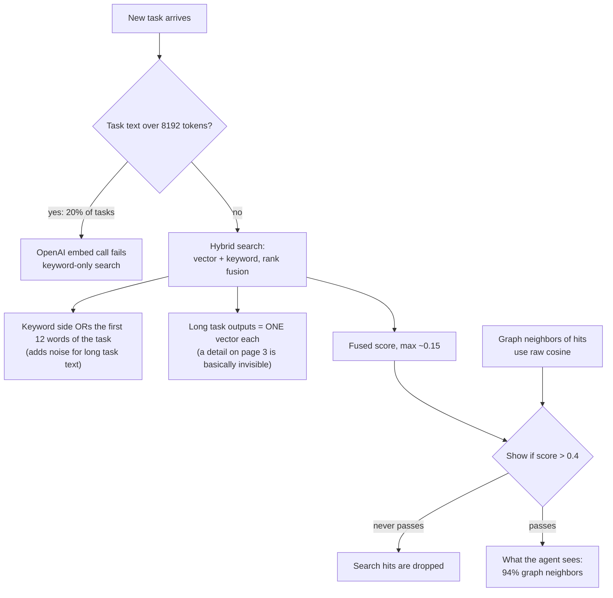

# What we learned benchmarking embeddings for agent memory

## The setup

Ok so, quick context. [agent-swarm](https://github.com/desplega-ai/agent-swarm) runs teams of AI coding agents. Agents write "memories": task outputs, notes, session summaries. Before an agent starts a task, the swarm searches those memories with the task text and shows the agent the top 5.

Search is hybrid: an embedding (vector) search plus a keyword search (SQLite FTS5), merged with rank fusion. The embeddings come from OpenAI `text-embedding-3-small`, cut down to 512 dims.

The question was simple: why that model, and what happens if we change the model, the vector size, or how we chunk the text?

## Why 3-small at 512 dims

Basically it was a cost and simplicity call in February 2026. It costs $0.02 per 1M tokens, and a 512-dim vector is only 2 KB. The plan said 512 dims is "likely sufficient". Nobody ever benchmarked it. After that, the vector table got locked to 512, so it just stuck.

## What we did

- Exported all 16,087 real memories from prod, read-only, with secrets scrubbed before anything left the box.
- Re-embedded them with 6 models at several widths: OpenAI 3-small and 3-large, Gemini `gemini-embedding-001` and `gemini-embedding-2`, Voyage `voyage-4`, and Qwen `qwen3-embedding-8b`.
- Simulated the prod search (same filters, same keyword query, same fusion) in numpy.
- Measured three ways:
  - LLM-written queries that target one known memory
  - real prod tasks, with the top results judged by an LLM from a vendor we were not testing
  - a chunking test on long memories
- Total cost: about $18.

## The big learning: the plumbing mattered more than the model

The point is, before any model question, we found four places where memory search leaks:

1. **20% of pre-task searches never use embeddings.** The task text is over OpenAI's 8192-token limit, the embed call fails, and search quietly falls back to keywords only.
2. **Long memories are one vector each.** If a task needs a detail from the middle of a long output, the right memory lands in the top 5 only 13% of the time. Chunking it with the chunker we already have takes that to 41%. No model swap comes close.
3. **The display threshold is on the wrong scale.** The prompt only shows memories with a score over 0.4. But hybrid scores are rank-fusion numbers that top out around 0.15. So in the last 30 days, zero hybrid or vector hits got shown. 94% of what agents see comes from "graph neighbors" of those hits instead.
4. **For long task text, hybrid ranks worse than vector-only.** The keyword side ORs the first 12 words of the task ("Please review the...") and adds noise.

## Models, once the plumbing is fair

On real prod tasks, the chance that a top-5 slot is actually useful:

| Model | Useful per top-5 slot | Price per 1M tokens |
|---|---|---|
| OpenAI 3-small @512 (today) | 0.43 | $0.02 |
| OpenAI 3-large @3072 | 0.44 (no real change) | $0.13 |
| Gemini embedding-001 | 0.43 (no change) | $0.15 |
| **Gemini embedding-2 @768** | **0.53** | $0.20 |
| Voyage 4 @1024 | 0.51 | $0.06 |
| Qwen3 embedding 8B | 0.43 (no change) | $0.01 |

- gemini-embedding-2 wins. Voyage 4 is almost as good at under a third of the price.
- 3-large looked better on the LLM-written queries but did nothing on real tasks. Good reminder that synthetic benchmarks flatter models.

## Dimensions

- 256 hurts every model.
- 3-small at 1536 instead of 512 gives nothing on real tasks, for 3x the storage.
- gemini-embedding-2 stops improving at 768.
- You don't need to call the API once per width. Truncating the full vector and re-normalizing gives exactly what the API returns (cosine 1.00000). So one embed call covers every width.

## Method learnings (the stuff I'd reuse)

- **Your prod feedback labels are biased toward your current system.** Raters (agents and LLM raters here) can only rate what the system already showed. Every model "lost" to the incumbent on those labels, even 3-small at other widths. A pooled LLM judge fixes this: take the top 5 from every config and judge all of them. The judge agreed with the swarm's own usefulness ratings 86% of the time.
- **Check the harness before trusting it.** Our re-embeddings matched the vectors stored in prod at cosine 0.9999. That one check makes every other number believable.
- **Gemini cosines run hot.** Two random memories score about 0.65 (vs 0.45 for OpenAI). Any fixed threshold you tuned for OpenAI is meaningless after a switch.
- **gemini-embedding-2 ignores `taskType`.** The vectors are identical with or without it, so the OpenAI-compatible endpoint loses nothing.
- **OpenAI rejects the whole batch if one input is too long.** One long memory can null out 19 others.
- **gemini-embedding-001 silently truncates at 2048 tokens.** gemini-embedding-001 also returns unnormalized vectors at reduced widths.

## Bonus: we found a real bug

The chunker had an infinite loop. Any text with more than 2000 characters and no space or newline (base64, minified JSON) made it spin forever at 100% CPU. It runs synchronously in the API, so one bad memory write could take the server down. The fix is in PR #1639.

## Outcomes

- Fix for the hang: [PR #1639](https://github.com/desplega-ai/agent-swarm/pull/1639) (issue [#1638](https://github.com/desplega-ai/agent-swarm/issues/1638))
- The full research doc, the reproducible harness, and these learnings: [PR #1640](https://github.com/desplega-ai/agent-swarm/pull/1640)

## What we're doing next (in this order)

1. Merge the hang fix.
2. Chunk long task memories and cap the query length before embedding. Cheapest fix, biggest win, works with any model.
3. Fix the display threshold so real search hits can show up.
4. Stop the keyword side from dominating long task queries.
5. Then switch models as a measured A/B test: gemini-embedding-2 at 768, or Voyage 4 if cost matters.

TL;DR: before you shop for a better embedding model, check that your search actually uses the one you have.
