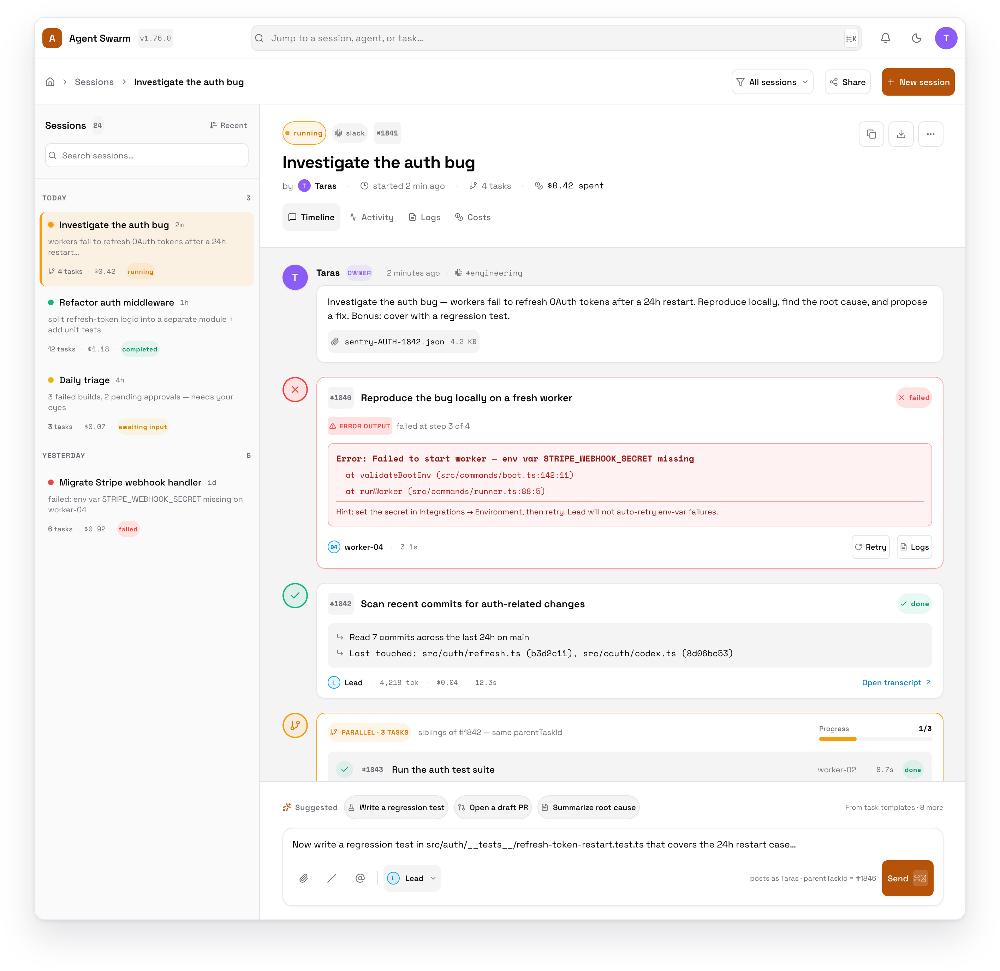
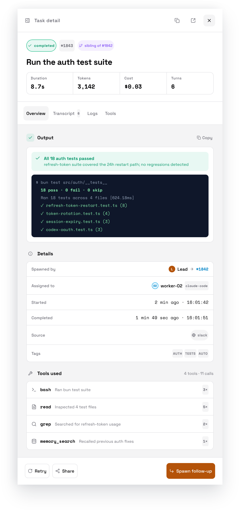

# UI Chat/Session Experience v1 Implementation Plan

## Overview

Bundled v1 launch in `ui/`: a **Sessions** experience (`/sessions`, `/sessions/:id`) that renders a task chain as a chat-style timeline with composer, and a **Dashboard revamp** (`/`) replacing today's page with a static `@xyflow/react` org-chart canvas (lead → workers, sized by 24h activity) plus a four-bucket action-items inbox (Blocking / Broken / To read / To start). Backend changes are minimal and additive: Zod becomes the single source of truth for `agent_tasks.source`, `requestedByUserId` is plumbed end-to-end, a new chain-fetch endpoint, two new tables (`inbox_item_state`, `task_templates`), HTTP routes for users (DB functions already exist), and a minor version bump (`1.75.0 → 1.76.0`) so the UI can soft-degrade against older self-hosted API servers.

- **Motivation**: replace the current task-table dashboard and Slack-only thread experience with a first-class in-product session/chat surface; align v1 with what's already plumbed (`parentTaskId`, `SessionLogViewer`, polling) so we ship in predictable, independently-reviewable phases.
- **Self-hosted version-gate**: bump `package.json` to `1.76.0`. The UI checks `GET /health` (already returns `version` — `src/http/core.ts:100-113`) and soft-degrades new surfaces when the API is older. No hard block; users on a stale API still see the legacy dashboard and a banner pointing at upgrade docs. `/health` shape is **unchanged** — the original plan's `swarmId` addition is dropped (resolved errata Critical-C3): the UI namespaces all per-deployment localStorage by `apiUrl` from `useConfig()` to match `useDismissibleCard`'s shipped pattern (`swarm:v1:${apiUrl}:${cardKey}`).
- **Identity**: a "who are you?" modal lists rows from a new `GET /api/users` endpoint (DB functions already exist at `src/be/db.ts:8380-8590`), persists the picked id in `localStorage` under the same `swarm:v1:${apiUrl}:current-user` namespace as `useDismissibleCard`, and feeds `requestedByUserId` to every task create from the UI (existing CreateTaskDialog included). The modal **auto-pops** whenever no entry exists for the current `apiUrl` — so existing users on an upgraded API are prompted exactly once, and a single browser pointed at multiple swarm URLs keeps separate identities.
- **Related**:
  - `thoughts/taras/brainstorms/2026-05-08-ui-chat-session-experience.md` (PRD)
  - `thoughts/taras/research/2026-05-08-ui-chat-session-experience-research.md` (research)
  - `src/types.ts:56-69` (AgentTaskSourceSchema), `src/types.ts:217-233` (UserSchema)
  - `src/http/tasks.ts:29-47,55-68,257-307` (tasks routes), `src/http/core.ts:100-113` (`/health` returns version)
  - `src/be/db.ts:2219-2330` (createTaskExtended w/ requestedByUserId), `src/be/db.ts:8380-8590` (user fns)
  - `src/be/migrations/043_jira_source.sql` (latest agent_tasks rebuild), `031_user_registry.sql` (users + requestedByUserId column), `034_slack_reply_sent.sql:4` (parentTaskId index)
  - `ui/src/app/router.tsx`, `ui/src/app/providers.tsx:7-15` (TanStack polling defaults)
  - `ui/src/api/client.ts:215-234` (createTask), `ui/src/api/hooks/use-tasks.ts:48-63` (useCreateTask)
  - `ui/src/pages/tasks/page.tsx:35-42,317-330` (TaskFormData + submit), `ui/src/pages/dashboard/page.tsx:315-477` (current dashboard)
  - `ui/src/components/shared/session-log-viewer.tsx:805` (transcript), `ui/src/components/ui/sheet.tsx`, `ui/src/components/shared/data-grid.tsx`, `ui/src/components/ui/detail-page-layout.tsx`
  - `ui/src/components/workflows/workflow-graph.tsx`, `ui/src/components/workflows/graph-utils.ts`, `ui/src/components/shared/workflow-node-shell.tsx` (xyflow + dagre patterns)
  - `ui/src/styles/globals.css:49-86` (OKLCH status tokens)
  - `LOCAL_TESTING.md`, `CLAUDE.md`, `runbooks/ci.md`, `runbooks/local-development.md`

## Current State Analysis

**Backend already in place:**
- `parentTaskId` column on `agent_tasks` (`043_jira_source.sql:37`) with index (`034_slack_reply_sent.sql:4`).
- `requestedByUserId` column on `agent_tasks` referencing `users(id)` (`031_user_registry.sql:27`); accepted by `createTaskExtended` (`src/be/db.ts:2219`); read by `src/tools/get-task-details.ts:48-49` and `src/http/poll.ts:248`. **NOT** in the HTTP create body (`src/http/tasks.ts:55-68`).
- Source CHECK constraint in `agent_tasks` is the *only* enum gate today — `src/http/tasks.ts:65` is `source: z.string().optional()`. Fix: drop the CHECK, tighten Zod to `AgentTaskSourceSchema.optional()` (`src/types.ts:56-69`).
- Users table (`031_user_registry.sql:2-17`) + DB functions exist (`getAllUsers`, `getUserById`, `createUser`, `updateUser`, `resolveUser` — `src/be/db.ts:8380-8590`). No HTTP layer (`src/http/users.ts` does not exist).
- `/health` already returns `{ status, version }` from `package.json` (`src/http/core.ts:100-113`).
- Approvals: `GET /api/approval-requests?status=pending` returns `{ approvalRequests }` (`src/http/approval-requests.ts:112-127`).
- Credentials: `GET /api/agents/credential-status?status=waiting_for_credentials` returns `{ agents: [{ agentId, name, status, missing[], provider, harnessProvider, credStatus, lastCheckedAt }] }` (route `src/http/agents.ts:217-228`, handler `:462-480`). Post-PR #441 (worker self-reports `cred_status` via migration `055_agent_cred_status.sql`) and PR-a438c9f8 (harness column UI), the row carries the full credential snapshot — Phase 6's `useCredentialMissingAgents()` should consume `credStatus.missing` (richer; per-harness) when present and fall back to top-level `missing[]` for older workers.
- `route()` factory + auto-OpenAPI registration at `src/http/route-def.ts:84-104`.

**Backend missing:**
- No chain fetch — `GET /api/tasks?...` filters do not include `parentTaskId` / `rootTaskId` (`src/http/tasks.ts:29-47`). Naive timeline = N polls.
- No HTTP CRUD for users (DB functions are HTTP-orphaned).
- No `inbox_item_state` table.
- No `task_templates` table (the existing `templates/` directory is **agent personas**, not session prompts).

**Frontend in place:**
- `react-router-dom` v7 in `ui/src/app/router.tsx`; pages = `ui/src/pages/<route>/page.tsx` (lazy-imported, default-exported).
- TanStack Query polling defaults: `refetchInterval: 5000`, `staleTime: 2000` (`ui/src/app/providers.tsx:7-15`).
- `SessionLogViewer({ logs, compactionSnapshots?, className? })` at `ui/src/components/shared/session-log-viewer.tsx:805`.
- Hooks: `useTask, useTaskSessionLogs (5s), useTaskContext (10s), useCreateTask` in `ui/src/api/hooks/use-tasks.ts`; `useSessionCosts` in `ui/src/api/hooks/use-costs.ts:15-22`.
- shadcn `Sheet` (`ui/src/components/ui/sheet.tsx`), `DataGrid` (`ui/src/components/shared/data-grid.tsx`), `detail-page-layout.tsx` (`ui/src/components/ui/detail-page-layout.tsx`).
- Workflow graph: `@xyflow/react` v12.10.1 + `dagre` v0.8.5 already installed (`ui/package.json:19,26`); reusable patterns in `ui/src/components/workflows/workflow-graph.tsx`, `graph-utils.ts` (`applyDagreLayout` line 254), `WorkflowNodeShell` (`ui/src/components/shared/workflow-node-shell.tsx`).
- Design tokens (OKLCH): `--color-status-{success,active,error,info,pending,warning,paused,neutral}` and `--color-action-*` in `ui/src/styles/globals.css:49-86`.
- localStorage convention (key prefix `agent-swarm-*`) used in `ui/src/hooks/use-theme.ts`, `ui/src/lib/config.ts`, `ui/src/pages/tasks/[id]/page.tsx:471,475`.

**Frontend missing:**
- No `/sessions` route, no sessions pages.
- No identity context / user picker / current-user provider; no `useApiVersion` hook; no version-gate.
- `ui/src/api/client.ts:215-234` `createTask` does NOT pass `parentTaskId`, `source`, `requestedByUserId`, `offeredTo`, `dir`, `outputSchema`, or `contextKey` (server accepts all of these).
- `TaskFormData` (`ui/src/pages/tasks/page.tsx:35-42`) lacks `parentTaskId`, `source`, `requestedByUserId`.
- **Stale post-PR #452**: `/` is now `HomePage` (`ui/src/pages/home/page.tsx`); the legacy 4-section dashboard moved to `/dashboard` (`ui/src/pages/dashboard/page.tsx`). Sidebar already lists both "Home" and "Dashboard" entries (`ui/src/components/layout/app-sidebar.tsx:42-47`). `<StatusProvider>` (`ui/src/app/status-context.tsx`) centralizes polling of `GET /status` at 30s for AppHeader badge / AppFooter / sidebar identity / home. `useDismissibleCard("home-welcome")` already implements per-deployment localStorage namespace + cross-tab sync via `storage` event. See errata Critical-C1 / Critical-C2 — Phase 5 and Phase 6 must be re-scoped against this baseline.

## Desired End State

**Sessions** — At `/sessions` users see a split view: left = sidebar list of recent sessions (latest activity first), right = selected session detail. Selecting a session loads the full chain in one round trip via `GET /api/sessions/{rootTaskId}`. The detail panel renders user messages and task cards in chronological order; sibling tasks (same `parentTaskId`) are visually grouped under a `[parallel · N tasks]` wrapper. Card click opens a shadcn `Sheet` on the right embedding the existing `SessionLogViewer` plus `useTaskSessionLogs` / `useTaskContext` / `useSessionCosts`. The composer at the bottom of the detail panel posts a new task with `parentTaskId` set to the latest leaf in the chain, `source: "api"`, and `requestedByUserId` from the identity context. Live updates piggyback on TanStack Query polling (5s).

**Dashboard at `/`** — Two regions: (1) an `@xyflow/react` org-chart canvas (lead at top, workers below) where node size scales with last-24h task count + token usage; nodes are click-through to `/agents/:id`; a tabular fallback toggle is always available. (2) An action-items inbox with four buckets — Blocking (pending approvals + agents `waiting_for_credentials`), Broken (`failed`/`cancelled` tasks with `failureReason`), To read (recently completed root sessions), To start (cards from `task_templates`, click pre-fills `CreateTaskDialog`). Each item supports dismiss / snooze / done with state persisted per user via the new `inbox_item_state` table.

**Self-hosted soft-degrade** — UI fetches `GET /health` once on boot, caches via TanStack. If `version < 1.76.0`, the new `/sessions` route renders an "Upgrade required" page; the dashboard falls back to today's `DashboardPage`; the sidebar entry for Sessions shows a tooltip hint. Boot modal shows up only after the version check passes.

**Auditability** — Every task created from the UI carries `requestedByUserId`. `TaskDetailPage` displays the requested-by user (read-only QuickStat).

## What We're NOT Doing

v1 explicitly excludes:
- Animated react-flow edges, pulse-on-active edges, failure visuals on edges.
- "Agent flagged this as interesting" signal — every completed root session = a card.
- Mobile-optimized session timeline.
- Custom user-authored quick-start templates (registry is read-only / seed-only in v1).
- Sharing / multi-user-visible sessions.
- PR-awaiting-review bucket source.
- Generic integration-health aggregator.
- "Awaiting input" task status (`paused` stays graceful-shutdown only).
- New `sessions` table (session = root task + chained children, derived).
- SSE/WebSocket transport for sub-second feel.
- Hard version block — degraded UX is intentional.

## Implementation Approach

- **Backend changes are additive** — new migrations, new routes, new schemas. The only mutation to existing surface is dropping the `agent_tasks.source` SQL CHECK and tightening the Zod to take its place, plus adding `requestedByUserId` to the `POST /api/tasks` body.
- **Identity is the keystone** — Phase 1 establishes the audit-field contract (`requestedByUserId` accepted on `POST /api/tasks`); Phase 3 wires the boot UI and namespaces the picked id by `apiUrl` (matching `useDismissibleCard`); everything after assumes a `userId` is available client-side.
- **Reuse the workflow-viewer pattern** for the agent canvas (`workflow-graph.tsx` + `graph-utils.ts` + `WorkflowNodeShell`) — no greenfield xyflow integration.
- **Reuse SessionLogViewer + transcript hooks** verbatim inside a `Sheet` — no new transcript component.
- **Polling, not streaming** — every UI surface is TanStack Query at 5s; no new transport layer.
- **Soft version-gate** via `useApiVersion` + `useFeatureGate(minVersion)` helpers; no hard kill switch.
- **Phase commits** — one `[phase N] <desc>` commit after each phase passes manual verification.

## Quick Verification Reference

Backend (root):
- Type-check: `bun run tsc:check`
- Lint (CI parity, read-only): `bun run lint`
- Unit tests: `bun test`
- DB boundary: `bash scripts/check-db-boundary.sh`
- OpenAPI freshness: `bun run docs:openapi`
- Server: `bun run start:http`

UI (`ui/`):
- Type-check (CI parity): `cd ui && pnpm exec tsc -b`
- Lint: `cd ui && pnpm lint`
- Design tokens: `cd ui && pnpm check:tokens`
- Dev server: `cd ui && pnpm dev` (port 5274)

---

## Phase 1: Source-enum cleanup, audit field, version bump

### Overview

Drop the SQL CHECK on `agent_tasks.source`, tighten the Zod schema to `AgentTaskSourceSchema.optional()`, add `requestedByUserId` to the `POST /api/tasks` body, bump `package.json` to `1.76.0`, and regenerate `openapi.json`. Pure backend, no UI touch. Ships independently — no v1 UI feature depends on the version bump landing in this phase, but downstream phases gate against it. **Note (errata Critical-C3 resolved)**: the original plan included a `swarmId` extension to `/health` + a `swarm_metadata` migration. Dropped — the UI namespaces by `apiUrl` from `useConfig()` instead, matching `useDismissibleCard`. `/health` shape stays `{ status, version }`.

**Independent shippability note**: this phase ships `1.76.0` to production with no UI consumer until Phase 3+. Stale-API users hitting an in-between deploy see a `1.76.0` API but the same UI as before. No regression — just no new features yet. Acceptable.

### Changes Required:

#### 1. Forward-only migration: drop `source` CHECK
**File**: `src/be/migrations/056_drop_agent_tasks_source_check.sql` *(new)*
**Changes**: Table-rebuild migration that mirrors `043_jira_source.sql:10-58` *minus* the `CHECK(source IN (...))` line; preserve all other columns, defaults, indexes, FKs (especially `requestedByUserId TEXT REFERENCES users(id)` from `031_user_registry.sql:27` — easy to drop silently in a rebuild), and triggers (`043_jira_source.sql:62-119`). No data migration — existing rows valid. Verification command lives in Success Criteria: run `PRAGMA foreign_key_list(agent_tasks)` before and after to confirm all FKs survive.

#### 2. Tighten Zod
**File**: `src/http/tasks.ts` (~line 65)
**Changes**: `source: z.string().optional()` → `source: AgentTaskSourceSchema.optional()` (import from `src/types.ts:56-69`). Defaults stay at handler line 272.

#### 3. Add `requestedByUserId` to POST body
**File**: `src/http/tasks.ts` (~lines 55-68 + handler at 271)
**Changes**: Append `requestedByUserId: z.string().optional()` to the body schema; forward to `createTaskWithSiblingAwareness` alongside `parentTaskId`. DB layer already accepts (`src/be/db.ts:2219`). **FK note**: `agent_tasks.requestedByUserId` is `TEXT REFERENCES users(id)` (declared at `031_user_registry.sql:27`, carried through the `043_jira_source.sql:62` table-rebuild — and through migration `056` here, see § sub-step 1). The deleted-user race that this FK can produce is handled in Phase 2 § sub-step 4 ("Tolerant `requestedByUserId`") — server checks `getUserById(...)` and silently NULLs the field rather than letting the FK fail at insert.

#### 4. Version bump
**File**: `package.json`
**Changes**: `"version": "1.75.0"` → `"version": "1.76.0"`. Update `runbooks/ci.md` if it references a specific version (it doesn't today — drift check only).

#### 5. Regenerate OpenAPI
**Files**: `openapi.json`, `docs-site/content/docs/api-reference/**`
**Changes**: Run `bun run docs:openapi`. Commit regenerated outputs.

### Success Criteria:

#### Automated Verification:
- [x] Type-check passes: `bun run tsc:check`
- [x] Lint passes (CI parity): `bun run lint`
- [x] Unit tests pass: `bun test`
- [x] DB boundary clean: `bash scripts/check-db-boundary.sh`
- [x] OpenAPI matches: `bun run docs:openapi && git diff --exit-code openapi.json docs-site/content/docs/api-reference`
- [x] Docs-site embeds the new version: `grep -r '"1.76.0"' docs-site/content/docs/api-reference | head` returns rows (otherwise the openapi regen didn't pick up the bump)
- [x] Migration applies on a fresh DB: `rm agent-swarm-db.sqlite && bun run start:http` exits 0 boot
- [x] Migration applies on the existing DB (back up first): `bun run start:http` against the working tree's DB exits 0 boot
- [x] FK preservation across the table-rebuild: `sqlite3 agent-swarm-db.sqlite "PRAGMA foreign_key_list(agent_tasks);"` returns the `requestedByUserId → users(id)` FK both before and after migration `056`

#### Automated QA:
- [x] `curl -X POST` to `POST /api/tasks` with `source: "mcp"` succeeds (200 + task row)
- [x] `curl -X POST` to `POST /api/tasks` with `source: "garbage"` returns 400 (Zod rejects, not the SQL CHECK)
- [x] `curl -X POST` to `POST /api/tasks` with a valid `requestedByUserId` writes the column (verify via `sqlite3 agent-swarm-db.sqlite "SELECT id, requestedByUserId FROM agent_tasks ORDER BY createdAt DESC LIMIT 1"`)
- [x] `curl http://localhost:3013/health` returns `{ status: "ok", version: "1.76.0" }` (shape unchanged from current)

#### Manual Verification:
- [ ] Diff `openapi.json` review: only the `source` enum tightening + new `requestedByUserId` field + version bump appear

**Implementation Note**: After this phase, pause for manual confirmation. Commit as `[phase 1] source enum cleanup + requestedByUserId + bump 1.76.0`.

---

## Phase 2: New tables + new HTTP routes (foundations for sessions / inbox / templates / users)

### Overview

Stand up every new HTTP contract v1 depends on: two migrations (`inbox_item_state`, `task_templates` + seed), six new routes via the `route()` factory (users `GET`/`POST`, sessions list + chain, inbox-state `GET`/`PATCH`, task-templates `GET`), extensions to existing `GET /api/tasks` (multi-status CSV + `createdAfter` filter so the dashboard can bound activity-window fetches), and tolerant handling for unknown `requestedByUserId` in `POST /api/tasks`. Update `scripts/generate-openapi.ts`, regenerate `openapi.json`. Still backend-only. Curlable end-to-end.

**Independent shippability note**: routes ship with no UI consumer until Phase 3+. That's intentional — the API contract is reviewable in isolation, and rollback is just dropping the routes.

### Changes Required:

#### 1. Migration: `inbox_item_state`
**File**: `src/be/migrations/057_inbox_item_state.sql` *(new)*
**Changes**:
```sql
CREATE TABLE IF NOT EXISTS inbox_item_state (
  id TEXT PRIMARY KEY DEFAULT (lower(hex(randomblob(16)))),
  userId TEXT NOT NULL REFERENCES users(id) ON DELETE CASCADE,
  itemType TEXT NOT NULL,           -- enforced via Zod (`InboxItemTypeSchema`), not SQL CHECK (Phase 1 lesson). NOTE: direct SQL inserts can bypass; HTTP layer is the only writer.
  itemId TEXT NOT NULL,
  status TEXT NOT NULL DEFAULT 'open',
  snoozeUntil TEXT,
  dismissedAt TEXT,
  doneAt TEXT,
  createdAt TEXT NOT NULL DEFAULT (datetime('now')),
  lastUpdatedAt TEXT NOT NULL DEFAULT (datetime('now')),
  UNIQUE(userId, itemType, itemId)
);
CREATE INDEX IF NOT EXISTS idx_inbox_item_state_userId_status
  ON inbox_item_state(userId, status);
```

#### 2. Migration: `task_templates` + seed

**Extensibility note (v2-aware schema)**: the "To start" bucket eventually wants more than tasks — workflows (per `runbooks/workflows.md`) and scheduled routines (per the `schedule` skill / `CronCreate`) are obvious peers. The v1 schema below is shaped as a polymorphic "starters" registry from day one to avoid a v2 rename: a `kind TEXT NOT NULL DEFAULT 'task' CHECK(kind IN ('task','workflow','schedule'))` discriminator + a generic `payload TEXT NOT NULL DEFAULT '{}'` JSON column carrying kind-specific fields (e.g. `{}` for tasks where `prompt` already lives in its own column, `{"workflowId":"..."}` for workflows, `{"cron":"...","prompt":"..."}` for schedules). The `prompt` column stays NOT NULL but only because v1 only ever inserts `kind='task'` rows; a future migration can drop the NOT NULL when v2 adds workflow/schedule starters. v1 click-handling reads `kind` to dispatch: `task` → existing `CreateTaskDialog` flow; `workflow`/`schedule` are deferred (no UI for them in v1, but the schema accepts them so seeds can prototype without a follow-up migration). Table name kept as `task_templates` for v1 to match existing references throughout the plan; v2 may rename to `quick_starts` if non-task kinds graduate from prototype to first-class.
**File**: `src/be/migrations/058_task_templates.sql` *(new)*
**Changes**:
```sql
CREATE TABLE IF NOT EXISTS task_templates (
  id TEXT PRIMARY KEY DEFAULT (lower(hex(randomblob(16)))),
  title TEXT NOT NULL,
  description TEXT NOT NULL,
  prompt TEXT NOT NULL,                  -- task prompt (NOT NULL in v1 since only kind='task' is seeded; relax in a future migration when workflow/schedule starters land)
  kind TEXT NOT NULL DEFAULT 'task' CHECK(kind IN ('task','workflow','schedule')),  -- v2-aware discriminator; v1 only inserts/reads kind='task' rows
  payload TEXT NOT NULL DEFAULT '{}',    -- kind-specific JSON: {} for tasks; {"workflowId":"..."} for workflows; {"cron":"...","prompt":"..."} for schedules
  category TEXT,
  tags TEXT NOT NULL DEFAULT '[]',
  createdAt TEXT NOT NULL DEFAULT (datetime('now'))
);
CREATE INDEX IF NOT EXISTS idx_task_templates_kind ON task_templates(kind);
INSERT INTO task_templates (title, description, prompt, category, tags) VALUES
  ('Refactor a file', 'Improve a file without changing behavior', 'Refactor the file at <path> for readability while preserving behavior. Run typecheck + tests after.', 'engineering', '["refactor"]'),
  ('Investigate a bug', 'Reproduce, root-cause, and propose a fix', 'Investigate the following bug: <symptom>. Reproduce locally, identify the root cause, and propose a fix.', 'engineering', '["debug"]'),
  ('Open a PR', 'Create a PR for the current branch', 'Open a PR from the current branch with a clear summary and test plan.', 'git', '["git","pr"]'),
  ('Write tests for X', 'Cover an under-tested module', 'Write unit tests for <module>. Aim for ~80% line coverage.', 'engineering', '["test"]'),
  ('Daily triage', 'Review failed tasks + pending approvals', 'Triage the action-items inbox: dismiss noise, escalate blockers, summarize unread sessions.', 'ops', '["triage"]');
```

#### 3. Zod schemas + DB functions
**File**: `src/types.ts`
**Changes**: New `InboxItemTypeSchema = z.enum(["approval","credential_missing","broken_task","to_read","to_start_template"])`, `InboxItemStatusSchema = z.enum(["open","snoozed","dismissed","done"])`, `InboxItemStateSchema`, `TaskTemplateSchema`. Existing `UserSchema` re-exported.

**File**: `src/be/db.ts`
**Changes**: Add:
- `listInboxState({ userId, status?, itemType? })`,
- `upsertInboxState({ userId, itemType, itemId, status, snoozeUntil?, dismissedAt?, doneAt? })`,
- `listTaskTemplates({ category?, kind?, query? })` — `query` does case-insensitive `title`/`description` LIKE-match (single `WHERE` clause, parameter-bound),
- `getRootTaskChain(rootTaskId)` (recursive CTE walking `parentTaskId`; returns `AgentTask[]` ordered by `createdAt`),
- `listRecentSessions({ limit, offset })` returning rows with `lastActivityAt` (computed as `MAX(t.lastUpdatedAt)` over the chain via correlated subquery; named column shape: `{ root: AgentTask, chainTaskCount: number, lastActivityAt: string, latestStatus: AgentTaskStatus }`),
- Extend `getAllTasks(filters)` to accept `status: string | string[]` (CSV-parsed at HTTP layer) and `createdAfter?: string` (ISO timestamp). Single SQL change — `IN (?, ?, …)` for status, `AND createdAt >= ?` for the time filter. Confirm existing query still works for single-status callers.

#### 4. Extend existing `POST /api/tasks` + `GET /api/tasks`
**File**: `src/http/tasks.ts`
**Changes**:
- Multi-status CSV: query schema accepts `status: z.string().optional()` already; HTTP layer splits on `,` before forwarding to `getAllTasks`. Validates each token against `AgentTaskStatusSchema`.
- New query param: `createdAfter: z.string().datetime().optional()` (ISO 8601). Forwarded to `getAllTasks`.
- **Tolerant `requestedByUserId`**: in the POST handler at `:271`, before calling `createTaskWithSiblingAwareness`, check `getUserById(parsed.body.requestedByUserId)`; if the user does not exist, set the field to `undefined` and log a warning (`console.warn` is fine — no Sentry plumbing in v1) rather than letting the FK fail at insert. Prevents the deleted-user race from turning into a 500.

#### 5. New routes (all via `route()` factory — auto-registers in OpenAPI)
**File**: `src/http/users.ts` *(new)*
**Changes**:
- `GET /api/users` — `{ users: User[] }`. Calls `getAllUsers()`.
- `POST /api/users` — body `{ name, email?, role?, slackUserId?, ... }`, calls `createUser`. Returns `{ user: User }`. Auth: `apiKey: true` (no `agentId` requirement).
- `PUT /api/users/{id}` — params `{ id: z.string() }`; body `{ name?, email?, role?, slackUserId?, ... }` (partial update — all fields optional, at least one required). Calls existing `updateUser` (`src/be/db.ts:8493`). Returns `{ user: User }` on success, `404` if id not found, `400` if body is empty. Auth: `apiKey: true` (no `agentId` requirement). Lets the identity modal expose a lightweight edit affordance and keeps roles/Slack-mappings reconcilable from outside the swarm.

**File**: `src/http/sessions.ts` *(new)*
**Changes**:
- `GET /api/sessions` — query `{ limit?, offset? }`. Returns `{ sessions: Array<{ root: AgentTask, chainTaskCount: number, lastActivityAt: string, latestStatus: AgentTaskStatus }> }`.
- `GET /api/sessions/{rootTaskId}` — params `{ rootTaskId: z.string() }`. Returns `{ root: AgentTask, chain: AgentTask[] }`.

**File**: `src/http/inbox-state.ts` *(new)*
**Changes**:
- `GET /api/inbox-state` — query `{ userId: z.string(), status?, itemType? }`. Returns `{ items: InboxItemState[] }`.
- `PATCH /api/inbox-state` — body `{ userId, itemType, itemId, status, snoozeUntil? }`. Upserts. Returns `{ item: InboxItemState }`.

**File**: `src/http/task-templates.ts` *(new)*
**Changes**:
- `GET /api/task-templates` — query `{ category?, kind?, query? }`. Returns `{ templates: TaskTemplate[] }`. The `query` param does a case-insensitive `LIKE '%...%'` match against `title` (the schema's "name") OR `description` — single SQL `WHERE (title LIKE ? OR description LIKE ?)` clause, parameter-bound to prevent injection. Combine with `category` and `kind` via `AND`. Empty/missing `query` returns all rows. The new `kind` filter (default-ignored, returns all kinds) lets v2 surfaces ask just for `kind='workflow'` rows without a route change — v1 always passes `kind='task'` to keep "To start" scoped.

#### 6. Wire into `scripts/generate-openapi.ts` + regen
**Files**: `scripts/generate-openapi.ts`, `openapi.json`, `docs-site/content/docs/api-reference/**`
**Changes**: Add imports for the new handler files (mirror existing imports). Run `bun run docs:openapi`.

### Success Criteria:

#### Automated Verification:
- [x] Type-check passes: `bun run tsc:check`
- [x] Lint passes: `bun run lint`
- [x] Unit tests pass: `bun test`
- [x] DB boundary clean: `bash scripts/check-db-boundary.sh`
- [x] Migrations apply fresh + existing: `rm agent-swarm-db.sqlite && bun run start:http` and again against working DB
- [x] OpenAPI matches: `bun run docs:openapi && git diff --exit-code openapi.json docs-site/content/docs/api-reference`
- [x] New unit tests for `getRootTaskChain` and `listRecentSessions` in `src/tests/sessions.test.ts` (covers empty chain, single-root chain, 3-level chain, parallel siblings)

#### Automated QA:
- [x] `curl http://localhost:3013/api/users` returns at least one row (seeded migration 031 plus any locally created)
- [x] `curl -X POST http://localhost:3013/api/users -d '{"name":"QA Bot"}'` returns 200 + new user
- [x] After creating a 3-task chain via `POST /api/tasks` (root → child → grandchild), `curl http://localhost:3013/api/sessions/{root}` returns `{ root, chain: [3 tasks] }` in dependency order
- [x] `curl http://localhost:3013/api/sessions?limit=10` returns recent root tasks ordered by `lastActivityAt`
- [x] `curl http://localhost:3013/api/task-templates` returns ≥5 seeded rows
- [x] `curl -X PATCH http://localhost:3013/api/inbox-state -d '{"userId":"...","itemType":"approval","itemId":"abc","status":"snoozed","snoozeUntil":"2026-05-09T00:00:00Z"}'` upserts; subsequent `GET /api/inbox-state?userId=...` returns it
- [x] Multi-status CSV: `curl 'http://localhost:3013/api/tasks?status=failed,cancelled'` returns rows where status ∈ {failed, cancelled} (single round trip)
- [x] `createdAfter` filter: `curl 'http://localhost:3013/api/tasks?createdAfter=2026-05-07T00:00:00Z'` returns only tasks created on/after the timestamp
- [x] Tolerant `requestedByUserId`: `curl -X POST /api/tasks -d '{"task":"test","requestedByUserId":"<random-non-existent-id>"}'` returns 200, the inserted row has `requestedByUserId` NULL, and a warning is logged (verify via `bun run start:http` stderr)

#### Manual Verification:
- [ ] Visual diff of `openapi.json`: only new endpoints + new schemas appear

**Implementation Note**: After this phase, pause for manual confirmation. Commit as `[phase 2] new tables + endpoints (users, sessions, inbox-state, task-templates)`.

---

## Phase 3: Identity gate + UI client plumbing

### Overview

Add a "who are you?" identity modal in `ui/` that lists / creates rows in the `users` table. Storage key is namespaced per deployment via `useDismissibleCard`'s pattern: `swarm:v1:${apiUrl}:current-user`, where `apiUrl` comes from `useConfig()`. The modal **auto-pops** the moment `useHealth()` + `useUsers()` resolve with no entry for the current `apiUrl` — so first-time visitors and existing users on a freshly-upgraded API both get prompted exactly once, and a single browser pointed at multiple swarm URLs keeps separate identities. Add `useApiVersion()` and `useFeatureGate(minVersion)` hooks. Plumb `parentTaskId`, `source`, `requestedByUserId` through `ui/src/api/client.ts`, `useCreateTask`, and the existing `CreateTaskDialog`. Display `requestedByUserId` (read-only) in `TaskDetailPage`.

### Changes Required:

#### 1. Version + feature-gate hooks (extend existing `useHealth`)
**File**: `ui/src/api/hooks/use-stats.ts` (extend — `useHealth` already exists at line 11)
**Changes**: Add a `useApiVersion()` selector wrapping `useHealth().data?.version`. Set `staleTime: 30_000` (NOT `Infinity` — covers the version-bump-mid-session case where the API server is upgraded under a long-lived UI tab; 30s is fast enough to react, slow enough to avoid hot polling). Reuse the existing query key. **No `useSwarmId()` hook** — Critical-C3 resolved to namespace by `apiUrl` from `useConfig()` instead.

**File**: `ui/src/lib/semver.ts` *(new)*
**Changes**: Tiny `compareSemver(a, b): -1 | 0 | 1` helper. No new dep.

**File**: `ui/src/api/hooks/use-feature-gate.ts` *(new)*
**Changes**: `useFeatureGate(minVersion: "1.76.0")` returns `{ supported: boolean, currentVersion, requiredVersion }` using `useApiVersion()` + `compareSemver`.

#### 2. Identity context + boot modal
**File**: `ui/src/api/hooks/use-users.ts` *(new)*
**Changes**: `useUsers()` (query), `useCreateUser()` (mutation). Both call new endpoints from Phase 2.

**File**: `ui/src/api/client.ts`
**Changes**: Add `listUsers(): Promise<User[]>`, `createUser(data): Promise<User>`. Reuse `getHeaders()`.

**File**: `ui/src/contexts/current-user-context.tsx` *(new)*
**Changes**: `<CurrentUserProvider>` with `localStorage` persistence of `userId`. Storage key follows the merged `useDismissibleCard` pattern: `deriveStorageKey(apiUrl, "current-user")` → `swarm:v1:${apiUrl}:current-user`, where `apiUrl` comes from `useConfig()` (`ui/src/api/client.ts:121-127`). State machine — `state: "pending" | "needs-pick" | "ready"`:
- `pending` while `useUsers()` is loading.
- `needs-pick` when no `userId` in localStorage for the current `apiUrl`, OR when the stored `userId` doesn't match any row in `useUsers()` (covers the deleted-user case — provider re-derives `state` from the join).
- `ready` when both resolved and userId matches.

**Multi-tab semantics**: provider attaches a `window.addEventListener("storage", ...)` listener to react to `localStorage` writes from other tabs (mirroring `useDismissibleCard`'s implementation at `ui/src/hooks/use-dismissible-card.ts:75-83`). When another tab calls `setUserId` or `clearUser`, this tab updates state without a reload. When `apiUrl` changes (user re-pointed the UI at a different deployment URL), provider recomputes the storage key via the `useEffect` that watches `storageKey`, mirroring `use-dismissible-card.ts:50-52`, and may re-enter `needs-pick`.

Exposes `useCurrentUser(): { state, userId: string | null, user: User | null, setUserId: (id: string) => void, clearUser: () => void }`.

**File**: `ui/src/components/identity/identity-modal.tsx` *(new)*
**Changes**: shadcn `Dialog` (not `Sheet`) listing `useUsers()` rows with select + inline "Create new" form (`name`, optional `email`). On submit → `setUserId` then close. Cannot dismiss without a selection (no `X` close, no escape-key dismiss).

**Coordination note (Important-I4)**: HomePage (`ui/src/pages/home/page.tsx`) already shows a `<WelcomeCard>` on first load (dismissible via `useDismissibleCard("home-welcome")`). A first-time visitor would see: loading → identity modal → HomePage with WelcomeCard → user dismisses both. Decide one of: (a) modal first, then welcome (current spec — two prompts), (b) welcome card defers / is hidden until identity is set, (c) merge identity-pick into the welcome card itself for first-load. Recommend (b): WelcomeCard reads `useCurrentUser().state` and renders only when `state === "ready"`.

**File**: `ui/src/app/providers.tsx`
**Changes**: Mount `<CurrentUserProvider>` inside the QueryClient provider. Render `<IdentityModal />` automatically whenever `useCurrentUser().state === "needs-pick"` AND `useFeatureGate("1.76.0").supported` is true. This means: first-time visitors see it on first load; existing users keep their selection across reloads; users on a freshly-upgraded API hit `needs-pick` exactly once; users pointed at a different deployment (different `apiUrl`) get prompted again for that deployment.

#### 3. Plumb fields through createTask
**File**: `ui/src/api/client.ts:215-234`
**Changes**: Extend `createTask` signature to accept `{ task, agentId?, taskType?, tags?, priority?, dependsOn?, parentTaskId?, source?, requestedByUserId?, contextKey? }`. Forward all to JSON body.

**File**: `ui/src/api/hooks/use-tasks.ts:48-63`
**Changes**: `useCreateTask` mutation type widens to match.

**File**: `ui/src/pages/tasks/page.tsx:35-42,317-330`
**Changes**: `TaskFormData` type widens (don't surface `parentTaskId` in the form UI in v1; it's API-only). Form `handleCreateSubmit` reads `userId` from `useCurrentUser()` and passes it as `requestedByUserId`. `source` defaults to `"api"` (omit; let server default).

#### 4. Read-only `requestedByUserId` display
**File**: `ui/src/pages/tasks/[id]/page.tsx`
**Changes**: In QuickStats, render "Requested by" with the user name (look up via `useUsers()` cache) when `task.requestedByUserId` present.

### Success Criteria:

#### Automated Verification:
- [x] UI type-check passes (CI parity): `cd ui && pnpm exec tsc -b`
- [x] UI lint passes: `cd ui && pnpm lint`
- [x] Design tokens unchanged: `cd ui && pnpm check:tokens`
- [x] Backend type-check still green (no API contract drift): `bun run tsc:check`

#### Automated QA:
> Note (phase-3 sub-agent, 2026-05-09): qa-use scenarios A / A2 / A3 / B / C below are automated-by-design but **execution is deferred to Phase 7**, where the orchestrator runs the consolidated qa-use sweep against the full stack. Phase 3 implements the code paths these scenarios cover; the boxes stay unchecked until Phase 7 runs them end-to-end.

- [ ] qa-use scenario A: with `localStorage.clear()`, load `http://localhost:5274/`, identity modal appears, list shows seeded users, creating a new user closes the modal, reload preserves selection.
- [ ] qa-use scenario A2 (per-deployment namespacing): with a chosen identity against `apiUrl=http://localhost:3013`, point the UI at a second deployment via `?apiUrl=http://localhost:3014`; modal **must** re-prompt (different `apiUrl` → different localStorage key per `useDismissibleCard`'s `swarm:v1:${apiUrl}:current-user` scheme). Pick a different user, then return to the first URL; original identity is still intact.
- [ ] qa-use scenario A3 (auto-show on stale userId): pre-seed `localStorage.setItem('swarm:v1:${apiUrl}:current-user', 'non-existent-user-id')`, reload — `<IdentityModal />` re-pops because `useUsers()` returns no match (defensive: `state` recomputes to `needs-pick`).
- [ ] qa-use scenario B: from `/tasks`, click "New Task", submit; verify `agent_tasks.requestedByUserId` matches the picked user (`sqlite3 ... "SELECT requestedByUserId FROM agent_tasks ORDER BY createdAt DESC LIMIT 1"`).
- [ ] qa-use scenario C: open a task detail page where `requestedByUserId` is set; QuickStat shows the user's name.

#### Manual Verification:
- [ ] Boot modal copy reads naturally; create-new form accessible via keyboard alone.
- [ ] No legacy code paths regressed (open existing `/tasks`, `/agents`, `/workflows` pages and confirm rendering).

**Implementation Note**: After this phase, pause for manual confirmation. Commit as `[phase 3] identity boot gate + parentTaskId/requestedByUserId plumbing`.

---

## Phase 4: Sessions surface (`/sessions`, `/sessions/:id`)

### Overview

Add the new `/sessions` route with split view: sidebar list + selected session detail. Detail renders a chronological timeline of user messages + task cards, with a `[parallel · N tasks]` wrapper grouping siblings sharing a `parentTaskId`. Card click opens a shadcn `Sheet` embedding `SessionLogViewer` + transcript hooks. Composer at the bottom posts a new task with `parentTaskId` set. Soft-degrade behind `useFeatureGate("1.76.0")`.

### Changes Required:

#### 1. Route registration
**File**: `ui/src/app/router.tsx`
**Changes**: Add `<Route path="sessions" element={<SessionsPage />} />` and `<Route path="sessions/:rootTaskId" element={<SessionDetailPage />} />` (or react-router v7 nested-route equivalent matching existing patterns).

#### 2. Sessions list page
**File**: `ui/src/pages/sessions/page.tsx` *(new — default export)*
**Changes**: Two-column layout. Left = `SessionsSidebar` rendering `useSessions()` (query against `GET /api/sessions?limit=50`); each row = card with root task title, last activity (relative time), task count badge, latest status pill. Right = either selected `<SessionDetailPage />` or empty state. Uses `detail-page-layout.tsx`'s grid primitives.

#### 3. Sessions detail page
**File**: `ui/src/pages/sessions/[rootTaskId]/page.tsx` *(new — default export)*
**Changes**:
- Fetch `useSession(rootTaskId)` against `GET /api/sessions/{rootTaskId}`.
- Header strip: root task title, `requestedByUserId` link, status, total tasks, total cost (sum of `useSessionCosts({ taskId: rootTaskId })` extended for chain — see Phase 5 for the inbox flow that may need this).
- Timeline: `<SessionTimeline chain={...} />`.
- Composer at bottom: `<SessionComposer rootTaskId={...} latestLeafTaskId={...} />`.

#### 4. Timeline component + parallel-group wrapper
**File**: `ui/src/components/sessions/session-timeline.tsx` *(new)*
**Changes**: Build a tree from the flat `chain[]` keyed on `parentTaskId`, then render via DFS by `createdAt` (spawn order, NOT completion order — completion order is misleading because finishes can interleave). Algorithm:

1. Identify the root: the task whose `parentTaskId` is `null` AND whose id matches `rootTaskId` from the URL. Any other `parentTaskId === null` rows in `chain` are anomalies — render them in a small "orphan" footer with a console.warn (defensive: should not happen if the chain endpoint is correct).
2. Build `childrenByParent: Map<string, AgentTask[]>` and sort each list by `createdAt`.
3. Recursive render: for each parent, walk its children in `createdAt` order. If `children.length === 1`, render the child inline. If `children.length >= 2`, wrap them in `<ParallelGroup count={N}>` with the children themselves rendered in `createdAt` order *inside* the group; their own children render outside the group as the chain continues from each.
4. **Mixed sequential + parallel + nested**: handled naturally by recursion. A chain like `root → 3 parallel → summary → 2 parallel → done` produces: card(root) → ParallelGroup(3 cards) → card(summary) → ParallelGroup(2 cards) → card(done).
5. **Status pill** uses `<Badge size="tag">` + `--color-status-*` tokens (per `ui/CLAUDE.md`). Markdown content (task descriptions, agent output) renders via `<Streamdown>` per the global rule.
6. **Empty case**: `chain.length === 0` is rendered as the empty session state with a "Start typing below" hint focused on the composer.

Selected mock — **canonical mockups ship at `designs/agent-swarm-ui.pen`**: timeline state (frame `BvN4Y`, exported `designs/exports/sessions-timeline.png`) + task-detail Sheet (frame `EAXzI`, exported `designs/exports/session-task-detail-sheet.png`). Both use the actual UI design tokens (`$background`, `$foreground`, `$muted`, `$muted-foreground`, `$border`, `$status-success/active/pending/info/neutral` + `-strong` + `-tint` variants, `$action-agent-task`, `$primary`, `$font-sans` (Space Grotesk), `$font-mono` (Space Mono)) sourced 1:1 from `ui/src/styles/globals.css:49-86`.

**Frame 1 — Timeline state** (`sessions-timeline.png`): full Sessions surface — top bar (brand + global search + user), sub-header (breadcrumb + filter + share + new-session), sidebar (search + grouped session list with active-row left-rail accent), detail hero (status pill + source tag + id chip + big title + by/started/tasks/cost meta row + action buttons + Timeline/Activity/Logs/Costs tab nav), timeline showing the **success and failure outputs inline** (user message bubble → failed task #1840 with red ERROR OUTPUT block + retry/logs actions → completed #1842 with structured commit-scan result → parallel group with progress bar + 3 siblings (1 done + 2 streaming) → pending #1846 with dependency callout listing sibling status badges), composer (suggestion chips + input card with attach/cmd/at-mention buttons + agent selector **defaulting to Lead** + ⌘↵ Send).

**Frame 2 — Task-detail Sheet** (`session-task-detail-sheet.png`): the right-side Sheet that slides in when a timeline task card is clicked. Shows the task's full state — header (Task detail / copy / open-in-tasks / close), hero block (completed pill + #1843 ID chip + sibling-of-#1842 chip + big task title), 4-up KPI strip (Duration / Tokens / Cost / Turns), tab nav (Overview selected, Transcript with turn-count badge, Logs, Tools), Output section (success summary card + dark monospace bun-test output with passed/failed line colors), Details panel (Spawned by Lead → #1842, Assigned to worker-02 + claude-code harness chip, Started/Completed timestamps, Source slack pill, Tags), Tools used panel (4 tools · 11 calls), footer actions (Retry, Share, Spawn follow-up primary).





```text
session: "Investigate the auth bug"
─────────────────────────────────────────────
> User · 2 minutes ago
  Investigate the auth bug

  ▸ Task #1842 · scan recent commits        ✓ done · 12s
       (click → opens Sheet w/ full transcript)

  ┌─ parallel · 3 tasks ──────────────────────┐
  │ ▸ Task #1843 · check tests       ✓ done  │
  │ ▸ Task #1844 · diff main vs HEAD ⏳ run    │
  │ ▸ Task #1845 · grep auth code    ⏳ run    │
  └────────────────────────────────────────────┘

  ▸ Task #1846 · summary report           ⏳ pending

> User · just now
  ─── Composer (textarea + Send) ───
```

Card collapsed-by-default body: status pill, agent name, started-at, latest tool/key activity (top 1-2 bullets from `useTaskSessionLogs`'s already-cached data — pull from QueryClient cache, no extra fetch).

#### 5. Task card + Sheet panel
**File**: `ui/src/components/sessions/task-card.tsx` *(new)*
**Changes**: Card composed from `<Card>` shadcn primitive (per `ui/CLAUDE.md` compose-only rule). Status pill = `<Badge size="tag">` with status token classnames. Body = agent name (via `<AgentLink />`), started-at, top 1-2 cached log entries. Click opens `<TaskDetailSheet taskId={...} />`. **`<ParallelGroup>`** is a thin wrapper using `border-border bg-muted/30 rounded-md` (no raw palette literals — would fail `pnpm check:tokens`); header strip says "parallel · N tasks" via `<Badge variant="outline" size="tag">`.

**File**: `ui/src/components/sessions/task-detail-sheet.tsx` *(new)*
**Changes**: Wraps shadcn `Sheet` (`side="right"`); inside renders the existing `<SessionLogViewer logs={useTaskSessionLogs(taskId).data?.logs} compactionSnapshots={useTaskContext(taskId).data?.snapshots} />`, plus a "Costs" sub-section using `useSessionCosts({ taskId })`. No new transcript code.

**Secret-scrubbing note**: this introduces no new server→client egress paths. `useTaskSessionLogs` and `useTaskContext` already hit existing endpoints whose payloads are scrubbed on the server side via `scrubSecrets` (per `runbooks/secret-scrubbing.md`). Confirm during implementation that the new chain endpoint (Phase 2) also scrubs anything that might leak through `agent_tasks.output` or `agent_tasks.failureReason`. Add an explicit verification step.

#### 6. Composer
**File**: `ui/src/components/sessions/session-composer.tsx` *(new)*
**Changes**: textarea + Send button + cmd/ctrl-enter submit. On submit: `useCreateTask({ task: input, parentTaskId: latestLeafTaskId, requestedByUserId: useCurrentUser().userId })`. Optimistic — show pending bubble, clear input, scroll to bottom. Invalidate `["session", rootTaskId]` on success.

#### 7. Sidebar navigation entry
**File**: `ui/src/components/layout/sidebar.tsx` (or wherever the existing sidebar is — confirm during implementation)
**Changes**: Add "Sessions" link above "Tasks". When `useFeatureGate("1.76.0").supported === false`, render disabled w/ tooltip `Requires API ≥ 1.76.0`.

#### 8. Version gate page
**File**: `ui/src/components/feature-gate/upgrade-required.tsx` *(new)*
**Changes**: Generic component `<UpgradeRequired feature="Sessions" requiredVersion="1.76.0" currentVersion={...} />`. Used by both Sessions pages.

### Success Criteria:

#### Automated Verification:
- [x] UI type-check: `cd ui && pnpm exec tsc -b`
- [x] UI lint: `cd ui && pnpm lint`
- [x] Design tokens: `cd ui && pnpm check:tokens`

#### Automated QA:
> Note (phase-4 sub-agent, 2026-05-09): qa-use scenarios D / E / F / G below are automated-by-design but **execution is deferred to Phase 7**, where the orchestrator runs the consolidated qa-use sweep against the full stack. Phase 4 implements the code paths these scenarios cover; the boxes stay unchecked until Phase 7 runs them end-to-end.

- [ ] qa-use scenario D: load `/sessions`, sidebar shows seeded sessions, click one, detail loads, click a task card, Sheet opens with transcript, dismiss Sheet, composer present at bottom.
- [ ] qa-use scenario E: from session detail composer, submit "Run /tmp/foo.sh"; new task appears in the timeline within 5s (polling tick), `parentTaskId` matches the latest leaf.
- [ ] qa-use scenario F: pin a 3-sibling parallel session (created via API), open it, verify the `[parallel · 3 tasks]` wrapper renders all three.
- [ ] qa-use scenario G: simulate stale API by editing `package.json` version to `1.74.0` locally; reload — `/sessions` renders the upgrade-required page; sidebar entry shows the disabled tooltip.

#### Manual Verification:
- [ ] Composer feels responsive (no >300ms perceived lag on submit).
- [ ] Sheet close animation isn't janky on the Activity Monitor.
- [ ] Empty session state (no chain children yet) renders without layout shift.

### QA Spec (optional):

**QA Doc**: `thoughts/taras/qa/2026-05-08-ui-chat-session-experience-v1.md` (generate via `desplega:qa` before handoff). Cross-cutting screenshot evidence required by frontend merge gate (per `runbooks/testing.md`). Scenarios D–G + Phase 5–6 scenarios live in the doc, not here.

**Implementation Note**: After this phase, pause for manual confirmation. Commit as `[phase 4] sessions surface (/sessions, /sessions/:id)`.

---

## Phase 5: Dashboard react-flow agent canvas at `/dashboard`

### Overview

**Resolved post-#452**: target route is **`/dashboard`** (not `/`). PR #452 made `/` the new `HomePage`; this phase is untouched by that — `HomePage` keeps its welcome card + activity strip + setup checklist + first-steps + storage. The work below replaces the **legacy 4-section dashboard at `/dashboard`** (StatsBar + Agent Status Grid + Active Tasks Panel + Activity Feed) with the new canvas + table + inbox. Sub-step 5.1 ("extract legacy") is no-op — legacy is already isolated at `/dashboard`. Soft-degrade still holds: when `useFeatureGate("1.76.0").supported === false`, `/dashboard` renders the existing legacy content unchanged (no canvas, no inbox).

Replace `ui/src/pages/dashboard/page.tsx` body with a new dashboard whose top region is a static `@xyflow/react` org-chart canvas (lead → workers, sized by 24h activity) and whose bottom region is reserved for the action-items inbox added in Phase 6. Reuse `workflow-graph.tsx` + `graph-utils.ts` + `WorkflowNodeShell`. Tabular fallback always available. Click-through to `/agents/:id`. Soft-degrade to legacy content when `useFeatureGate("1.76.0").supported === false`.

### Changes Required:

#### 1. Extract legacy dashboard FIRST (mechanical move, separate sub-step for diff readability)
**File**: `ui/src/pages/dashboard/legacy-dashboard.tsx` *(new)*
**Changes**: Move the existing 4-section dashboard body (StatsBar + Agent Status Grid + Active Tasks Panel + Activity Feed — currently `ui/src/pages/dashboard/page.tsx:315-477`) verbatim into a `LegacyDashboard` default-exported component. No behavior change. This is purely a copy-then-delete to keep the diff for the new dashboard reviewable.

#### 2. Replace dashboard root
**File**: `ui/src/pages/dashboard/page.tsx`
**Changes**: New body is `if (!useFeatureGate("1.76.0").supported) return <LegacyDashboard />;` then render the new `<NewDashboard />` (Phase 5 sub-steps 3+ + Phase 6 inbox).

#### 3. Agent canvas
**File**: `ui/src/components/dashboard/agent-canvas.tsx` *(new)*
**Changes**: Reuse `workflow-graph.tsx` skeleton: `<ReactFlow nodes={...} edges={...} nodesDraggable={false} fitView><Background /><Controls /></ReactFlow>`. Layout via `applyDagreLayout` (`graph-utils.ts:254`) tuned for top-down org chart (`rankdir: "TB"`). Edges: lead → each worker. Nodes: custom `<AgentNode />`.

**Performance bound**: target 50+ nodes per the PRD. dagre layout + xyflow rendering both scale O(N+E); 50 nodes with ≤ 50 edges is well within smooth-render territory (workflow-graph.tsx already proves this). No `nodesConnectable`, no `nodesDraggable`, no animation in v1.

**File**: `ui/src/components/dashboard/agent-node.tsx` *(new)*
**Changes**: Wraps `WorkflowNodeShell`. Body = `<HarnessIcon harness={agent.harnessProvider} provider={agent.provider} />` (reuse the primitive shipped in PR-a438c9f8 at `ui/src/components/shared/harness-icon.tsx`; agents-list page `ui/src/pages/agents/page.tsx` is the visual reference) + name + role pill + 24h stats (task count, cost). Width/height computed from a normalized "activity score" (formula below). Click → `navigate('/agents/${id}')` (lands on the credentials-aware detail page `ui/src/pages/agents/[id]/page.tsx` whose tabs include the new `credentials-panel.tsx`).

#### 4. Activity-score data (pinned to real sources — no `useUsageDaily()`, that hook does not exist)
**File**: `ui/src/api/hooks/use-agent-activity.ts` *(new)*
**Changes**: `useAgentActivity({ windowHours: 24 })` returns `{ agents: Array<{ agentId, taskCount24h, cost24h }> }`. Data sources:
- `useAgents()` for the agent roster.
- `useTasks({ createdAfter: <ISO 24h ago>, limit: 1000 })` — bounded fetch (≤ 1000 task rows/day is more than enough; if exceeded, surface a warning). Server-side `createdAfter` filter ships in Phase 2.
- `useDashboardCosts()` (`ui/src/api/hooks/use-costs.ts:117`) — already aggregates server-side. Provides per-agent `cost24h`. Token usage is *not* a separate dimension in v1 — cost is a strict super-signal of token usage and the canvas is visually saturated by two dimensions; drop tokens from the score.

**Pre-implementation verification (Important-I3)**: confirm the `useDashboardCosts()` return shape includes a per-agent `cost24h` (or equivalent) breakdown. The plan asserts this; if the hook only returns swarm-wide aggregates, either extend the underlying `/api/costs/dashboard` route to surface per-agent OR derive `cost24h` from session-cost rows joined to agents. Run `grep -n "useDashboardCosts\|/api/costs" ui/src/api/` first; do not hand-roll a parallel agent-cost path if one exists.

**Activity score formula** (starting heuristic, label as such, tune in v1.1):
`score(agent) = 0.6 * normalize(taskCount24h) + 0.4 * normalize(cost24h)`
`size(agent) = MIN_SIZE + (MAX_SIZE - MIN_SIZE) * score(agent)`

If both dimensions are zero across the swarm, fall back to constant `MIN_SIZE` (no normalization on a zero vector).

#### 5. Tabular fallback
**File**: `ui/src/components/dashboard/agent-table.tsx` *(new)*
**Changes**: `DataGrid` over the same `useAgentActivity()` data. Columns: name, role, status, taskCount24h, cost24h. Toggle button at top of canvas: `[Canvas | Table]`. Persisted in `localStorage` key `agent-swarm-dashboard-view`.

### Success Criteria:

#### Automated Verification:
- [x] UI type-check: `cd ui && pnpm exec tsc -b`
- [x] UI lint: `cd ui && pnpm lint`
- [x] Design tokens: `cd ui && pnpm check:tokens`

#### Automated QA:
> Note (phase-5 sub-agent, 2026-05-09): qa-use scenarios H / I / J / K below are automated-by-design but **execution is deferred to Phase 7**, where the orchestrator runs the consolidated qa-use sweep against the full stack. Phase 5 implements the code paths these scenarios cover; the boxes stay unchecked until Phase 7 runs them end-to-end.

- [ ] qa-use scenario H: load `/`, canvas renders within 2s, lead at top, ≥1 worker below, edges drawn.
- [ ] qa-use scenario I: click a worker node, navigates to `/agents/{id}`.
- [ ] qa-use scenario J: toggle to "Table" view; AG Grid renders the same agents with sortable activity columns.
- [ ] qa-use scenario K: with `package.json` version forced to `1.74.0` and the FE rebuilt, load `/` — legacy dashboard renders unchanged.

#### Manual Verification:
- [ ] Canvas remains smooth (no jank) with ≥10 worker nodes locally.
- [ ] Node sizing is visually distinguishable between an idle agent and the most-active one (not a marginal 5px difference).
- [ ] Tabular fallback toggle persists across reload.

**Implementation Note**: After this phase, pause for manual confirmation. Commit as `[phase 5] dashboard react-flow agent canvas + tabular fallback`.

---

## Phase 6: Action-items inbox (4 buckets, dismiss/snooze/done)

### Overview

**Resolved post-#452**: keep the server-side `inbox_item_state` table + endpoints — dismiss/snooze/done state must follow a user across devices/browsers (a Slack notification dismissed on phone shouldn't re-pop on the desktop). `useDismissibleCard` is browser-local; not a substitute. Open follow-ups (handled below as inline notes, not blocking implementation):
>
> - **I1 — `task_templates` vs `templates/official/` registry**: still recommend resolving before implementing. The "To start" bucket can either source from a new `task_templates` SQL table OR from the existing template registry filtered by a `quickStart: true` config flag. Picking option (b) avoids fragmenting the template story; pick (a) only if there's a clear reason starter prompts must be data-driven and admin-editable in v1 (probably not).
> - **I2 — Polling budget**: `<StatusProvider>` already polls `/status` at 30s. Counts that don't need sub-10s freshness (Blocking-bucket pending-approvals count, "broken" workers count) should ride that poll via aggregate fields on `/status.activity` instead of dedicated 5s polls. Tighten the 5s poll to surfaces that actually need it (active session timeline, composer-spawned-task feedback).

Add the four-bucket inbox below the agent canvas on `/dashboard`: Blocking (pending approvals + agents `waiting_for_credentials`), Broken (failed/cancelled tasks via `?status=failed,cancelled` — the multi-status CSV from Phase 2), To read (recently completed root sessions), To start (rows from `task_templates` — click pre-fills `CreateTaskDialog`). Each item supports dismiss / snooze / done via `PATCH /api/inbox-state`. State scoped by `userId` from identity context. Polling at the global 5s default (revisit per I2 above).

**Polling-rate budget** (per dashboard tick, every 5s):
- `useApprovalRequests({ status: "pending" })` — 1 request
- `useCredentialMissingAgents()` — 1 request
- `useTasks({ status: "failed,cancelled", createdAfter: <7d ago> })` — 1 request (CSV merges what would otherwise be 2)
- `useSessions({ limit: 50 })` — 1 request (already needed by Sessions sidebar; cached query, not a re-fetch)
- `useTaskTemplates()` — 1 request, `staleTime: Infinity` (templates rarely change)
- `useInboxState({ userId })` — 1 request

Budget: ~5 polled requests/5s on the dashboard. Inbox-state filtering happens client-side via a `Set<itemKey>` of `dismissed | snoozed-still-active | done` items joined against bucket source data. **No N+1**: each bucket source is a single list call, the join is O(N+M).

### Changes Required:

#### 1. Per-bucket data hooks
**File**: `ui/src/api/hooks/use-inbox.ts` *(new)*
**Changes**: 
- `useBlockingInbox()` — combines `useApprovalRequests({ status: "pending" })` + `useCredentialMissingAgents()` (new wrapper hook over `GET /api/agents/credential-status?status=waiting_for_credentials`). Filters out items with `inbox_item_state.status IN ('snoozed','dismissed','done')` for the current user.
- `useBrokenInbox()` — fetches `useTasks({ status: "failed,cancelled", createdAfter: <7d ago> })` (one call via the Phase 2 multi-status CSV), filters via inbox-state.
- `useToReadInbox()` — uses `GET /api/sessions?limit=50` (Phase 2), filters to those whose latest task is `completed` within last 7 days, filters via inbox-state.
- `useToStartInbox()` — `useTaskTemplates()` query.

#### 2. Inbox UI
**File**: `ui/src/components/dashboard/inbox-panel.tsx` *(new)*
**Changes**: Four columns (or stacked at narrow widths via Tailwind responsive utilities). Each column = bucket header + count badge + scrollable card list. Uses `--color-status-*` tokens for severity.

**File**: `ui/src/components/dashboard/inbox-card.tsx` *(new)*
**Changes**: Card primitive with title, subtitle, footer actions: Dismiss (×), Snooze (▼ menu: 1h, 4h, 1d), Done (✓). Click body → contextual deep link (approval → `/approval-requests/:id`, broken → `/tasks/:id`, to-read → `/sessions/:rootTaskId`, to-start → triggers Phase 6.3).

#### 3. "To start" → CreateTaskDialog wiring
**File**: `ui/src/components/dashboard/inbox-panel.tsx`
**Changes**: Click on a template card → opens existing `CreateTaskDialog` (`ui/src/pages/tasks/page.tsx:53`) with `task` pre-filled from `template.prompt`, `tags` pre-filled from `template.tags`. Dialog already supports controlled prop pattern (verify during implementation; refactor if not).

#### 4. Dismiss/snooze/done mutation (with explicit race semantics)
**File**: `ui/src/api/hooks/use-inbox-state.ts` *(new)*
**Changes**: `useUpdateInboxItem()` mutation against `PATCH /api/inbox-state`. Strict TanStack flow:
- `onMutate`: snapshot current `["inbox-state", userId]` cache, optimistically merge the new state into it (Map-based merge keyed by `itemType+itemId`), return rollback ref.
- `onError`: revert to snapshot, fire a `toast.error(...)`.
- `onSettled`: invalidate `["inbox-state", userId]` to converge with server.

**Polling tick interaction**: when a polling tick re-fetches `useInboxState`, the merge function joins server response with any in-flight optimistic mutation by `itemType+itemId` so an optimistically-dismissed item does not flicker back. With 5 rapid dismisses, all five `onMutate` callbacks accumulate into the same cache entry; PATCH calls execute in parallel; `onSettled` is per-mutation but the invalidation is debounced via TanStack's default coalescing.

#### 5. Replace placeholder slot in dashboard
**File**: `ui/src/pages/dashboard/page.tsx`
**Changes**: Render `<InboxPanel />` below `<AgentCanvas />` (or `<AgentTable />`).

### Success Criteria:

#### Automated Verification:
- [x] UI type-check: `cd ui && pnpm exec tsc -b`
- [x] UI lint: `cd ui && pnpm lint`
- [x] Design tokens: `cd ui && pnpm check:tokens`

#### Automated QA:
_All four scenarios deferred to Phase 7's consolidated qa-use sweep (per Phases 3-5 deferral pattern)._
- [ ] qa-use scenario L: seed a pending approval + a `waiting_for_credentials` agent + a `failed` task + a recently completed root session via API; load `/`; all four buckets render the seeded items.
- [ ] qa-use scenario M: dismiss an inbox item; reload — item stays dismissed.
- [ ] qa-use scenario N: snooze for 1h; verify `inbox_item_state.snoozeUntil` is ~1h in the future via SQL.
- [ ] qa-use scenario O: click a "To start" template card → `CreateTaskDialog` opens with prompt pre-filled.

#### Manual Verification:
- [ ] Bucket counts match what's actually visible (no off-by-one from inbox-state filter).
- [ ] Snooze menu copy + UX is unambiguous.

**Implementation Note**: After this phase, pause for manual confirmation. Commit as `[phase 6] action-items inbox (4 buckets, dismiss/snooze/done)`.

---

## Phase 7: Polish, empty states, qa-use sweep, full verification

### Overview

Empty states for every new surface, loading skeletons, a clean qa-use session capturing screenshots of all four UI pages, and a final pass of every CI check before opening the bundled PR.

### Changes Required:

#### 1. Empty states (use existing `EmptyState` primitive)
**Files**: `ui/src/pages/sessions/page.tsx`, `ui/src/pages/sessions/[rootTaskId]/page.tsx`, `ui/src/components/dashboard/agent-canvas.tsx`, `ui/src/components/dashboard/inbox-panel.tsx`
**Changes**: Reuse `<EmptyState icon={...} title="..." description="..." />` from `ui/src/components/shared/empty-state.tsx` (per `ui/CLAUDE.md` primitives catalog). Each: icon + headline + 1-line context + primary CTA (e.g., Sessions empty → "Start your first session" → composer-focused). Inbox bucket empty → "All clear" line per bucket.

#### 2. Loading skeletons (use existing `<Skeleton />` and `<PageSkeleton />` primitives)
**Files**: same surfaces above
**Changes**: TanStack Query `isLoading` branches render skeletons matching the layout: sidebar rows = `<Skeleton className="h-12 w-full" />` repeated; timeline cards = `<Skeleton className="h-16 w-full" />`; full-page initial load = `<PageSkeleton />`. Both already exist per `ui/CLAUDE.md` primitives catalog.

#### 3. qa-use session
**File**: `thoughts/taras/qa/2026-05-08-ui-chat-session-experience-v1.md` *(new — generated via `desplega:qa`)*
**Changes**: Captures all qa-use scenarios across phases 3–6. Screenshots embedded for: identity modal, sessions list, session detail (collapsed cards + Sheet open), parallel-group wrapper, dashboard canvas + table toggle, inbox panel with all 4 buckets, version-gate page.

#### 4. Final sweep
- `bun run tsc:check`, `bun run lint`, `bun test`, `bash scripts/check-db-boundary.sh`, `bun run docs:openapi` (commit drift if any), `cd ui && pnpm exec tsc -b`, `pnpm lint`, `pnpm check:tokens`.

### Success Criteria:

#### Automated Verification:
- [x] All backend checks: `bun run tsc:check && bun run lint && bun test && bash scripts/check-db-boundary.sh`
- [x] OpenAPI clean: `bun run docs:openapi && git diff --exit-code openapi.json docs-site/content/docs/api-reference`
- [x] All UI checks: `cd ui && pnpm exec tsc -b && pnpm lint && pnpm check:tokens`

#### Automated QA:
- [ ] All qa-use scenarios A–O re-run end-to-end in a single session, screenshots stored in QA doc.

#### Manual Verification:
- [ ] Every empty state has been visually confirmed (clear DB → load each page).
- [ ] Loading state never flashes a layout-shifted skeleton (no CLS).
- [ ] No console errors during the qa-use walkthrough — verified deterministically via the instrumented hook (`window.console.error = (...args) => { window.__sawError = true; orig(...args); }`); qa-use script asserts `window.__sawError === undefined` at end.

**Implementation Note**: After this phase, the bundle is PR-ready. Final commit: `[phase 7] polish, empty states, qa-use sweep`.

---

## Manual E2E

Real commands sourced from `LOCAL_TESTING.md`. Execute end-to-end after Phase 7, with a clean DB.

```bash
# 0. Verify port + clean state
lsof -i :3013 || true       # confirm 3013 free
rm -f agent-swarm-db.sqlite agent-swarm-db.sqlite-wal agent-swarm-db.sqlite-shm

# 1. Start API server (foreground, watch logs)
bun run start:http
# Confirm: "Server listening on http://localhost:3013"

# 2. In another terminal: start UI dev server
cd ui && pnpm dev   # port 5274

# 3. Verify version contract
curl -s http://localhost:3013/health
# expect: {"status":"ok","version":"1.76.0"} (shape unchanged from current; swarmId NOT added per Critical-C3)

# 4. Open http://localhost:5274/ in browser
#    - Identity modal appears (no localStorage entry)
#    - Pick "Taras" or create a new user
#    - Modal closes
#    - Dashboard renders: agent canvas (likely empty initially) + inbox (empty buckets)

# 5. In another terminal: spin up lead + worker via Docker (uses pm2 helpers)
bun run docker:build:worker
bun run pm2-start
# Confirm: pm2 status shows api, lead, worker green

# 6. Watch the canvas populate
#    - Reload /  -> the lead + worker now render with sized nodes

# 7. Create a session via curl (simulating an API caller)
USER_ID=$(curl -s -H "Authorization: Bearer 123123" http://localhost:3013/api/users | jq -r '.users[0].id')
echo "USER_ID=$USER_ID"
curl -X POST http://localhost:3013/api/tasks \
  -H "Authorization: Bearer 123123" \
  -H "Content-Type: application/json" \
  -d "{\"task\":\"Investigate the auth bug\",\"source\":\"api\",\"requestedByUserId\":\"$USER_ID\"}"
# Capture returned task id (e.g. ROOT_TASK_ID=...)

# 7b. Force a parallel-group: spawn 3 child tasks sharing the same parentTaskId
for i in 1 2 3; do
  curl -X POST http://localhost:3013/api/tasks \
    -H "Authorization: Bearer 123123" -H "Content-Type: application/json" \
    -d "{\"task\":\"Parallel work $i\",\"source\":\"api\",\"parentTaskId\":\"$ROOT_TASK_ID\",\"requestedByUserId\":\"$USER_ID\"}"
done

# 8. Reload /sessions -> sidebar shows the new session
#    - Click it -> detail loads via GET /api/sessions/{rootTaskId}
#    - Wait ~10s for the lead to spawn child tasks
#    - Verify timeline cards appear; click one -> Sheet opens with transcript
#    - If parallel siblings exist, parallel-group wrapper is visible

# 9. Submit a follow-up via the composer
#    - Type "Now write a regression test"; Send
#    - Verify a new card appears within 5s
#    - SQL spot-check: parentTaskId matches the latest leaf
sqlite3 agent-swarm-db.sqlite "SELECT id, parentTaskId, requestedByUserId, source FROM agent_tasks ORDER BY createdAt DESC LIMIT 5;"

# 10. Trigger inbox-state mutations across all four buckets
#  10a. Broken: cancel one of the worker tasks
TASK_TO_CANCEL=$(curl -s -H "Authorization: Bearer 123123" http://localhost:3013/api/tasks?limit=5 | jq -r '.tasks[0].id')
curl -X POST "http://localhost:3013/api/tasks/$TASK_TO_CANCEL/cancel" -H "Authorization: Bearer 123123"
#       Reload /, "Broken" bucket shows the cancelled task; Dismiss; reload; item stays dismissed.
#  10b. Snooze: pick a "Broken" item, snooze 1h; verify SQL:
sqlite3 agent-swarm-db.sqlite "SELECT itemType, itemId, status, snoozeUntil FROM inbox_item_state ORDER BY lastUpdatedAt DESC LIMIT 5;"
#  10c. To-read: complete a chain (the lead/worker should naturally complete the parallel group from 7b);
#       reload, the root session should appear in the "To read" bucket.
#  10d. To-start: click any template card → CreateTaskDialog opens with `task` pre-filled from `template.prompt`.

# 10e. Per-deployment namespacing — start a second API on a different port
PORT=3014 bun run start:http &
#       Visit http://localhost:5274/?apiUrl=http://localhost:3014; identity modal re-pops
#       (different `apiUrl` → different localStorage key under `swarm:v1:${apiUrl}:current-user`).
#       Pick a different user. Switch back to the default URL — original identity intact.

# 10f. Canvas/table toggle persistence
#       Click "Table" toggle on the dashboard. Reload. View should still be Table.

# 10g. Console-error sweep
#       In the browser devtools, ensure window.console.error has not been called during the walkthrough.
#       (Optional automation: prepend `window.console.error = (...args) => { window.__sawError = true; orig(...args); }`)

# 11. Stale-API soft-degrade smoke test
#     - Stop API; revert package.json to 1.75.0; restart API
git stash; sed -i.bak 's/"1.76.0"/"1.75.0"/' package.json; bun run start:http
#     - Reload UI; confirm:
#       * /sessions renders the upgrade-required page
#       * Dashboard falls back to legacy 4-section dashboard
#       * Sidebar Sessions entry has disabled tooltip
#     - Restore version
git checkout package.json

# 12. Cleanup
bun run pm2-stop
kill $(lsof -ti :3013) 2>/dev/null || true
```

---

## Appendix

- **Autonomy mode**: Critical (per `/desplega:create-plan` invocation).
- **Commit cadence**: Yes — one `[phase N] <desc>` commit per phase after manual verification passes.
- **Required minimum API version**: `1.76.0` (current: `1.75.0`).
- **Frontend QA gate**: per `runbooks/testing.md`, frontend PRs require a qa-use session with screenshots — covered by Phase 7's QA doc.
- **OpenAPI drift**: regenerated in Phases 1, 2, and again at the end of Phase 7 if any handler signatures shift.
- **Derail notes** (out of scope, captured for v2):
  - "Awaiting input" first-class status — need a new `task_status` value + lead semantics; defer.
  - SSE/WebSocket transport for sub-second feel; today's 5s polling is acceptable.
  - PR-awaiting-review bucket source — needs GH API poller or webhook extension.
  - Generic missing-keys-health aggregator (beyond per-agent `waiting_for_credentials`).
  - Per-feature gating (vs the simpler whole-feature soft degrade) if the API contract diverges within a single batch.
- **References**:
  - PRD: `thoughts/taras/brainstorms/2026-05-08-ui-chat-session-experience.md`
  - Research: `thoughts/taras/research/2026-05-08-ui-chat-session-experience-research.md`
  - Project rules: `CLAUDE.md`, `ui/CLAUDE.md`
  - CI gate map: `runbooks/ci.md`
  - Local dev: `runbooks/local-development.md`
  - Local testing: `LOCAL_TESTING.md`
  - Secret scrubbing: `runbooks/secret-scrubbing.md`

## Review Errata

_Reviewed: 2026-05-08 by `desplega:reviewing` (Auto-apply mode)_

### Applied (Critical)
- [x] Migration numbers renumbered `054→055..057→058` to avoid collision with existing `054_agent_harness_provider.sql`.
- [x] Phase 5 activity-score data source pinned to real hooks (`useAgents`, `useTasks` with bounded `createdAfter`, `useDashboardCosts`); dropped the made-up `useUsageDaily()`.
- [x] Phase 2 extends `GET /api/tasks` with `createdAfter` filter so the dashboard fetch is bounded.
- [x] Phase 4 timeline algorithm explicitly spec'd (tree-build → DFS by `createdAt` → group siblings ≥ 2; nested parallel + out-of-order completion handled).
- [x] Phase 2 server-side handling of unknown `requestedByUserId`: treat as `null` + log warn rather than 500 (deleted-user race).
- [x] Phase 6 dismiss-state filter strategy made explicit (server-side `useInboxState` query + client-side O(N+M) join); Broken bucket consolidated into one `?status=failed,cancelled` CSV call (Phase 2 contract).

### Applied (Important)
- [x] `getSwarmId()` precedence rule documented: env var wins; cached at boot; cross-replica must align; mid-deployment changes invalidate per-swarm localStorage identities.
- [x] Phase 1 FK preservation verification step added (`PRAGMA foreign_key_list(agent_tasks)` before/after).
- [x] Phase 3 `<CurrentUserProvider>` adds a `storage` event listener for cross-tab cohesion; deleted-user case handled via `state` recompute.
- [x] `useHealth` `staleTime` set to `30_000` (not `Infinity`) so swarmId switch mid-session is detected.
- [x] Phase 6 dismiss-race semantics specified (TanStack `onMutate` snapshot, optimistic merge, polling-tick join).
- [x] Phase 4 secret-scrubbing note added; chain endpoint validation step.
- [x] Manual E2E expanded to cover all four buckets (Broken, Snooze, To read, To start), parallel-group spawn via curl, per-swarm namespacing (10e), canvas/table toggle persistence (10f), console-error sweep (10g), `<userId>` extraction via `jq`.
- [x] Phase 1 docs-site version grep added to verification.

### Applied (Minor)
- [x] `inbox_item_state.itemType` Zod-only flagged with note in the migration.
- [x] `<ParallelGroup>` styling pinned to `border-border bg-muted/30` tokens (no raw palette literals).
- [x] Activity-score formula labeled as "starting heuristic, tune in v1.1".
- [x] Console-error verification made deterministic via `window.console.error` instrumentation.
- [x] Phase 5 sub-step 1 = legacy-dashboard extraction (mechanical move, separate sub-step for diff readability).
- [x] Phase 1 + Phase 2 visibility / "ships with no UI consumer until Phase 3+" notes added.
- [x] `lastActivityAt` column shape pinned in `listRecentSessions` return type.
- [x] Reuse existing `useHealth` (`use-stats.ts:11`), `EmptyState`, `<Skeleton />`, `PageSkeleton`, `<Card>`, `<Badge size="tag">`, `<Streamdown>`, `<AgentLink />` primitives per `ui/CLAUDE.md`.

### Remaining
_(none — all Critical and Important auto-applied with user authorization)_

---

## Review Errata (2026-05-08 — second pass, post-PR #452)

_Reviewed: 2026-05-08 by `desplega:reviewing` (Auto-apply mode). Cross-referenced against the latest merged PR — `6a2685a7 feat: cloud personalization & adaptive home (phases 1-4) (#452)` — which shipped a new `HomePage`, `<StatusProvider>`, `useDismissibleCard`, and `template-recommendations.ts`. The plan was authored before #452 merged; several assumptions are now stale._

### Applied (Important)
- [x] **I1 — `task_templates` vs `templates/official/` registry duplication**: noted in the Phase 6 § Overview review block. Decision required before implementing.
- [x] **I2 — Phase 6 polling budget**: noted in the Phase 6 § Overview review block. Recommend reusing `<StatusProvider>`'s 30s poll for blocking-bucket counts.
- [x] **I3 — `useDashboardCosts` per-agent shape**: pre-implementation verification step added under Phase 5 § "Activity-score data".
- [x] **I4 — Identity modal vs HomePage WelcomeCard**: coordination note added under Phase 3 § "Identity context + boot modal", recommending WelcomeCard waits for `useCurrentUser().state === "ready"`.
- [x] **I5 — HomePage `FirstStepsCard` "Create task" CTA route choice**: surfaced below as Remaining-Important (no clean place in the plan body; needs Sessions/Tasks scope decision).

### Applied (Minor)
- [x] **M1 — Migration numbering**: at second-pass time `054_agent_harness_provider.sql` was the latest existing migration and plan's 055 / 056 / 057 / 058 numbering was correct. **Superseded by third-pass review (2026-05-09)**: `055_agent_cred_status.sql` has since merged (PR #441), so plan numbers shifted to **056 / 057 / 058**.
- [x] **M2 — QA doc**: `thoughts/taras/qa/2026-05-08-ui-chat-session-experience-v1.md` is committed (alongside #452); scaffold matches the plan's scenarios A–Q.
- [x] **M3 — Per-swarm-localstorage learning vs shipped pattern**: surfaced — `thoughts/taras/learnings/2026-05-08-per-swarm-localstorage-namespacing.md` advocates `swarmId` from `/health` while the merged PR's `useDismissibleCard` namespaces by `apiUrl`. Update or split the learning after Critical-C3 is resolved.
- [x] **M4 — Stale "Current State" reference**: line about `ui/src/pages/dashboard/page.tsx:315-477` updated to acknowledge `/` is now `HomePage`, legacy lives at `/dashboard`, and to point at the relevant merged primitives (`useStatusContext`, `useDismissibleCard`).

### Remaining (Critical — pending user decision)
- [ ] **C1 — Phase 5 architecture is stale**: `/` is no longer the legacy dashboard. PR #452 made `/` `HomePage` and moved the legacy 4-section dashboard to `/dashboard`. Phase 5 must pick one of: (a) compose the agent canvas + table toggle into `HomePage` as a new section, (b) put the canvas + inbox on `/dashboard` and leave `HomePage` alone, (c) replace `HomePage` (throws out shipped cloud-personalization work — discouraged). Sub-step 5.1 ("extract legacy") is no-op post-#452. Phase 5 § Overview now carries an inline review block describing the three options.
- [ ] **C2 — Phase 6 dismiss/snooze/done duplicates `useDismissibleCard`**: PR #452 shipped `useDismissibleCard(cardKey)` with per-deployment localStorage namespace, cross-tab `storage` event sync, and try/catch storage access (tested). The plan's `inbox_item_state` SQLite table + `PATCH /api/inbox-state` endpoint + optimistic-mutation glue are heavyweight unless dismiss state must follow the user across devices. Decide: (a) keep the table + endpoint (cross-device), (b) drop the table and use `useDismissibleCard` with `cardKey: 'inbox:${itemType}:${itemId}'` (browser-scoped). The latter cuts a migration, two routes, four hooks, and the optimistic-mutation glue.
- [ ] **C3 — `swarmId` introduces a third namespacing pattern**: the plan adds `swarmId` to `/health` and namespaces identity localStorage as `agent-swarm-current-user:${swarmId}`. But `useDismissibleCard` uses `apiUrl` and `/status` already exposes a richer `identity` payload. Decide: (a) add `swarmId` to `/status.identity` (consistent surface) and have `useDismissibleCard` read swarmId via `useStatusContext()` instead of `apiUrl`, (b) drop the `/health` swarmId addition entirely and use `apiUrl` for current-user namespacing too (consistent with merged code), (c) keep both — only if a clear contract distinction exists. Whichever you pick, update the `per-swarm-localstorage-namespacing.md` learning to match.

### Remaining (Important — needs micro-decision)
- [ ] **I5 — HomePage `FirstStepsCard` "Create task" CTA**: the merged HomePage has a primary "Create task" button that today routes to `/tasks?new=true`. Plan v1 ships `/sessions` as a peer surface. Decide whether the CTA should route to `/sessions` (kicks off a session-style flow) or stay on `/tasks` (existing CreateTaskDialog). Likely keep `/tasks?new=true` for v1, route to `/sessions` in v2 once the session experience matures — but state the call.

### Critical decisions — resolved (2026-05-08, by Taras)

- [x] **C1 → "Put canvas on /dashboard"**: Phase 5 retargets `/dashboard` (replacing the legacy 4-section body), not `/`. `HomePage` at `/` is untouched. Sub-step 5.1 ("extract legacy") becomes no-op — legacy already lives at `/dashboard`. Soft-degrade: when feature-gate fails, `/dashboard` renders existing legacy content unchanged. Phase 5 § Overview rewritten.
- [x] **C2 → "Keep server table"**: dismiss/snooze/done state must follow users across devices — `inbox_item_state` table + `PATCH /api/inbox-state` stay. `useDismissibleCard` is browser-local and not a substitute. Phase 6 § Overview rewritten; I1 (`task_templates` vs registry) and I2 (polling-budget reuse of `<StatusProvider>`) remain as inline notes for future tightening but are no longer blockers.
- [x] **C3 → "Use apiUrl, drop swarmId"**: Phase 1 § 4 (swarmId on /health + `058_swarm_metadata.sql` + `getSwarmId()`) deleted. `/health` shape stays `{ status, version }`. Phase 3 namespaces identity localStorage as `swarm:v1:${apiUrl}:current-user` (matching `useDismissibleCard`'s `deriveStorageKey`). Phase 3 `<CurrentUserProvider>`, useApiVersion (no useSwarmId), QA scenarios A2 / A3, and Manual E2E §10e all updated. The `per-swarm-localstorage-namespacing.md` learning needs an update (or splitting) to reflect the chosen pattern; tracked as a follow-up below.

### Follow-ups
- Update `thoughts/taras/learnings/2026-05-08-per-swarm-localstorage-namespacing.md` to advocate the `apiUrl` namespacing pattern that actually shipped with PR #452, not the `swarmId`-from-`/health` pattern that was originally proposed and then dropped.
- After implementation, retitle Phase 1 commit message stub to drop the `swarmId` mention: `[phase 1] source enum cleanup + requestedByUserId + bump 1.76.0`.
- Confirm `useDashboardCosts()` per-agent shape during Phase 5 implementation (Important-I3 verification step).

---

## Review Errata (2026-05-09 — third pass, post-cred-status / harness UI)

_Reviewed: 2026-05-09 by `desplega:reviewing` (Autopilot mode). Cross-referenced against latest commits — `b89d6a06` (worker self-reports `cred_status`), `a438c9f8` (UI harness column with logos + cred breakdown tooltip + agent-detail credentials tab), `8d06bc53` (`~/.codex/auth.json` live-test bypass), `6561b6cb` (fleet-aware harness milestone on `/status`). The plan was authored before these merged; numbering, one endpoint shape, and several `src/be/db.ts` line refs are now stale._

### Applied (Critical)
- [x] **Migration numbering collision**: PR #441 / commit `b89d6a06` shipped `src/be/migrations/055_agent_cred_status.sql` (adds `agents.cred_status` JSON column with full credential snapshot). Plan migrations renumbered:
  - `055_drop_agent_tasks_source_check.sql` → **`056_drop_agent_tasks_source_check.sql`** (Phase 1, sub-step 1)
  - `056_inbox_item_state.sql` → **`057_inbox_item_state.sql`** (Phase 2, sub-step 1)
  - `057_task_templates.sql` → **`058_task_templates.sql`** (Phase 2, sub-step 2)
  Phase 1 FK-preservation verification step also updated to "before/after migration `056`".
- [x] **Stale second-pass errata M1**: amended in place — second-pass note ("054 is latest, 055/056/057/058 numbering correct") was valid then but is now superseded; addendum added.

### Applied (Important)
- [x] **Credential-status response shape now richer**: bulk endpoint `GET /api/agents/credential-status?status=waiting_for_credentials` returns `{ agents: [{ agentId, name, status, missing[], provider, harnessProvider, credStatus, lastCheckedAt }] }` (route `src/http/agents.ts:217-228`, handler `:462-480`). Phase 6's `useCredentialMissingAgents()` should consume `credStatus.missing` (richer; per-harness; live-test aware) when present and fall back to top-level `missing[]` for older workers. Reflected in Current State Analysis "Credentials" bullet.
- [x] **Reuse `<HarnessIcon />` for `<AgentNode />` body**: PR-a438c9f8 shipped `ui/src/components/shared/harness-icon.tsx` and `ui/src/components/shared/harness-cell.tsx` with provider/harness logos under `ui/public/{harness,provider}-logos/`. Phase 5 § sub-step 3 (`<AgentNode />`) updated to compose `<HarnessIcon harness={...} provider={...} />` rather than a generic icon. The agents-list page (`ui/src/pages/agents/page.tsx`) is the visual reference. Click-through to `/agents/{id}` lands on the credentials-aware detail page (`credentials-panel.tsx`).
- [x] **`/status` is fleet-aware (commit 6561b6cb)**: harness milestone now derives from agent fleet, not the API env. Phase 6 § "Polling-rate budget" recommendation to piggyback blocking-bucket counts on `<StatusProvider>`'s 30s poll (note I2) is now strictly more attractive — fleet-level signals already exist on `/status`. No plan-body change required; stronger justification for I2.

### Applied (Minor — `src/be/db.ts` line drift)
- [x] `src/be/db.ts:2085` (createTaskExtended) → **`:2219`**. Updated in Overview "Related" list (Phase 1 sub-step 3, Current State Analysis bullet).
- [x] `src/be/db.ts:2085-2259` → **`:2219-2330`**. Updated in Overview "Related" list.
- [x] `src/be/db.ts:8262-8475` / `:8285-8475` (user fns: `resolveUser`, `getUserById`, `getAllUsers`, `createUser`, `updateUser`) → **`:8380-8590`**. Updated in Overview line, "Related" list, and Current State Analysis.

### Remaining
_(none — all Critical, Important, and Minor findings auto-applied per autopilot mode. Carry-over from second pass: confirm `useDashboardCosts()` per-agent shape during Phase 5 implementation, Important-I3.)_

---

## Review Errata (2026-05-09 — fourth pass, file-review inline comments)

_Reviewed: 2026-05-09 by Taras via `file-review` GUI; comments processed via `file-review:process-review` skill in autopilot mode. Five inline comments resolved; HTML markers stripped._

### Applied (Important)
- [x] **`73fc52f1` (Phase 1 sub-step 3 — "DB layer already accepts `requestedByUserId`")**: clarified that `agent_tasks.requestedByUserId` is `TEXT REFERENCES users(id)` (declared at `031_user_registry.sql:27`, carried through the `043_jira_source.sql:62` table-rebuild and through migration `056` here); cross-referenced Phase 2 § sub-step 4 ("Tolerant `requestedByUserId`") which already handles the deleted-user FK race.
- [x] **`8871f1ab` (Phase 2 sub-step 2 — `task_templates` extensibility)**: extensibility note added; v1 schema reshaped as a polymorphic "starters" registry from day one with `kind TEXT NOT NULL DEFAULT 'task' CHECK(kind IN ('task','workflow','schedule'))` discriminator + `payload TEXT NOT NULL DEFAULT '{}'` JSON column. v1 still only inserts/reads `kind='task'` rows; v2 wires `workflow`/`schedule` click-handling without a follow-up migration. Table name kept as `task_templates` to preserve existing plan references; v2 may rename to `quick_starts` if non-task kinds graduate. Added `idx_task_templates_kind` index. `listTaskTemplates(...)` and `GET /api/task-templates` route signatures updated to accept the new `kind` filter (Comment `56be4a39` ties in here).
- [x] **`ff03e74b` (Phase 2 sub-step 5 — `POST /api/users` should also have PUT)**: added `PUT /api/users/{id}` route — params `{ id }`, body partial-update over name/email/role/slackUserId/etc, calls existing `updateUser` (`src/be/db.ts:8493`), returns `{ user: User }` / 404 / 400. Auth `apiKey: true`, no `agentId` requirement.
- [x] **`56be4a39` (Phase 2 sub-step 5 — `GET /api/task-templates` should accept query string)**: route extended — query `{ category?, kind?, query? }`. `query` is a case-insensitive `LIKE '%...%'` match against `title` (the schema's "name" field) OR `description`, single parameter-bound `WHERE` clause. `kind` filter is the v2 hook from Comment `8871f1ab`. v1 always passes `kind='task'`.
- [x] **`40d7225f` (Phase 4 sub-step 4 — Pencil mockup)**: ASCII mock kept for plan-doc readability; canonical visual mockup deferred to `designs/agent-swarm-ui.pen` as Phase 4 design groundwork — concrete steps documented inline (open via `pencil` MCP, `find_empty_space_on_canvas`, add frame "Sessions — timeline (parallel group)", `export_nodes` to `designs/exports/sessions-timeline.png` for QA-doc embed). v1 ships when ASCII + Pencil + implementation visually agree.

### Remaining
_(none — all five inline comments addressed.)_
