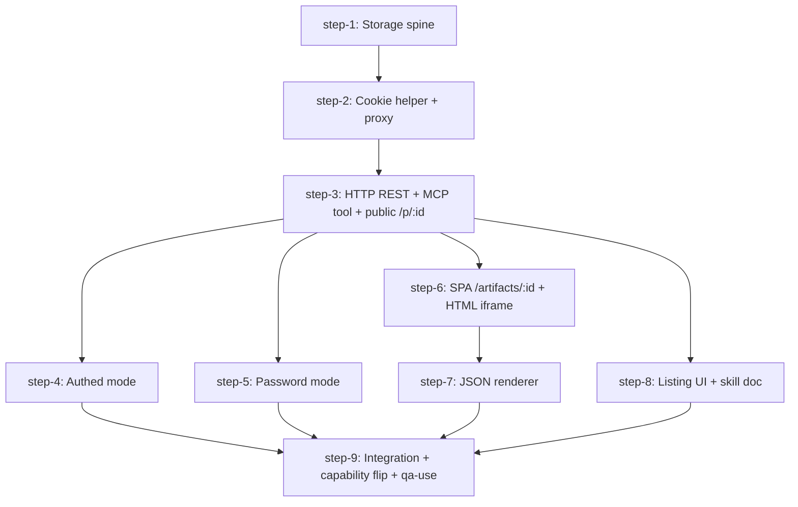

# DB-backed Pages — Plan (DAG)

## Overview

Introduce a lighter-weight alternative to the existing artifact servers: agents create `pages` (HTML or JSON blobs) that the API stores in SQLite and serves directly — no PM2, no tunnel, no port allocation, no `services` registry row. Two delivery surfaces: `/p/:id` on the API (HTML direct, JSON 302→SPA) and `/artifacts/:id` in the SPA (always works; JSON rendered via vendored json-render.dev).

- **Motivation**: ~80% of agent-emitted artifacts are static reports / status JSON, not interactive apps. Current artifact servers are massive overkill for that path.
- **Related**: `thoughts/taras/brainstorms/2026-05-12-db-backed-pages.md`, `src/artifact-sdk/`, `src/commands/artifact.ts`, `plugin/skills/artifacts/skill.md`

## Current State Analysis

**Existing artifact subsystem** (the heavyweight thing pages replaces for static cases):
- `src/artifact-sdk/server.ts:42-69` — proxy `/@swarm/api/*` → MCP `/api/*`, injecting `Authorization: Bearer ${API_KEY}` + `X-Agent-ID: ${AGENT_ID}` server-side. The proxy lives **inside the artifact's own Hono server**, NOT on the main API. **Pages must introduce an equivalent proxy on the main API**, cookie-gated.
- `src/artifact-sdk/browser-sdk.ts:2-29` — `BROWSER_SDK_JS` constant (`SwarmSDK` class on `window`, methods `createTask` / `getTasks` / `getTaskDetails` / `storeProgress` / `postMessage` / `readMessages` / `getSwarm` / `listServices` / `slackReply`). No token-injection hook; relies on server-side header injection. **Reused verbatim by pages.**
- `src/commands/artifact.ts` — PM2-per-artifact + localtunnel + service-registry row. Pages skips all of this.

**HTTP routing** (`src/http/`):
- `src/http/route-def.ts:84-142` — `route()` factory. Generic over Zod schemas for params/query/body. Auto-registers into `routeRegistry` for OpenAPI emission. `auth: { apiKey: false }` opts a route out of the global bearer gate.
- Bearer auth is **global**, applied in `src/http/core.ts:237-253` before per-handler dispatch. `isPublicRoute()` (`src/http/route-def.ts:65-69`) scans the registry; unknown paths fail closed.
- `src/http/index.ts:122-158` — central `handlers` array of `() => Promise<boolean>` thunks; first-to-return-true wins. **This is where new handler modules wire in**, not `src/server.ts`.
- `scripts/generate-openapi.ts:1-37` — side-effect imports of each handler module. New module must be added here too.
- `src/http/utils.ts:40-46` — `parseBody` is unbounded (no Content-Length cap). **Pages introduces the first body-size cap.**
- **No cookie code anywhere** in `src/`. Pages is the first cookie-issuing surface.
- **No JWT / signing helpers** beyond OAuth-specific code. Pages introduces a small `signPageSession()` HMAC helper.

**Workflow versioning** (the pattern pages mirrors):
- Parent table `workflows` holds **current** state directly (`src/be/migrations/008_workflow_redesign.sql:17-29`, augmented by `012`, `015`).
- History table `workflow_versions` (`008:74-82`) — `id` PK, `workflowId` FK with **`ON DELETE CASCADE`**, `version` INTEGER, `snapshot` JSON (frozen pre-update parent state), `changedByAgentId`, `createdAt`, `UNIQUE(workflowId, version)`.
- Head pointer is **derived `MAX(version)`** (`src/workflows/version.ts:20-22`) — no `head_version` column.
- Update path: `snapshotWorkflow(id, agentId)` is called **before** `updateWorkflow` in HTTP handlers (`src/http/workflows.ts:483, 523, 569`). The snapshot stores PRE-update state; the parent gets the NEW state. **Critical gotcha — preserve this ordering.**
- Snapshot failure is swallowed (try/catch with empty catch). Intentional resilience.
- `WorkflowSnapshotSchema` (`src/types.ts:1042-1056`) — omits id/createdByAgentId/timestamps, captures the mutable content fields.

**MCP tool architecture** (correction to brainstorm assumption):
- MCP tools in `src/tools/` run **on the API server**, accessing `src/be/db` directly (`requestInfo.agentId` is the agent identity). The architecture invariant ("workers never import `bun:sqlite`") covers `src/commands/`, `src/hooks/`, `src/providers/` — NOT `src/tools/`. Pages tools follow the existing pattern (`src/tools/create-channel.ts` is the template).
- Tools register through `registerXxxTool(server)` calls in `src/server.ts:155-200`, **gated by `hasCapability(...)`** (`src/server.ts:121-134`). `CAPABILITIES` env var controls which ones load; default = `"core,task-pool,profiles,services,scheduling,memory,workflows"`. Pages adds `"pages"` to this gate.

**UI** (`ui/`):
- Vite 7 + React 19 + react-router-dom 7 (data-router via `createBrowserRouter`, `ui/src/app/router.tsx:43-86`) + shadcn/ui + Tailwind 4 + react-query 5.
- apiKey lives in `localStorage["agent-swarm-connections"]` (`ui/src/lib/config.ts:4-21`). Multi-connection; active connection global to tab.
- `ApiClient.getHeaders()` attaches `Authorization: Bearer ${apiKey}` to every call (`ui/src/api/client.ts:126-135`). No `credentials: 'include'` anywhere today.
- **No iframes anywhere in `ui/`**. No existing `/artifacts/:id` route. Service worker absent. Fully greenfield.
- `ConfigGuard` (`ui/src/components/layout/config-guard.tsx:8-28`) redirects to `/config` if no connection. New `/artifacts/:id` route inherits this gate (acceptable — authed pages need a connection regardless).

**Migrations & types**:
- Highest migration number = 058 (`src/be/migrations/058_task_templates.sql`). Pages claims **059** (parent table) and **060** (versions table).
- ID convention is **`TEXT PRIMARY KEY DEFAULT (lower(hex(randomblob(16))))`** — 32-char random hex, NOT ulid (brainstorm assumption corrected). Same column used as the public URL token in `/p/:id`.
- `AgentTaskSourceSchema` (`src/types.ts:56-70`) is the mirror-pattern template: Zod enum + matching SQL `CHECK(... IN (...))`. Pages adds `PageAuthModeSchema = z.enum(['public','authed','password'])` paired with `CHECK(authMode IN (...))`.

**External dependency — `@json-render/core` + `@json-render/react`** (vercel-labs/json-render):
- Real npm packages, Apache-2.0, peer deps `react ^19` (✅) + `zod ^4` (verify swarm's zod version; bump if needed in `ui/`).
- `defineCatalog` / `defineRegistry` / `ActionHandler` extension pattern supports our `{method, endpoint, body}` action shape as a custom node type.
- Bundled shadcn-style components ship in the package (opt-in via Registry).

## Desired End State

A new `pages` feature where:

- An agent calls one MCP tool (`create_page` — gated by `CAPABILITIES` env var containing `pages`) with `{title, slug?, body, contentType, authMode, password?, description?, needsCredentials?}` and receives `{ id, app_url, api_url, version }`. Upsert by `(agent_id, slug)`; auto-slug from title otherwise. Every update versions the prior state.
- The HTTP REST API exposes `POST/PUT/GET/DELETE /api/pages`, `GET /api/pages/:id/versions`, `GET /api/pages/:id/versions/:version`, `POST /api/pages/:id/launch` (issues HttpOnly page-session cookie), and the public-facing `GET /p/:id` + `GET /p/:id.json`.
- `GET /p/:id` serves HTML directly (Browser SDK injected) for `auth_mode='public'`; serves HTML with SDK calls authenticated via the page-session cookie for `authed`/`password`; redirects `application/json` content to the SPA route.
- The SPA has a `/artifacts/:id` route that fetches `/p/:id.json` and renders HTML via `<iframe src="${apiUrl}/p/:id">` (absolute, with `credentials: 'include'` on the launch call) or JSON via `@json-render/react` with custom-action handler dispatching `{method, endpoint, body}` through the SPA's bearer.
- A new `/@swarm/api/*` proxy on the main API resolves the page-session cookie → forwards to `/api/*` with the resolved user's identity.
- A listing UI at `/pages` shows pages the viewer can see (title, description, agent, updated_at, auth_mode).
- All cookies issued via a small HMAC helper (`src/utils/page-session.ts`). All page bodies pass through `scrubSecrets` at every log/egress boundary.
- `plugin/skills/pages/skill.md` documents the agent contract.
- `openapi.json` regenerated, committed.
- Zero PM2, zero localtunnel, zero `services` registry row.

## What We're NOT Doing

- **NOT removing or modifying the existing artifact subsystem.** Pages is additive — agents pick the right tool per use case.
- **NOT building a server-side credential vault.** Tier-C deferred. Tiers A (SPA-shares-localStorage-creds via consented postMessage) and B (per-page browser-local prompt) are in v1.
- **NOT integrating with the `secret-scrubber` credential pool yet.** Reuse of scrubber for egress is in scope; cred-pool-as-page-cred-source is v1.5+.
- **NOT supporting public-API calls from the Browser SDK in `public` pages in v1.** Public pages can only render content; SDK calls 401 (no cookie → no user). A curated public-endpoint allowlist is a follow-up.
- **NOT implementing OG meta-tag unfurl for Slack/Twitter in v1** (deferred to a polish step or v1.5). `title`/`description` columns exist so unfurl can be layered on later without schema churn.
- **NOT building a per-page TTL / quota / cleanup job.** Manual delete via UI/MCP only. Storage-cap discussion handled by per-version body-size cap.
- **NOT generalizing the cookie helper for other surfaces.** Scope-locked to page-session use; if a second use case appears, refactor then.
- **NOT touching the existing `services` table or PM2 stack.**
- **NOT implementing credential capture (Tier A or Tier B) in v1.** JSON pages' declared actions in v1 may only target the swarm API using the viewer's bearer (via the page-session cookie / `/@swarm/api/*` proxy). Per-page localStorage prompts for `needs_credentials` and SPA-iframe postMessage credential sharing are deferred to a follow-up plan. The `needs_credentials` field is reserved in the schema but the renderer ignores it (Zod accepts, no UI prompt).

## Implementation Approach

- **Strategy: thin vertical slices that compose into a working public-only path first, then layer in auth modes and JSON rendering.** Each slice ships end-to-end DB + API + (where relevant) SPA + tests.
- **Reuse, don't replicate**: `BROWSER_SDK_JS` is reused verbatim; the workflow-versioning helper pattern (`snapshotWorkflow` ordering) is copied to a new `snapshotPage` helper.
- **Cookies-first architectural step is isolated**: the HMAC signer + `/@swarm/api/*` proxy lands as its own slice so subsequent auth-mode work has a stable substrate.
- **Frontend lands as two narrow steps**: (a) HTML iframe rendering (depends only on auth-mode plumbing), (b) JSON renderer (depends on json-render install + listing/route shell). Splitting keeps the iframe-cookie surface separate from the json-render integration risk.
- **Capability-gated tool**: `pages` capability defaults OFF until the end-to-end path is green, then is toggled on in `DEFAULT_CAPABILITIES`.
- **OpenAPI regeneration** is in every step that touches HTTP — small, frequent regens beat one giant diff at the end.
- **Sequencing decision**: storage (slice 1) + cookie helper + proxy (slice 2) + MCP tool (slice 3) form a sequential spine because each subsequent slice depends on the prior. The three auth modes (public HTML, authed HTML, password HTML), the JSON renderer, the SPA route shell, and the listing UI fan out as parallel siblings once the spine lands. A final integration step wires the listing UI cross-checks and runs the end-to-end QA matrix.

## Quick Verification Reference

- `bun test src/tests/<file>.test.ts` — unit test
- `bun run lint` — lint (read-only; CI runs this exact form)
- `bun run tsc:check` — typecheck
- `bash scripts/check-db-boundary.sh` — worker/API DB-boundary invariant
- `bun run docs:openapi` — regenerate `openapi.json` after adding routes
- `cd ui && pnpm exec tsc -b` — SPA typecheck (CI form)

## DAG

## Steps

| ID | Name | Depends on | Status | File |
|----|------|------------|--------|------|
| step-1 | Storage spine | — | done | [step-1.md](./step-1.md) |
| step-2 | Cookie helper + `/@swarm/api/*` proxy | step-1 | done | [step-2.md](./step-2.md) |
| step-3 | HTTP REST + MCP tool + public `/p/:id` | step-2 | done | [step-3.md](./step-3.md) |
| step-4 | Authed mode (launch cookie) | step-3 | done | [step-4.md](./step-4.md) |
| step-5 | Password mode (`?key=` + Basic) | step-3 | done | [step-5.md](./step-5.md) |
| step-6 | SPA `/artifacts/:id` + HTML iframe | step-3 | done | [step-6.md](./step-6.md) |
| step-7 | JSON renderer (`@json-render/react`) | step-6 | done | [step-7.md](./step-7.md) |
| step-8 | Listing UI + skill doc | step-3 | done | [step-8.md](./step-8.md) |
| step-9 | Integration + capability flip + qa-use | step-4, step-5, step-7, step-8 | done | [step-9.md](./step-9.md) |

> **Canonical dependencies and execution status live in each `step-<n>.md`'s frontmatter.** This table is a derived snapshot at plan creation. During `/v-implement`, frontmatter `status` (`ready` → `claimed` → `done`) is the source of truth.

## Pre-flight Verification

Run before kicking off any step:

- [ ] Working tree is clean (or only contains intentional in-flight work)
- [ ] Baseline tests pass: `bun test`
- [ ] Baseline typecheck passes: `bun run tsc:check`
- [ ] DB-boundary check passes: `bash scripts/check-db-boundary.sh`
- [ ] Local server boots: `bun run start:http`

## Global Verification

Run after all steps complete:

- [x] Whole-repo typecheck: `bun run tsc:check` — clean
- [x] Full test suite: `bun test` — 3858 pass / 0 fail (after registering `create_page` in `DEFERRED_TOOLS`)
- [x] DB-boundary invariant intact: `bash scripts/check-db-boundary.sh` — passed
- [x] OpenAPI spec is fresh: `bun run docs:openapi` produces no diff
- [x] SPA typecheck: `cd ui && pnpm exec tsc -b` — clean
- [ ] End-to-end (manual): create a public HTML page via MCP → open `api_url` in browser → confirms rendered; create an authed JSON page → open `app_url` → declared action fires; create a password page → `?key=` and Basic dialog both unlock. **See [step-9.md § Manual Verification](./step-9.md) for the runnable curl matrix.**
- [ ] `qa-use` session with screenshots for the SPA `/artifacts/:id` route — **Taras runs manually before merge** (no YAML authored per orchestrator directive; merge gate for `ui/` PRs still applies).

## Appendix

- **Follow-up plans**: TBD (credential vault, listing UX polish, OG-tag unfurl if not included v1)
- **Derail notes**:
  - Existing artifacts (`src/artifact-sdk/`, `src/commands/artifact.ts`) are NOT being removed by this plan — pages is additive.
  - Credential-pool integration (`src/utils/secret-scrubber.ts` cache) is explicitly v1.5/v2.
- **References**:
  - Brainstorm: `thoughts/taras/brainstorms/2026-05-12-db-backed-pages.md`
  - Existing SDK: `src/artifact-sdk/browser-sdk.ts` (`BROWSER_SDK_JS`)
  - Workflow versioning prior art: `src/be/migrations/0NN_*workflows*.sql`, `ui/src/api/client.ts` (`Workflow` / `WorkflowVersion`)
  - Architecture invariant: `CLAUDE.md` — workers must never import `src/be/db` or `bun:sqlite`
