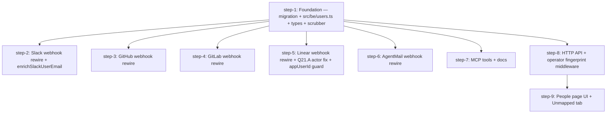

# Humans as first-class users — Plan (DAG)

## Overview

Land the full "humans-as-first-class-users" initiative as a **single bundled PR**. Normalize identity into `user_external_ids`, drop the four deprecated identity columns (`slackUserId` / `linearUserId` / `githubUsername` / `gitlabUsername`), introduce `src/be/users.ts` as the canonical API-server-side identity surface, rewire all 7 webhook handlers + MCP tools + HTTP API + types + UI to use it, and ship an operator People page with Unmapped tab.

- **Motivation**: Daniel↔fuvidani identity-mapping footgun (brainstorm Triggering feedback). Pre-existing Linear bug — `src/linear/sync.ts` reads non-existent `event.actor` field, so Linear-originated tasks always have `requestedByUserId = undefined` (Q21.A). Tech-debt cleanup that also unblocks the MCP-token brainstorm (zero new tables on top).
- **Related**:
  - Brainstorm: `thoughts/taras/brainstorms/2026-05-18-humans-as-first-class-users.md` — §Key Decisions / Constraints / Core Requirements / Next Steps + Q17 research-folded findings are canonical.
  - Research: `thoughts/taras/research/2026-05-18-user-identity-refactor.md` — exhaustive call-site inventory (§1), `resolveUser` call-graph (§2), email-availability matrix (§3), Plan-time deliverables checklist.
  - Adjacent brainstorm (shares People-page surface, schema co-lands here): `thoughts/taras/brainstorms/2026-05-15-client-side-mcp.md`.

## Current State Analysis

**Identity model today** (per research §1):

- `users` table has four UNIQUE-constrained identity columns: `slackUserId`, `linearUserId`, `githubUsername`, `gitlabUsername` (migration 031). These are a prematurely-denormalized version of `user_external_ids`.
- Single read primitive: `resolveUser()` at `src/be/db.ts:8770-8832` — four sequential SELECT branches + email/aliases/name fallback. 14 callers across 7 webhook handlers, 2 MCP tools, 1 HTTP route, tests.
- **Pre-existing Linear bug** (Q21.A): `src/linear/sync.ts:379, 691` reads `event.actor` but `AgentSessionEvent` payloads put the human at `event.agentSession.creator` (created) / `event.agentActivity.user` (prompted). `actorLinearId`/`actorEmail`/`actorName` are always empty strings → `resolveUser({})` always returns `null` → `requestedByUserId` always `undefined` on Linear tasks.
- **Slack email enrichment exists but is in-process only** (Q17.E): `src/slack/handlers.ts:38` declares `userEmailCache: Map<string, string | null>` — lost on every restart.
- **No People page UI**, no Unmapped triage queue, no per-user budget/status surface.
- **`kv_entries` has every primitive needed** (research §5): `getKv` / `upsertKv` / `incrKv` (atomic in tx) / `listKv` (prefix + LIKE-escape) / `countKv`. No new helper required.
- **Boundary checker** (`scripts/check-db-boundary.sh`) is silent on `src/be/users.ts` and every prospective caller — all API-side (research §4). ✅
- **Blast radius**: ~30 file:line refs to rewire, NOT 150 (the naive grep is polluted by unrelated `agent_tasks.slackUserId` / `inbox_messages.slackUserId` — different tables, KEPT).

**Linear `appUserId`** (Q21.C): `event.appUserId` is the swarm itself (lead-agent identity Linear assigned at install), NOT a human. Must be stored in integration config (NOT `users`) and webhook handlers must skip auto-link when `actor.id === appUserId` ("the swarm hearing itself").

## Desired End State

- `src/be/migrations/064_users_first_class.sql` applied: six DDL blocks + backfill + four `DROP COLUMN`s.
- `src/be/users.ts` is the **only** path that mutates identity tables — every mutation emits a `user_identity_events` row in the same transaction.
- All 7 webhook handlers, both MCP tools, the HTTP `src/http/users.ts` route, types, seed script, scrubber, and UI use the new surface.
- Linear webhook auto-link works against real `AgentSessionEvent.created`/`prompted` payloads — `requestedByUserId` is populated for the first time.
- Operator can: open the People page, see every user with identity badges + budget + status, edit any of those, view the per-user identity-event timeline, see Unmapped identities and triage them (create-and-link OR link-to-existing).
- `grep -RIn -E 'users\.(slackUserId|linearUserId|githubUsername|gitlabUsername)' src/ ui/ scripts/` returns **zero hits** outside the new migration file.
- `openapi.json` regenerated and committed.
- `bun run lint` / `bun run tsc:check` / `bun test` / `cd ui && pnpm exec tsc -b` all pass.
- Manual QA on the People + Unmapped pages passes (per memory: Taras manual-QAs the SPA).

## What We're NOT Doing

- **Token-mint UI dialog and `POST/DELETE /users/:id/mcp-tokens` endpoints** — schema for `user_tokens` + `tokenPreview` lands here (Q20), but the mint/revoke endpoints + UI dialog ship with the MCP-token brainstorm (Core Req #6 explicit defer).
- **Token-bearer middleware on `/mcp/user`** — same defer; lands with MCP plan.
- **End-user auth (OAuth / magic-link)** — operator-only v1 per Q2/Q3.
- **Per-alias email metadata** (verified flag, source-of-alias, primary toggle) — `emailAliases` stays JSON per Q12; normalize only when needed.
- **Linear lifecycle widening** (issue.update, label diff, unassign-triggers-cancel) — out of scope per Q22; separate future brainstorm.
- **GitHub email auto-link** — operator-manual-link only per Q17.A; no `enrichUserFromIntegration('github', ...)` helper built.
- **Per-alias `email_added`/`email_removed` event emission from automatic paths** — events exist in the enum but are emitted only by the operator-driven UI/manage-user edits. Webhook auto-link emits `auto_merge` + `identity_added`.
- **Allow/deny lists or dedicated audit views** — deferred per Q7.
- **Soak period for deprecated columns** — same-PR DROP per Q15.
- **Soak/dual-write of `resolveUser`** — deleted in step-1 alongside the column drops.

## Implementation Approach

- **Foundation-first fan-out**: step-1 lands the migration, types, and `src/be/users.ts` (with unit tests). Steps 2–8 fan out from it and can be implemented in parallel. The UI (step-9) sits on top of the HTTP API (step-8).
- **All in one branch, one PR** (Q15 no-soak). Per-step commits are clean — each step commit message is `[step-N] <name>` — squash optional at merge.
- **Each step is independently QA-able**: every step's Success Criteria block proves the slice works in isolation (unit tests for `src/be/users.ts`, per-integration webhook round-trip for steps 2–6, MCP tool surface for step-7, HTTP curl for step-8, manual UI for step-9). The Global Verification block is the integration gate after all steps drain.
- **Linear is the only webhook step with non-trivial new logic** (cascade + actor extraction fix + appUserId guard). Per Q21 dev-pipeline loop: tail `/tmp/linear-webhooks.jsonl` against the real dev API to verify extraction shapes.
- **MCP `resolve-user` break-and-migrate** (Q18): new `{kind, externalId, email}` shape with Zod refine, old field names removed. Worker callers in `plugin/commands/` get same-PR rewrite — runtime error on the old shape is honest.
- **Slack-only `enrichUserFromIntegration`** (Q17.A): Linear has email inline in webhook, GitHub has no email at all, GitLab is conditional inline only. Only Slack needs the kv-backed cache helper.
- **Two-kv-row unmapped record** (Q17.D): `<externalId>:meta` (json, upserted) + `<externalId>:count` (integer, atomic `incrKv`). 30-day TTL on both.

## Quick Verification Reference

Commands every step uses:

- Tests: `bun test` (single file: `bun test src/tests/<file>.test.ts`)
- Lint: `bun run lint` (CI runs lint, not lint:fix)
- Typecheck: `bun run tsc:check`
- UI typecheck: `cd ui && pnpm install --frozen-lockfile && pnpm lint && pnpm exec tsc -b`
- DB boundary: `bash scripts/check-db-boundary.sh`
- API-key boundary: `bash scripts/check-api-key-boundary.sh`
- OpenAPI regen: `bun run docs:openapi` (commit `openapi.json` + `docs-site/content/docs/api-reference/**`)
- Pi-skills regen: `bun run build:pi-skills` (commit `plugin/pi-skills/**`)
- Fresh DB: `rm agent-swarm-db.sqlite && bun run start:http` (CLAUDE.md migration rule)
- Existing DB: snapshot the current `agent-swarm-db.sqlite` before running new migration; verify backfill rows.

## DAG

## Steps

| ID | Name | Depends on | Status | File |
|----|------|------------|--------|------|
| step-1 | Foundation — migration + src/be/users.ts + types + scrubber | — | ready | [step-1.md](./step-1.md) |
| step-2 | Slack webhook rewire + enrichSlackUserEmail | step-1 | ready | [step-2.md](./step-2.md) |
| step-3 | GitHub webhook rewire | step-1 | ready | [step-3.md](./step-3.md) |
| step-4 | GitLab webhook rewire | step-1 | ready | [step-4.md](./step-4.md) |
| step-5 | Linear webhook rewire + Q21.A actor fix + appUserId guard | step-1 | ready | [step-5.md](./step-5.md) |
| step-6 | AgentMail webhook rewire | step-1 | ready | [step-6.md](./step-6.md) |
| step-7 | MCP tools + docs | step-1 | ready | [step-7.md](./step-7.md) |
| step-8 | HTTP API + operator fingerprint middleware | step-1 | ready | [step-8.md](./step-8.md) |
| step-9 | People page UI + Unmapped tab | step-8 | ready | [step-9.md](./step-9.md) |

> **Canonical dependencies and execution status live in each `step-<n>.md`'s frontmatter.** This table is a derived snapshot at plan creation. During `/v-implement`, frontmatter `status` (`ready` → `claimed` → `done`) is the source of truth.

## Pre-flight Verification

- [ ] Working tree clean (or only intentional in-flight work)
- [ ] Baseline `bun test` passes on the current branch
- [ ] Baseline `bun run tsc:check` passes
- [ ] Baseline `bash scripts/check-db-boundary.sh` passes
- [ ] Baseline `bash scripts/check-api-key-boundary.sh` passes
- [ ] Dev API server running: `bun run dev:http` (portless `https://api.swarm.localhost:1355`) OR `bun run pm2-start`
- [ ] Linear dev integration is authenticated (for step-5 webhook capture loop)
- [ ] `/tmp/linear-webhooks.jsonl` capture is wired (step-5 dev loop reference)
- [ ] Slack dev app + bot installed in `#swarm-dev-2` (channel `C0AR967K0KZ`, bot `U0ALZGQCF96`) per memory
- [ ] All worktrees / branches needed for parallel implementation created

## Global Verification

Run after all 9 steps complete (final wave gate before opening the PR):

### Code health gates (CI mirror — `runbooks/ci.md`)

- [ ] `bun install --frozen-lockfile` clean
- [ ] `bun run lint` (read-only — NOT `lint:fix`) passes
- [ ] `bun run tsc:check` passes
- [ ] `bun test` passes (whole suite)
- [ ] `bash scripts/check-db-boundary.sh` passes (confirms no worker-side imports of `src/be/users.ts`)
- [ ] `bash scripts/check-api-key-boundary.sh` passes (confirms `fingerprintApiKey` uses `getApiKey()`)
- [ ] `cd ui && pnpm install --frozen-lockfile && pnpm lint && pnpm exec tsc -b` passes

### Drift checks (regenerate + commit)

- [ ] `bun run docs:openapi` — committed `openapi.json` + `docs-site/content/docs/api-reference/**` (step-8 adds endpoints)
- [ ] `bun run build:pi-skills` — committed `plugin/pi-skills/user-management/SKILL.md` (step-7 edits source MD)

### Cross-cutting greps (must each return ZERO hits outside `src/be/migrations/064_users_first_class.sql` and `src/be/migrations/031_user_registry.sql`)

- [ ] `grep -RIn 'users\.slackUserId' src/ ui/ scripts/ plugin/ docs-site/ MCP.md` → 0 hits
- [ ] `grep -RIn 'users\.linearUserId' src/ ui/ scripts/ plugin/ docs-site/ MCP.md` → 0 hits
- [ ] `grep -RIn 'users\.githubUsername' src/ ui/ scripts/ plugin/ docs-site/ MCP.md` → 0 hits
- [ ] `grep -RIn 'users\.gitlabUsername' src/ ui/ scripts/ plugin/ docs-site/ MCP.md` → 0 hits
- [ ] `grep -RIn 'resolveUser\s*(' src/ ui/ scripts/ plugin/` → 0 hits (function deleted in step-1)
- [ ] `grep -RIn 'userEmailCache' src/` → 0 hits (Slack in-memory Map retired in step-2)
- [ ] No reference to dropped columns in any test fixture / seed / doc

### Existing-DB migration check

- [ ] Snapshot the real `agent-swarm-db.sqlite` BEFORE running the new migration (copy aside).
- [ ] Run the new migration against the snapshot. Confirm: each pre-existing `users.<identityCol> IS NOT NULL` row produced a matching `user_external_ids` row with `(kind, externalId)` PK. Zero data loss.
- [ ] `sqlite3 <snapshot.db> '.indexes users'` — confirm dropped `idx_users_slack/linear/github/gitlab` are gone (auto-cleaned with DROP COLUMN).
- [ ] `sqlite3 <snapshot.db> 'SELECT count(*) FROM user_external_ids;'` — matches sum of non-null identity counts from pre-snapshot.

### Fresh-DB integration round-trip

- [ ] `rm agent-swarm-db.sqlite && bun run start:http`
- [ ] Trigger one webhook per integration with a NEW external identity that has an email (Slack DM via `#swarm-dev-2`, Linear `@devagentswarm` mention in dev workspace, AgentMail inbound).
- [ ] For each: assert a `users` row exists, a `user_external_ids` row exists, an `auto_merge` OR `identity_added` event exists in `user_identity_events`, the resulting task has `requestedByUserId` set.
- [ ] Trigger the SAME identity again — assert no duplicate `users` row, no duplicate `user_external_ids` row, identity-event timeline reflects the second event.
- [ ] Trigger a GitHub webhook with an unknown sender — assert a kv row `integration:unmapped:github` `<login>:meta` is present and `<login>:count` is `1`. Trigger again — assert count is `2`.
- [ ] Trigger a Linear webhook where `creator.id === storedAppUserId` — assert NO `users` row created, NO unmapped entry written (Q21.C bot-guard).

### Linear pre-existing-bug fix confirmation

- [ ] Send a real `AgentSessionEvent.created` from the Linear dev workspace. Confirm `requestedByUserId` is populated on the resulting agent task (today it is always `undefined`).
- [ ] Send a real `AgentSessionEvent.prompted` follow-up. Confirm `requestedByUserId` is populated.

### Manual UI QA (Taras manual-QAs the SPA per feedback memory)

- [ ] People page list view loads — identity badges render per row, budget badge ("Unlimited" or `$X.YY`), status pill.
- [ ] People detail page — edit name, add an identity link via picker, remove an identity link, set/clear daily budget, change status, all persist + show in events timeline.
- [ ] Operator merge flow — pick two rows, preview, confirm, target row gains source row's identities, `manual_merge` appears in timeline.
- [ ] Unmapped tab — list shows kv-backed entries with filter chips, "Create user from this externalId" and "Link to existing user" CTAs both work and remove the kv entry on success.
- [ ] No console errors on any page.

## Appendix

- **Follow-up plans**:
  - MCP token-bearer endpoints + UI dialog (separate brainstorm: `thoughts/taras/brainstorms/2026-05-15-client-side-mcp.md` → its own plan). Will use schema already landed here (`user_tokens`, `tokenPreview`, `IdentityEventTypeSchema` has `token_minted`/`token_revoked`).
  - Linear lifecycle events (cancel/unassign/labels) — separate future brainstorm per Q22. Identity primitives in `src/be/users.ts` are event-type-agnostic; new event-type handlers just call the same primitives.
- **Derail notes**:
  - **Q19 deferred discriminated union**: per-event `beforeJson`/`afterJson` shape enforcement is overkill for v1. Revisit if event-shape bugs surface.
  - **GitLab inline-email reliability**: untested in dev (no canonical fixture). If the inline-email auto-link path proves flaky in production, fall back to manual-only like GitHub.
  - **Operator merge endpoint shape**: brainstorm Core Req #7 mentions "select two rows → preview → confirm → emit `manual_merge`" but doesn't pin an endpoint. Plan resolves to a dedicated `POST /users/:id/merge { sourceUserId }` in step-8 — cleaner than composing client-side from identity endpoints.
  - **Linear app config widening watch**: if event subscriptions widen later (Issue events, label diffs), system-actor case returns (Q21.B). Identity primitives unaffected; new handlers re-use them.
- **References**:
  - Research: `thoughts/taras/research/2026-05-18-user-identity-refactor.md`
  - Brainstorm: `thoughts/taras/brainstorms/2026-05-18-humans-as-first-class-users.md`
  - Adjacent brainstorm: `thoughts/taras/brainstorms/2026-05-15-client-side-mcp.md`
  - CLAUDE.md (project root) — migration rules, route() factory, OpenAPI regen, secret-scrubbing, harness-providers
  - `runbooks/ci.md` — merge-gate mirror
  - `runbooks/local-development.md` — dev env, OAuth, portless dev
  - `runbooks/secret-scrubbing.md` — scrubber rule additions
  - `runbooks/workflows.md` — N/A for this plan, listed for completeness
