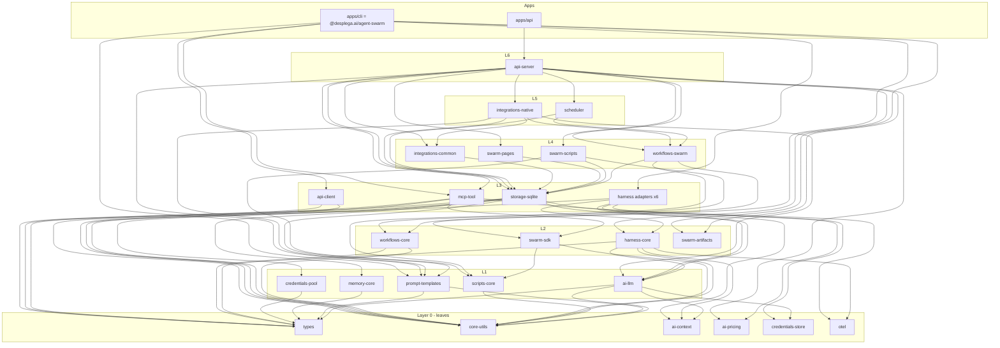

# Agent Swarm Monorepo Restructure — Final Plan

## 1. Executive Summary

This plan splits the current flat `src/` tree of `agent-swarm` into a layered, acyclic monorepo of **39 internal packages + 7 apps**, while keeping the published artifact (`@desplega.ai/agent-swarm`) byte-for-byte stable for consumers.

**What changes**

- The single `src/` directory becomes `packages/*` (libraries, organized into 8 dependency layers) and `apps/*` (the bootable/buildable targets: `api`, `cli`, `ui`, `templates-ui`, `evals`, `evals-ui`, `docs`).
- Four genuine source-level cycles in today's code are explicitly cut (types↔model-tiers, utils↔be, utils↔providers, be→github), plus several engine/integration coupling edges are inverted via ports.
- The DB-ownership invariant (today enforced by `scripts/check-db-boundary.sh` over a flat tree) becomes **structural**: `@swarm/storage-sqlite` is the sole `bun:sqlite` owner and is depended on only by `@swarm/api-server` and the swarm adapters above it. `apps/cli` (the worker) reaches the API only through the net-new `@swarm/api-client`, never through storage.

**Recommended toolchain**

- **Package manager:** **Bun workspaces** as the *sole* PM across the whole tree — migrate `ui/` and `templates-ui/` off pnpm so there is one lockfile (`bun.lock`) and one resolver. (Reconciliation of the verifier/architect contradiction below.)
- **Task runner:** **Turborepo** for the task graph + content-hash caching + `--affected` across ~40 packages.
- **Publishing:** **Changesets**, but in *fixed/lockstep* mode and only adopted once a second package is actually published. Day-1 publish set is exactly one package.
- **TS strategy:** one root `tsconfig.base.json`; thin per-package `tsconfig.json`; **no** project references/composite (incompatible with `noEmit` + `allowImportingTsExtensions` + Bun-runs-TS); type-check-only `tsc --noEmit` per package, cached by Turbo.

**Package count:** 39 internal `@swarm/*` packages + 7 apps = **46 workspaces**.

**Publish posture:** **Publish almost nothing.** The shipped CLI is a bundled single-file `dist/cli.js` that inlines its workspace deps, so the split is invisible to consumers. Day-1 publish = only `@desplega.ai/agent-swarm` (unchanged). The publish-later set (gated on a real external consumer) is, in priority order: `@desplega.ai/swarm-api-client`, then `@desplega.ai/swarm-sdk` (+ scripts-runtime, shipped as one unit), then `@desplega.ai/swarm-types`.

**Acyclicity guarantee:** The dependency graph is a verified DAG (8 layers, every `dependsOn` points strictly downward). A topological order exists (Section 3). The four real back-edges in the live code are cut as a precondition of the corresponding extraction phase, and a `dependency-cruiser` config encodes the layering so the invariant is enforced at the module-graph level, not by grep.

> **Reconciliation note (architect ↔ tooling recommendation):** The architect's `openQuestions` floated "pnpm workspaces + turborepo." The tooling analysis argues convincingly for **Bun-as-sole-PM + Turbo**, since the root + `evals` are already Bun workspaces and cross-PM sharing of `@swarm/components`/`@swarm/types` between a Bun app (`api`) and a Next app (`ui`) is the single biggest friction point — which disappears once everything is one Bun workspace. **This plan adopts Bun-as-sole-PM + Turbo**, with pnpm-as-workspace-PM kept only as a documented fallback if a hard Next-on-Bun blocker surfaces. Phase 0's migration steps are written for the Bun-sole path; where the original migration phases mention "pnpm install," read it as the fallback.

---

## 2. Target Structure

### 2.1 Tree (annotated)

```
agent-swarm/
├── package.json                 # root: workspaces[], catalog:, turbo, changeset scripts
├── bun.lock                     # SINGLE lockfile (ui/templates-ui migrated off pnpm)
├── turbo.json                   # build / typecheck / test / lint / boundary tasks
├── tsconfig.base.json           # one set of compiler flags; every pkg `extends` this
├── .dependency-cruiser.cjs      # encodes the LAYER DAG (replaces grep boundary guards)
├── biome.json                   # single root lint/format config for the whole tree
│
├── packages/
│   ├── types/                   # L0  @swarm/types          (absorbs model-tiers)
│   ├── core-utils/              # L0  @swarm/core-utils      (+ moved `interpolate`)
│   ├── ai-context/              # L0  @swarm/ai-context
│   ├── ai-pricing/              # L0  @swarm/ai-pricing      (ships cache.json asset)
│   ├── credentials-store/       # L0  @swarm/credentials-store (codex-oauth FS+PKCE)
│   ├── vcs/                     # L0  @swarm/vcs
│   ├── otel/                    # L0  @swarm/otel
│   ├── swarm-templates/         # L0  @swarm/swarm-templates  (templates/ data)
│   ├── e2b-dispatch/            # L0  @swarm/e2b-dispatch
│   ├── components/              # L0  @swarm/components       (ASPIRATIONAL, defer)
│   ├── credentials-pool/        # L1  @swarm/credentials-pool
│   ├── ai-llm/                  # L1  @swarm/ai-llm           (KEY cycle-breaker)
│   ├── prompt-templates/        # L1  @swarm/prompt-templates (invariant enforcement)
│   ├── scripts-core/            # L1  @swarm/scripts-core     (DB-free sandbox)
│   ├── memory-core/             # L1  @swarm/memory-core
│   ├── react-data/              # L1  @swarm/react-data       (ASPIRATIONAL, defer)
│   ├── harness-core/            # L2  @swarm/harness-core     (dynamic-import factory)
│   ├── swarm-sdk/               # L2  @swarm/swarm-sdk        (mergeable into scripts-core)
│   ├── workflows-core/          # L2  @swarm/workflows-core   (StoragePort; collapse?)
│   ├── swarm-artifacts/         # L2  @swarm/swarm-artifacts
│   ├── api/
│   │   ├── client/              # L3  @swarm/api-client       (NET-NEW)
│   │   └── server/              # L6  @swarm/api-server       (integration hub)
│   ├── storage/
│   │   └── adapters/
│   │       └── sqlite/          # L3  @swarm/storage-sqlite   (THE DB owner)
│   ├── harness/
│   │   └── adapters/
│   │       ├── claude-code/     # L3  @swarm/harness-claude-code
│   │       ├── claude-managed/  # L3  @swarm/harness-claude-managed
│   │       ├── codex/           # L3  @swarm/harness-codex
│   │       ├── pi/              # L3  @swarm/harness-pi
│   │       ├── opencode/        # L3  @swarm/harness-opencode
│   │       └── devin/           # L3  @swarm/harness-devin
│   ├── mcp-tool/                # L3  @swarm/mcp-tool
│   ├── workflows-swarm/         # L4  @swarm/workflows-swarm  (SQLite StoragePort impl)
│   ├── swarm-scripts/           # L4  @swarm/swarm-scripts
│   ├── swarm-pages/             # L4  @swarm/swarm-pages
│   ├── swarm-scheduler/         # L5  @swarm/scheduler
│   └── integrations/
│       ├── common/              # L4  @swarm/integrations-common
│       ├── native/              # L5  @swarm/integrations-native
│       ├── x-composio/          # L0  @swarm/integrations-x-composio
│       └── beta-x402/           # L0  @swarm/integrations-beta-x402
│
├── apps/
│   ├── api/                     # boots @swarm/api-server; owns initDb + pricing seed
│   ├── cli/                     # @desplega.ai/agent-swarm (worker/lead/hook bins)
│   ├── ui/                      # Next.js dashboard (port 5274)
│   ├── templates-ui/            # Next.js templates registry
│   ├── evals/                   # eval harness (own package)
│   │   └── ui/                  # evals dashboard (evals-ui)
│   └── docs/                    # Fumadocs site (docs-site)
│
├── plugin/                      # UNCHANGED — stays at repo root (out of the split)
├── runbooks/                    # unchanged
├── charts/agent-swarm/          # Chart.yaml version anchor (synced from published pkg)
├── thoughts/, mockups/          # unchanged
└── scripts/                     # boundary guards + codemod + generators (repoint paths)
```

> `docs-site/`, `helm/charts`, `runbooks/`, `thoughts/`, `mockups/`, and `plugin/` stay where they are. The package split touches only `src/`, `ui/`, `templates-ui/`, `evals/`, and `templates/`.

### 2.2 Package table

Layer 0 = leaf (zero internal deps). Apps are L7.

| Package | Dir | Layer | Purpose | Key sourceModules | dependsOn | Pub? |
|---|---|---|---|---|---|---|
| `@swarm/types` | `packages/types` | 0 | Central Zod schema + TS registry; **absorbs `model-tiers`** to dissolve the types↔model-tiers cycle | `src/types.ts`, `src/model-tiers.ts`, `src/tracker/types.ts` | — | yes¹ |
| `@swarm/core-utils` | `packages/core-utils` | 0 | Cross-cutting leaf utils for api+worker: api-key reader, secret-scrubber, constants, date-utils, crypto, swarm-config-guard, tool-loop-detection, **moved `interpolate`** | `src/utils/api-key.ts`, `src/utils/secret-scrubber.ts`, `src/utils/constants.ts`, `src/be/date-utils.ts`, `src/be/crypto/`, `src/be/swarm-config-guard.ts`, `src/hooks/tool-loop-detection.ts`, `src/be/skill-parser.ts`, `interpolate` from `src/workflows/template.ts` | — | yes¹ |
| `@swarm/ai-context` | `packages/ai-context` | 0 | Pure context-window math | `src/utils/context-window.ts` | — | int |
| `@swarm/ai-pricing` | `packages/ai-pricing` | 0 | models.dev snapshot loader + normalize + **pure** `buildModelsDevSeedRows`; ships `cache.json` asset | `src/be/modelsdev-cache.ts(.json)`, `src/be/pricing-normalize.ts`, `seed-pricing.ts` (pure only) | `@swarm/types` | int |
| `@swarm/credentials-store` | `packages/credentials-store` | 0 | Worker-side FS+PKCE OAuth token storage (codex `auth.json`). **Breaks utils→providers cycle** | `src/providers/codex-oauth/` | — | int |
| `@swarm/vcs` | `packages/vcs` | 0 | `detectVcsProvider` (github\|gitlab) | `src/vcs/` | — | int |
| `@swarm/otel` | `packages/otel` | 0 | otel facade + lazy impl + telemetry + error-tracker | `src/otel.ts`, `src/otel-impl.ts`, `src/telemetry.ts`, `src/utils/error-tracker.ts` | — | int |
| `@swarm/swarm-templates` | `packages/swarm-templates` | 0 | Templates DATA + `schema.ts`; ships raw files | `templates/` | — | int |
| `@swarm/e2b-dispatch` | `packages/e2b-dispatch` | 0 | E2B sandbox dispatch + env prep (cli + evals) | `src/e2b/` | `@swarm/core-utils` | int |
| `@swarm/integrations-x-composio` | `packages/integrations/x-composio` | 0 | Thin composio wrapper (server tool + worker cmd) | `src/x/` | `@swarm/core-utils` | int |
| `@swarm/integrations-beta-x402` | `packages/integrations/beta-x402` | 0 | x402 micropayments (pre-product, isolated viem/x402 deps) | `src/x402/` | — | int |
| `@swarm/components` | `packages/components` | 0 | Shared React kit (shadcn, workflow-graph, logs-parser) — **ASPIRATIONAL de-dup** | `ui/src/components/ui/`, `ui/src/components/workflows/`, `ui/src/logs-parser/`, `ui/src/lib/utils.ts` | — | int |
| `@swarm/credentials-pool` | `packages/credentials-pool` | 1 | Provider credential-pool maps + harness-provider resolution + provider-metadata | `src/utils/credentials.ts`, `harness-provider.ts`, `provider-metadata.ts` | `@swarm/types` | int |
| `@swarm/ai-llm` | `packages/ai-llm` | 1 | Worker-safe structured-output LLM abstraction + **hoisted memory rater client**. **Breaks utils↔be & utils↔providers** | `src/utils/internal-ai/`, `src/be/memory/raters/llm.ts`, `llm-client.ts`, `llm-summarizer.ts` | `@swarm/types`, `@swarm/core-utils`, `@swarm/ai-context`, `@swarm/credentials-store` | int |
| `@swarm/prompt-templates` | `packages/prompt-templates` | 1 | Prompt registry + dual-mode resolver; **invariant enforcement point**; DB-free (injected resolver) | `src/prompts/`, `src/heartbeat/templates.ts` | `@swarm/types`, `@swarm/core-utils` | int |
| `@swarm/scripts-core` | `packages/scripts-core` | 1 | Portable user-TS sandbox (loader, executors, import-allowlist, stdlib, redacted, egress-secrets). Verified DB-free | `src/scripts-runtime/` (minus swarm-sdk files) | `@swarm/core-utils` | int |
| `@swarm/memory-core` | `packages/memory-core` | 1 | DB-free memory primitives (types, constants, reranker, chunking, embedding) | `src/be/memory/types.ts`, `constants.ts`, `reranker.ts`, `src/be/chunking.ts`, `src/be/embedding.ts` | `@swarm/types` | int |
| `@swarm/react-data` | `packages/react-data` | 1 | Shared react-query hooks + client — **ASPIRATIONAL** | `ui/src/api/` | `@swarm/types`, `@swarm/components` | int |
| `@swarm/harness-core` | `packages/harness-core` | 2 | Harness contract + ProviderAdapter + **dynamic-import provider factory** (load-bearing, PR #452) + worker cred-check dispatcher | `src/providers/index.ts`, `types.ts`, `swarm-events-shared.ts`, `ctx-mode-env.ts`, `otel-env.ts`, `harness-version.ts`, `src/commands/provider-credentials.ts` | `@swarm/types`, `@swarm/core-utils`, `@swarm/ai-context`, `@swarm/ai-llm`, `@swarm/otel` | int |
| `@swarm/swarm-sdk` | `packages/swarm-sdk` | 2 | In-script SDK surface + `sdk-allowlist` (CI-synced) + swarm-config-over-stdin. *Candidate to merge into scripts-core* | `src/scripts-runtime/swarm-sdk.ts`, `sdk-allowlist.ts`, `swarm-config.ts` | `@swarm/scripts-core`, `@swarm/core-utils` | yes¹ |
| `@swarm/workflows-core` | `packages/workflows-core` | 2 | Portable DAG engine behind **StoragePort**; event-bus; portable executors. NO be/db. *Candidate to collapse into workflows-swarm* | `src/workflows/engine.ts` (port-abstracted), `event-bus.ts`, `templates.ts`, `definition.ts`, `validation.ts`, `json-schema-validator.ts`, `wait-filter.ts`, `executors/{base,registry,code-match,property-match,raw-llm,notify,validate,wait,human-in-the-loop}.ts` | `@swarm/types`, `@swarm/core-utils` | int |
| `@swarm/swarm-artifacts` | `packages/swarm-artifacts` | 2 | Artifact/page Hono mini-server + browser SDK + localtunnel | `src/artifact-sdk/` | `@swarm/core-utils` | int |
| `@swarm/api-client` | `packages/api/client` | 3 | **NET-NEW** typed HTTP client mirroring route registry; what workers/cli/harness consume | generated from `route-def.ts` + `openapi.json` | `@swarm/types`, `@swarm/core-utils` | yes¹ |
| `@swarm/storage-sqlite` | `packages/storage/adapters/sqlite` | 3 | **THE DB owner**: db monolith, migrations, db-queries, events/users/audit, memory sqlite stores, pricing/budget/skill-sync writers | `src/be/db.ts`, `src/be/migrations/`, `db-queries/`, `events.ts`, `users.ts`, memory stores, `seed-pricing.ts` (writer), `pricing-refresh.ts`, `src/be/scripts/` | `@swarm/types`, `@swarm/core-utils`, `@swarm/ai-pricing`, `@swarm/prompt-templates`, `@swarm/ai-llm`, `@swarm/memory-core`, `@swarm/credentials-pool` | int |
| `@swarm/harness-claude-code` | `packages/harness/adapters/claude-code` | 3 | Claude Code CLI adapter (folds in `src/claude.ts`) | `src/providers/claude-adapter.ts` | `@swarm/harness-core`, `@swarm/ai-context`, `@swarm/core-utils` | int |
| `@swarm/harness-claude-managed` | `packages/harness/adapters/claude-managed` | 3 | Claude Managed cloud adapter + helpers | `src/providers/claude-managed-*.ts` | `@swarm/harness-core`, `@swarm/ai-context`, `@swarm/core-utils` | int |
| `@swarm/harness-codex` | `packages/harness/adapters/codex` | 3 | Codex SDK adapter (uses credentials-store + ai-llm) | `src/providers/codex-*.ts` | `@swarm/harness-core`, `@swarm/ai-context`, `@swarm/ai-llm`, `@swarm/credentials-store`, `@swarm/core-utils` | int |
| `@swarm/harness-pi` | `packages/harness/adapters/pi` | 3 | pi (Earendil) adapter; heaviest SDK | `src/providers/pi-mono-*.ts` | `@swarm/harness-core`, `@swarm/ai-context`, `@swarm/ai-llm`, `@swarm/core-utils` | int |
| `@swarm/harness-opencode` | `packages/harness/adapters/opencode` | 3 | opencode adapter | `src/providers/opencode-adapter.ts` | `@swarm/harness-core`, `@swarm/ai-context`, `@swarm/core-utils` | int |
| `@swarm/harness-devin` | `packages/harness/adapters/devin` | 3 | Devin REST adapter + playbooks | `src/providers/devin-*.ts` | `@swarm/harness-core`, `@swarm/core-utils` | int |
| `@swarm/mcp-tool` | `packages/mcp-tool` | 3 | MCP tool-registration core + HTTP-client script tools + kapso registration shim | `src/tools/utils.ts`, `task-tool-ctx.ts`, `tool-config.ts`, `script-*.ts` | `@swarm/types`, `@swarm/core-utils`, `@swarm/swarm-sdk`, `@swarm/otel` | int |
| `@swarm/workflows-swarm` | `packages/workflows-swarm` | 4 | SQLite StoragePort impl + swarm executors (agent-task, swarm-script, vcs, script) + task helpers | `src/workflows/{checkpoint,cooldown,version,recovery,resume,input,wait-poller,retry-poller,triggers}.ts`, `executors/{agent-task,swarm-script,vcs,script}.ts`, `src/tasks/*` | `@swarm/workflows-core`, `@swarm/storage-sqlite`, `@swarm/scripts-core`, `@swarm/prompt-templates`, `@swarm/vcs`, `@swarm/types`, `@swarm/core-utils` | int |
| `@swarm/swarm-scripts` | `packages/swarm-scripts` | 4 | DB-backed script-run supervisor/executor/harness | `src/script-workflows/` | `@swarm/scripts-core`, `@swarm/workflows-core`, `@swarm/storage-sqlite`, `@swarm/types`, `@swarm/core-utils` | int |
| `@swarm/swarm-pages` | `packages/swarm-pages` | 4 | Page/metric version snapshotting (server-only) | `src/pages/`, `src/metrics/`, `src/utils/page-session.ts` | `@swarm/storage-sqlite`, `@swarm/core-utils`, `@swarm/types` | int |
| `@swarm/integrations-common` | `packages/integrations/common` | 4 | Shared OAuth token plumbing (ensure/refresh/keepalive) | `src/oauth/` | `@swarm/storage-sqlite`, `@swarm/types` | int |
| `@swarm/scheduler` | `packages/swarm-scheduler` | 5 | Cron scheduler; fires workflow triggers | `src/scheduler/` | `@swarm/storage-sqlite`, `@swarm/workflows-swarm`, `@swarm/types` | int |
| `@swarm/integrations-native` | `packages/integrations/native` | 5 | First-party slack/github/gitlab/jira/linear/agentmail/kapso | `src/slack/`, `github/`, `gitlab/`, `jira/`, `linear/`, `agentmail/`, `integrations/kapso/` | `@swarm/storage-sqlite`, `@swarm/prompt-templates`, `@swarm/workflows-swarm`, `@swarm/integrations-common`, `@swarm/ai-llm`, `@swarm/types`, `@swarm/core-utils` | int |
| `@swarm/api-server` | `packages/api/server` | 6 | HTTP API server library (integration hub): route handlers + `route()` + openapi + MCP transports + DB-owning tool bodies + heartbeat. **Sole storage consumer** | `src/server.ts` (db-init moved out), `server-user.ts`, `src/http/`, `src/tools/` (~108), `src/heartbeat/` | storage-sqlite, mcp-tool, workflows-swarm, swarm-scripts, scheduler, integrations-native, integrations-common, swarm-pages, swarm-artifacts, prompt-templates, harness-core, ai-pricing, otel, types, core-utils | int |
| `apps/api` | `apps/api` | 7 | Boots api-server; owns `initDb()` + pricing seed side-effects | `src/http.ts`, `src/server.ts` boot | api-server (+ transitive) | — |
| `apps/cli` → `@desplega.ai/agent-swarm` | `apps/cli` | 7 | worker/lead/hook bins; **never depends on storage** | `src/cli.tsx`, `claude.ts`, `commands/`, `hooks/`, `stdio.ts`, `e2b/` | types, core-utils, ai-context, ai-llm, credentials-store, **api-client**, otel, prompt-templates, harness-core + 6 adapters, swarm-sdk, swarm-artifacts, integrations-x-composio, workflows-core, mcp-tool | **yes** |
| `apps/ui` | `apps/ui` | 7 | Next.js dashboard | `ui/` | types, components, react-data, ai-pricing | — |
| `apps/templates-ui` | `apps/templates-ui` | 7 | Next.js templates registry | `templates-ui/` | components, swarm-templates | — |
| `apps/evals` | `apps/evals` | 7 | Eval harness | `evals/` | e2b-dispatch, ai-pricing | — |
| `apps/evals-ui` | `apps/evals/ui` | 7 | Evals dashboard | `evals/ui/` | components | — |
| `apps/docs` | `apps/docs` | 7 | Fumadocs site | `docs-site/` | — | — |

¹ "yes" = *eligible* to publish; actual day-1 publish set is **only** `@desplega.ai/agent-swarm`. See Section 6.

---

## 3. Dependency Layering

### 3.1 The layered DAG

Every package sits in a layer; **every `dependsOn` edge points strictly downward** (higher layer → lower layer). The eight layers:

- **L0 (leaves):** `types`, `core-utils`, `ai-context`, `ai-pricing`, `credentials-store`, `vcs`, `otel`, `swarm-templates`, `e2b-dispatch`, `integrations-x-composio`, `integrations-beta-x402`, `components`.
- **L1:** `credentials-pool`, `ai-llm`, `prompt-templates`, `scripts-core`, `memory-core`, `react-data`.
- **L2:** `harness-core`, `swarm-sdk`, `workflows-core`, `swarm-artifacts`.
- **L3:** the six harness adapters, `storage-sqlite`, `mcp-tool`, `api-client`.
- **L4:** `workflows-swarm`, `swarm-scripts`, `swarm-pages`, `integrations-common`.
- **L5:** `scheduler`, `integrations-native`.
- **L6:** `api-server`.
- **L7 (apps):** `api`, `cli`, `ui`, `templates-ui`, `evals`, `evals-ui`, `docs`.

### 3.2 Diagram (mermaid)



### 3.3 Why it is acyclic

A directed graph is acyclic iff a topological order exists. One is produced and verified:

```
types → core-utils → ai-context → otel → credentials-store → vcs → swarm-templates →
components → integrations-beta-x402 → ai-pricing → integrations-x-composio →
e2b-dispatch → credentials-pool → ai-llm → prompt-templates → scripts-core →
memory-core → react-data → harness-core → swarm-sdk → workflows-core →
swarm-artifacts → api-client → harness-claude-code → harness-claude-managed →
harness-codex → harness-pi → harness-opencode → harness-devin → storage-sqlite →
mcp-tool → workflows-swarm → swarm-scripts → swarm-pages → integrations-common →
scheduler → integrations-native → api-server →
apps: docs → evals-ui → templates-ui → evals → ui → cli → api
```

Because each package appears strictly *after* all of its dependencies in this order, no edge can point "backward" — there is no cycle. The independent acyclicity verification confirmed `isAcyclic: true` with `cyclesFound: []`. The structure is guaranteed by:

1. Merging `model-tiers` into `types` (dissolves the L0 self-cycle).
2. Extracting `ai-llm` (L1) — absorbs both the consumer (`internal-ai`) and the worker-safe rater client, so nothing under `utils` reaches `be`, and `storage-sqlite` (L3) imports the rater client *from* `ai-llm` (downward).
3. Moving `codex-oauth` storage to leaf `credentials-store` (L0).
4. Inverting `be → github` via a `task.started` event.
5. Moving `interpolate` to `core-utils` (cuts `prompts → workflows`).
6. The `StoragePort` interface in `workflows-core`, implemented in `workflows-swarm`.

### 3.4 The three load-bearing structural distinctions

**(a) DB-ownership / api-client split.** `@swarm/storage-sqlite` is the sole `bun:sqlite` owner; it sits at L3 and is depended on **only** by `api-server` (L6) and the swarm adapters above it (`workflows-swarm`, `swarm-scripts`, `swarm-pages`, `integrations-common`, `integrations-native`, `scheduler`). The worker (`apps/cli`) reaches the API exclusively through `@swarm/api-client` (L3, deps only `types` + `core-utils`). `getApiKey()` lives in `core-utils`, so the worker/API HTTP boundary is preserved *structurally*. This is what `check-db-boundary.sh` enforced by grep over a flat tree; post-split it becomes a `dependency-cruiser` rule.

**(b) Prompt-registry layer.** `@swarm/prompt-templates` (L1) is the single enforcement point for the "all prompt text goes through the registry" invariant. It is DB-free: the DB resolver is *injected* via the existing `configureDbResolver` pattern (`be/db.ts:6` already calls it), and it uses the moved `interpolate` from `core-utils`. `ProviderTraits` is passed as a plain injected interface — a **type-only** import (`base-prompt.ts:10 import type { ProviderTraits }`), erased at compile. A lint rule must keep it `import type` (see Section 8 risk).

**(c) Portable core vs swarm adapter.** Two engines are split into a portable, DB-free *core* and a DB-bound *swarm adapter*:
- **scripts:** `scripts-core` (L1, verified DB-free — only depends on `core-utils`) vs `swarm-scripts` (L4, DB-backed run lifecycle). **Low-risk, recommended.**
- **workflows:** `workflows-core` (L2, engine behind a `StoragePort`) vs `workflows-swarm` (L4, SQLite `StoragePort` impl + swarm executors). **This is a genuine ~10-file refactor**, not a move — see open question #2.

---

## 4. Cycles Identified & How They're Broken

All four real back-edges below are **verified in the live code** (confirmed during this plan: `be/db.ts:4` imports `addEyesReactionOnTaskStart`; `prompts/resolver.ts:11` imports `interpolate` from `workflows/template`; `be/db.ts:5` imports `model-tiers`).

| # | Cycle | Strategy | Risk |
|---|---|---|---|
| 1 | `types ↔ model-tiers` | **Merge** `model-tiers.ts` into `@swarm/types`. They are mutually recursive (`types` value-imports `ModelTierSchema`; `model-tiers` type-imports `ProviderName`). One package, no internal edge. | Low (mechanical; ~10 import sites rewritten in lockstep) |
| 2 | `utils ↔ be` | **Extract `@swarm/ai-llm` (L1).** Hoist the worker-safe, DB-clean rater client (`be/memory/raters/{llm,llm-client,llm-summarizer}.ts`) out of `be/` and co-locate with `internal-ai/`. Nothing under `utils` then imports `be`; `storage-sqlite` imports the rater client *from* `ai-llm` (downward). | **HIGH** — real file relocation; 3 files verified imported by worker code (`codex-adapter`, `pi-mono-extension`, `hook.ts`, `summarize-session.ts`) |
| 3 | `utils ↔ providers` | **Move `providers/codex-oauth/*` into leaf `@swarm/credentials-store`** (pure FS+PKCE, no DB/SDK). `internal-ai/credentials.ts → codex-oauth/storage` becomes `ai-llm → credentials-store` (downward). | Medium |
| 4 | `be → github` | **Invert** the `db.ts:4 → github/task-reactions` edge. `storage-sqlite` must not import an integration. Storage emits a `task.started` event; `api-server` wires `integrations-native` (github) to react (eyes reaction). **Mandatory, not optional** — until inverted, the split does not compile (it would be a hard `storage → integrations-native → … → storage` cycle). | **HIGH** — changes runtime wiring/timing |
| 5 | `prompts → workflows` | **Move `interpolate`** (pure zero-dep string fn) from `workflows/template.ts` to `core-utils`. `prompts/resolver.ts` imports it from `core-utils`. **Split the file — do NOT move `template.ts` whole** (it imports workflow types that would pollute the L0 leaf). | Low (after the file-split caveat) |
| 6 | `be ↔ workflows` | **StoragePort inversion.** Define `StoragePort` in `workflows-core`; the SQLite impl lives in `workflows-swarm`. The 2 `be → workflows` init-wiring edges move to `api-server` bootstrap. | **HIGH** — ~10-file refactor; *deferrable* (collapse `workflows-core` into `workflows-swarm` if no 2nd consumer) |
| 7 | `tasks ↔ tools` | Pure task helpers (`context-key`, `sibling-block`, `additive-buffer`) go to `workflows-swarm`; the single `tasks → tools` import is relocated so `tasks` no longer imports `mcp-tool`. | Low |
| 8 | `integrations ↔ tools` | kapso tool **body** stays in `integrations-native`; the registration shim lives in `mcp-tool` and calls *down* into integrations-native. **Verifier caveat:** `integrations-native` (L5) is *above* `mcp-tool` (L3), so the shim must depend only on `types`/ctx from the kapso handler, not its L5 webhook plumbing — confirm the inbound handler the shim needs is relocatable below `mcp-tool`. | Medium (more delicate than a one-liner) |
| 9 | `slack ↔ workflows` | slack imports only `workflowEventBus` (in `workflows-core`, downward — verified `handlers.ts:13`); the notify executor's slack dep is injected as a **Notifier port** registered by `api-server`. **Verifier note:** the claimed `workflows → slack` executor edge does **not** exist in `notify.ts` today; if a `workflows → slack` edge lives elsewhere, the Notifier-port injection MUST cover it. | Low/Medium |
| 10 | `commands ↔ hooks` | Worker-internal (both land in `apps/cli`) — never crosses a package boundary. Still inverted for cleanliness (shared module under `apps/cli/shared`). | None |
| 11 | `otel ↔ otel-impl` | **Benign** facade/lazy-impl split — keep together in `@swarm/otel`. The lazy `import()` of `otel-impl` is intentional (keeps heavy `@opentelemetry/sdk-node` out of non-tracing processes). | None |
| 12 | `be → commands` | **Non-issue:** `be/db.ts:3132` `commands` reference is a **comment**, not an import. No edge. | None |

> **Reconciliation (favoring acyclic + pragmatic):** Where the architect described breaking edges that the verifier found *don't currently exist in the named file* (#9 `workflows → slack` in `notify.ts`; #8 the exact kapso shim direction), this plan keeps the **Notifier/kapso port-injection mechanism as a guard** (cheap, harmless) but flags that the import-graph counts must be reconciled against the real source before the relevant phase ships. The acyclic result does not depend on those phantom edges existing.

---

## 5. Monorepo Tooling

### 5.1 Workspace mechanism & package manager

**Decision: Bun workspaces as the sole package manager.** Migrate `ui/` and `templates-ui/` off pnpm. Today they use pnpm only because they were scaffolded standalone; nothing in Next requires it, and Bun supports Next builds.

**Why Bun-sole over keeping pnpm for the UIs:** the root + `evals` are *already* Bun workspaces (`bun.lock` present). Keeping pnpm for the two Next apps means two lockfiles, two resolvers, no shared hoisting/dedup for `@swarm/components`/`@swarm/types` that BOTH a Bun app (`api`) and a Next app (`ui`) consume — that cross-PM sharing is the single biggest friction point and it disappears once everything is one Bun workspace. Cost: a one-time `rm ui/pnpm-lock.yaml templates-ui/pnpm-lock.yaml && bun install` plus verifying `next build` under Bun.

Root `package.json`:

```jsonc
{
  "workspaces": [
    "packages/*",
    "packages/harness/adapters/*",
    "packages/storage/adapters/*",
    "packages/integrations/*",
    "packages/api/*",
    "apps/*",
    "apps/evals/ui"
  ],
  "catalog": {
    "react": "...", "zod": "...", "typescript": "...",
    "@opentelemetry/api": "...", "@anthropic-ai/sdk": "..."
  }
}
```

(Nested adapter dirs need explicit globs — Bun globs are single-level.)

**Internal dep protocol:** `workspace:*` for ALL internal deps. Shared external versions pinned via a root `catalog:` so the publishable packages don't drift. Changesets rewrites `workspace:*` → concrete versions at publish.

**Fallback (documented, not adopted):** pnpm-as-workspace-PM with Bun kept as runtime, *only* if a hard Next-on-Bun blocker surfaces. This loses Bun catalog/`--filter` ergonomics.

### 5.2 Task runner: Turborepo

A task runner IS warranted at ~46 workspaces / 8 layers. Turbo's `dependsOn: ["^build"]` topological scheduler + content-hash caching + `--affected` is exactly what the CI (bun test + tsc + biome + 4 boundary scripts + docker on every push) needs. Nx is heavier (project-graph plugins/generators) and fights Bun's TS-first, build-less model.

`turbo.json` tasks:
- `build` — `dependsOn: ["^build"]`, `outputs: ["dist/**", ".next/**", "!.next/cache/**"]`
- `typecheck` — `dependsOn: ["^typecheck"]`, cache-only (no outputs)
- `lint`, `test`, `boundary` — cache-only
- `dev` — `cache: false`, `persistent: true`

### 5.3 TS project strategy

ONE root `tsconfig.base.json` holding the current flags (`strict`, bundler resolution, `allowImportingTsExtensions`, `noEmit`, `verbatimModuleSyntax`). Each package has a thin `tsconfig.json` that `extends` it.

- **Drop** the `@/* → src/*` path alias in favor of real workspace package names (`@swarm/types`) — the alias is per-package-root and breaks the moment `src/` is split.
- **No project references / composite** — `composite` requires emit, which collides with `noEmit` + `allowImportingTsExtensions` + Bun-runs-TS. `tsc` stays type-check-only (`tsc --noEmit`), run per-package via Turbo (cached + parallel).
- The two *buildable* publishable targets that ship `.d.ts` get their own emit-enabled `tsconfig.build.json` (`emitDeclarationOnly`) used only at pack time.

### 5.4 Build / test / lint — per package + root

**Build: source-only by default.** Bun executes TS directly, so internal `@swarm/*` packages have **no build step** — `apps/api`/`apps/cli` import sibling `src/index.ts` through workspace resolution. Real build steps exist for exactly **three** targets:
1. `@desplega.ai/agent-swarm` (apps/cli) — `bun build ./apps/cli/src/cli.tsx --target=node --format=esm` → `dist/cli.js` (inlines all `@swarm/*` deps), plus `.d.ts` emit via `tsconfig.build.json`.
2. `apps/ui` — `next build`.
3. `apps/templates-ui` — `next build`.

The internal `@swarm/*` packages have no `build` task, so `^build` no-ops through them; `dependsOn` ordering still holds.

**Test:** `bun test` per package (the repo's runner). Tests co-locate with the package they cover (e.g. `scripts-*.test.ts` → `packages/scripts-core`; the four memory test files → `memory-core` + `storage-sqlite`). A root `bun test` escape hatch remains for cross-cutting integration tests (in `apps/api` or a `tests/` workspace).

**Lint:** SINGLE root `biome.json` (Biome is already the standard; per-package configs would drift). Run two ways: `biome check .` (what humans run) and a Turbo `lint` task scoped per package for caching + `--affected`. CI stays read-only `biome check` (not `--write`).

**Boundary guards become structure.** `check-db-boundary` + `check-api-key-boundary` become `dependency-cruiser` rules (storage-sqlite is the sole `bun:sqlite` importer; only allowlisted packages may import the `core-utils` api-key entry) — stronger than grep. `check-sdk-tool-registration` + `check-sdk-tool` stay as scripts but move to `packages/mcp-tool` / `apps/api`.

### 5.5 Exact commands

```bash
# Install (single Bun workspace install; replaces both pnpm installs)
bun install

# Whole-graph tasks (topo-ordered + cached)
bunx turbo run build
bunx turbo run typecheck
bunx turbo run test
bunx turbo run lint          # or: biome check .  (whole tree at once)
bunx turbo run boundary      # dependency-cruiser layering enforcement

# CI: only changed packages + dependents
bunx turbo run build test typecheck lint boundary --affected

# Dev (Next apps + bun --hot api together)
bun run dev                  # turbo run dev --parallel

# Scoped single-package high-risk suite
bunx turbo run test --filter=@swarm/scripts-core

# App-level
bun apps/api/src/http.ts                 # start API
bun --hot apps/api/src/http.ts           # dev API
bun run build:cli                        # bundle dist/cli.js + .d.ts
bun apps/cli/src/cli.tsx worker          # run worker
cd apps/ui && next dev                    # UI (now under Bun)

# Release
bun changeset / bun changeset version / bun publish
```

---

## 6. npm Publishing

### 6.1 Publish vs internal — bottom line

**Do the split (internal hygiene + Turbo caching) but publish almost nothing.** The shipped CLI is a bundled binary that inlines its workspace deps, so the split is invisible to consumers and you get the refactor benefit without paying the multi-package release tax.

**Day-1 publish set:** ONLY `@desplega.ai/agent-swarm` (unchanged, as the bundled app).

**Publish-LATER set (each gated on a real external consumer, priority order):**
1. `@desplega.ai/swarm-api-client` — highest external value (any out-of-repo program driving a deployed swarm; also kills `ui/src/api/types.ts` drift). **Build it first — it does not exist yet.**
2. `@desplega.ai/swarm-sdk` + scripts-runtime, shipped as **one** package — when external user-script authoring becomes a product surface. (Merge `scripts-core` + `swarm-sdk`; two thin coordinated releases is pure overhead.)
3. `@desplega.ai/swarm-types` — only as the shared contract dependency of #1/#2, never marketed standalone.

Everything else is internal implementation detail (the 6 harness adapters, storage-sqlite, mcp-tool, api-server, integrations, workflows, scheduler, etc.). The cost of publishing a package you don't need is a frozen semver surface, release coordination, provenance/token surface, and docs — with a bundled CLI you get NONE of the upside.

### 6.2 Naming / scope

- **Public** packages use the existing `@desplega.ai` scope (matches `@desplega.ai/agent-swarm`, `@desplega.ai/business-use`, `@desplega.ai/localtunnel`).
- **Internal** packages use `@swarm/*` as workspace-only names (`workspace:*`, `version 0.0.0`), **never published**.
- Map internal `@swarm/foo` → public `@desplega.ai/swarm-foo` at the moment of first publish. Do NOT publish under `@swarm/*` (likely unowned on npm, off-brand).

### 6.3 Versioning: fixed / lockstep, single source of truth

Keep **ONE product version** (currently `1.101.1`, verified in root `package.json`). The current release is already fully lockstep + automated (one bump on `main` → Docker + npm + E2B + GitHub release together), and the version is load-bearing for `openapi.json`, `docs-site/api-reference/**`, and `charts/agent-swarm/Chart.yaml` (CI fails on drift). **Do not go independent** — that would fork the single-version contract into ~40 versions and break the chart/openapi sync invariants.

Because the shipped CLI is a bundled single-file `dist/cli.js`, internal package versions are never resolved at install time — they're compiled in. So lockstep costs nothing at the consumer boundary: internal packages can literally all be `"version": "0.0.0"` / `workspace:*` and never publish.

**Adopt Changesets ONLY for the curated public set**, pinned to the same version as the CLI via `fixed` mode:

```jsonc
// .changeset/config.json
{ "fixed": [["@desplega.ai/*"]], "access": "public", "baseBranch": "main" }
```

Every non-published package is `"private": true` (Changesets auto-skips private packages). **Until a second package actually publishes, skip Changesets entirely** — it's overhead with no payoff. When adopted, wire `bun run prepare-release` (sync-chart-version + docs:openapi) into the Changesets `version` lifecycle so the version-derived artifacts stay in sync.

### 6.4 How `@desplega.ai/agent-swarm` + its CLI bin survive

The published package remains the **bundled APP** (apps/cli), not a thin meta-package — a meta-package depending on 30 others at install time would be a regression.

1. `@desplega.ai/agent-swarm` becomes the `apps/cli` workspace package. Its build still produces ONE bundle via `build-cli.ts`, now bundling from workspace packages (`workspace:*` deps) instead of `src/*`. The published tarball is unchanged in shape: `dist/cli.js` + assets. Internal `@swarm/*` deps are inlined by the bundler and **NOT listed as runtime dependencies** in the published `package.json` — consumers never see 30 new packages.
2. Keep `bin.agent-swarm`, `files`, `publishConfig.access: public`, `prepack: build:cli`, engines/peerDeps **untouched**. The `prepack` bundle step makes the split invisible.
3. Audit the `"module": "src/http.ts"` entry — if it has real external importers, keep shipping a built ESM entry; if not, drop `src/` from `files` to shrink the tarball.
4. The CI publish-npm job stays as-is (`npm publish --access public --provenance`, version-changed gate), just running in `apps/cli`'s directory. E2B + Docker + chart + openapi steps are unaffected because the root/anchor version remains the single source of truth.

---

## 7. Incremental Migration Plan

The migration is **incremental, per-package, gated by the full test + boundary + Docker suite after every extraction** — never a big-bang rewrite. The codemod and file move land in the SAME commit so each step is independently green.

### Extraction order

```
types(merge model-tiers) → core-utils(+interpolate) → ai-context → ai-pricing →
credentials-store → vcs → otel → swarm-templates → e2b-dispatch → x-composio →
credentials-pool → memory-core → ai-llm(hoist rater) → prompt-templates →
scripts-core → swarm-sdk → harness-core → workflows-core(StoragePort) →
swarm-artifacts → [6 harness adapters] → storage-sqlite(break be→github) →
workflows-swarm → swarm-scripts → swarm-pages → integrations-common →
scheduler → integrations-native → mcp-tool → api-client(net-new) →
api-server(move db side-effects) → apps split → components + react-data (defer)
```

### Phase 0 — Workspace scaffold (no code moves)

- Adopt **Bun workspaces + Turbo** at the root. Add the `workspaces` array (nested adapter globs) + `turbo.json` (root passthrough tasks initially).
- **DECISION POINT for Taras:** confirm Bun-sole-PM (this plan) vs the architect's pnpm+turbo; and confirm 39 packages vs a *collapsed* set (merge `workflows-core` into `workflows-swarm`; merge `swarm-sdk` into `scripts-core`; keep memory in `storage-sqlite` with only `memory-core` extracted). **Recommendation: start collapsed; split when a 2nd consumer appears.**
- Do NOT touch `tsconfig` paths, `src/` layout, Docker, or CI. Goal: everything passes byte-identically.

**Verification:**
```bash
bun install --frozen-lockfile
bun run tsc:check && bun run lint && bun test
bash scripts/check-db-boundary.sh && bash scripts/check-api-key-boundary.sh
bun scripts/check-sdk-tool-registration.ts
docker build -f Dockerfile . && docker build -f Dockerfile.worker .
bunx turbo run tsc:check lint test --dry-run   # task-graph wiring only
```

### Phase 1 — tsconfig path-alias bridge + codemod foundation

- Add FUTURE package names as extra tsconfig `paths` entries pointing back at current `src/` locations (alongside `@/*`). This lets code import by package name *before* files physically move.
- Build `scripts/codemod-imports.ts` (ts-morph) driven by `packages.map.json` `{srcGlob → packageName+subpath}`. It must rewrite BOTH `@/`-alias specifiers AND **relative** specifiers (all 343 test files use only relative imports; 218 import `../be/db`). It MUST preserve `import type` (`verbatimModuleSyntax`) and MUST NOT convert the provider factory's dynamic `import()` to static. Validate the manifest for disjoint globs.
- Phase 1 lands only the bridge + tool + manifest. Rewrites happen per-package in later phases.

**Verification:** `bun run tsc:check && bun test`; `node scripts/codemod-imports.ts --dry-run --package @swarm/types`.

### Phase 2 — Extract Layer-0 leaves

- **`@swarm/types`** first: MERGE `model-tiers.ts` in (dissolves the cycle). Codemod all importers (`@/types`, `../types`, `../model-tiers`).
- **`@swarm/core-utils`**: absorb `interpolate` (split out of `workflows/template.ts` — do NOT move the whole file) + api-key, secret-scrubber, constants, crypto, swarm-config-guard, tool-loop-detection, skill-parser.
- Remaining leaves: `ai-context`, `ai-pricing` (pure seed-row builder + JSON asset), `credentials-store` (codex-oauth — breaks utils→providers), `vcs`, `otel`, `swarm-templates`, `e2b-dispatch`, `integrations-x-composio`.
- **ai-pricing JSON asset:** `ui/src/lib/modelsdev-cache.json` is a SYMLINK into `src/be/modelsdev-cache.json` — repoint it to a real dep on `packages/ai-pricing/cache.json`. Update `scripts/refresh-modelsdev-pricing.ts` output path.
- After each: drop its bridge tsconfig path; update boundary-script allowlists; update the Biome `lint` glob to include `packages apps`.

**Verification (per package):**
```bash
bun run tsc:check && bun test
bash scripts/check-db-boundary.sh && bash scripts/check-api-key-boundary.sh
docker build -f Dockerfile . && docker build -f Dockerfile.worker .
grep -rn 'src/model-tiers' src/    # empty after types extraction
```

### Phase 3 — Extract Layer-1 cycle-breakers

- **`@swarm/ai-llm` (THE key refactor):** hoist `be/memory/raters/{llm,llm-client,llm-summarizer}.ts` out of `be/`, co-locate with `internal-ai/`. Breaks utils→be AND (with Phase-2 codex-oauth) utils→providers. Verify `grep -rn 'be/' packages/ai-llm/ packages/core-utils/` is empty.
- **`@swarm/prompt-templates`:** move `src/prompts/` + `heartbeat/templates.ts`; uses injected `configureDbResolver` + moved `interpolate`; verify no `providers/` import remains (ProviderTraits is an injected interface).
- **`@swarm/scripts-core`:** move `src/scripts-runtime/` EXCEPT `swarm-sdk.ts`/`sdk-allowlist.ts`/`swarm-config.ts`. Verified DB-free.
- **`@swarm/memory-core`:** move the DB-free subset only.
- **`@swarm/credentials-pool`:** move `credentials.ts`, `harness-provider.ts`, `provider-metadata.ts` (`db.ts:2` `parseProviderMeta` becomes a downward storage→credentials-pool edge).
- Repoint `scripts/bundle-script-types.ts`.

**Verification:**
```bash
bun run tsc:check && bun test            # all 4 memory files + scripts-*.test.ts
bash scripts/check-db-boundary.sh        # ai-llm + scripts-core must be DB-clean
bun scripts/bundle-script-types.ts && git diff src/scripts-runtime/types   # empty
docker build -f Dockerfile.worker .
```

### Phase 4 — Layer-2 + Layer-3 harness adapters

- **`@swarm/harness-core`:** move the **dynamic-import factory** (`providers/index.ts`, load-bearing PR #452) + contract files. **Preserve `import()`** — do not let the codemod make it static.
- **`@swarm/swarm-sdk`** (or merge into scripts-core): move `swarm-sdk.ts`/`sdk-allowlist.ts`/`swarm-config.ts`; repoint `check-sdk-tool-registration.ts`.
- **`@swarm/workflows-core`:** the genuine refactor — define `StoragePort` in `storage-port.ts`; engine reads checkpoint/run state through the port. Move event-bus, templates, validation, json-schema-validator, wait-filter, portable executors. **OPEN QUESTION — recommend deferring** (collapse into workflows-swarm) unless a 2nd consumer exists.
- **`@swarm/swarm-artifacts`:** move `src/artifact-sdk/`.
- **Harness adapters** (one package each): claude-code (fold in `src/claude.ts`), claude-managed, codex, pi, opencode, devin.

**Verification:**
```bash
bun run tsc:check && bun test             # engine + executors + event-bus suites
bash scripts/check-db-boundary.sh         # workflows-core must be DB-free
docker build -f Dockerfile.worker .       # verify lazy adapter loading; check binary size
bun apps/cli/src/cli.tsx worker --help
```

### Phase 5 — Extract `@swarm/storage-sqlite` (the DB owner)

- Largest single package: move `db.ts`, `migrations/` (+ `.sql`), `db-queries/`, events/users/audit, DB-bound memory stores + raters registry/store, `be/scripts/` maintenance, pricing/budget/skill-sync writers.
- **BREAK `be → github` FIRST** (verified `db.ts:4`): replace the direct `addEyesReactionOnTaskStart` call with a `task.started` event; `api-server` (Phase 7) wires github to react. Verify `grep -rn 'github\|slack\|linear\|jira' packages/storage/adapters/sqlite/src` is empty.
- Storage deps point downward only (types, core-utils, ai-pricing, prompt-templates DI, ai-llm rater, memory-core, credentials-pool).
- **THE TEST PRELOAD pivot:** `src/tests/preload.ts` imports `initDb/getDb/closeDb` from `../be/db`. Repoint to `@swarm/storage-sqlite`; the package index MUST export `initDb/getDb/closeDb/serialize`. Smoke-test the preload in isolation BEFORE running the suite.
- **Docker:** repoint migrations COPY (`Dockerfile:87`) → `packages/storage/adapters/sqlite/migrations/*.sql`; JSON COPY (`Dockerfile:91`) → `packages/ai-pricing/cache.json`.

**Verification:**
```bash
bun test                                  # 218 DB-importing tests now resolve the package
bun run tsc:check
bash scripts/check-db-boundary.sh         # THE POINT: cli/worker show ZERO storage/bun:sqlite
docker build -f Dockerfile . && docker build -f Dockerfile.worker .
rm -f agent-swarm-db.sqlite && bun run start:http   # fresh-DB migration smoke
```

### Phase 6 — Layer-4/5 swarm-bound

- **`@swarm/workflows-swarm`:** SQLite `StoragePort` impl + swarm executors + task helpers; resolve tasks↔tools.
- **`@swarm/swarm-scripts`** (`script-workflows/`), **`@swarm/swarm-pages`** (`pages/` + `metrics/`), **`@swarm/integrations-common`** (`oauth/`), **`@swarm/scheduler`** (`scheduler/`).
- **`@swarm/integrations-native`:** move slack/github/gitlab/jira/linear/agentmail/kapso. Break integrations→tools (kapso body stays; shim in mcp-tool calls down) and slack→workflows (eventBus only; Notifier port injection). **Move one integration subdir at a time, slack first** (most coupling), running the suite between each.

**Verification:** `bun run tsc:check && bun test`; boundary scripts; fresh-DB `bun run start:http` (scheduler + workflows boot); Slack E2E smoke (`#swarm-dev-2` / `@dev-swarm`).

### Phase 7 — Server core + apps split

- **`@swarm/mcp-tool`:** move tool-registration core + HTTP-client script tools + kapso registration shim; repoint `check-sdk-tool-registration.ts`.
- **`@swarm/api-client` (NET-NEW):** generate a typed client from `openapi.json` / route registry. **OPEN QUESTION — generate-from-openapi (recommended) vs hand-author.** Ship ADDITIVELY (don't force-migrate every `fetch` call).
- **`@swarm/api-server`:** move route handlers + `route()` + openapi + MCP transports + ~108 DB-owning tool bodies + heartbeat. Wire the github `task.started` listener (Phase 5 inversion).
- **EXTRACT db/pricing side-effects out of `server.ts`:** today `createServer()` runs `initDb()+seedPricing()+startPricingRefreshLoop()`. Move to `apps/api` bootstrap (`bootstrapApi()`); keep `createServer()` pure (registers tools only). `bundle-script-types.ts` may now need an explicit `initDb`. **CONFIRM with Taras — refactor, not a move.**
- **Split apps:** `apps/api` (boots api-server + DB init), `apps/cli` (cli.tsx/commands/hooks/stdio/e2b — depends on api-client + adapters, never storage), `apps/ui`, `apps/templates-ui`, `apps/evals`, `apps/evals-ui`, `apps/docs`.
- The published package: `apps/cli` becomes `@desplega.ai/agent-swarm`; update `build-cli.ts` entry → `apps/cli/src/cli.tsx`; update `files`/`bin`.

**Verification:**
```bash
bun run tsc:check && bun test
bun run docs:openapi && git diff --exit-code openapi.json docs-site/content/docs/api-reference/
bash scripts/check-db-boundary.sh          # FINAL proof: api-server sole storage consumer
bun run build:cli && node dist/cli.js --help
docker build -f Dockerfile . && docker build -f Dockerfile.worker .
rm -f agent-swarm-db.sqlite && bun run start:http   # DB init now in apps/api bootstrap
```

### Phase 8 — Cut over CI, generated-artifact checks, finalize

- Rewrite `merge-gate.yml` `detect-changes` globs from `src/`-based to `packages/`+`apps/`-based; prefer `turbo run <task> --filter='...[origin/main]'` over hand-maintained globs (with `fetch-depth: 2`).
- Convert per-task CI steps to Turbo; add `TURBO_TOKEN`/`TURBO_TEAM` for remote cache.
- Re-point boundary guards permanently (Section below) and flip the `dependency-cruiser` config to **blocking**.
- openapi freshness: repoint trigger globs to `packages/api/server/http` + `packages/types`.
- **pi-skills: UNCHANGED** — `plugin/` stays at root; `build:pi-skills` still runs from root.
- chart-version: pick ONE `package.json` as the version anchor (recommend the published `apps/cli`); update `sync-chart-version.ts` PACKAGE_JSON path.
- `bunfig.toml`: move the preload path with the tests; `pathIgnorePatterns evals/** → apps/evals/**`.

**Verification:**
```bash
# full merge-gate dry run on a PR branch (every job green)
bunx turbo run tsc:check lint test build boundary --filter='...[origin/main]'
bun run prepare-release && git diff           # chart + openapi regenerate cleanly
npx depcruise --config .dependency-cruiser.cjs packages apps   # zero layering violations
bun run build:pi-skills && git diff --exit-code plugin/pi-skills/
```

### 7.x How the boundary-check scripts adapt

- **`check-db-boundary.sh`:** rewrite `WORKER_PATHS` from `src/*` dirs to worker PACKAGE dirs (`apps/cli`, `packages/harness/adapters/*`, `scripts-core`, `swarm-sdk`, `prompt-templates`, `ai-llm`, `core-utils`, `credentials-store`, `harness-core`, `workflows-core`, `plugin/opencode-plugins`). Forbidden patterns: `bun:sqlite` (stays) + `@swarm/storage-sqlite` (replaces `be/db`). Same invariant at the package boundary.
- **`check-api-key-boundary.sh`:** change scan root `src/` → `packages/ apps/`; ALLOW_FILE → `packages/core-utils/src/api-key.ts`; keep test exclusions.
- **`check-sdk-tool-registration.ts`:** repoint `SDK_TOOL_NAME_MAP` → `@swarm/swarm-sdk` (or scripts-core), `ALL_TOOLS` → `@swarm/mcp-tool`.
- **`check-audit-columns.sh`:** repoint migrations glob → `packages/storage/adapters/sqlite/migrations`.
- **ADD `.dependency-cruiser.cjs`** encoding the LAYER DAG (no upward imports; `apps/cli` may not depend on storage-sqlite/`bun:sqlite`; workflows-core/scripts-core/ai-llm DB-free). Advisory from Phase 2, blocking in Phase 8.

### 7.y Docker

- **Dockerfile (API):** COPY the workspace (`package.json` + all `packages/*/package.json` + `apps/*/package.json` + `bun.lock`) → install (cached) → COPY the rest → `bun build ./apps/api/src/http.ts --compile` (Bun inlines all `@swarm/*`). Keep the two-step COPY pattern; add a `.dockerignore` (node_modules, dist, work, logs, thoughts, docs-site, mockups). Follow `docker-images.md` HOME/cache rules unchanged.
- **Dockerfile.worker:** same shape → `bun build ./apps/cli/src/cli.tsx --compile`. `plugin/` COPYs UNCHANGED. **CRITICAL:** the compiled worker binary MUST NOT contain `bun:sqlite` — add a post-build check (the Docker-level proof of the DB boundary).
- Widen the `merge-gate` DOCKER `detect-changes` flag to `^packages/` + `^apps/api/` + `^apps/cli/` alongside the Dockerfiles.

### 7.z Test migration (highest-risk surface)

- The bunfig preload + 218/343 test files import `../be/db` (relative). A single missed rewrite or a missing `storage-sqlite` export breaks the ENTIRE suite at preload.
- **Mitigation:** pivot the preload exactly in Phase 5; explicitly export `initDb/getDb/closeDb/serialize`; smoke-test the preload in isolation first; run the FULL suite after EVERY extraction. **Tests STAY co-located in `src/tests` during migration** (import packages by name via the bridge); physically split into per-package tests only in a follow-up — moving 343 files AND repackaging simultaneously multiplies risk.

---

## 8. Risks & Open Questions

### Top risks

1. **The `ai-llm` rater hoist (cycle #2)** — the single highest-risk move. 3 `be/memory/raters/*` files are imported by worker code (codex-adapter, pi-mono-extension, hook.ts, summarize-session.ts); they are verified DB-clean. They MUST be hoisted out of `be/` **before** drawing the storage boundary or every worker breaks. It is a real file relocation, not a rename.
2. **`be → github` inversion (cycle #4) is mandatory** — until inverted, the split does not compile (hard storage→integrations cycle). Changes the eyes-reaction timing; integration-test the task-start → reaction path after Phase 7 wires it.
3. **The four cut back-edges are genuine refactors, not moves** (ai-llm hoist, StoragePort inversion, github inversion, server side-effect extraction). Each changes runtime wiring; get sign-off and integration-test each end-to-end.
4. **Dynamic-import provider factory** — if the codemod/bundler eagerly resolves the 6 adapters, worker cold-start + image size regress (pi + codex + anthropic + openai SDKs at boot). Preserve `import()`; add a smoke test asserting harness-core's module graph excludes adapter SDKs until `createProviderAdapter()` runs; measure binary size before/after.
5. **Test-preload pivot** — see 7.z. Highest blast radius if mishandled.
6. **Next-on-Bun migration** — moving `ui/`/`templates-ui/` into a Bun workspace can surface peer-dep/plugin quirks. Migrate `templates-ui` first (smaller), verify `next build` + the SPA flow, then `ui/`. Keep a pnpm fallback branch.
7. **Generated-artifact freshness drift** — openapi.json, docs-site api-reference, Chart.yaml are version-anchored and import every route handler; `bundle-script-types.ts` boots `createServer()`. Repoint generator imports + assert byte-identical output; pick ONE version anchor; pi-skills unaffected.
8. **`import type { ProviderTraits }` must stay type-only** — if anyone converts it to a value import, `prompt-templates` (L1) gains a real edge to `harness-core` (L2), an up-edge. Enforce via lint.
9. **kapso shim direction (cycle #8)** — `integrations-native` (L5) is above `mcp-tool` (L3); the registration shim must depend only on types/ctx, not L5 webhook plumbing. Confirm the inbound handler is relocatable below mcp-tool.
10. **~46 workspaces of `package.json`/`tsconfig` boilerplate** — drift risk. Mitigate with a generator/template script + the root `catalog:`. This is the "tedious but correct" work; do it systematically.

### Open questions for Taras (require sign-off)

1. **Tooling:** Bun-sole-PM + Turbo (this plan) vs the architect's pnpm + Turbo? And **start collapsed** (merge workflows-core→workflows-swarm, swarm-sdk→scripts-core, memory inside storage) vs the full 39-package split? *Recommendation: Bun-sole + collapsed-first.*
2. **StoragePort inversion** — worth a portable `workflows-core` now, or ship a single `@swarm/workflows` (collapse core into swarm) until a 2nd consumer appears? *Recommendation: defer the port; one implementor doesn't justify the abstraction.*
3. **Server side-effects** — confirm extracting `initDb()`/`seedPricing()`/`startPricingRefreshLoop()` out of `createServer()` into `apps/api` bootstrap. (Refactor, not a move; widest test blast radius.)
4. **`@swarm/api-client`** — generate from `openapi.json` (recommended — already a build artifact) vs hand-author? It is net-new work, not on the critical path for acyclicity, but is the highest-value extraction.
5. **memory split** — standalone publishable `@swarm/memory`, or `memory-core` (leaf) + sqlite stores folded into `storage-sqlite`? *Recommendation: the latter.*
6. **swarm-sdk** — merge into `scripts-core` unless published independently for external script authors?
7. **ai-pricing JSON asset** — confirm `ai-pricing` ships the raw `cache.json` as a package asset (replaces the `ui` symlink; `evals` reads it too).
8. **`@swarm/components` / `@swarm/react-data`** — ASPIRATIONAL de-dup across Vite (ui) + Next (templates-ui). Per the memory note, Taras deprioritized shared-UI abstraction work (manual-QAs the SPA). *Recommendation: lowest priority; defer entirely; extract `@swarm/types`-consumable client first to kill the worst `ui/src/api/types.ts` drift.*
9. **Version anchor** — confirm the published `apps/cli` `package.json` is the single chart/openapi version source of truth post-split.
