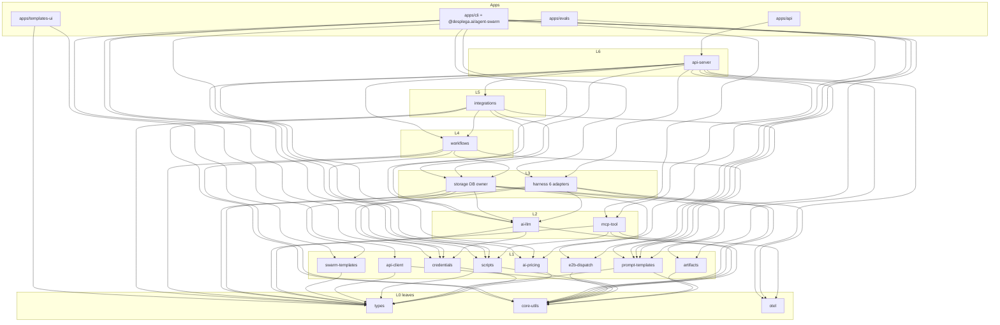

# Agent Swarm Monorepo Restructure — Collapsed-First Plan

## 1. Executive Summary

This is the pragmatic, **collapsed-first** revision of the monorepo restructure. Instead of the maximal 39-package / 46-workspace split, we ship **18 internal `@swarm/*` packages + 7 apps = 25 workspaces**. The published artifact (`@desplega.ai/agent-swarm`) stays byte-for-byte stable for consumers, and the dependency graph is a verified, strictly-acyclic DAG (7 lib layers L0–L6 + apps at L7).

**The four genuine source-level cycles are already broken** — they landed in two open PRs off `main` (PR #820, PR #822) ahead of the restructure (see §5). So the highest-risk refactors that the maximal plan listed as preconditions are **done**; this plan is now mostly *mechanical relocation* of an already-acyclic source tree into package dirs.

**What changes vs. the maximal plan**

- 39 internal packages → **18**. We collapse the eight "portable-core + db-adapter" and "per-provider / per-integration" splits into cohesive units (`harness` = core + 6 adapters; `integrations` = all providers; `workflows` = core + swarm; `scripts` = sandbox + sdk; memory + pages fold into `storage`), while keeping two shared leaves explicit (`e2b-dispatch`, `swarm-templates`).
- Same toolchain decision as the maximal plan: **Bun workspaces as sole PM + Turborepo + Changesets-when-a-2nd-package-publishes**, source-only internal packages, no TS project references (§6, summarized — full derivation in the 2026-06-25 doc §5).
- Same publish posture: **publish almost nothing day-1** — only the bundled `@desplega.ai/agent-swarm` CLI; `api-client` / `scripts`-sdk / `types` are publish-*eligible* but deferred (§7).

**Package count:** 18 `@swarm/*` + 7 apps = **25 workspaces** (vs 46). The collapse spec estimated ~13–15 internal; the explicit mapping enumerates 18 (we keep `api-client` net-new, the shared `e2b-dispatch` + `swarm-templates` leaves, and `artifacts` as dependency-isolated standalone units rather than fold them).

**Acyclicity guarantee:** verified by Kahn's algorithm over the collapsed graph — `ACYCLIC: true`, all 25 nodes emitted, a valid topological order exists (§4.3). `storage` is depended on by **exactly** `{api-server, workflows, integrations}`; `apps/cli` does **not** reach `storage` (only `api-client`).

---

## 2. Why Collapsed-First

The boilerplate tax of the maximal split is real: 46 `package.json` + 46 thin `tsconfig.json`, 46 `workspace:*` dep lists to keep honest, a 46-node Turbo graph, and a `dependency-cruiser` config encoding 8 layers — all to model a source tree that is **already acyclic** once the four cycle-breaks land. Most of those 39 packages have exactly one consumer (`api-server`), so the package boundary buys nothing over a directory boundary today.

Collapsed-first keeps the load-bearing structural wins — DB-ownership as a *structural* boundary (`storage` is the sole `bun:sqlite` owner; `apps/cli` physically cannot import it), the prompt-registry enforcement point, the worker/API HTTP split via `api-client` — at **half the workspace count**. Each collapsed unit that the maximal plan splits (`harness`→6 adapters, `integrations`→per-provider, `workflows`→core/swarm, `scripts`→core/sdk, memory→`memory-core`+stores) is split **later, when a real second consumer appears**, using the 2026-06-25 doc as the cut sheet (§8). Until then, a directory inside a package is free; a package is not.

This matches the maintainer's own steer in the maximal plan (Open Question #1, "Recommendation: start collapsed; split when a 2nd consumer appears") and Open Question #2 ("defer the StoragePort; one implementor doesn't justify the abstraction").

---

## 3. Target Structure

### 3.1 Tree (annotated)

```
agent-swarm/
├── package.json                 # root: workspaces[], catalog:, turbo + changeset scripts
├── bun.lock                     # SINGLE lockfile (ui/templates-ui migrated off pnpm)
├── turbo.json                   # build / typecheck / test / lint / boundary tasks
├── tsconfig.base.json           # one set of compiler flags; every pkg `extends` this
├── .dependency-cruiser.cjs      # encodes the LAYER DAG (replaces grep boundary guards)
├── biome.json                   # single root lint/format config
│
├── packages/
│   ├── types/                   # L0  @swarm/types          (model-tiers merged ✓ PR#820)
│   ├── core-utils/              # L0  @swarm/core-utils      (interpolate ✓ PR#820; +ctx-window +vcs)
│   ├── otel/                    # L0  @swarm/otel
│   ├── ai-pricing/              # L1  @swarm/ai-pricing      (ships cache.json asset)
│   ├── credentials/             # L1  @swarm/credentials     (codex-oauth + pool + resolution)
│   ├── prompt-templates/        # L1  @swarm/prompt-templates (injected DB resolver)
│   ├── artifacts/               # L1  @swarm/artifacts       (artifact-sdk)
│   ├── scripts/                 # L1  @swarm/scripts         (DB-free sandbox + sdk + allowlist)
│   ├── api-client/              # L1  @swarm/api-client      (NET-NEW typed worker HTTP client, GENERATED)
│   ├── e2b-dispatch/            # L1  @swarm/e2b-dispatch    (E2B dispatch + env prep; shared by cli + evals)
│   ├── swarm-templates/         # L1  @swarm/swarm-templates (templates/ data + schema; schema types → @swarm/types)
│   ├── ai-llm/                  # L2  @swarm/ai-llm          (internal-ai; raters hoist+fold at extraction, Phase 3)
│   ├── mcp-tool/                # L2  @swarm/mcp-tool
│   ├── harness/                 # L3  @swarm/harness         (core factory + 6 adapters as subpaths)
│   ├── storage/                 # L3  @swarm/storage         (THE DB owner; folds memory + pages)
│   ├── workflows/               # L4  @swarm/workflows       (engine + swarm exec + scheduler)
│   ├── integrations/            # L5  @swarm/integrations    (all providers as subpaths)
│   └── api-server/              # L6  @swarm/api-server      (integration hub)
│
├── apps/
│   ├── api/                     # boots @swarm/api-server; owns initDb + pricing seed
│   ├── cli/                     # @desplega.ai/agent-swarm (worker/lead/hook bins; e2b via @swarm/e2b-dispatch)
│   ├── ui/                      # Next.js dashboard (port 5274)
│   ├── templates-ui/            # Next.js templates registry (uses @swarm/swarm-templates)
│   ├── evals/                   # eval harness (own package; e2b via @swarm/e2b-dispatch)
│   │   └── ui/                  # evals dashboard
│   └── docs/                    # Fumadocs site (docs-site)
│
├── templates/                   # → @swarm/swarm-templates package (data + schema.ts; schema types fold into @swarm/types)
├── plugin/                      # UNCHANGED — stays at repo root, out of the split
├── runbooks/, thoughts/, mockups/   # unchanged
├── charts/agent-swarm/          # Chart.yaml version anchor (synced from apps/cli pkg)
└── scripts/                     # boundary guards + codemod + generators (repoint paths)
```

`docs-site/`, `charts/`, `runbooks/`, `thoughts/`, `mockups/`, `plugin/` stay where they are. The split touches `src/`, `ui/`, `templates-ui/`, `evals/`. `templates/` becomes the **`@swarm/swarm-templates` package** (data + schema; see §3.3 refinement #1).

### 3.2 Package table

Layers are integer longest-path layers (L0 = leaf, zero internal deps), computed and verified in §4. Apps are sinks placed at the nominal top layer (L7).

| Package | Dir | L | Purpose | Key source modules | dependsOn (internal) | Pub? |
|---|---|---|---|---|---|---|
| `@swarm/types` | `packages/types` | 0 | Zod schema + TS registry; **model-tiers merged** (✓ PR#820) | `src/types.ts` (incl `model-tiers`), `src/tracker/types.ts` | — | yes¹ |
| `@swarm/core-utils` | `packages/core-utils` | 0 | Cross-cutting leaf utils for api+worker; **`interpolate` moved in** (✓ PR#820); folds context-window math + `detectVcsProvider` | `src/utils/{api-key,secret-scrubber,constants,crypto,context-window}.ts`, `src/utils/template.ts` (interpolate), `src/be/{date-utils,swarm-config-guard,skill-parser}.ts`, `src/hooks/tool-loop-detection.ts`, `src/vcs/` | — | yes¹ |
| `@swarm/otel` | `packages/otel` | 0 | otel facade + lazy impl + telemetry + error-tracker (isolated heavy deps) | `src/otel.ts`, `otel-impl.ts`, `telemetry.ts`, `src/utils/error-tracker.ts` | — | int |
| `@swarm/ai-pricing` | `packages/ai-pricing` | 1 | models.dev snapshot + normalize + **pure** seed-row builder; ships `cache.json` asset (ui/evals consume) | `src/be/modelsdev-cache.ts(.json)`, `pricing-normalize.ts`, `seed-pricing.ts` (pure only) | `types` | int |
| `@swarm/credentials` | `packages/credentials` | 1 | Worker-side FS+PKCE codex OAuth store **+** credential-pool maps + harness-provider resolution + provider-metadata. DB-free | `src/providers/codex-oauth/`, `src/utils/credentials.ts`, `src/providers/harness-provider.ts`, `provider-metadata.ts` | `types` | int |
| `@swarm/prompt-templates` | `packages/prompt-templates` | 1 | Prompt registry + dual-mode resolver; **invariant enforcement point**; DB-free (DB resolver injected via `configureDbResolver`) | `src/prompts/`, `src/heartbeat/templates.ts` | `types`, `core-utils` | int |
| `@swarm/artifacts` | `packages/artifacts` | 1 | Artifact/page Hono mini-server + browser SDK + localtunnel | `src/artifact-sdk/` | `core-utils` | int |
| `@swarm/scripts` | `packages/scripts` | 1 | **DB-free** user-TS sandbox (loader, executors, import-allowlist, stdlib, redacted, egress-secrets) **+ swarm-sdk + sdk-allowlist + swarm-config**. Security-sensitive cohesive unit | `src/scripts-runtime/` (sandbox + `swarm-sdk.ts` + `sdk-allowlist.ts` + `swarm-config.ts`) | `types`, `core-utils` | yes¹ |
| `@swarm/api-client` | `packages/api-client` | 1 | **NET-NEW** typed HTTP client mirroring the route registry; what workers/cli consume instead of storage. **GENERATED from `openapi.json`**, CI freshness-gated | generated from `route-def.ts` + `openapi.json` | `types`, `core-utils` | yes¹ |
| `@swarm/e2b-dispatch` | `packages/e2b-dispatch` | 1 | E2B sandbox dispatch + env prep, **shared by `apps/cli` + `apps/evals`** (real 2nd consumer). DB-free leaf | `src/e2b/{dispatch,env}.ts` | `core-utils` | int |
| `@swarm/swarm-templates` | `packages/swarm-templates` | 1 | `templates/` data + schema as a package; schema **types** (`TemplateConfig`/`TemplateResponse`) fold into `@swarm/types`. Consumed by `storage` (seed-skills) + `apps/templates-ui` | `templates/` (data) + `templates/schema.ts` | `types` | int |
| `@swarm/ai-llm` | `packages/ai-llm` | 2 | Worker-safe structured-output LLM abstraction + memory rater client. **At extraction (Phase 3), applies the deferred raters hoist AND folds `be/memory/raters/types.ts`** to kill the #2 residual edge | `src/utils/internal-ai/`, `src/utils/internal-ai/raters/{llm,llm-client,llm-summarizer}.ts` (hoisted at extraction), `+ be/memory/raters/types.ts` | `types`, `core-utils`, `credentials` | int |
| `@swarm/mcp-tool` | `packages/mcp-tool` | 2 | MCP tool-registration core + HTTP-client script tools + kapso registration shim. DB-free (tool *bodies* live in api-server) | `src/tools/{utils,task-tool-ctx,tool-config,script-*}.ts` | `types`, `core-utils`, `otel`, `scripts` | int |
| `@swarm/harness` | `packages/harness` | 3 | Harness contract + **dynamic-import provider factory** (load-bearing, PR#452) + **ALL 6 adapters** (claude-code/claude-managed/codex/pi/opencode/devin) as subpaths | `src/providers/{index,types,...}.ts`, `claude-adapter.ts`, `claude-managed-*.ts`, `codex-*.ts`, `pi-mono-*.ts`, `opencode-adapter.ts`, `devin-*.ts`, `src/claude.ts`, `src/commands/provider-credentials.ts` | `types`, `core-utils`, `otel`, `ai-llm`, `credentials` | int |
| `@swarm/storage` | `packages/storage` | 3 | **THE DB owner**: db monolith, migrations, db-queries, events/users/audit, **task-lifecycle emitter** (✓ PR#822), memory sqlite stores (**folds memory-core**), pages/metrics (**folds swarm-pages**), pricing/budget/skill-sync writers, `be/scripts/` | `src/be/db.ts`, `migrations/`, `db-queries/`, `events.ts`, `task-lifecycle-events.ts`, `users.ts`, memory stores + `chunking/embedding/reranker`, `seed-pricing.ts` (writer), `pricing-refresh.ts`, `src/be/scripts/`, `src/be/seed-skills` (template data via `@swarm/swarm-templates`), `src/pages/`, `src/metrics/`, `src/utils/page-session.ts` | `types`, `core-utils`, `ai-pricing`, `prompt-templates`, `ai-llm`, `credentials`, `swarm-templates` | int |
| `@swarm/workflows` | `packages/workflows` | 4 | DAG engine + event-bus + **swarm executors** (agent-task, swarm-script, vcs, script) + checkpoint/recovery/resume/triggers + **scheduler** + task helpers (collapses workflows-core + workflows-swarm + scheduler) | `src/workflows/` (engine, event-bus, executors, checkpoint, cooldown, version, recovery, resume, input, wait/retry-poller, triggers), `src/tasks/*`, `src/scheduler/` | `types`, `core-utils`, `storage`, `scripts`, `prompt-templates` | int |
| `@swarm/integrations` | `packages/integrations` | 5 | First-party slack/github/gitlab/jira/linear/agentmail/kapso + composio (server tool) + x402, **+ oauth-common** — ONE package, subpaths | `src/slack/`, `github/`, `gitlab/`, `jira/`, `linear/`, `agentmail/`, `integrations/kapso/`, `src/oauth/`, `src/x/` (server tool), `src/x402/` | `types`, `core-utils`, `storage`, `prompt-templates`, `workflows`, `ai-llm` | int |
| `@swarm/api-server` | `packages/api-server` | 6 | HTTP API server library (**integration hub**): route handlers + `route()` + openapi + MCP transports + ~108 DB-owning tool bodies + heartbeat + **DB-bound script-run orchestration** (`script-workflows/` minus pure exec, which moves to `@swarm/scripts`; see §3.3 #2). **Sole `storage` consumer besides workflows/integrations** | `src/server.ts` (db-init moved out), `server-user.ts`, `src/http/`, `src/tools/` (~108 bodies), `src/heartbeat/`, `src/script-workflows/` (DB-bound supervisor only) | `types`, `core-utils`, `otel`, `ai-pricing`, `prompt-templates`, `artifacts`, `scripts`, `harness`, `storage`, `mcp-tool`, `workflows`, `integrations` | int |
| `apps/api` | `apps/api` | 7 | Boots api-server; owns `initDb()` + pricing seed side-effects | `src/http.ts` boot | `api-server` | — |
| `apps/cli` → `@desplega.ai/agent-swarm` | `apps/cli` | 7 | worker/lead/hook bins; **never depends on storage**; folds composio worker cmd (e2b via `@swarm/e2b-dispatch`) | `src/cli.tsx`, `commands/`, `hooks/`, `stdio.ts`, composio worker cmd | `types`, `core-utils`, `ai-llm`, `credentials`, `api-client`, `e2b-dispatch`, `otel`, `prompt-templates`, `harness`, `scripts`, `artifacts`, `mcp-tool` | **yes** |
| `apps/ui` | `apps/ui` | 7 | Next.js dashboard | `ui/` | `types`, `ai-pricing` | — |
| `apps/templates-ui` | `apps/templates-ui` | 7 | Next.js templates registry (replaces `cp -r ../templates` prebuild with a workspace dep) | `templates-ui/` (templates via `@swarm/swarm-templates`) | `types`, `swarm-templates` | — |
| `apps/evals` | `apps/evals` | 7 | Eval harness (e2b via `@swarm/e2b-dispatch`) | `evals/` | `ai-pricing`, `e2b-dispatch` | — |
| `apps/evals/ui` | `apps/evals/ui` | 7 | Evals dashboard | `evals/ui/` | — | — |
| `apps/docs` | `apps/docs` | 7 | Fumadocs site | `docs-site/` | — | — |

¹ "yes" = *eligible* to publish; **day-1 publish set is only `@desplega.ai/agent-swarm`** (§7).

### 3.3 Deviations / refinements vs. the collapse spec (called out)

Per the brief, boundaries were refined only where needed to keep the graph acyclic + honor the invariants. Each change:

1. **`templates/` becomes the `@swarm/swarm-templates` package** (a package, not just a root data dir). The template JSON data + `templates/schema.ts` ship as one L1 package consumed by `@swarm/storage` (`be/seed-skills` imports the template data files) and `apps/templates-ui` (replacing its `cp -r ../templates` prebuild hack with a `workspace:*` dep). The schema **types** (`TemplateConfig` / `TemplateResponse`) fold into `@swarm/types` so the worker (`commands/runner`, onboard) imports them light. *(Signed off 2026-06-26 — reverses the earlier draft that kept `templates/` a bare data dir.)*
2. **DB-bound `script-workflows/` orchestration lands in `api-server`; its PURE execution logic moves to the DB-free `@swarm/scripts`.** The spec folds `script-workflows` into `@swarm/scripts`. We split by concern: the **pure script-execution logic** is extracted into `@swarm/scripts` (the genuinely security-sensitive, worker-safe unit), while the **DB-backed run supervisor / orchestration** stays in `api-server` (server-only; alternative home: `workflows`). Putting the supervisor in `scripts` would make `scripts` storage-bound, and since `apps/cli` and `mcp-tool` both depend on the sandbox, that would drag the worker through `storage` (boundary violation). So `@swarm/scripts` stays **DB-free** sandbox + SDK + pure exec, and only the storage-backed orchestration lives in `api-server`. This is the single most important refinement.
3. **Composio (`src/x/`) splits by side.** The spec folds composio into `integrations`. The **server-side** tool body goes there; the **worker-side** composio command moves into `apps/cli` (it was a leaf the worker consumed). Keeps `apps/cli` storage-free without a separate leaf package.
4. **`e2b-dispatch` IS a shared leaf package** (`@swarm/e2b-dispatch`, L1, deps only `core-utils`). `src/e2b/{dispatch,env}.ts` is consumed by **both** `apps/cli` (`src/commands/e2b.ts` uses it) **and** `apps/evals` (`evals/src/swarm/sandbox.ts` imports `../../../src/e2b/{dispatch,env}`). The real second consumer already exists, so this is a package, not a fold into `apps/cli`. *(Signed off 2026-06-26 — reverses the earlier draft that folded e2b into `apps/cli`.)*
5. **Computed integer layers differ from the spec's rough L-labels** — the spec's "L1/L2/L3" were grouping hints. Longest-path puts `ai-llm` at **L2** (it depends on `credentials` for the codex token store), `harness`/`storage` at **L3**, `mcp-tool` at **L2**, and `api-client` at **L1** (deps only `types`+`core-utils`). The invariants ("`storage` consumed only by `api-server` + workflows/integrations adapters"; "`apps/cli` reaches the API only via `api-client`") hold at any layer number — verified in §4.
6. **`workflows` is L4 (above `storage`), not L2.** Collapsing `workflows-core` (DB-free) + `workflows-swarm` (DB-bound) + `scheduler` yields a storage-bound package. Consequence: **`apps/cli` no longer depends on `workflows`** — the worker talks to the API over HTTP (`api-client`) and pulls any workflow *types* from `@swarm/types`; it does not run the DB-bound engine. (In the maximal plan `apps/cli` depended on the DB-free `workflows-core`; collapsing removes that consumable surface, which is fine because the worker had no DB-bound need.)
7. **`components` / `react-data` deferred entirely** (aspirational, as in the maximal plan). Each Next/Vite app keeps its own components; the cross-app de-dup is the lowest-priority future split.

---

## 4. Dependency Layering (verified DAG)

### 4.1 Integer layers (longest-path, computed)

Every `dependsOn` edge points to a **strictly lower** layer. Verified by running Kahn's algorithm over the graph (§4.3):

- **L0 (leaves, zero internal deps):** `types`, `core-utils`, `otel`
- **L1:** `ai-pricing`, `credentials`, `prompt-templates`, `artifacts`, `scripts`, `api-client`, `e2b-dispatch`, `swarm-templates`
- **L2:** `ai-llm`, `mcp-tool`
- **L3:** `harness`, `storage`
- **L4:** `workflows`
- **L5:** `integrations`
- **L6:** `api-server`
- **L7 (apps, sinks):** `api`, `cli`, `ui`, `templates-ui`, `evals`, `evals/ui`, `docs`

### 4.2 Per-package `dependsOn` (internal edges only)

```
types            : —
core-utils       : —
otel             : —
ai-pricing       : types
credentials      : types
prompt-templates : types, core-utils
artifacts        : core-utils
scripts          : types, core-utils
api-client       : types, core-utils
e2b-dispatch     : core-utils
swarm-templates  : types
ai-llm           : types, core-utils, credentials
mcp-tool         : types, core-utils, otel, scripts
harness          : types, core-utils, otel, ai-llm, credentials
storage          : types, core-utils, ai-pricing, prompt-templates, ai-llm, credentials, swarm-templates
workflows        : types, core-utils, storage, scripts, prompt-templates
integrations     : types, core-utils, storage, prompt-templates, workflows, ai-llm
api-server       : types, core-utils, otel, ai-pricing, prompt-templates, artifacts,
                   scripts, harness, storage, mcp-tool, workflows, integrations
apps/api         : api-server
apps/cli         : types, core-utils, ai-llm, credentials, api-client, e2b-dispatch,
                   otel, prompt-templates, harness, scripts, artifacts, mcp-tool
apps/ui          : types, ai-pricing
apps/templates-ui: types, swarm-templates
apps/evals       : ai-pricing, e2b-dispatch
apps/evals/ui    : —
apps/docs        : —
```

### 4.3 Why it is acyclic (Kahn's algorithm + topological order)

A directed graph is acyclic iff Kahn's algorithm emits every node. Run over the graph above, it emits **all 25 nodes** (`ACYCLIC: true`, `nodes emitted: 25 / 25`). A valid topological order (libraries, then apps as sinks):

```
types → core-utils → otel → ai-pricing → credentials → prompt-templates →
artifacts → scripts → api-client → e2b-dispatch → swarm-templates → ai-llm → mcp-tool → harness → storage →
workflows → integrations → api-server →
apps:  docs → evals/ui → templates-ui → ui → evals → cli → api
```

Each package appears strictly **after** all of its dependencies, so no edge points backward — no cycle. The two new L1 leaves slot in at positions 10–11 (both depend only on L0): `e2b-dispatch`(10) after `core-utils`(2) ✓; `swarm-templates`(11) after `types`(1) ✓. Spot-checks of the load-bearing edges (positions reflect the two new L1 nodes):
- `ai-llm`(12) after `credentials`(5) ✓ — the codex-token edge points down.
- `harness`(14)/`storage`(15) after `ai-llm`(12) ✓ — the rater edge points down.
- `storage`(15) after `swarm-templates`(11) ✓ — the template-data edge points down.
- `workflows`(16) after `storage`(15) ✓ — the swarm-executor DB edge points down.
- `integrations`(17) after `workflows`(16) + `storage`(15) ✓.
- `api-server`(18) after `integrations`(17) ✓ — the hub is last among libs.

**Invariant checks (verified mechanically):**
- `storage` consumers = `{api-server, workflows, integrations}` — exactly the allowed set. Nothing else imports the DB owner.
- `apps/cli` `dependsOn` does **not** include `storage` → `false`. The worker reaches the API only through `api-client` (L1, deps `types`+`core-utils` only).
- `prompt-templates` sits at **L1** with an injected DB resolver — far below `storage`(L3) and `api-server`(L6).

### 4.4 Diagram (mermaid)



### 4.5 The three load-bearing structural distinctions (unchanged in spirit)

**(a) DB-ownership / api-client split.** `@swarm/storage` is the sole `bun:sqlite` owner (L3), depended on only by `api-server`(L6) and the two DB-bound adapters `workflows`(L4) + `integrations`(L5). The worker (`apps/cli`) reaches the API exclusively through `@swarm/api-client`(L1). `getApiKey()` lives in `core-utils`, so the worker/API HTTP boundary is preserved **structurally** — this is what `check-db-boundary.sh` enforced by grep; post-split it becomes a `dependency-cruiser` rule.

**(b) Prompt-registry layer.** `@swarm/prompt-templates`(L1) is the single enforcement point for "all prompt text goes through the registry." DB-free: the DB resolver is injected via `configureDbResolver`; `ProviderTraits` is a **type-only** import (must stay `import type` — a lint rule keeps `prompt-templates` from gaining a value edge to `harness`).

**(c) Cohesion over premature ports.** The maximal plan's portable-core/db-adapter splits (`scripts-core`+`swarm-scripts`, `workflows-core`+`workflows-swarm`) collapse: `@swarm/scripts` is the DB-free sandbox+SDK + pure script-exec (worker-safe), while the DB-bound run supervisor lives in `api-server`; `@swarm/workflows` is one DB-bound engine (no `StoragePort` abstraction until a 2nd implementor exists — maximal-plan Open Question #2).

---

## 5. Cycle-breaks: 3 landed, #2 deferred to extraction

**Three** of the four genuine source-level back-edges the maximal plan identified are **already broken**, landed in two open PRs off `main` *before* this restructure (**PR #820** = #5 + #1; **PR #822** = **#4 only**, force-pushed down to a single commit). The fourth (**#2**, memory-raters) was **dropped from PR #822** and preserved on local branch `wip/raters-hoist-deferred`; it is **deferred to the `@swarm/ai-llm` extraction (Phase 3)** — the hoist alone only *relocated* the `utils → be` edge, so the clean fix happens at extraction when `be/memory/raters/types.ts` folds into `@swarm/ai-llm`. The collapsed tree is acyclic at the source level except for that one DB-free `utils → be` leaf edge, which Phase 3 eliminates; this plan is mechanical relocation plus that one hoist-and-fold, not cycle surgery.

| # | Cycle (maximal-plan numbering) | Resolution | Status |
|---|---|---|---|
| 5 | `prompts → workflows` (via `interpolate`) | `interpolate()` moved to `src/utils/template.ts`; decoupled prompts/commands/http/tools from the workflow engine | ✅ **PR #820** (`refactor/cycle-break-leaf-consolidation`) |
| 1 | `types ↔ model-tiers` | `src/model-tiers.ts` merged into `src/types.ts` — cycle dissolved (one package, no internal edge) | ✅ **PR #820** |
| 4 | `be/db → github` | Inverted via `src/be/task-lifecycle-events.ts` emitter (`emitTaskStarted` / `onTaskStarted`, wired in `createServer`); storage emits, integrations react | ✅ **PR #822** (force-pushed to a SINGLE commit — **#4 only**; `refactor/cycle-break-be-decoupling`) |
| 2 | `utils ↔ be` (memory raters) | Worker-safe raters `llm.ts` / `llm-client.ts` / `llm-summarizer.ts` hoist from `be/memory/raters/` to `src/utils/internal-ai/raters/` — but the hoist alone only **relocates** the `utils→be` edge. **Dropped from PR #822**, preserved on branch `wip/raters-hoist-deferred`. Full elimination deferred to the `@swarm/ai-llm` extraction (Phase 3), where `be/memory/raters/types.ts` folds into `@swarm/ai-llm` | ⏳ **Deferred to Phase 3** (`@swarm/ai-llm` extraction) |

### 5.1 The #2 edge: dropped from PR #822, deferred to extraction

PR #822 was force-pushed down to **#4 only**; the #2 memory-raters hoist was **dropped from it** and preserved on local branch `wip/raters-hoist-deferred`. That hoist would **relocate** rather than fully eliminate the #2 coupling: `be/memory/raters/types.ts` stays in place (moving it ripples into DB-backed code), so the hoisted `src/utils/internal-ai/raters/llm.ts` imports **2 runtime values + 3 types** from `be/memory/raters/types.ts` — a `utils → be` value+type edge into a pure, DB-free leaf. The DB-boundary check still passes because the target is DB-free, but the edge exists. Because the hoist alone buys nothing structural, it is **deferred to the `@swarm/ai-llm` extraction (Phase 3)** rather than shipped as a standalone PR.

**Clean resolution at extraction time (Phase 3):** when `@swarm/ai-llm` is extracted, apply the branch hoist **and fold `be/memory/raters/types.ts` into `@swarm/ai-llm`**. After the fold, `ai-llm`'s rater code imports those 2 values + 3 types from *within its own package*, and the `utils → be` edge disappears entirely. `storage`(L3) then imports the rater types *from* `ai-llm`(L2) — downward. This is captured as a concrete step in Phase 3 and as a `dependency-cruiser` assertion (`ai-llm` must not import `be/` or `storage`).

> **Net effect on this plan:** two of the maximal plan's three HIGH-risk refactors (be→github inversion, model-tiers merge) and the one Low-risk `interpolate` move are **complete**; the third (ai-llm raters hoist) is staged on `wip/raters-hoist-deferred` and lands with the Phase-3 extraction (hoist + `be/memory/raters/types.ts` fold). The remaining work is relocation + that hoist-and-fold (Phase 3) + extracting db side-effects out of `createServer()` (Phase 6, refactor — accepted).

---

## 6. Tooling (summarized — full derivation in 2026-06-25 doc §5)

Adopted unchanged from the maximal plan; only the package count differs.

- **Package manager — Bun workspaces, sole PM.** Migrate `ui/` + `templates-ui/` off pnpm to one `bun.lock` / one resolver (root + `evals` are already Bun workspaces; cross-PM sharing of `@swarm/types`/`@swarm/ai-pricing` between a Bun app and a Next app is the friction that disappears). pnpm-as-workspace-PM kept only as a documented fallback if a hard Next-on-Bun blocker surfaces. Root `package.json` `workspaces`: `["packages/*", "apps/*", "apps/evals/ui"]` (collapsed tree needs **no** nested adapter/`integrations`/`api` globs — those are now subpaths inside single packages, a simplification over the maximal plan's nested globs). Internal deps via `workspace:*`; shared external versions pinned via root `catalog:`.
- **Task runner — Turborepo.** `dependsOn: ["^build"]` topo scheduler + content-hash cache + `--affected`. Tasks: `build` (outputs `dist/**`, `.next/**`), `typecheck` (cache-only), `lint`/`test`/`boundary` (cache-only), `dev` (persistent). A 25-node graph is comfortably within Turbo's sweet spot.
- **TS strategy — one `tsconfig.base.json`**, thin per-package `extends`. Drop the `@/* → src/*` alias for real workspace names (`@swarm/types`). **No project references / composite** (collides with `noEmit` + `allowImportingTsExtensions` + Bun-runs-TS). `tsc --noEmit` per package, cached by Turbo. Only the 3 buildable targets (`apps/cli`, `apps/ui`, `apps/templates-ui`) get a `tsconfig.build.json`.
- **Source-only internal packages.** Bun runs TS directly → internal `@swarm/*` have **no build step**; `^build` no-ops through them. Real build steps exist for exactly three: `apps/cli` (`bun build … → dist/cli.js`, inlines all `@swarm/*` + `.d.ts` emit), `apps/ui` (`next build`), `apps/templates-ui` (`next build`).
- **Lint — single root `biome.json`** (`biome check .`); Turbo `lint` task per package for caching. CI stays read-only `biome check`.
- **Boundary guards become structure.** `check-db-boundary` + `check-api-key-boundary` → `dependency-cruiser` rules (`storage` sole `bun:sqlite` importer; only allowlisted packages import the `core-utils` api-key entry). The worker/API **DB boundary becomes a real CI rule via `dependency-cruiser`**, **superseding** the grep-based `check-db-boundary.sh` (graph assertion, not a text grep). `check-sdk-tool-registration` stays a script, repointed to `@swarm/scripts` + `@swarm/mcp-tool`.
- **`@swarm/api-client` is GENERATED from `openapi.json`** (not hand-authored), guarded by a **CI freshness gate** — a CI step regenerates the client and runs `git diff --exit-code` (modeled on the existing openapi-freshness check). This freshness gate is a **sibling CI check** to the `dependency-cruiser` DB-boundary rule.

---

## 7. Publishing (summarized — full derivation in 2026-06-25 doc §6)

Same posture as the maximal plan: **do the split for internal hygiene + Turbo caching, but publish almost nothing.**

- **Day-1 publish set: ONLY `@desplega.ai/agent-swarm`** (`apps/cli`), unchanged — a bundled single-file `dist/cli.js` that **inlines** its `@swarm/*` workspace deps, so the split is invisible to consumers and internal `@swarm/*` packages are *never* listed as runtime deps. Keep `bin.agent-swarm`, `files`, `publishConfig.access: public`, `prepack: build:cli`, engines/peerDeps untouched.
- **Publish-LATER (each gated on a real external consumer, priority order):** `@desplega.ai/swarm-api-client` (highest external value; **generated from `openapi.json`** + CI freshness-gated; kills `ui/src/api/types.ts` drift) → `@desplega.ai/swarm-scripts` (sandbox + SDK as **one** unit, for external script authoring) → `@desplega.ai/swarm-types` (only as the shared contract of the first two). Everything else is internal implementation detail.
- **Versioning — fixed/lockstep, one product version** (`package.json` version is load-bearing for `openapi.json`, `docs-site/api-reference/**`, `charts/agent-swarm/Chart.yaml`). Internal packages are `"private": true` / `"version": "0.0.0"` / `workspace:*`. **Adopt Changesets only when a 2nd package actually publishes**, in `fixed` mode; until then skip it entirely. Wire `bun run prepare-release` (sync-chart-version + docs:openapi) into the Changesets `version` lifecycle when adopted.

---

## 8. Incremental Migration Plan (collapsed set, leaves-first)

Incremental, per-package, gated by the **full test + boundary + Docker suite after every extraction** — never a big-bang. Codemod + file move land in the SAME commit so each step is independently green. **Three of the four cycle-breaks are already done (§5)**, so most of the maximal plan's "precondition: break cycle X" steps are complete; what remains is relocation + the deferred #2 raters **hoist-and-fold** (`be/memory/raters/types.ts` → `@swarm/ai-llm`, Phase 3) + the `createServer()` side-effect extraction (Phase 6).

### Extraction order

```
types(✓merged) → core-utils(✓interpolate; +ctx-window +vcs) → otel →
ai-pricing → credentials(✓codex-oauth landed; +pool +resolution) → prompt-templates →
artifacts → scripts(DB-free sandbox; pure script-exec folded in at the Phase-6 script-workflows split) → api-client(NET-NEW, GENERATED) →
e2b-dispatch(shared by cli + evals) → swarm-templates(data + schema; schema types → types) →
ai-llm(hoist raters from branch + FOLD raters/types.ts) → mcp-tool →
harness(core + 6 adapters) → storage(✓be→github inverted; FOLD memory + pages; consume swarm-templates) →
workflows(engine + swarm + scheduler) → integrations(native + common + composio + x402) →
api-server(+ script-workflows DB-bound supervisor only; extract db side-effects) → apps split → CI/Docker cutover
```

### Phase 0 — Workspace scaffold (no code moves)

- Adopt **Bun workspaces + Turbo** at root: add `workspaces: ["packages/*","apps/*","apps/evals/ui"]` + `turbo.json` (root passthrough tasks initially). Do NOT touch `tsconfig` paths, `src/` layout, Docker, or CI.
- Migrate `ui/` + `templates-ui/` off pnpm (`rm ui/pnpm-lock.yaml templates-ui/pnpm-lock.yaml && bun install`); verify `next build` under Bun (do `templates-ui` first — smaller).

**Verification:**
```bash
bun install --frozen-lockfile
bun run tsc:check && bun run lint && bun test
bash scripts/check-db-boundary.sh && bash scripts/check-api-key-boundary.sh
bun scripts/check-sdk-tool-registration.ts
docker build -f Dockerfile . && docker build -f Dockerfile.worker .
bunx turbo run tsc:check lint test --dry-run   # task-graph wiring only
```

### Phase 1 — tsconfig path-alias bridge + codemod foundation

- Add the 18 future `@swarm/*` package names as tsconfig `paths` pointing back at current `src/` (and `templates/`) locations, so code can import by package name *before* files move.
- Build `scripts/codemod-imports.ts` (ts-morph) driven by `packages.map.json` `{srcGlob → packageName+subpath}`. It MUST rewrite both `@/`-alias and **relative** specifiers (218 test files import `../be/db`), preserve `import type` (`verbatimModuleSyntax`), and NOT convert the provider factory's dynamic `import()` to static.

**Verification:** `bun run tsc:check && bun test`; `bun scripts/codemod-imports.ts --dry-run --package @swarm/types`.

### Phase 2 — Extract L0 + L1 (leaves + low)

- **`@swarm/types`** (cycle ✓ already merged in PR#820): codemod importers off `@/types` / `../types` / `../model-tiers`.
- **`@swarm/core-utils`** (`interpolate` ✓ already moved in PR#820): move api-key, secret-scrubber, constants, crypto, swarm-config-guard, tool-loop-detection, skill-parser, date-utils; **fold in** `context-window.ts` + `src/vcs/`.
- **`@swarm/otel`**, **`@swarm/ai-pricing`** (pure seed-row builder + `cache.json` asset; repoint the `ui/src/lib/modelsdev-cache.json` symlink to a real dep + `scripts/refresh-modelsdev-pricing.ts` output path), **`@swarm/credentials`** (codex-oauth ✓ relocation already supported; add credential-pool + harness-provider + provider-metadata), **`@swarm/prompt-templates`** (injected `configureDbResolver`; `ProviderTraits` stays `import type`), **`@swarm/artifacts`**, **`@swarm/scripts`** (DB-free sandbox + swarm-sdk + sdk-allowlist + swarm-config; repoint `scripts/bundle-script-types.ts` + `check-sdk-tool-registration.ts`).
- **`@swarm/e2b-dispatch` (shared leaf):** move `src/e2b/{dispatch,env}.ts`; repoint BOTH consumers — `apps/cli` (`src/commands/e2b.ts`) and `apps/evals` (`evals/src/swarm/sandbox.ts`, currently `import ../../../src/e2b/{dispatch,env}`) — to the `@swarm/e2b-dispatch` workspace dep.
- **`@swarm/swarm-templates`:** wrap `templates/` data + `templates/schema.ts` as a package; **fold the schema types** (`TemplateConfig` / `TemplateResponse`) into `@swarm/types` so the worker imports them light; repoint `@swarm/storage` (`be/seed-skills`) and `apps/templates-ui` (drop the `cp -r ../templates` prebuild for a `workspace:*` dep).
- **`@swarm/api-client` (NET-NEW, GENERATED):** **generate** a typed client from `openapi.json` / route registry (not hand-authored); add a **CI freshness gate** that regenerates the client and runs `git diff --exit-code` (modeled on the openapi-freshness check). Ship **additively** (do not force-migrate every `fetch`). Not on the acyclicity critical path.

**Verification (per package):**
```bash
bun run tsc:check && bun test
bash scripts/check-db-boundary.sh && bash scripts/check-api-key-boundary.sh
bun scripts/bundle-script-types.ts && git diff --exit-code src/scripts-runtime/types   # after scripts
docker build -f Dockerfile . && docker build -f Dockerfile.worker .
grep -rn 'src/model-tiers' src/    # empty (already true post-PR#820)
```

### Phase 3 — Extract L2 (`ai-llm`, `mcp-tool`)

- **`@swarm/ai-llm`** (raters hoist was **deferred** from PR #822 — apply branch `wip/raters-hoist-deferred` here): move `src/utils/internal-ai/` (incl the now-hoisted `raters/{llm,llm-client,llm-summarizer}.ts`). **CRITICAL: also fold `be/memory/raters/types.ts` into the package** — together the hoist + fold kill the #2 `utils → be` edge entirely (§5.1). After the move, `grep -rn "be/" packages/ai-llm/src` must be empty.
- **`@swarm/mcp-tool`:** move tool-registration core + HTTP-client script tools + kapso registration shim (depends down into `scripts` for the SDK surface; the kapso tool *body* stays in `integrations`, Phase 5).

**Verification:**
```bash
bun run tsc:check && bun test                  # internal-ai + memory rater suites
bash scripts/check-db-boundary.sh              # ai-llm + scripts DB-clean
grep -rn 'be/' packages/ai-llm/src             # EMPTY — proves #2 residual edge gone
docker build -f Dockerfile.worker .
```

### Phase 4 — Extract L3 (`harness`, `storage`)

- **`@swarm/harness`:** move the **dynamic-import factory** (`providers/index.ts`, load-bearing PR#452 — preserve `import()`) + contract files + all 6 adapter subdirs (fold `src/claude.ts` into claude-code) + `src/commands/provider-credentials.ts`. Add a smoke test asserting harness's module graph excludes the 6 adapter SDKs until `createProviderAdapter()` runs.
- **`@swarm/storage` (largest package; be→github ✓ already inverted in PR#822):** move `db.ts`, `migrations/` (+`.sql`), `db-queries/`, events/users/audit, `task-lifecycle-events.ts`, DB-bound memory stores + `chunking/embedding/reranker` (**folds memory-core**), `seed-pricing.ts` writer, `pricing-refresh.ts`, `be/scripts/`, `src/pages/` + `src/metrics/` (**folds swarm-pages**). **Pivot the test preload** (`src/tests/preload.ts` imports `initDb/getDb/closeDb` from `../be/db`) → `@swarm/storage`; the package index MUST export `initDb/getDb/closeDb/serialize`; smoke-test the preload in isolation BEFORE the suite. Verify `grep -rn 'github\|slack\|linear\|jira' packages/storage/src` is empty (the inversion makes this true).

**Verification:**
```bash
bun run tsc:check && bun test                  # 218 DB-importing tests resolve the package; 4 memory files
bash scripts/check-db-boundary.sh              # cli/worker show ZERO storage/bun:sqlite
docker build -f Dockerfile . && docker build -f Dockerfile.worker .
rm -f agent-swarm-db.sqlite && bun run start:http   # fresh-DB migration smoke
```

### Phase 5 — Extract L4 + L5 (`workflows`, `integrations`)

- **`@swarm/workflows`:** move the engine + event-bus + portable executors + **swarm executors** (agent-task, swarm-script, vcs, script) + checkpoint/recovery/resume/triggers + `src/scheduler/` + `src/tasks/*` (resolve `tasks↔tools` by relocating the single `tasks → tools` import). One DB-bound package; no `StoragePort`.
- **`@swarm/integrations`:** move slack/github/gitlab/jira/linear/agentmail/kapso + `src/oauth/` (folds integrations-common) + `src/x/` server tool + `src/x402/`. **Move one subdir at a time, slack first** (most coupling), running the suite between each. Wire the github `task.started` listener against the storage emitter (the inversion from §5). Move the composio **worker** command to `apps/cli` (Phase 6).

**Verification:**
```bash
bun run tsc:check && bun test
bash scripts/check-db-boundary.sh
rm -f agent-swarm-db.sqlite && bun run start:http   # scheduler + workflows boot
# Slack E2E smoke: #swarm-dev-2 / @dev-swarm
```

### Phase 6 — `api-server` + apps split + CI/Docker/openapi cutover

- **`@swarm/api-server`:** move route handlers + `route()` + openapi + MCP transports + ~108 DB-owning tool bodies + heartbeat. **Split `src/script-workflows/`** (deviation §3.3 #2): extract its **pure execution logic into the DB-free `@swarm/scripts`** package, and keep only the **storage-backed run supervisor / orchestration** here in `api-server`. Wire the github `task.started` listener.
- **EXTRACT db/pricing side-effects out of `server.ts`** (the one remaining refactor, **accepted / signed off 2026-06-26**): `createServer()` today runs `initDb()+seedPricing()+startPricingRefreshLoop()`; move to `apps/api` `bootstrapApi()`, keep `createServer()` pure. Mechanics unchanged; widest test blast radius (was an open question — now confirmed).
- **Split apps:** `apps/api` (boot + DB init), `apps/cli` (cli.tsx/commands/hooks/stdio + composio worker cmd; e2b via `@swarm/e2b-dispatch` — depends on `api-client` + `e2b-dispatch` + `harness` + `scripts` + `mcp-tool`, **never `storage`/`workflows`**), `apps/ui`, `apps/templates-ui` (`@swarm/swarm-templates` dep), `apps/evals` (`@swarm/e2b-dispatch` dep), `apps/evals/ui`, `apps/docs`. `apps/cli` becomes `@desplega.ai/agent-swarm`; update `build-cli.ts` entry → `apps/cli/src/cli.tsx`, `files`, `bin`.
- **CI / boundary / generated-artifact cutover:**
  - `check-db-boundary.sh`: rewrite `WORKER_PATHS` from `src/*` to worker PACKAGE dirs (`apps/cli`, `packages/harness`, `packages/scripts`, `packages/prompt-templates`, `packages/ai-llm`, `packages/core-utils`, `packages/credentials`, `packages/mcp-tool`, `packages/api-client`, `packages/e2b-dispatch`, `plugin/opencode-plugins`); forbidden patterns `bun:sqlite` + `@swarm/storage`. (Superseded by `dependency-cruiser` below — kept as a redundant fast check.)
  - `check-api-key-boundary.sh`: scan root `src/` → `packages/ apps/`; ALLOW_FILE → `packages/core-utils/src/api-key.ts`.
  - `check-sdk-tool-registration.ts`: `SDK_TOOL_NAME_MAP` → `@swarm/scripts`, `ALL_TOOLS` → `@swarm/mcp-tool`. `check-audit-columns.sh`: migrations glob → `packages/storage/migrations`.
  - **ADD `.dependency-cruiser.cjs`** encoding the L0–L6 DAG (no upward imports; `apps/cli` may not import `@swarm/storage`/`bun:sqlite`; `ai-llm`/`scripts`/`prompt-templates` DB-free). Advisory from Phase 2, **blocking** here. This **supersedes the grep-based `check-db-boundary.sh`** as the real CI DB-boundary rule (the worker/API boundary becomes a graph assertion; keep the grep only as a redundant fast check, or retire it).
  - **api-client freshness gate:** add a CI step that regenerates `@swarm/api-client` from `openapi.json` and runs `git diff --exit-code` — a **sibling check** to the openapi-freshness + `dependency-cruiser` DB-boundary rules; fails on drift.
  - **openapi freshness:** repoint trigger globs to `packages/api-server/http` + `packages/types`; run `bun run docs:openapi` and assert byte-identical.
  - **pi-skills: UNCHANGED** — `plugin/` stays at root; `build:pi-skills` still runs from root.
  - **chart-version:** anchor on the published `apps/cli` `package.json`; update `sync-chart-version.ts` PACKAGE_JSON path.
  - **Docker:** API Dockerfile COPY `package.json` + `packages/*/package.json` + `apps/*/package.json` + `bun.lock` → install → COPY rest → `bun build ./apps/api/src/http.ts --compile`; repoint migrations COPY → `packages/storage/migrations/*.sql`, JSON COPY → `packages/ai-pricing/cache.json`. `Dockerfile.worker` → `bun build ./apps/cli/src/cli.tsx --compile`; `plugin/` COPYs unchanged; **add a post-build check that the worker binary contains no `bun:sqlite`** (Docker-level proof of the DB boundary). Follow `docker-images.md` HOME/cache rules unchanged.
  - `merge-gate.yml`: rewrite `detect-changes` globs `src/` → `packages/`+`apps/`; prefer `turbo run <task> --filter='...[origin/main]'` (`fetch-depth: 2`).
  - `bunfig.toml`: move the preload path with the tests; `pathIgnorePatterns evals/** → apps/evals/**`. **Tests STAY co-located in `src/tests`** during migration (import packages by name via the bridge); physical per-package split is a follow-up.

**Verification:**
```bash
bun run tsc:check && bun test
bun run docs:openapi && git diff --exit-code openapi.json docs-site/content/docs/api-reference/
bash scripts/check-db-boundary.sh                  # FINAL proof: api-server sole storage consumer
bunx depcruise --config .dependency-cruiser.cjs packages apps   # zero layering violations
bun run build:cli && node dist/cli.js --help
docker build -f Dockerfile . && docker build -f Dockerfile.worker .
rm -f agent-swarm-db.sqlite && bun run start:http  # DB init now in apps/api bootstrap
bun run build:pi-skills && git diff --exit-code plugin/pi-skills/
bun run prepare-release && git diff                # chart + openapi regenerate cleanly
```

---

## 9. Deferred Maximal Split (north-star: 2026-06-25 doc)

The 39-package plan stays the **cut sheet** for when a real second consumer or independent publish appears. Each collapsed package and how it later splits:

| Collapsed package | Splits into (maximal plan) | Trigger to split |
|---|---|---|
| `@swarm/harness` | `harness-core` + `harness-{claude-code,claude-managed,codex,pi,opencode,devin}` | One adapter needs independent publish/versioning, or to shrink the worker image by lazy-loading a single heavy SDK |
| `@swarm/integrations` | `integrations-common` + `integrations-native` + `integrations-x-composio` + `integrations-beta-x402` | A provider becomes externally reusable, or x402/composio graduate from pre-product isolation |
| `@swarm/workflows` | `workflows-core` (DB-free, behind `StoragePort`) + `workflows-swarm` (SQLite impl) + `scheduler` | A **second** `StoragePort` implementor appears (the only thing justifying the port abstraction) |
| `@swarm/scripts` | `scripts-core` (sandbox) + `swarm-sdk` (in-script SDK + allowlist) | External user-script authoring becomes a product surface and `swarm-sdk` publishes standalone |
| `@swarm/ai-llm` + `@swarm/storage` | `ai-llm` + `memory-core` (DB-free primitives) + memory sqlite stores | A standalone publishable `@swarm/memory`, or a 2nd consumer of the DB-free memory primitives |
| `@swarm/storage` | `storage-sqlite` + `swarm-pages` | A non-sqlite storage backend, or pages/metrics gain an external consumer |
| `@swarm/core-utils` | `core-utils` + `ai-context` + `vcs` | Any folded leaf gains a consumer that should not pull all of `core-utils` (`e2b-dispatch` + `swarm-templates` are **already** their own packages — see §3.3 #1, #4) |
| `apps/ui` / `apps/templates-ui` / `apps/evals/ui` | `@swarm/components` + `@swarm/react-data` | Cross-app UI de-dup becomes worth the abstraction (lowest priority; deferred entirely) |

### v2 / future — internal-API decoupling of `workflows` + `scripts`

**(v2 — explicitly NOT in scope for this collapsed-first migration.)** Today `@swarm/workflows` (DB-bound engine) and `@swarm/scripts` (DB-free sandbox + the pure script-exec logic extracted from `script-workflows`) reach the server and storage via **direct imports**. A v2 idea: introduce **net-new internal API endpoints** so the workflow runner and the script runner communicate with the server over an **API boundary** instead of importing storage/orchestration directly. That would let `@swarm/workflows` and `@swarm/scripts` become **fully standalone, storage-decoupled, independently-publishable** packages. Flagged here so it is not lost — but it is **v2**, the only genuinely-open design decision (see §10 "Still open").

---

## 10. Risks & Open Questions

### Risks carried over (still live)

1. **Dynamic-import provider factory** — if the codemod/bundler eagerly resolves the 6 adapters now co-located in one `@swarm/harness` package, worker cold-start + image size regress. Preserve `import()`; add a smoke test asserting the module graph excludes adapter SDKs until `createProviderAdapter()` runs; measure binary size before/after. **Collapsing all 6 adapters into one package raises this risk** vs the maximal split — the lazy boundary is now *intra*-package, so the bundler must still tree-shake/lazy-load by subpath.
2. **Test-preload pivot (Phase 4)** — 218/343 test files + the bunfig preload import `../be/db`. A missed rewrite or a missing `@swarm/storage` export breaks the entire suite at preload. Pivot exactly in Phase 4; export `initDb/getDb/closeDb/serialize`; smoke-test the preload in isolation first.
3. **`createServer()` side-effect extraction (Phase 6)** — the one remaining genuine refactor (`initDb`/`seedPricing`/`startPricingRefreshLoop` → `apps/api` bootstrap). `bundle-script-types.ts` boots `createServer()`, so it may need an explicit `initDb`. Widest test blast radius; **signed off 2026-06-26** (mechanics unchanged).
4. **Next-on-Bun migration** — moving `ui/`/`templates-ui/` into the Bun workspace can surface peer-dep/plugin quirks. Migrate `templates-ui` first; keep a pnpm fallback branch.
5. **Generated-artifact freshness drift** — `openapi.json`, `docs-site/api-reference`, `Chart.yaml` are version-anchored and import every route handler; `@swarm/api-client` adds a generated artifact too. Repoint generator imports; the **confirmed** version anchor is `apps/cli` (signed off 2026-06-26); api-client + openapi each get a CI freshness gate; pi-skills unaffected.
6. **`import type { ProviderTraits }` must stay type-only** — else `prompt-templates`(L1) gains a value edge to `harness`(L3), an up-edge. Enforce via lint + dependency-cruiser.
7. **~25 workspaces of `package.json`/`tsconfig` boilerplate** — about half the maximal tax, but still drift-prone. Mitigate with a generator/template + root `catalog:`.

### Risks introduced by collapsing

8. **`@swarm/scripts` cohesion vs. the DB boundary** — keeping the sandbox + SDK in one package is correct, but **only because the DB-bound supervisor was moved out** (§3.3 #2). If anyone later moves `script-workflows/` back into `@swarm/scripts`, `apps/cli` + `mcp-tool` silently gain a `storage` dependency. The dependency-cruiser rule must assert `@swarm/scripts` does not import `@swarm/storage`.
9. **`@swarm/workflows` is DB-bound, so the worker can't use the engine** — fine today (the worker never ran the engine), but if a future feature needs DB-free workflow evaluation on the worker, that's the trigger to re-split `workflows-core` out (§9). Documented, not blocking.
10. **Big packages, coarse Turbo caching** — collapsing means a one-line change in any of the 6 harness adapters invalidates the whole `@swarm/harness` cache entry (and `api-server`'s, transitively). Acceptable at this scale; a reason to re-split if a single adapter churns hot.

### Decisions (signed off 2026-06-26)

Every former open question is now **resolved**:

1. **Collapsed-first (18 internal + 7 apps = 25 workspaces) is the plan of record**, with the 2026-06-25 maximal split as the deferred north-star.
2. **`script-workflows/` home = `@swarm/api-server`** (the DB-bound run supervisor / orchestration) **with its PURE execution logic extracted into the DB-free `@swarm/scripts`** (§3.3 #2).
3. **`createServer()` side-effect extraction = YES** — `initDb`/`seedPricing`/`startPricingRefreshLoop` move to `apps/api` bootstrap; `createServer()` stays pure (Phase 6).
4. **`@swarm/api-client` is GENERATED from `openapi.json`** (not hand-authored), guarded by a **CI freshness gate** (`git diff --exit-code`, sibling to the openapi-freshness check + the `dependency-cruiser` DB-boundary rule).
5. **`templates/` becomes the `@swarm/swarm-templates` package** (data + schema), and the schema **types** (`TemplateConfig` / `TemplateResponse`) fold into `@swarm/types`.
6. **`e2b-dispatch` is the shared `@swarm/e2b-dispatch` package** (consumed by `apps/cli` + `apps/evals`), not a fold into `apps/cli`.
7. **Version anchor = the published `apps/cli` `package.json`** — single chart/openapi version source of truth post-split.

### Still open

- **v2 internal-API decoupling of `@swarm/workflows` + `@swarm/scripts`** — net-new internal endpoints so the workflow/script runners talk to the server over an API boundary, enabling fully standalone, storage-decoupled, independently-publishable packages. Explicitly **v2** (see §9). This is the **only** genuinely-open design decision.
