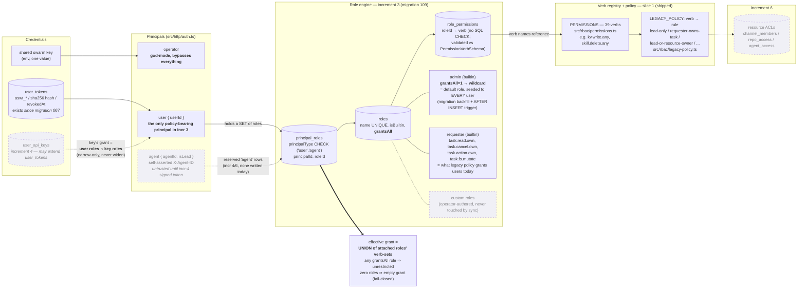
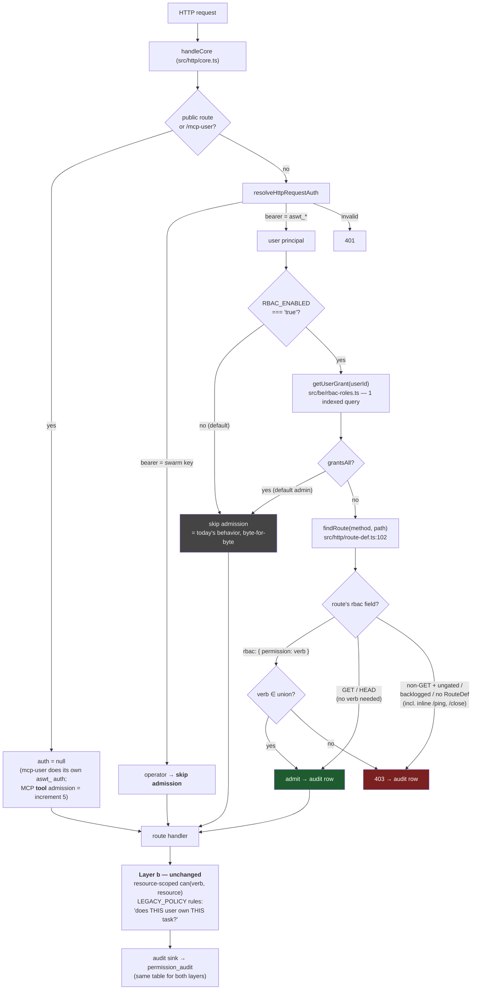

# DES-445 RBAC — structure diagrams

Two views: (1) the **data/policy model** — what a role is, how grants compose, where every table sits; (2) the **request flow** — how the two authorization layers stack at runtime. Solid = exists after increment 3. Dashed = future increments, shown so you can see what today's schema reserves for them.

## 1. Data / policy model

Key properties of the model:

- **A role is just a named verb-set.** No policy language, no deny, no conditions. Composition is monotonic union — adding a role can only widen. Subtraction ("admin except X") is inexpressible on purpose; the `deny` primitive waits for a real subtract-requirement (design §8.1).
- **`grantsAll` is the one special case** — it exists because "what users can do today" includes 149 backlogged routes that have no verb yet, so no verb-set can express it. `admin` = wildcard = today's behavior. Once increment 5 burns the backlog down, a verb-listing "full" role becomes expressible and `grantsAll` could be retired to operator-only tooling.
- **`users.role` (the freeform TEXT column) plays no part** — display hint only; `principal_roles` is the source of truth.

## 2. Request flow — the two layers at runtime

Key properties of the flow:

- **Layer a (admission) answers "may this principal *attempt* this class of operation"** — coarse, verb-in-set, one DB read, no resource rows. **Layer b (`can()`) answers "may it touch *this* resource"** — unchanged from slice 1. Neither replaces the other (design §2).
- **Method is a proxy; the verb is the truth.** GET fallback exists only for verb-less routes; a declared verb always wins (that's how `POST /api/memory/search` becomes reachable for a read-only role once increment 5 assigns it a `*.read.*` verb).
- **Fail-closed default:** narrow (non-wildcard) user + verb-less non-GET route = 403. That's why the 149-route backlog burn-down (increment 5) is a *prerequisite* for useful narrow roles, not parallel hygiene.

## 3. The decisions embedded above, in one list

1. **`grantsAll` wildcard on the default `admin` role** — the yellow-flag one. Alternative was "admin lists all 39 verbs", but that still 403s the 149 verb-less routes, so enabling the flag would NOT be a no-op. Wildcard is the only faithful encoding of "current capability" until the backlog shrinks. ✅ **Approved (Taras, 2026-07-08): wildcard admin stays the default for backward compat.**
2. **Default-role attachment = migration backfill + `AFTER INSERT ON users` trigger** — airtight across all 3 user-insert paths (createUser, findOrCreateUserByEmail, raw test INSERTs), no import cycles. Cost: first trigger in the codebase; a future users-table rebuild silently drops it → mitigated by migration-header warning + `ensureRbacSeedsSynced()` recreating it at every boot + a unit test. ✅ **Approved (Taras, 2026-07-08).**
3. **Builtin role verb-sets are code-authoritative** — `BUILTIN_ROLES` in `src/be/rbac-roles.ts` re-syncs `role_permissions` at boot (insert missing / delete extras, builtins only). Migration SQL is just the initial snapshot; new verbs can join `requester` without a migration.
4. **Union resolution is per-request, uncached** — one indexed query on in-process SQLite; TTL cache deferred until measured need.
5. **Admission sits inside `handleCore` right after auth** (not the index.ts handler loop) — covers inline core routes AND all `route()` routes AND the in-process test mini-servers for free.
6. **CLI is `rbac bootstrap`** (not `rbac:bootstrap`) — follows the `scripts reembed` subcommand precedent; no colon-commands exist.
   **When does it run?** Never *required* in the happy path — migration 109 backfills existing users, the trigger covers new ones, and boot re-syncs builtin roles + trigger automatically. It's an idempotent operator tool for three moments: (a) **pre-enable audit** — run it right before flipping `RBAC_ENABLED=true` on an existing deployment; the summary (roles, verb counts, attached-user counts, users with zero roles, flag state) tells you enabling is safe; (b) **drift recovery** — a user stripped of all roles (accident, restored/hand-edited DB) gets the default back; (c) **post-restore/merge sanity** after any manual DB surgery. Safe to run any time; second run is a no-op.
7. **Admission audit rows only for non-wildcard grants** — default-role traffic adds zero rows; narrow-role allows AND denies both land in `permission_audit` (`resourceType='http-route'`).
