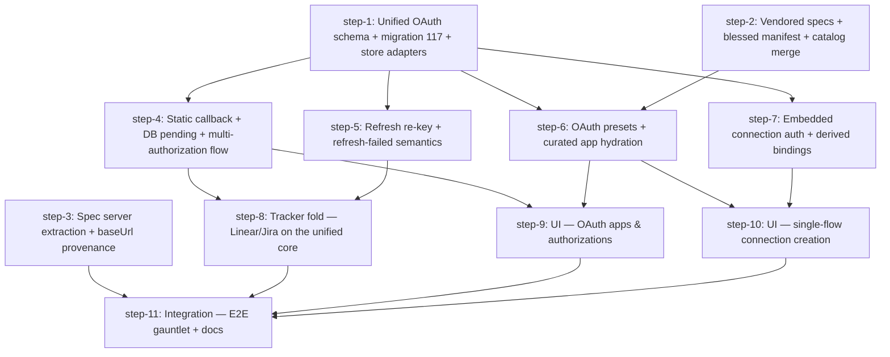

# Connections Redesign — Unified OAuth, Embedded Auth, Curated Integrations — Plan (DAG)

## Overview

Redesign the script-connections feature around one unified OAuth core (apps 1:N authorizations, encrypted at rest, single static callback), embed auth directly on connections, extract spec-declared server URLs, and ship a curated integrations layer (presets + blessed manifest + vendored specs). All three existing OAuth stacks (tracker 009, MCP-DCR 041, connections) fold onto the new core with a zero-manual-step startup migration.

- **Motivation**: Three pain points from real usage of the script-connections MVP (PR #934): spec baseUrl ignored, OAuth apps hard-wired 1-1 with a single authorization (plaintext secrets, in-memory PKCE), and the connection↔binding↔credential triad too tedious to set up.
- **Related**: `thoughts/taras/brainstorms/2026-07-21-connections-redesign.md` (converged brainstorm — decisions + in-session research with file:line refs)

## Current State Analysis

*(Brainstorm research 2026-07-21 + five targeted codebase-analysis passes, same day.)*

### Tracker/generic OAuth stack (migration 009)

- `oauth_apps` (`src/be/migrations/009_tracker_integration.sql:11-23`): one row per provider, `provider UNIQUE`, `scopes` comma-joined string, `metadata` free-form JSON blob written by **four** call sites (Jira callback → cloudId/siteUrl; Jira webhook-register → webhookIds; Linear init → `actor`; script-connections upsert → `extraParams`/`tokenAuthStyle`/`tokenBodyFormat`). `upsertOAuthApp` preserves existing metadata on UPDATE when caller omits it (`src/be/db-queries/oauth.ts:42-46`).
- `oauth_tokens` (`009:26-36`): `provider UNIQUE` FK → `oauth_apps(provider)` — hard 1-1. **Plaintext at rest** (`TODO(secrets-cipher)` at `src/be/db-queries/oauth.ts:116`).
- PKCE/state: in-memory `pendingStates` map, 10-min TTL (`src/oauth/wrapper.ts:56-67`) — process-local, lost on restart.
- Provider quirks as `OAuthProviderConfig` fields (`src/oauth/wrapper.ts:6-46`): `scopeSeparator` (default `,` for Linear back-compat — RFC default is space), `tokenAuthStyle` body|basic, `tokenBodyFormat` form|json, `requiresRefreshTokenRotation`, `extraParams`. **Jira rotation flag hardcoded in two drift-prone places**: `src/jira/oauth.ts:32` and `src/oauth/ensure-token.ts:55`.
- Refresh: dual-layer lock — in-process `refreshLocks` Map + cross-process `oauth_refresh_locks` (migration 077, PK `provider` but generically caller-keyed; Codex pool uses `codex_oauth_<slot>` in the same namespace, `src/http/oauth-locks.ts:14-17`). Optimistic-concurrency persist keyed on *previous* refreshToken (`updateOAuthTokensAfterRefresh`, `src/be/db-queries/oauth.ts:131-172`). Sweep: 15-min interval, 30-min expiry buffer, 7-day stale keep-alive (`src/be/oauth-refresh-sweep.ts:23-26`); **failures are console-only — no persisted status anywhere**. Keepalive hardcoded `["linear","jira"]` + Slack alerting (`src/oauth/keepalive.ts:9`).
- Reserved-provider carve-out: `RESERVED_OAUTH_PROVIDERS = {linear, jira}` (`src/oauth/app-validation.ts:3-10`), enforced in HTTP upsert + MCP tool; but generic callback (`src/http/oauth-generic.ts:8`) blocks only `linear` — asymmetric.
- Runtime reads: Jira `jiraFetch` with 401-retry (`src/jira/client.ts:45-80`); Linear caches a module-level `LinearClient` needing explicit `resetLinearClient()` after refresh (`src/linear/client.ts:6-14`, `src/linear/outbound.ts:97,147,196`). Redirect URIs baked at boot by `initJira`/`initLinear` from env — external app registrations depend on them staying valid.
- Tracker routes (`src/http/trackers/{linear,jira}.ts`) are RBAC-backlog (ungated); script-connections OAuth CRUD is `script-connection.manage`-gated (`src/http/script-connections.ts:237-380`).

### MCP-DCR stack (migration 041)

- `mcp_oauth_tokens`: per-`(mcpServerId, userId)` with **inert** `UNIQUE(mcpServerId, userId)` (SQLite NULL-distinct; userId always NULL in practice — the only runtime call site `src/http/mcp-servers.ts:282` never passes one; worked around via select-then-write, `src/be/db-queries/mcp-oauth.ts:165-171`). `clientSource` discriminator `dcr|manual|preregistered`; `status` `connected|expired|error|revoked`; AS metadata (issuer/authorize/token/revocation URLs) **denormalized per token row** (read by `src/oauth/ensure-mcp-token.ts:56-63`).
- `mcp_oauth_pending`: DB-persisted PKCE (encrypted `codeVerifier`/`dcrClientSecret`), 10-min GC timer (`src/http/mcp-oauth.ts:771-791`).
- Encryption already flows through the shared `src/be/crypto/secrets-cipher.ts` (AES-256-GCM) + `key-bootstrap.ts` (`SECRETS_ENCRYPTION_KEY` → key file → autogenerate 0600).
- `mcp_servers.authMethod` (`static|oauth|auto`) is the runtime switch (`src/http/mcp-servers.ts:278`); flipped by side effect in callback (`→ oauth`) and disconnect (`→ static`). Callback route is public (`auth: {apiKey:false}`). Single-flight refresh mutex keyed `${mcpServerId}::${userId}` (`src/oauth/ensure-mcp-token.ts:15,36`). Token resolution reaches workers via `GET /api/agents/:id/mcp-servers?resolveSecrets=true` (RBAC `mcp-server.read.secrets`), with Bearer-scheme normalization for issue #368 (`mcp-servers.ts:284-289`).

### Script-connections + bindings (migrations 101/111/112)

- `script_connections` (101, rebuilt by 112 for graphql): `credential_binding_id` nullable FK; CHECKs per kind; unique `(slug, scope, COALESCE(scope_id,''))`. `openapi_spec_source_kind` `'agent_fs'` value reserved-but-inert (no producer/consumer).
- `script_credential_bindings` (101 + 111 adds `auth_kind config|oauth` + `oauth_provider` bare string, no FK). Identity-based idempotent upsert (`findCredentialBindingByIdentity`, `src/be/script-connections.ts:210-234`).
- `extractOperations` (`src/be/script-connections.ts:487-598`) reads only `spec.paths` — zero code anywhere touches `spec.servers`/`host`/`basePath`. Runtime `ctx.api.<slug>` clients take `baseUrl` exclusively from `descriptor.baseUrl` = stored `base_url` column (`src/scripts-runtime/api-client.ts:165,196`). apis.guru `servers[0].url` extraction exists **client-side only** (`apps/ui/src/pages/connections/page.tsx:414-448`).
- Egress chain: `buildScriptCredentialBindings` (`src/be/script-credential-broker.ts:22-50`; call sites: workflows executor, scheduler, `src/http/scripts.ts:525`, `src/http/x.ts:210`) → `CredentialBroker.resolveBindings` (**keyed on `binding.oauthProvider` string at `src/scripts-runtime/credential-broker/broker.ts:35-38`**) → `registerVolatileSecret` scrubber hook → stdin payload → sandbox `patchFetchWithCredentialBroker` substitutes `[REDACTED:KEY]` only toward `allowedHosts` (`src/scripts-runtime/credential-broker/fetch-patch.ts:63-102`). OAuth refresh failure in the broker = **silent drop** (binding omitted; script sees unsubstituted placeholder) — `src/be/script-credential-broker.ts:32-42`.
- Legacy `SCRIPT_CREDENTIAL_BINDINGS` swarm-config JSON blob: still read as fallback when relational list is empty (`src/be/script-credential-broker.ts:16-18`), still writable via `import-legacy` tool action; direct `set-config` writes blocked (`src/tools/swarm-config/set-config.ts:99`).
- `swarm_config` already has encrypt-on-write + boot-time backfill scan for unencrypted secret rows (`src/be/db.ts:6931-6998`) — the exact idempotent-backfill pattern the OAuth migration needs.
- **Phase-0 bug discrepancy**: the brainstorm calls the query-only-auth header-defaulting a live bug, but current main guards it (`queryTemplate ? undefined : bearer-default` at `src/tools/script-connections/tool.ts:302-305,381-384` and `src/http/script-connections.ts:777-779`) and a regression test locks it in (`src/tests/script-connections-http.test.ts:172-200`). Treated as verify-only, not a fix item.

### Catalog / discovery / UI

- `GET /api/integrations-catalog` + `/surface`: in-process 1h caches, normalization via `normalizeCatalogEntry`/`catalogEntriesFromPayload` (`src/http/script-connections.ts:1014-1058`) — the natural merge point for a blessed manifest. Entry shape already has `feeds: string[]`.
- `POST /api/oauth-apps/discover`: RFC 8414 + OIDC + raw-URL candidates, SSRF-checked, fills authorizeUrl/tokenUrl/scopes only — pure lookup, client-side prefill (`src/http/script-connections.ts:977-1003`).
- `catalog-browser.tsx`: fuzzy score + `curationBoost` (+30 non-apis.guru feeds, +40 hardcoded 23-domain `WELL_KNOWN_DOMAINS` list, `apps/ui/src/pages/connections/components/catalog-browser.tsx:44-80`).
- Redirect URI is deterministic pre-creation (`genericOAuthRedirectUri`, `src/http/script-connections.ts:914-916` — pure function of provider + `getPublicMcpBaseUrl()`), but the UI only shows it **after** POST (grid column + detail page; never inside `OAuthAppDialog`).
- Single-flow blocker: inline credentials in `AddConnectionDialog` support `config` only; OAuth requires pre-existing app via new-tab link (`apps/ui/src/pages/connections/page.tsx:1252-1284`); `maybeCreateInlineBinding` (`src/http/script-connections.ts:761-801`) has no OAuth branch.
- Vendored-JSON precedent: `src/be/modelsdev-cache.json` + `scripts/refresh-modelsdev-pricing.ts` — operator-run, **no CI drift check** (unlike `openapi.json` freshness gate); UI consumes via symlink import.

### Cross-cutting facts

- Latest migration: `116_favorite_principal_scope.sql` → new work starts at **117**.
- RBAC verbs `script-connection.manage`/`.invoke`, `credential-binding.manage` exist (`src/rbac/permissions.ts:100-110`); MCP OAuth uses `mcp-oauth.authorize.any` + `mcp-server.read.secrets` (`:176,180`). New verbs register in `src/rbac/permissions.ts` + `src/rbac/legacy-policy.ts`.
- Relevant tests: `oauth-refresh-sweep`, `oauth-credential-bindings` (11), `credential-broker` (11), `oauth-wrapper`, `oauth-keepalive`, `oauth-access-token-tool`, `script-connections*` (4 files), `secrets-cipher`, `swarm-config-encryption`, plus 5 codex-oauth files sharing only the lock table.

## Desired End State

The brainstorm's "Target model (converged)" section, verbatim summary:

- `oauth_apps` (no UNIQUE-per-provider; encrypted clientSecret; source `manual|dcr|curated-prefill`), `oauth_authorizations` (N per app, label + account identity + encrypted tokens + status), `oauth_pending` (DB PKCE state), single static callback `${PUBLIC_MCP_BASE_URL}/api/oauth/callback`.
- Connections embed auth inline (`bearer|header|query` + inline secret → derived swarm_config key, or `configKey`, or `oauth` + `authorizationId`); templates/hosts derived; bindings auto-managed (standalone surface only for raw fetch()).
- Spec `servers[]`/`host`+`basePath` extraction with baseUrl provenance (spec-derived vs user-set).
- Curated catalog: in-repo blessed manifest merged into `/api/integrations-catalog`, `src/oauth/presets.ts`, `vendored-openapi/` + refresh script + CI drift check.
- Tracker (Linear/Jira) + MCP-DCR run through the unified core; legacy callback routes keep working during transition.
- Zero-manual-step upgrade: forward-only SQL migration + idempotent TS encryption backfill at API start.

## What We're NOT Doing

- User/role-level scoping of authorizations/connections (schema leaves room; RBAC follow-up).
- Self-serve connection setup (lead-only in v1, behind `script-connection.manage`).
- Shared Desplega OAuth client credentials (never shipped — customers bring their own).
- Codex keep-warm OAuth (provider-specific, out of scope).
- Workspace-rw FS mode / worker dispatch (unrelated v2 item).

## Implementation Approach

- **Every step leaves the tree green.** Migration 117 (schema restructure + row carry-over + legacy-table drop, per the drop-in-same-migration decision) therefore ships in the same step as rewritten storage accessors (`src/be/db-queries/oauth.ts`, `src/be/db-queries/mcp-oauth.ts` as signature-preserving adapters) so all three stacks keep passing their existing tests on the new tables from day one. Feature steps then build on the unified store in parallel.
- **Signature-preserving adapters as the transition device**: legacy provider-string callers resolve app-by-provider → its migrated `default` authorization; MCP callers resolve by `mcpServerId` (column preserved on `oauth_authorizations`). Re-keying to explicit `authorizationId` happens in the dedicated feature steps, not as a repo-wide flag-day.
- **Encryption via the proven pattern**: SQL migration copies plaintext rows flagged `encrypted=0`; idempotent TS backfill encrypts at boot with `secrets-cipher` (mirrors `swarm_config`'s scan at `src/be/db.ts:6931-6998`). `mcp_oauth_*` rows are already ciphered with the same key — copied as-is (`encrypted=1`).
- **Lock table generalized, not re-invented**: `oauth_refresh_locks.provider` → `lockKey` (table-copy rebuild in 117); tracker/authorization locks use `authz:<id>` keys; Codex `codex_oauth_<slot>` keys untouched.
- **Provider quirks become schema, not code**: `scopeSeparator` / `tokenAuthStyle` / `tokenBodyFormat` / `requiresRefreshTokenRotation` / `extraParams` / userinfo hint move from hardcoded branches (`src/jira/oauth.ts:32`, `src/oauth/ensure-token.ts:55`) and the `metadata` blob into first-class `oauth_apps` columns; tracker/integration runtime state (Jira cloudId/webhookIds, Linear actor) stays in `metadata`.
- **Phase-0 bug is verify-only** (already guarded on main + regression-tested); the redesign keeps that test green.
- **Independent tracks run in parallel**: spec-server extraction + baseUrl provenance (own migration 118) and the vendored-specs/blessed-manifest track have no dependency on the OAuth core and start immediately.
- **UI last, per-surface**: OAuth apps/authorizations page and single-flow connection dialog land after their APIs; Taras manual-QAs the SPA (no qa-use YAML per repo convention for this codebase).
- **Docs/E2E as an explicit terminal step**: openapi.json regen is per-step (CI freshness gate), but docs-site guides, runbooks, and the cross-stack E2E gauntlet gate the whole DAG.

## Unified Schema Contract (shared by all steps)

Steps reference this contract instead of restating DDL. Canonical DDL lives in step-1's migration 117.

**`oauth_apps`** (rebuilt via table-copy, id-preserving): `id` PK, `provider` (NOT unique; DCR apps use `mcp-<mcpServerId>`), `displayName`, `clientId`, `clientSecret` (nullable), `clientSecretEncrypted` INT 0/1, `authorizeUrl`, `tokenUrl`, `revocationUrl`, `userinfoUrl` (identity-capture hint), `scopes` (JSON array string), `scopeSeparator` (default `' '`; migrated Linear row keeps `','`), `tokenAuthStyle` `body|basic`, `tokenBodyFormat` `form|json`, `requiresRefreshTokenRotation` INT (set 1 for migrated jira), `extraParamsJson`, `source` `manual|dcr|curated-prefill`, `mcpServerId` (nullable FK, set for DCR apps), `metadata` (runtime-owned JSON: Jira cloudId/webhookIds, Linear actor, MCP AS-context resourceUrl/issuer), audit cols.

**`oauth_authorizations`**: `id` PK, `appId` FK CASCADE, `label` (default `'default'`, UNIQUE(appId,label)), `userId` (nullable, dormant v1), `accountEmail`, `identityJson`, `accessToken`, `refreshToken`, `tokenType`, `expiresAt`, `scope`, `tokensEncrypted` INT 0/1, `tokenVersion` INT (optimistic concurrency — replaces WHERE-refreshToken-equality, which breaks under per-write IVs), `status` CHECK `active|refresh-failed|expired|revoked`, `lastErrorMessage`, `lastRefreshedAt`, `connectedByUserId`, audit cols.

**`oauth_pending`**: `state` PK, `appId` FK CASCADE, `label`, `flow` CHECK `generic|tracker|mcp`, `codeVerifier` (encrypted), `nonce`, `redirectUri`, `finalRedirect`, `userId`, `createdAt`. 10-min GC.

**`oauth_refresh_locks`**: rebuilt with `lockKey` PK (was `provider`). Authorization locks use `authz:<authorizationId>`; Codex keys (`codex_oauth_<slot>`) unchanged.

**`script_credential_bindings`**: `oauth_provider` replaced by `oauth_authorization_id` (nullable FK → oauth_authorizations ON DELETE SET NULL), backfilled provider→app→default-authorization in 117.

**Static callback**: `${PUBLIC_MCP_BASE_URL}/api/oauth/callback` — constant, state-keyed, public route.

**Status mapping** (041 → unified): `connected`→`active`, `error`→`refresh-failed`, `expired`→`expired`, `revoked`→`revoked`.

**Migration number assignments** (pre-assigned to avoid parallel-step collisions): **117** step-1 (OAuth restructure), **118** step-3 (baseUrl provenance), **119** step-2 (`vendored` spec source kind), **120** step-7 (embedded connection auth columns). If a number is taken by the time a step lands, take the next free one and update this table.

> **2026-07-23 consolidation**: pre-merge cleanup collapsed 118–121 (incl. step-5/8's `121_oauth_keepalive_flag`) into a single `117_unified_oauth.sql` — none were released, so one migration ships. Filename kept so dev DBs that applied all five stay consistent (runner keys by version; stale 118–121 `_migrations` rows are harmless).

## Quick Verification Reference

- `bun test` (single file: `bun test src/tests/<file>.test.ts`)
- `bun run lint` (read-only, what CI runs)
- `bun run tsc:check`
- `bun run docs:openapi` after route changes (commit `openapi.json`)
- `bun run check:rbac-coverage`
- Fresh-DB migration check: `rm agent-swarm-db.sqlite && bun run start:http` (and against an existing DB)

## DAG

## Steps

| ID | Name | Depends on | Status | File |
|----|------|------------|--------|------|
| step-1 | Unified OAuth schema + migration 117 + store adapters | — | done | [step-1.md](./step-1.md) |
| step-2 | Vendored specs + blessed manifest + catalog merge | — | done | [step-2.md](./step-2.md) |
| step-3 | Spec server extraction + baseUrl provenance | — | done | [step-3.md](./step-3.md) |
| step-4 | Static callback + DB pending + multi-authorization flow | step-1 | done | [step-4.md](./step-4.md) |
| step-5 | Refresh re-key + refresh-failed semantics | step-1 | done | [step-5.md](./step-5.md) |
| step-6 | OAuth presets + curated app hydration | step-1, step-2 | done | [step-6.md](./step-6.md) |
| step-7 | Embedded connection auth + derived bindings | step-1 | done | [step-7.md](./step-7.md) |
| step-8 | Tracker fold — Linear/Jira on the unified core | step-4, step-5 | done | [step-8.md](./step-8.md) |
| step-9 | UI — OAuth apps & authorizations | step-4, step-6 | done | [step-9.md](./step-9.md) |
| step-10 | UI — single-flow connection creation | step-6, step-7 | done | [step-10.md](./step-10.md) |
| step-11 | Integration — E2E gauntlet + docs | step-3, step-8, step-9, step-10 | ready | [step-11.md](./step-11.md) |

> **Canonical dependencies and execution status live in each `step-<n>.md`'s frontmatter.** This table is a derived snapshot at plan creation. During `/v-implement`, frontmatter `status` (`ready` → `claimed` → `done`) is the source of truth — re-render this table when you want a current view.

## Pre-flight Verification

- [ ] Working tree is clean (or only contains intentional in-flight work)
- [ ] Baseline tests pass: `bun test`
- [ ] Baseline typecheck passes: `bun run tsc:check`
- [ ] `SECRETS_ENCRYPTION_KEY` set in local env (encryption paths under test)
- [ ] Existing local DB snapshot saved for migration testing against a populated DB

## Global Verification

- [ ] Whole-repo typecheck: `bun run tsc:check`
- [ ] Full test suite: `bun test`
- [ ] `bash scripts/check-db-boundary.sh` + `bun run check:dep-graph` + `bun run check:rbac-coverage`
- [ ] Fresh-DB boot + populated-DB boot both migrate cleanly (009/041/bindings rows carried over)
- [ ] E2E: OAuth app → 2 authorizations → 2 connections → script calls both `ctx.api.*` clients
- [ ] Linear/Jira tracker flows still work through the unified core
- [ ] MCP-DCR server auth still resolves through the unified tables

## Appendix

- **Follow-up plans**: user/role-level authorization scoping (schema leaves `userId` dormant); self-serve connection setup (post user/role scoping); possible manifest generation from integrations.sh if it's Desplega-owned (open question).
- **Post-QA follow-ups (2026-07-23)**:
  - UI: configKey inputs (embedded auth + binding dialogs) should be a selector of existing swarm-config keys instead of free text. NOTE: resolution is scope-aware (`getResolvedConfig` merges global→agent→repo, `src/be/script-credential-broker.ts:36-43`), NOT global-only — selector should use `GET /api/config` with scope filtering (endpoint exists, unconsumed by connections UI).
  - Step-11 docs MUST include an upgrade note: pre-redesign generic script-connections OAuth apps have the old `/api/oauth/{provider}/callback` registered at the provider; new authorize attempts force the static `/api/oauth/callback` (`src/http/script-connections.ts:1923-1924` overrides stored redirectUri) → redirect_uri_mismatch on re-auth until the registration adds the static URL. Refresh of existing tokens unaffected; legacy route still completes in-flight callbacks. Trackers + MCP-DCR callbacks unchanged (no action for those users).
  - ~~Security-hygiene gap: pending carryover plaintext~~ **CORRECTED 2026-07-23**: legacy `mcp_oauth_pending` already stored `codeVerifier`/`dcrClientSecret` encrypted (main `src/be/db-queries/mcp-oauth.ts:385,394`), so the carryover copied ciphertext — no plaintext exposure existed. The carryover was nonetheless removed from 117 as a simplification (10-min TTL makes mid-upgrade pending state dead on arrival; drops ~50 lines of correlated-subquery SQL). DONE same day.
  - Informational (TC-9): real Linear rotates refresh tokens despite `requiresRefreshTokenRotation=0` seed + "Linear does not rotate" comment; wrapper's `refreshed ?? old` handles it — fix the comment.
  - Create-path clobber FIXED pre-merge (`7160d144`): POST /api/oauth-apps no-id now always inserts (`createOAuthApp`), id → `updateOAuthAppById`; provider-keyed `upsertOAuthApp` reserved for boot reconciliation. Remaining sibling: `DELETE /api/oauth-apps/{provider}` addressed by provider still deletes the oldest row — delete-by-id exists and the UI uses it; deprecate/disambiguate the provider-keyed delete as a follow-up.
- **Derail notes**:
  - Phase-0 bug (query-only auth header default) found **already fixed on main** with a regression test (`src/tests/script-connections-http.test.ts:172-200`) — plan treats it as verify-only, diverging from brainstorm requirement #11 (decided 2026-07-21).
  - `updateOAuthTokensAfterRefresh`'s optimistic concurrency compares raw `refreshToken` equality — breaks once tokens are encrypted with per-write IVs; replaced by `tokenVersion` counter (schema contract).
  - Sweep/refresh failures are console-only today — `refresh-failed` is entirely new persisted state, not a migration of existing state.
  - `mcp_oauth_tokens.connectedByUserId` is modeled but never populated on the live connect path — don't trust it during carry-over.
  - modelsdev refresh script has NO CI drift check; the vendored-openapi check (step-2) is new machinery modeled on the openapi.json freshness gate instead.
- **References**:
  - Brainstorm: `thoughts/taras/brainstorms/2026-07-21-connections-redesign.md`
  - Curated-connections design doc (agent-fs): `thoughts/16990304-76e4-4017-b991-f3e37b34cf73/plans/2026-07-21-curated-connections-design.md`
  - Script-connections MVP: PR #934 (merged c159a1a0, 2026-07-09)
