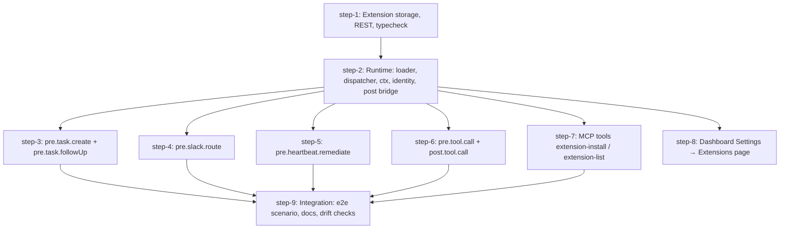

# Swarm extensions v1 — Plan (DAG)

## Overview

Add a swarm-level extension system: bundle-shaped extensions (`{ manifest, files }`) stored in the DB, loaded in-process in the API server, that receive `pre.*` events (continue, modify, or block) and `post.*` events (observe) at fixed orchestration boundaries. v1 bundles carry one asset, `hooks.ts`; the manifest reserves `skills`, `workflows`, and `schedules` for v2 and a marketplace source.

- **Motivation**: operators need to change routing, follow-up, heartbeat, tool-call, and task-creation behavior without a core change per customization. Five motivating examples are in the brainstorm.
- **Related**: `thoughts/taras/brainstorms/2026-09-10-swarm-extensions.md` (all decisions, contract sketch, v1 events table, verified facts). Read its Synthesis section before any step.

## Current State Analysis

**Pattern to copy: the scripts feature.**
- Storage: `src/be/migrations/064_scripts.sql` defines `scripts` + `script_versions` (source, contentHash, version, immutable version rows). Audit columns were added later by `082_user_audit_fields.sql:79`. Newest migration is `145_slack_render_v2_delegation.sql`; pre-flight on 2026-09-14: `origin/main` tail is `149_session_tokens.sql` (#1417 merged with 149, #1235 closed), no open PR adds a migration, so extensions take **150**.
- DB module: `src/be/scripts/db.ts` (`insertScript:110`, `upsertScriptByName:174`, `getScriptById:329`, `listScriptVersions:392`). Every function calls `getDbClient()` per call and takes `createdBy` from the caller, resolved with `resolveHttpAuditUserId` in `src/be/audit-user.ts:64`.
- Routes: `src/http/scripts.ts` uses `route()` with `rbac` and `responses` (`upsertRoute:222` is the canonical example). Imported at `src/http/all-routes.ts:54`.
- RBAC: verbs in `src/rbac/permissions.ts:224-255`, role mapping in `src/rbac/legacy-policy.ts:197-204`, handler gate via `can()` at `src/http/scripts.ts:640`.
- MCP tools: `src/tools/script-delete.ts` is the smallest complete example (registrar + `swarmToolOutputSchema` + `toolOk`). Registered in `src/server.ts:331` and `:391`. Allowlist in `src/scripts-runtime/sdk-allowlist.ts:48`, exclusions in `scripts/check-sdk-tool-registration.ts:20`.
- Typecheck: `typecheckScript` in `src/be/scripts/typecheck.ts:971` builds virtual files and a custom compiler host. Lib and package `.d.ts` resolve through `TS_LIB_DIR` and `SCRIPT_TYPES_DIR` in the compiled binary. Generated types come from `scripts/bundle-script-types.ts` (`build:script-types`).
- Import allowlist: `src/scripts-runtime/import-allowlist.ts` (`swarm-sdk`, `stdlib`, `zod`, relative). Bare-import shim: `writeBareImportShim` in `src/scripts-runtime/executors/native.ts:93` writes `node_modules/<pkg>/{package.json,index.ts}` next to the file. Bun resolves bare specifiers by walking up from the importing file, so the shim works for an in-process import.
- Tests: `src/tests/scripts-http.test.ts` calls the handler directly with synthetic request objects against a temp SQLite DB. `src/tests/scripts-typecheck.test.ts`, `scripts-import-allowlist.test.ts`, `scripts-mcp-e2e.test.ts` cover the other layers.
- UI: `apps/ui/src/pages/scripts/{page,[id]/page}.tsx`, router entries at `apps/ui/src/app/router.tsx:136`, sidebar at `components/layout/app-sidebar.tsx:141`, client methods on `apps/ui/src/api/client.ts` (`upsertScript:1274`). Settings pages live in `apps/ui/src/pages/settings/` under `SettingsLayout` (`router.tsx:152-166`). `ScriptSourceEditor` (`components/scripts/script-source-editor.tsx:56`) is a reusable Monaco editor that takes `typeDefs`.

**Boot order** (`src/http/index.ts`): migrations run lazily on first `getDbClient()`; `runAllSeeders` at line 599; `httpServer.listen` at 621; integrations, `initWorkflows` (679), `startScriptRunSupervisor` (682), scheduler, heartbeat (698) inside the listen callback. Extension loading goes right after `runAllSeeders`, before `listen`.

**Boundaries.**
- Task creation: `createTaskWithSiblingAwareness` (`src/tasks/sibling-awareness.ts:139`) has 30+ callers, none inside a transaction at the call site. `src/tools/send-task.ts` opens `getDbClient().transaction` at line 434 with all option locals resolved before it (`effectiveAgentId:329`, `effectiveParentTaskId:270`, `normalizedModel:267`). `src/tools/task-action.ts` opens transactions at 209 and 284 with `assetKey` resolved at 269-282. Dedup-guard skip path returns `toolOk`/`toolErr` without a task (send-task 423-432).
- Follow-up: `createWorkerTaskFollowUp` (`src/tasks/worker-follow-up.ts:151-229`) returns `null` on skip (lines 159, 160, 163, 166). Callers: `src/http/tasks.ts:1417`, `src/tools/store-progress.ts:533`. Tests: `src/tests/task-completion-idempotency.test.ts`.
- Slack: `routeMessage(text, botUserId, botMentioned, threadContext?)` returns `AgentMatch[]` (`src/slack/types.ts:11`). Called at `src/slack/handlers.ts:584` with `msg.channel` known since line 428. Empty matches with no mention returns early (591). Tests hand-build an `App`-shaped object and call the captured handler (`src/tests/slack-thread-buffer.test.ts:58`).
- Heartbeat: `detectAndRemediateStalledTasks` (`src/heartbeat/heartbeat.ts:352-415`) loops candidates with `task`, `session`, `taskAgeMs`, `sessionHeartbeatAgeMs`; Case A (380) and B (392) call `remediateCrashedWorkerTask(findings, task, opts)` (427), Case C (407) records only. `opts` = `{ supersedeReason, legacyFailReason, shortLabel, cleanupActiveSession? }`. No outer transaction. Tests: `src/tests/heartbeat.test.ts`, `heartbeat-supersede-resume.test.ts` backdate `lastUpdatedAt` and manipulate `active_sessions`.
- Registrar: `createToolRegistrar` (`src/tools/utils.ts:743-797`) computes `RequestInfo` (`{ sessionId, agentId, runtimeInstanceId, sourceTaskId, contextKey, callOrigin: "mcp" | "script-sdk" }`) before `cb(...)`, then `finalizeSwarmToolResult` (668) runs `FINALIZE_PIPELINE` (655: scrub, nudge, ctxControl). `callOrigin` comes from a module-private `WeakSet` set by `markScriptSdkRequestOrigin` (27) from `src/http/mcp-bridge.ts:103`. Tests: `src/tests/tool-registrar-no-input.test.ts`.
- Bus: `workflowEventBus` is a synchronous `EventEmitter` wrapper; the subscription pattern is `src/linear/outbound.ts:44-66` (`on`/`off` with stable handler refs, `observed()` try/catch wrapper). `task.completed` payload `{ taskId, output, agentId, workflowRunId, workflowRunStepId }` (`src/be/db.ts:3151`), `task.created` payload `{ taskId, task, source, tags, agentId, workflowRunId, workflowRunStepId }` (`db.ts:5424`), both under `afterCommit`.

**Gaps.**
- `src/be/db-client.ts` has no exported "in transaction" query. `txContext` (line 139) and `TxContext` (132) are module-private; a one-line `isInTransaction()` export is needed for the dispatcher guard.
- No system or service agent concept. `agents` has `isLead`, free-text `role`, and `status IN ('idle','busy','offline','waiting_for_credentials')`. Polling is agent-initiated (`src/http/poll.ts:468`), so an agent that never polls is never assigned. The `ext:<name>` agent uses `role: "extension"`, `status: "offline"`.
- No server-side logger module; logging is `console.*` with `scrubSecrets` (`src/utils/secret-scrubber.ts:235`) at the call site.
- No struct carries heartbeat classification plus proposed action; the plan introduces one.
- The registrar has no pre-call hook.

## Desired End State

An operator installs a bundle (`manifest` JSON + `files["hooks.ts"]`) through REST, the dashboard, or an MCP tool. Install validates the manifest, runs the import allowlist, and typechecks the hooks file against a generated `swarm-extension.d.ts`. Enable creates a system agent `ext:<name>`, imports the source in-process, and registers its handlers. From then on:

- `pre.task.create`, `pre.task.followUp`, `pre.slack.route`, `pre.heartbeat.remediate`, and `pre.tool.call` run the enabled handlers by priority, first block wins, each modify feeding the next, never inside a DB transaction.
- `post.task.*`, `post.slack.message`, and `post.tool.call` fan out after commit from the existing bus and the registrar.
- A throw or 5 s timeout counts as continue, is logged to the run log, and five in a row auto-disable the extension.
- Every version is kept, an older version can be re-activated, and a disabled extension keeps its history.
- All five motivating examples pass as test fixtures.

Verification: the per-step suites, `bun run e2e --only extensions`, and an `agent-browser` walkthrough of the dashboard page.

## What We're NOT Doing

- No worker-side loader or worker events (`runtime: "worker"` is rejected on install in v1).
- No Pi extension compatibility shim. Pi workers keep their native `extensionFactories` path untouched.
- No npm packages. Imports are `swarm-extension`, `zod`, `stdlib`.
- No assets other than `hooks` in v1: `manifest.assets.skills`, `.workflows`, `.schedules` are rejected with a clear message. No remote bundle source (git/npm marketplace).
- No `pre.task.claim`, `pre.prompt.resolve`, `pre.slack.send`, or `pre.heartbeat.classify`.
- No `pre.slack.route` on the Slack assistant API, modal actions, or thread-buffer flush.
- No host isolation. Extensions are trusted operator code.
- No seeded example extensions. Examples ship as test fixtures and docs snippets.
- No multi-replica coordination beyond the 30 s `updatedAt` poll.

## Implementation Approach

- Copy the scripts feature layer by layer: migration, `src/be/extensions/db.ts`, `src/http/extensions.ts`, MCP tools, Monaco page.
- Bundle shape from day one: JSON manifest + files map, an `extension_files` table, install/uninstall verbs. v1 only implements the `hooks` asset so later asset kinds add rows and a handler, not a rename.
- Keep the contract in one file, `src/extensions/contract.ts`, and generate `swarm-extension.d.ts` from it so the typecheck, the loader, and the UI editor share one source of truth.
- One dispatcher module, `src/extensions/dispatcher.ts`, owns the registry, the priority chain, the 5 s cap, fail-open, the failure counter, and the run log. Boundaries call `dispatchPre(name, payload)` / `dispatchPost(name, payload)` and apply the result; they never touch the registry.
- `pre.*` dispatch happens at entry points before any transaction. `isInTransaction()` guards every dispatch and logs a violation.
- `ctx.swarm` reuses the in-process tool invocation path of `src/http/mcp-bridge.ts` with `callOrigin: "extension"` and the `ext:<name>` agent id.
- Sequencing: storage + REST first (step-1) so every later step can seed an extension over HTTP; runtime second (step-2) so every boundary step has a dispatcher to call; five boundary/tool slices and the dashboard fan out; one integration step closes.

## Quick Verification Reference

```bash
bun run test:root -- src/tests/extensions-<name>.test.ts     # one file
bun run test:root -- --parallel=4 --changed=$(git merge-base origin/main HEAD)
bun run tsc:check
bun run lint                      # NOTE: Biome aborts with exit 0 on Taras's Mac; CI is authoritative
bun run check:rbac-coverage
bun run check:openapi-response-coverage
bun run docs:openapi              # after any route change, commit openapi.json + docs-site api-reference
bash scripts/check-db-boundary.sh
bash scripts/check-audit-columns.sh
bash scripts/check-migration-conflicts.sh
bun scripts/check-floating-promises.ts && bun scripts/check-promise-sinks.ts
bun scripts/check-sdk-tool-registration.ts
bun run e2e --only extensions
```

## DAG



## Steps

| ID | Name | Depends on | Status | File |
|----|------|------------|--------|------|
| step-1 | Extension storage, REST, typecheck | — | done | [step-1.md](./step-1.md) |
| step-2 | Runtime: loader, dispatcher, ctx, identity, post bridge | step-1 | done | [step-2.md](./step-2.md) |
| step-3 | pre.task.create + pre.task.followUp | step-2 | done | [step-3.md](./step-3.md) |
| step-4 | pre.slack.route | step-2 | done | [step-4.md](./step-4.md) |
| step-5 | pre.heartbeat.remediate | step-2 | done | [step-5.md](./step-5.md) |
| step-6 | pre.tool.call + post.tool.call | step-2 | done | [step-6.md](./step-6.md) |
| step-7 | MCP tools extension-install / extension-list | step-2 | done | [step-7.md](./step-7.md) |
| step-8 | Dashboard Settings → Extensions page | step-2 | done | [step-8.md](./step-8.md) |
| step-9 | Integration: e2e scenario, docs, drift checks | step-3, step-4, step-5, step-6, step-7 | ready | [step-9.md](./step-9.md) |

> **Canonical dependencies and execution status live in each `step-<n>.md`'s frontmatter.** This table is a derived snapshot at plan creation. During `/v-implement`, frontmatter `status` (`ready` → `claimed` → `done`) is the source of truth — re-render this table when you want a current view.

Step-8 is a leaf. It is optional for the first merge; step-9 does not depend on it.

## Pre-flight Verification

Run before kicking off any step (orchestrator's responsibility — `/v-implement` performs these once at the start of the run):

- [x] Working tree is clean (or only contains intentional in-flight work)
- [x] Baseline tests pass on the current branch: `bun run test:root -- --parallel=4`
- [x] Baseline typecheck passes: `bun run tsc:check`
- [x] `bun install --frozen-lockfile` is clean
- [x] Free migration ordinal confirmed: `ls src/be/migrations | tail -1` and `gh pr list --state open --json number,files --jq '.[] | select(.files[].path | test("src/be/migrations/")) | .number'`. Use the next ordinal above every open PR. Update `step-1.md` if it is not 150.
- [x] `DATABASE_PATH` is set to a scratch file for any manual run, never `./agent-swarm-db.sqlite` (see memory: dev-DB fallback hazard)

## Global Verification

Run after all steps complete (final wave gate):

- [x] Whole-repo typecheck: `bun run tsc:check`
- [x] Full test suite: `bun run test:root -- --parallel=4`
- [x] Lint (CI-authoritative): `bun run lint`
- [x] `bun run check:rbac-coverage && bun run check:openapi-response-coverage`
- [x] `bash scripts/check-db-boundary.sh && bash scripts/check-api-key-boundary.sh && bash scripts/check-audit-columns.sh && bash scripts/check-migration-conflicts.sh`
- [x] `bun scripts/check-floating-promises.ts && bun scripts/check-promise-sinks.ts && bun scripts/check-sdk-tool-registration.ts`
- [x] `bun run check:script-types` (generated `.d.ts` is fresh)
- [x] `bun run docs:openapi` produces no diff
- [x] `bun run e2e` passes, including `--only extensions`
- [x] Fresh DB boot: `rm -f /tmp/ext-fresh.sqlite && DATABASE_PATH=/tmp/ext-fresh.sqlite bun run start:http` applies the migration and boots with zero extensions
- [x] Existing DB boot: boot against a copy of a pre-migration DB applies only the new migration
- [x] Docker API image builds: `bun run docker:build:api`, and inside the container `import()` of a temp `.ts` file works (step-2 has the smoke command)
- [x] All five motivating examples pass as fixtures: `bun run test:root -- src/tests/extensions-example-*.test.ts` (one file per step; see wave-3 deviation)

## Manual E2E

Real backend walkthrough after the DAG drains (placeholders in angle brackets):

```bash
export DATABASE_PATH=/tmp/ext-e2e.sqlite; rm -f $DATABASE_PATH*
bun run start:http &                                   # API on :3013, key 123123
API=http://localhost:3013; KEY=123123

# 1. Install the Slack-routing example bundle
curl -s -X POST $API/api/extensions/install -H "Authorization: Bearer $KEY" -H 'Content-Type: application/json' \
  -d @src/tests/fixtures/extensions/route-slack-channel.bundle.json   # {manifest, files: {"hooks.ts": "..."}, config}
# 2. Enable it (operator key)
curl -s -X POST $API/api/extensions/<id>/enable -H "Authorization: Bearer $KEY"
# 3. Confirm the ext agent exists and the extension is loaded
curl -s $API/api/agents -H "Authorization: Bearer $KEY" | jq '.[] | select(.name=="ext:route-slack-channel")'
curl -s $API/api/extensions/<id> -H "Authorization: Bearer $KEY" | jq '{status, activeVersion, consecutiveFailures}'
# 4. Trigger a task creation and read the run log
curl -s -X POST $API/api/tasks -H "Authorization: Bearer $KEY" -H 'Content-Type: application/json' -d '{"task":{"task":"hello from e2e"}}'
curl -s $API/api/extensions/<id>/runs -H "Authorization: Bearer $KEY" | jq '.[0]'
# 5. Break it: install a version whose hooks.ts throws, enable, create 5 tasks, expect status auto-disabled
curl -s $API/api/extensions/<id> -H "Authorization: Bearer $KEY" | jq '.status'
# 6. Roll back
curl -s -X POST $API/api/extensions/<id>/activate-version -H "Authorization: Bearer $KEY" -H 'Content-Type: application/json' -d '{"version":1}'
# 7. Dashboard
agent-browser open http://localhost:5274/settings/extensions && agent-browser screenshot /tmp/ext-settings.png
```

## Appendix

- **Follow-up plans**: bundle assets `skills` / `workflows` / `schedules` installed through the existing skills, workflow, and schedule APIs with uninstall cleanup; marketplace = remote bundle source (git tag / npm tarball) with signature or pin; v2 worker loader + worker events; `pre.heartbeat.classify`; `pre.task.claim` / `pre.prompt.resolve` / `pre.slack.send`; npm package imports; seeded examples.
- **Derail notes**: `src/tools/send-task.ts` re-runs `evaluateDedupGuards` inside its transaction; a `pre.task.create` modify that changes the description changes the dedup key, which is correct but worth a test. `POST /api/scripts/run` has no `rbac` key in the route def; not touched here.
- **References**:
  - Brainstorm: `thoughts/taras/brainstorms/2026-09-10-swarm-extensions.md`
  - Pi extensions (shape inspiration): https://pi.dev/docs/latest/extensions
  - Testing hub: `LOCAL_TESTING.md`, `runbooks/testing.md`

## Wave 3 QA (2026-09-14, orchestrator)

Merged tree booted on `DATABASE_PATH=/tmp/ext-wave3.sqlite` with a REST + MCP client script (`scripts/e2e/mcp.ts` connector). Verified: `rewrite-task-priority` turns a REST priority 50 into 1 with a `modify` run row; `block-tasks-from-source` (config `{ source: "slack" }`) returns 422 `{ error, extension }` on REST and, with `{ source: "mcp" }`, `toolErr` on MCP `send-task` (note: the dedup guard runs before `pre.task.create`, so a duplicate description never reaches extensions; `send-task` has no `source` arg, origins are the lever there); `no-exclamation-marks` blocks `store-progress` with `!` via a real MCP client (`isError`, message, details naming the extension) and allows the clean call, with `pre.tool.call` + `post.tool.call` rows carrying `durationMs`; `extension-list` lists; `extension-install` from a lead lands `enabled: false, status: disabled` with the operator sentence, from a worker returns the RBAC 403 message, with `bad-return-shape` returns TS2322 diagnostics, and a reinstall of an enabled extension stores version 2 with `activeVersion` 1. Slack and heartbeat boundaries were verified by their unit suites only (no Slack workspace / no stalled worker in the scratch run). Dashboard walkthrough + 4 screenshots: /tmp/ext-impl/wave3/step-8-*.png, agent-fs `qa/agent-swarm/2026-09-14-extensions-dashboard/`.

## Global Verification run (2026-09-14/15)

All gates green on the tip after step-9 (see step-9.md notes for the live e2e, unit suite, docs-site build, and Manual E2E outputs). Fresh-DB boot: the Manual E2E scratch DB applied all migrations and listed zero extensions. Existing-DB boot: a copy of a 145-tail DB applied only `150_extensions`. Docker: `bun run docker:build:api` needed one retry (registry tarball integrity errors on the first attempt); the container ran the Manual E2E flow end to end, proving `import()` of the staged hooks file inside the compiled binary.
