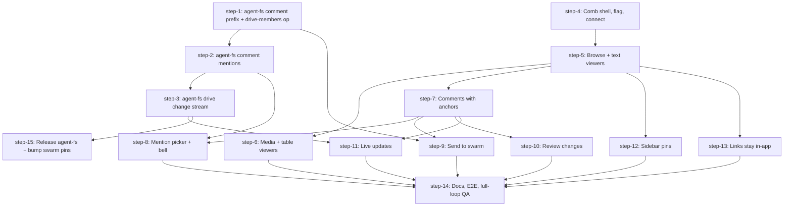

# Comb: agent-fs review space in the swarm dashboard (Plan, DAG)

## Overview

Comb shows the swarm's agent-fs drive inside the dashboard. Humans open agent-written files, comment on passages, @-mention teammates, and send "@swarm" comments to the lead as one task. Agents answer with new file versions and replies. Humans review the diff and resolve. The work spans two repos (agent-swarm and agent-fs), both on `main`, and ships behind a config flag.

- **Motivation**: agent-fs links leave the dashboard today, and there is no comment-to-agent loop. Taras wants the ChatGPT Space loop (shared docs + anchored comments + @agent), plus the swarm's strengths: batch review and diffable versions.
- **Related**:
  - Research: `thoughts/taras/research/2026-09-29-comb-agent-fs-review-space.md`
  - Brainstorm: `thoughts/taras/brainstorms/2026-09-29-agent-fs-space-in-dashboard.md` (17 decisions + "Amendments (2026-09-30, after research)")
  - agent-fs sibling repo: `/Users/taras/Documents/code/agent-fs` (`main` at `08e7d89`, v0.14.0). This plan calls it `$AFS`.

## Current State Analysis

**agent-fs (`$AFS`, v0.14.0)**
- Ops go through one registry. Add a type in `packages/core/src/ops/types.ts`, a handler, an `opRegistry` entry in `packages/core/src/ops/index.ts:50-358`, and an `OP_ROLES` row in `packages/core/src/identity/rbac.ts:15-50`. An op missing from `OP_ROLES` defaults to admin (`rbac.ts:52-54`). MCP tools come from the registry automatically.
- `comment-list` filters `path` by exact match only (`packages/core/src/ops/comment.ts:298-300`). Prefix precedent: `like(col, prefix + "%")` with `normalizePrefix()` (`packages/core/src/ops/paths.ts:21-26`, used in `ls.ts:26`, `tree.ts:24`). Index `idx_comments_path(drive_id, path)` exists (`packages/core/src/db/raw.ts:101`).
- Member listing is admin-only (`packages/server/src/routes/orgs.ts:174-182`, `listDriveMembers` at `packages/core/src/identity/drives.ts:105-119`, no `displayName`). A code comment says "Membership roles and emails remain private" (`comment.ts:157-165`).
- Comments have no mentions. Every comment notifies every other drive member (`emitCommentNotifications`, `comment.ts:52-89`). `comment-notification-list` hard-codes `type = "comment_notification"` (`packages/core/src/ops/comment-notification.ts:13,20,164`).
- Every file content or path change commits through `createVersion` (`packages/core/src/ops/versioning.ts:153-240`), called from write, edit, append, rm, mv, cp, revert, the raw PUT route, and FUSE IPC. There is no in-process event bus. `emitEvent` is private to `comment.ts:25-50`.
- `/health` returns a hard-coded `features: ["share-links"]` (`packages/server/src/app.ts:72`). Hono `^4.12.8`, no SSE today. Bun's default `idleTimeout` is 10 s, so an SSE stream needs a heartbeat under 10 s (Bun docs).
- Deploy: one Fly machine (`fly-deploy.yml` runs `flyctl deploy --ha=false` **on every push to `main`**), one volume, SQLite. An in-process bus is safe. npm and GHCR publish only on a version bump (`scripts/release.sh X.Y.Z`).
- Tests: `bun run test`, `bun run typecheck` (`tsc --build`), no lint script. CI also requires a fresh `docs/openapi.json` (`bun run scripts/sync-openapi.ts`). Test helpers: `createTestContext()` (`packages/core/src/test-utils.ts:248-289`), `createApp(db, s3)` for server tests.
- The local storage adapter supports versions (`packages/core/src/storage/local-adapter.ts:98-100`), so `log` and `diff` work locally. It has no presigned URLs, so `signed-url` returns an in-app link or 422.

**agent-swarm**
- `/status` has `agent_fs: {configured, base_url, provider_id, capabilities}` (`src/http/status.ts:122-127,688-714`). `base_url` is `AGENT_FS_API_URL`, which is an internal hostname in compose (`http://agent-fs:7433`, `docker-compose.local.yml:113`). The browser cannot use it there.
- The shared org and drive ids are non-secret config rows `AGENT_FS_DEFAULT_ORG_ID` / `AGENT_FS_DEFAULT_DRIVE_ID` (`src/be/seed/agent-fs-provision.ts:184-191`, getters `src/utils/constants.ts:96-107`).
- `POST /api/fs/members/invite` (`src/http/fs.ts:100-122`) invites an email into the shared org with the bootstrap key. It needs the operator API key and returns 500 when agent-fs rejects the email.
- `AgentFsProvider` has only task-scoped public methods. The generic op call is private (`src/fs/agent-fs-provider.ts:259-277`).
- Task creation for non-REST callers: `createTaskWithSiblingAwareness` (`src/tasks/sibling-awareness.ts:168-179`) + `getLeadAgent()` (`src/be/db/agents.ts:305-313`). Jira precedent: `src/jira/sync.ts:620-646`. `task.create.own` is the task-create permission (`src/rbac/permissions.ts:44`).
- Prompt templates register as a module side effect (`src/prompts/registry.ts:33`). New template files must also be added to `src/tests/template-registry-helpers.ts:17-29` and `scripts/dump-prompt-variants.ts:36`.
- KV idempotency: `claimKv` (`src/be/db.ts:13348-13370`) inserts only when the key is absent or expired.
- Favorites: SQL CHECK `('page','workflow','schedule')` (`src/be/migrations/116_favorite_principal_scope.sql:12`), zod `FavoriteItemTypeSchema` (`src/types.ts:1022`). The migration tail on `main` is `183`.
- Link builders: `buildAgentFsLiveUrl` (`src/utils/constants.ts:118-140`) and `taskAttachmentDisplayUrl` (`src/utils/task-attachment-links.ts:26-46`). The UI reads a different env name, `VITE_AGENT_FS_LIVE_URL` (`apps/ui/src/components/shared/task-attachment-link.tsx:4`).

**Dashboard (`apps/ui`)**
- Markdown: Streamdown 2.5 in `MarkdownView` (`apps/ui/src/components/shared/markdown-view.tsx:156-179`), streaming mode, fenced code in Monaco. For anchors, Comb needs `mode="static"`, `parseIncompleteMarkdown={false}`, and a line-stamp rehype plugin (research, "Streamdown internals"). No `shiki` in the lockfile.
- No `CSS.highlights`, `getSelection`, or Range code exists. `live/src/lib/comment-anchor.ts` (553 lines, no imports) and `live/src/lib/dom-text-space.ts` (178 lines, one type import) are portable. `live/src/components/viewers/DiffViewer.tsx` is 65 lines.
- Sidebar hides items only by version gate (`apps/ui/src/components/layout/app-sidebar.tsx:361-368`). Nav `children` render in the expanded list only (:479-498).
- The notification bell counts and lists a static array (`notification-bell.tsx:33-35`, `notification-panel.tsx:29-44`).
- All successful react-query results persist to localStorage (`agent-swarm-query-cache-v1`, `apps/ui/src/app/providers.tsx:22-64`, no `shouldDehydrateQuery`). agent-fs file contents and comments must not land there.
- Data lists must use `DataGrid` (`apps/ui/CLAUDE.md`). UI tests use `bun:test` + `renderToStaticMarkup` and run in `bun run test:root`. UI E2E smoke routes live in `packages/ui-e2e/specs/routes.ts`.

## Desired End State

With `COMB_ENABLED=true` on a swarm whose agent-fs server reports the Comb features:

1. A beta "Comb" nav item opens `/file/~/<org>/<drive>/`. A human connects their own agent-fs identity (register with their email or paste an `af_` key), gets invited to the swarm drive, and can disconnect.
2. The tree and folder views list the drive. Markdown, code/text, PDF, image, video, and CSV/TSV files render in the dashboard. Other types get a fallback with download and "Open in agent-fs".
3. Humans add, reply to, resolve, and reopen comments. Markdown and text comments anchor to passages and re-anchor across versions.
4. "@name" mentions reach that person's notification bell. "@swarm" marks a comment for the swarm.
5. "Send to swarm" on a comment, a file, or a folder creates ONE lead task that carries every comment. Each comment gets a `[comb:sent task=<id>]` reply. A second send skips it.
6. The agent writes new versions and replies. The human opens "Review changes" (diff from the commented version), then resolves, reopens, or reverts.
7. Agent edits and replies appear without a reload (agent-fs change stream).
8. Any file or folder can be pinned to the sidebar.
9. agent-fs links in the dashboard open in-app. Slack and prompt links point at `APP_URL/file/~/...` when `APP_URL` is set.

With the flag off, the dashboard and API behave exactly as today.

## What We're NOT Doing

- No iframe of agent-fs `live/`. Comb renders natively.
- No swarm-side comment table, no Yjs rooms, no swarm realtime socket ticket, no presence.
- No human file editing (read + comment only). Revert of an agent version is the only human write to file content.
- No agent picker. Every send goes to the lead.
- No SQL workbench, DuckDB, parquet, xlsx, or sqlite viewers. No HTML preview (HTML renders as source).
- No syntax highlighting in the code viewer in v1. The dashboard has no text-node highlighter, and Monaco breaks text anchors.
- No per-folder permissions. Access is agent-fs drive membership.
- No swarm-user to agent-fs-user mapping. Mentions use agent-fs user ids.
- No narrowing of the agent-fs broadcast comment notification.
- No cross-device draft sync (localStorage only).
- No `live/` UI changes in agent-fs (it keeps working, it does not gain a mention picker).

## Decisions made during planning (autopilot)

These were not asked. Each one is cheap to change before implementation.

1. **Route is `/file/~/<org>/<drive>/<path>`**, not `/files/...` as the brainstorm wrote. `live/` uses `/file/~/` (`live/src` routes), and the same scheme lets a live URL become a dashboard URL by swapping the origin.
2. **Comb config reaches the UI through `/status`**, as `agent_fs.comb = {enabled, api_url, live_url, org_id, drive_id}`. Every dashboard principal already polls `/status`. `GET /api/config` is a settings surface and has no callers outside settings.
3. **New config key `AGENT_FS_PUBLIC_URL`** (browser-facing agent-fs URL, falls back to `AGENT_FS_API_URL`). Compose uses an internal hostname that a browser cannot reach.
4. **Text bytes load through `/raw`** (Bearer fetch), because `cat` defaults to 200 lines. Media uses a presigned signed URL, with a `/raw` blob fallback when the backend has no presigned URLs (local adapter).
5. **The send route re-reads every comment from agent-fs** with the bootstrap key. The browser sends only comment ids. Idempotency is a `claimKv` row per comment id. The `[comb:sent ...]` reply is authored by the swarm service account.
6. **Mentions accept user ids or member emails.** They are stored in a new `comment_mentions` table. `comment-notification-list` gains `kinds` (default `["comment"]`, so old clients see no change) and returns `kind` per entry.
7. **The drive-members op exposes emails to every drive member.** Taras chose name + email. This reverses the current "emails remain private" posture for drive members. Roles stay private.
8. **agent-fs steps run in sequence (1 → 2 → 3).** They share `comment.ts`, `ops/index.ts`, `rbac.ts`, and the `/health` features list, so parallel branches would conflict on the same lines.
9. **Every agent-fs merge to `main` deploys to prod automatically** (Fly). All agent-fs changes are additive and feature-detected through `/health` `features`, so prod is safe between steps.
10. **agent-fs queries never persist** to the dashboard's localStorage query cache. Query keys start with `"agent-fs"`, and `shouldDehydrateQuery` skips them.

## Decisions made during implementation (autopilot, 2026-09-30)

1. **Existing drive members keep their role.** Connect runs `ls` first and invites (as editor) only when the human has no access. Swarm viewers stay agent-fs viewers, so they read but cannot comment. Comment UI shows a read-only notice on a 403.
2. **Query keys carry the drive.** `agentFsKey(endpoint, userId, orgId, driveId, ...rest)` returns `["agent-fs", endpoint, userId, orgId, driveId, ...rest]`. Drive-independent keys (health, me) pass `null` for org and drive. Invalidation by path matches on `(orgId, driveId, op, path)`.
3. **Any agent-fs 401 moves Comb to `invalid-key`.** agent-fs queries never retry a 401.
4. **`comment-list` `pathPrefix` uses a range comparison**, not LIKE + ESCAPE. It is exact, case-sensitive, and uses the `(drive_id, path)` index.
5. **The migration tail moved to `184_model_catalog.sql`.** step-12 takes the next free number at implementation time.

## Implementation Approach

- **Split along the ownership seam.** agent-fs owns bytes, comments, mentions, versions, and events. The swarm owns the dashboard, the flag, the send route, the prompt template, pins, and links. The browser talks to agent-fs directly with the human's key. The swarm API only sees "send these comment ids".
- **agent-fs first, as a short chain.** Steps 1-3 add the read surface, mentions, and the change stream. Each step adds one `/health` feature string, so the dashboard can hide what an older server lacks.
- **Dashboard spine, then a fan-out.** Step 4 (shell + connect) → step 5 (browse + text viewers) → step 7 (comments). After step 7, mentions, send, review, and live updates run in parallel. Media viewers, pins, and links fan out from step 5.
- **Mirror `live/` shapes** so more viewers copy over later: `AgentFsClient` method names from `live/src/api/client.ts`, an extension → viewer table shaped like `live/src/components/viewers/FileViewer.tsx`, and verbatim copies of `comment-anchor.ts` and `DiffViewer.tsx` with a source header.
- **Keep shared-file edits small.** Steps 8-11 all mount into the file page built in step 7. Each step adds its own component files and changes the file page in one small, clearly marked place.
- **Everything is gated.** The server rejects Comb routes when `COMB_ENABLED` is not true. The nav item hides. Links change only when the flag is on.

### Code layout (swarm)

| Path | Owner step | Purpose |
|---|---|---|
| `apps/ui/src/lib/agent-fs/client.ts` | 4 | `AgentFsClient` (mirrors `live/src/api/client.ts` names) |
| `apps/ui/src/lib/agent-fs/credential-store.ts` | 4 | localStorage credential, namespaced by swarm API URL + agent-fs URL |
| `apps/ui/src/lib/agent-fs/types.ts` | 4 | Op result types copied from `$AFS/packages/core/src/ops/types.ts` |
| `apps/ui/src/contexts/agent-fs-context.tsx` | 4 | `AgentFsProvider`, `useAgentFs()` |
| `apps/ui/src/api/hooks/use-agent-fs.ts` | 4, extended later | react-query hooks, keys `["agent-fs", endpoint, userId, ...]` |
| `apps/ui/src/pages/comb/page.tsx` | 4 | Route page (default export) |
| `apps/ui/src/components/comb/**` | 4-13 | Tree, folder view, viewers, comments, mentions, send, review |
| `apps/ui/src/lib/comb/**` | 5, 7 | `rehype-source-lines.ts`, `comment-anchor.ts`, `dom-text-space.ts`, `file-kinds.ts` |
| `src/http/comb.ts`, `src/comb/**` | 4, 9 | Comb routes, review-batch logic, templates |

### Local Comb loop (used by every step's Automated QA)

```bash
# 1. agent-fs from source, local storage (versions work, no presigned URLs)
cd "$AFS" && AGENT_FS_HOME=/tmp/comb-afs AGENT_FS_STORAGE_PROVIDER=local SERVER_PORT=7433 \
  bun run packages/cli/src/index.ts server

# 2. swarm API against it (provisioning registers the bootstrap user and the shared drive)
AGENT_FS_API_URL=http://localhost:7433 AGENT_FS_REGISTER_EMAIL=swarm-admin@agent-fs.local \
  COMB_ENABLED=true bun run start:http

# 3. dashboard
cd apps/ui && bun run dev      # or `bun run pm2-start` and use http://localhost:5274

# 4. a human agent-fs user for QA, invited to the swarm drive
curl -s -X POST http://localhost:7433/auth/register -H 'content-type: application/json' \
  -d '{"email":"qa-human@example.com"}'                       # -> {apiKey, userId, orgId}
curl -s -X POST http://localhost:3013/api/fs/members/invite -H "Authorization: Bearer 123123" \
  -H 'content-type: application/json' -d '{"email":"qa-human@example.com","role":"editor"}'

# 5. seed files as that human (org/drive ids from /status agent_fs.comb after step 4,
#    or from GET /api/config?scope=global before it)
export AGENT_FS_API_URL=http://localhost:7433 AGENT_FS_API_KEY=<qa-human key> \
  AGENT_FS_DEFAULT_ORG_ID=<org> AGENT_FS_DEFAULT_DRIVE_ID=<drive>
bun run "$AFS/packages/cli/src/index.ts" write comb-qa/notes.md --content "$(printf '# QA\n\nFirst paragraph.\n\nSecond paragraph.\n')"
```

If `curl` is blocked in the harness, run the same requests with `bun -e 'await fetch(...)'`.

## Quick Verification Reference

agent-swarm (repo root):
- `bun run tsc:check`
- `bun run lint` (CI runs `lint`, not `lint:fix`. It may abort locally on this Mac, see memory "Local Biome stack overflow". CI is authoritative.)
- `bun run test:root -- src/tests/<file>.test.ts`
- `cd apps/ui && bun run lint && bunx tsc -b && bun run check:tokens`
- `bun run check:rbac-coverage && bun run check:openapi-response-coverage`
- `bun run docs:openapi` (commit `openapi.json` + `docs-site/content/docs/api-reference/**`)
- `bun scripts/check-floating-promises.ts && bun scripts/check-promise-sinks.ts`
- `bash scripts/check-migration-conflicts.sh`
- `bun run e2e:ui -- --grep @smoke`

agent-fs (`$AFS`):
- `bun run typecheck`
- `bun run test`
- `bun run scripts/sync-openapi.ts && git diff --exit-code docs/openapi.json`
- `bun run scripts/sync-versions.ts --check`
- `bun run scripts/e2e.ts "bun run packages/cli/src/index.ts --" --local-only`

## DAG



## Steps

| ID | Name | Repo | Depends on | Status | File |
|----|------|------|------------|--------|------|
| step-1 | agent-fs comment prefix + drive-members op | agent-fs | — | ready | [step-1.md](./step-1.md) |
| step-2 | agent-fs comment mentions | agent-fs | step-1 | ready | [step-2.md](./step-2.md) |
| step-3 | agent-fs drive change stream | agent-fs | step-2 | ready | [step-3.md](./step-3.md) |
| step-4 | Comb shell, flag, connect | agent-swarm | — | ready | [step-4.md](./step-4.md) |
| step-5 | Browse + text viewers | agent-swarm | step-4 | ready | [step-5.md](./step-5.md) |
| step-6 | Media + table viewers | agent-swarm | step-5 | ready | [step-6.md](./step-6.md) |
| step-7 | Comments with anchors | agent-swarm | step-5 | ready | [step-7.md](./step-7.md) |
| step-8 | Mention picker + bell | agent-swarm | step-7, step-2 | ready | [step-8.md](./step-8.md) |
| step-9 | Send to swarm | agent-swarm | step-7, step-1 | ready | [step-9.md](./step-9.md) |
| step-10 | Review changes | agent-swarm | step-7 | ready | [step-10.md](./step-10.md) |
| step-11 | Live updates | agent-swarm | step-7, step-3 | ready | [step-11.md](./step-11.md) |
| step-12 | Sidebar pins | agent-swarm | step-5 | ready | [step-12.md](./step-12.md) |
| step-13 | Links stay in-app | agent-swarm | step-5 | ready | [step-13.md](./step-13.md) |
| step-14 | Docs, E2E, full-loop QA | agent-swarm | step-6, step-8, step-9, step-10, step-11, step-12, step-13 | ready | [step-14.md](./step-14.md) |
| step-15 | Release agent-fs + bump swarm pins | both | step-3 | ready | [step-15.md](./step-15.md) |

> **Canonical dependencies and execution status live in each `step-<n>.md`'s frontmatter.** This table is a derived snapshot at plan creation. During `/v-implement`, frontmatter `status` (`ready` → `claimed` → `done`) is the source of truth. Re-render this table when you want a current view.

**Waves (derived):** wave 1 = step-1, step-4. Wave 2 = step-2, step-5. Wave 3 = step-3, step-6, step-7, step-12, step-13. Wave 4 = step-8, step-9, step-10, step-11, step-15. Wave 5 = step-14.

**Delivery:** commit per step as `[step-N] <summary>`. Suggested PRs: agent-fs PR per step (each merge deploys to prod, all additive). agent-swarm: one PR per wave, or one feature PR for steps 4-14 (gated, off by default). step-15 is its own PR in each repo.

## Pre-flight Verification

Run before kicking off any step:

- [ ] agent-swarm working tree is clean apart from the plan, brainstorm, and research docs: `git status --short`
- [ ] agent-fs working tree is clean and on `main`: `git -C "$AFS" status --short && git -C "$AFS" rev-parse --abbrev-ref HEAD`
- [ ] agent-swarm baseline: `bun install --frozen-lockfile && bun run tsc:check`
- [ ] agent-fs baseline: `cd "$AFS" && bun install --frozen-lockfile && bun run typecheck && bun run test`
- [ ] Dashboard baseline: `cd apps/ui && bunx tsc -b`
- [ ] `agent-browser` is on PATH: `agent-browser --version`
- [ ] Node 22+ for the UI E2E suite: `node --version`
- [ ] The migration tail is still `183` on `origin/main`, and no open PR claims `184`: `git ls-tree --name-only origin/main src/be/migrations/ | tail -3`

## Global Verification

Run after all steps complete:

- [ ] agent-swarm typecheck: `bun run tsc:check`
- [ ] agent-swarm unit tests: `bun run test:root -- --parallel=4`
- [ ] Dashboard: `cd apps/ui && bun run lint && bunx tsc -b && bun run check:tokens`
- [ ] Route checks: `bun run check:rbac-coverage && bun run check:openapi-response-coverage`
- [ ] OpenAPI fresh: `bun run docs:openapi && git diff --exit-code openapi.json`
- [ ] Promise checks: `bun scripts/check-floating-promises.ts && bun scripts/check-promise-sinks.ts`
- [ ] UI E2E smoke: `bun run e2e:ui -- --grep @smoke`
- [ ] Black-box E2E: `bun run e2e`
- [ ] agent-fs: `cd "$AFS" && bun run typecheck && bun run test && bun run scripts/e2e.ts "bun run packages/cli/src/index.ts --" --local-only`
- [ ] Flag off: with `COMB_ENABLED` unset, `/status` reports `agent_fs.comb.enabled=false`, the nav has no Comb item, `POST /api/comb/review-batches` answers 404, and task attachment links still point at `live.agent-fs.dev`.
- [ ] Full loop (step-14 QA doc) passes locally with a real lead + worker.
- [ ] Manual: after step-15, prod agent-fs `/health` lists `comment-path-prefix`, `drive-members`, `comment-mentions`, `change-stream`, and Taras enables `COMB_ENABLED` on the prod swarm and runs one review loop on a real file.

## Appendix

- **Follow-up plans**: syntax highlighting for the code viewer; plain source editing (brainstorm Q16 v2); a direct agent picker; narrowing the agent-fs broadcast notification to author + thread + mentioned; per-folder `AGENTS.md` as space instructions; cross-device drafts in swarm KV; presence.
- **Derail notes**:
  - `inviteToOrg` in agent-fs throws a plain `Error` for an unknown email, which becomes a 500 (`$AFS/packages/core/src/identity/orgs.ts:228-230`). Comb avoids it by registering first. A proper 404 would help other clients.
  - The boot-time seeder invites swarm users by email and swallows failures (`src/be/seed/agent-fs-provision.ts:394-416`), so users who never registered in agent-fs are silently not invited.
  - LIKE prefixes in agent-fs do not escape `_` and `%`. step-1 escapes them for `comment-list`. Other ops keep today's behavior.
  - `swarmId` namespacing (learning 2026-05-08) is still not implemented. Comb namespaces by swarm API URL through `deriveStorageKey`.
- **References**:
  - Research: `thoughts/taras/research/2026-09-29-comb-agent-fs-review-space.md`
  - Brainstorm: `thoughts/taras/brainstorms/2026-09-29-agent-fs-space-in-dashboard.md`
  - Learning: `thoughts/taras/learnings/2026-05-08-per-swarm-localstorage-namespacing.md`
  - agent-fs `live/`: `$AFS/live/src/api/client.ts`, `$AFS/live/src/lib/comment-anchor.ts`, `$AFS/live/src/lib/dom-text-space.ts`, `$AFS/live/src/components/viewers/{FileViewer,DiffViewer,MarkdownViewer}.tsx`

## Manual E2E

Against the real prod stack after step-15. Placeholders: `$SWARM_API` (prod swarm API URL), `$SWARM_KEY` (operator key), `$DASHBOARD` (prod dashboard URL), `$AF_KEY` (Taras's own agent-fs key), `<org>` / `<drive>` (from step 3 below).

```bash
# 1. prod agent-fs has every Comb feature
curl -s https://agent-fs-taras.fly.dev/health
#    expect features: share-links, comment-path-prefix, drive-members, comment-mentions, change-stream

# 2. enable Comb on the prod swarm (global config, no restart)
curl -s -X PUT "$SWARM_API/api/config" -H "Authorization: Bearer $SWARM_KEY" \
  -H 'content-type: application/json' -d '{"scope":"global","key":"COMB_ENABLED","value":"true"}'

# 3. the dashboard sees it, with a browser-reachable agent-fs URL and the swarm drive ids
curl -s "$SWARM_API/status" -H "Authorization: Bearer $SWARM_KEY" | jq .agent_fs.comb

# 4. the change stream stays open through the Fly proxy (leave it 60 s, expect ": ping" lines)
curl -N -H "Authorization: Bearer $AF_KEY" "https://agent-fs-taras.fly.dev/orgs/<org>/drives/<drive>/events"

# 5. in a browser: open "$DASHBOARD/file", connect (paste $AF_KEY), open a real agent-written file,
#    add two @swarm comments, "Send 2 to swarm", wait for the agent's replies and new version,
#    "Review changes", resolve one

# 6. the batch task exists, came from Comb, and went to the lead
curl -s "$SWARM_API/api/tasks?limit=5" -H "Authorization: Bearer $SWARM_KEY" \
  | jq '.tasks[] | select(.source=="comb") | {id, agentId, status, source}'

# 7. rollback if anything looks wrong (UI and routes turn off within one status poll)
curl -s -X PUT "$SWARM_API/api/config" -H "Authorization: Bearer $SWARM_KEY" \
  -H 'content-type: application/json' -d '{"scope":"global","key":"COMB_ENABLED","value":"false"}'
```

Adjust the `jq` paths if the tasks list response wraps rows differently (check one response first).
