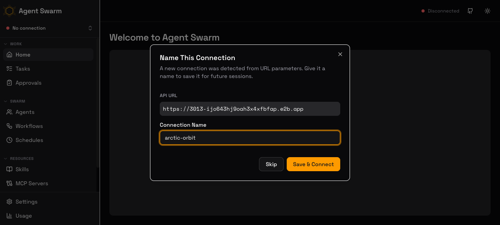
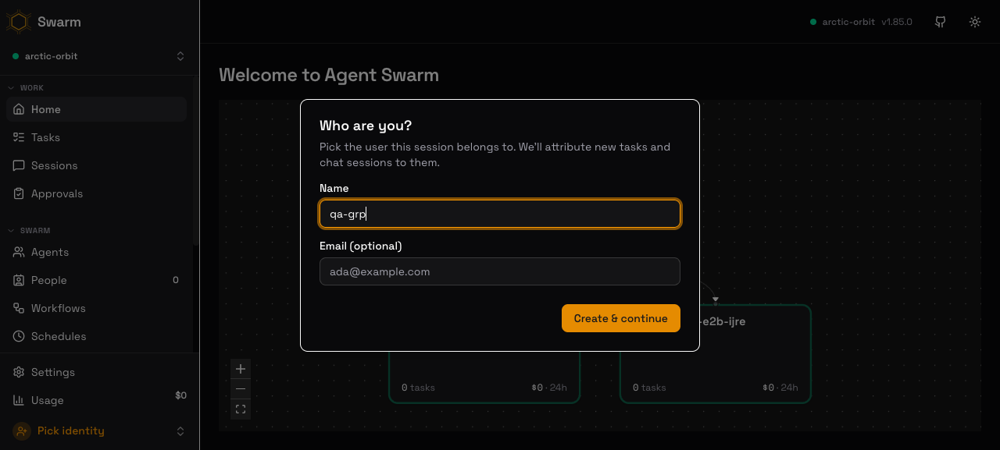
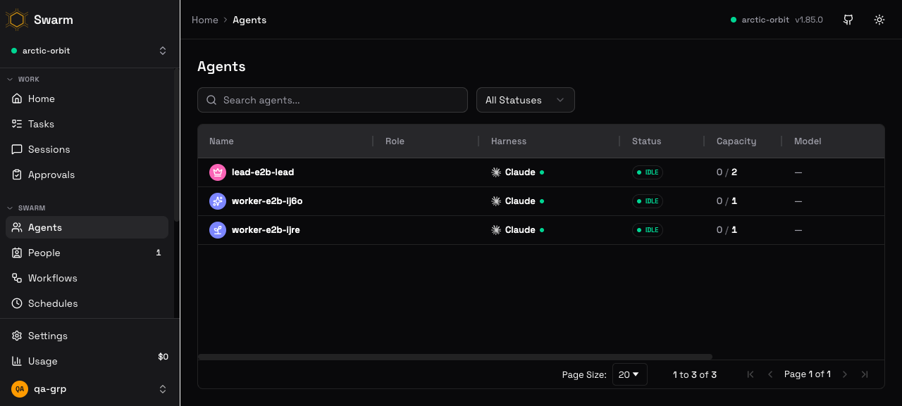
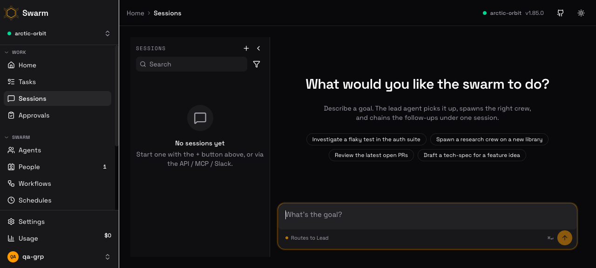

# E2B Swarms CLI v1 — QA Report

## Context

Functional validation of **v1 (Phases 1–5)** of the E2B dispatch CLI shipped in **PR #601** (`feat/e2b-swarms-cli`). v1 adds: sandbox lifecycle control (`extend`, `kill --all`, TTL visibility + stack re-sync), per-role env scoping, `start-stack` → API + lead + N workers + interactive wizard, swarm grouping (`swarms list|info|kill|add`), a `--reveal-key` dashboard deep-link, and native log capture (`swarms logs` + envd-tracked tee'd entrypoint).

This was **real-backend** QA against a live E2B account — it launched real, paid sandboxes. The branch was first brought up to date with `main` (clean merge, commit `8fe019ed`; the only conflict was a docs-only add/add in the plan doc, resolved to the completed branch version). CLI run as `bun run src/cli.tsx e2b <…>` from the worktree `/Users/taras/Documents/code/agent-swarm-e2b-cli` (CLI version reports **v1.87.0**).

Orchestration: a multi-agent **Workflow** ran the CLI scenarios (Setup barrier → parallel Inspect → sequential Mutate → Synthesize); the orchestrator then drove the dashboard browser screenshots (browser-use / `agent-browser`) on the live swarm and ran a guaranteed teardown.

## Scope

### In Scope
- Scenario 1 — `start-stack --yes --swarm qa-grp --workers 1 --timeout-sec 1800 --json`: topology, `/health`, registration.
- Scenario 2 — `extend`: endAt moves later + stack TTL re-sync.
- Scenario 3 — `swarms list` / `swarms info` / `--reveal-key`: URL, masked-key + source, roles, health, TTL, deep-link.
- Scenario 4 — dashboard deep-link auto-connect (browser screenshot).
- Scenario 5 — `swarms add`: grow the swarm by a worker.
- Scenario 6 — `swarms logs --role api/lead`, native `e2b sandbox logs <id>`, dashboard log view.
- Scenario 7 — `swarms kill` + `kill --all` → 0 remain.

### Out of Scope
- Phases 6–7 (v2): persona templates, pause/resume/auto-pause — not in this PR.
- Template builds (`build-template`) — pre-existing `agent-swarm-api` / `agent-swarm-worker` templates (status `ready`) were used.
- Whether agents *do work* (they were launched idle; lifecycle/grouping/logs were the target, not task execution).

## Environment / Fixtures

| Item | Value |
|---|---|
| Swarm slug | `qa-grp` |
| API sandbox | `ijo643hj9oah3x4xfbfap` → `https://3013-ijo643hj9oah3x4xfbfap.e2b.app` |
| Lead sandbox | `iadbgy5o9kho9gesiw5s9` → agent `e2b-lead-iadbgy5o9kho9gesiw5s9` (isLead=true) |
| Worker 1 (launch) | `ijre659oast22u7rcrqqh` → agent `e2b-ijre659oast22u7rcrqqh` |
| Worker 2 (added) | `ij6o05u88ezbn9pnesawd` → agent `e2b-ij6o05u88ezbn9pnesawd` |
| Swarm API key | `API_KEY` from `.env` (dev default `123123`); source reported as `API_KEY` |
| E2B account | `t@desplega.ai`, team **desplega labs**; native `e2b` CLI v2.10.2 |

Evidence root: `thoughts/taras/qa/2026-05-30-e2b-evidence/` (CLI outputs `0X-*.txt`, screenshots under `screens/`).

## Test Cases

### TC-1 (Scenario 1): `start-stack` → API + lead + 1 worker
**Steps:** `bun run src/cli.tsx e2b start-stack --yes --swarm qa-grp --workers 1 --timeout-sec 1800 --json`; then GET `${apiUrl}/health` and `${apiUrl}/api/agents` (Bearer).
**Expected:** API + lead + 1 worker sandboxes up; `/health` 200; exactly **2** registered agents (1 lead `isLead:true` + 1 worker) — the API sandbox runs the server and is **not** a registered agent.
**Actual:** 3 sandboxes launched (api/lead/worker). `/health` → **200** first try (unauthenticated). `/api/agents` → 200, total **2** (lead `e2b-lead-…` isLead=true idle + worker `e2b-…` isLead=false idle). API sandbox correctly not an agent.
**Status:** ✅ **PASS**
**Evidence:** `01-start-stack.json`, `01-api-agents.json`

### TC-2 (Scenario 2): `extend` moves endAt + re-syncs the stack
**Steps:** record expiries (`swarms info`); `e2b extend <api> <lead> <worker> --timeout-sec 2400`; re-record.
**Expected:** every sandbox's endAt moves later; all members re-synced to one wall-clock deadline.
**Actual:** before = all 3 "expires in 25m" (<30m, consistent with 1800s launch). After `extend … --timeout-sec 2400` = all 3 "expires in 39m", absolute deadlines `2026-05-30T10:20:15Z / .819Z / 10:20:16Z` (spread ~0.9s, well within tolerance). `movedLater=true`, `ttlResynced=true`; health stayed 200.
**Status:** ✅ **PASS**
**Evidence:** `02-info-before-extend.txt`, `02-extend.txt`, `02-info-after-extend.txt`

### TC-3 (Scenario 3): `swarms list` / `info` / `--reveal-key`
**Steps:** `swarms list`; `swarms info qa-grp`; `swarms info qa-grp --reveal-key`.
**Expected:** list groups by slug w/ role breakdown; info shows API URL, masked key + source, roles, per-sandbox TTL, health; reveal-key emits a camelCase deep-link embedding the real key + a secret warning; default mode hides the key.
**Actual:**
- `list`: `qa-grp 3 sandbox(es) — 1 api, 1 lead, 1 worker, expires in 28m`. ✅
- `info` (masked): api url matches; key `**** (from API_KEY)` (source = `API_KEY`); per-sandbox TTL rows; `health: up (200 OK)`; default dashboard line shows `apiKey=<hidden — pass --reveal-key>` (no leak). ✅
- `info --reveal-key`: camelCase params (`apiKey=`, `apiUrl=`, `name=qa-grp`); real key embedded `apiKey=123123`; verbatim warning `⚠ secret: the URL below embeds the swarm API key — do not share or paste it.` ✅
**Status:** ✅ **PASS** (see Finding F2 re: deep-link host)
**Evidence:** `03-swarms-list.txt`, `03-swarms-info.txt`, `03-swarms-info-reveal.txt`

### TC-4 (Scenario 4): dashboard deep-link auto-connect
**Steps:** open the deep-link on `https://app.agent-swarm.dev` (production host + the CLI's exact params), confirm it connects and shows the swarm's agents.
**Expected:** dashboard parses the params, connects to the E2B-hosted API, lists lead + workers.
**Actual:** the SPA detected the URL params, parsed the API URL exactly, and presented a **"Name This Connection"** modal (deep-link *stages* a connection — matches the plan's design). After **Save & Connect**, the header flipped to **connected (green) `arctic-orbit v1.85.0`**, the identity field was pre-filled `qa-grp` (from the `name` param), and the **Agents** table showed all **3** live agents — `lead-e2b-lead` (Claude, IDLE, 0/2), `worker-e2b-ij6o`, `worker-e2b-ijre` (Claude, IDLE, 0/1) — "1 to 3 of 3". Confirms cross-origin connectivity (production dashboard → `*.e2b.app` API) works.
**Status:** ✅ **PASS** (see Findings F3, F4 re: param→field mapping)
**Evidence:** `screens/04-dashboard-autoconnect.png` (staged modal), `screens/04b-dashboard-connected.png` (connected), `screens/06d-dashboard-agents.png` (agents table)

### TC-5 (Scenario 5): `swarms add` grows the swarm
**Steps:** record worker count; `swarms add qa-grp --workers 1`; verify count, registration, TTL sync.
**Expected:** worker count 1→2; new worker auto-registers; new worker TTL synced to the group deadline.
**Actual:** before = 1 worker (all "expires in 39m"). `swarms add qa-grp --workers 1` → "added 1 member(s)", new worker `ij6o05u88ezbn9pnesawd`. After = 4 sandboxes (1 api + 1 lead + 2 worker), `workerCountAfter=2` (grew). `/api/agents` → 3 agents (1 lead + 2 workers); new worker auto-registered. New worker re-synced from a transient "59m" raw TTL to "38m" — identical to the rest (group endAt). `grew && newWorkerRegistered && newWorkerTtlSynced` all true.
**Status:** ✅ **PASS**
**Evidence:** `05-info-before-add.txt`, `05-add.txt`, `05-info-after-add.txt`, `05-api-agents-after-add.txt`

### TC-6 (Scenario 6): native log capture — CLI + native + dashboard
**Steps:** `swarms logs qa-grp --role api --tail 200`; `--role lead`; native `e2b sandbox logs <api-id>`; dashboard log view.
**Expected:** CLI logs non-empty (API boot + lead harness boot); native E2B logs no longer empty (Phase 5); no secret leak in CLI output.
**Actual:**
- API CLI logs: non-empty (200 lines) — migrations 042..077, pricing seed, `MCP HTTP server running on http://localhost:3013/mcp`, `POST /api/agents → 201`, scheduler/heartbeat. CLI scrubbing active (20 `[REDACTED]` markers). ✅
- Lead CLI logs: non-empty (150 lines) — `=== Agent Swarm Lead v1.85.0 ===`, Harness Provider claude, PM2 init, `[lead] Polling for triggers (0/2 active)…`. CLI scrubbing active. ✅
- Native `e2b sandbox logs <api-id>`: non-empty (22 lines at INFO) — shows the tee'd entrypoint `… | tee /tmp/agent-swarm-e2b-api.log` + "Sandbox created". **Confirms Phase 5 native capture.** ✅ (see Finding F5 re: first-call race)
- Secret hygiene (CLI egress): **no leak** in the 3 captured files (grep for `sk-ant-`/`sk-proj-`/`sk-or-v1-`/`xoxb-`/`glpat-`/`cog_`/`e2b_`/`Bearer` → 0 matches). ✅
- Dashboard log view: the *E2B web* dashboard process/log view requires interactive e2b.dev login not available in the headless browser, so it was not screenshotted; the underlying capability (entrypoint output reaching E2B's native log stream) is directly confirmed by the non-empty native `e2b sandbox logs`. The agent-swarm dashboard has no session logs to show (agents idle, 0 tasks) — its Agents/Sessions surfaces were captured instead.
**Status:** ✅ **PASS** (CLI + native verified; E2B-web-dashboard screenshot deferred — see Verdict note + Finding F1 security advisory)
**Evidence:** `06-logs-api.txt`, `06-logs-lead.txt`, `06-native-sandbox-logs.txt`, `screens/06d-dashboard-agents.png`, `screens/06d-dashboard-sessions.png`

### TC-7 (Scenario 7): `swarms kill` + `kill --all` → 0 remain
**Steps:** `swarms kill qa-grp --yes`; `kill --all --yes`; verify via dispatcher list, swarms list, native list.
**Expected:** all sandboxes torn down (API last); 0 remain.
**Actual:** `swarms kill qa-grp --yes` killed in order **workers first → lead → API last** (`ij6o…`, `ijre…`, then `iadbgy…` lead, then `ijo643…` api) — confirms the "API last" ordering. `kill --all --yes` → "no agent-swarm sandboxes to kill". Verified 3 ways: dispatcher `e2b list` empty; `swarms list` "no swarms found"; native `e2b sandbox list` "No sandboxes found" (account-wide zero).
**Status:** ✅ **PASS**
**Evidence:** `07-swarms-kill.txt`, `07-kill-all.txt`, `07-list-after.txt`, `07-swarms-list-after.txt`, `07-native-sandbox-list-after.txt`

## Evidence

### Screenshots
-  — SPA parsed `apiUrl`, prompted to name the connection.
-  — `lead-e2b-lead` + 2 workers IDLE; identity `qa-grp`.
-  — 1 lead + 2 workers, Claude harness, "1 to 3 of 3".
-  — dashboard session/log surface (empty; agents idle).

### Logs & Output (teardown — the key safety evidence)
```
$ e2b swarms kill qa-grp --yes
killed ij6o05u88ezbn9pnesawd (worker)
killed ijre659oast22u7rcrqqh (worker)
killed iadbgy5o9kho9gesiw5s9 (lead)
killed ijo643hj9oah3x4xfbfap (api)       # API killed last ✓
$ e2b kill --all --yes
no agent-swarm sandboxes to kill
$ e2b swarms list           → no swarms found
$ e2b list                  → (empty)
$ e2b sandbox list (native) → No sandboxes found     # account-wide ZERO ✓
```

### External Links
- PR: https://github.com/desplega-ai/agent-swarm/pull/601 (`feat/e2b-swarms-cli`)
- Plan: `thoughts/taras/plans/2026-05-29-e2b-swarms-cli.md`
- Runbook: `runbooks/e2b-dispatch.md`

## Issues Found

- [ ] **F1 — E2B native DEBUG log stream leaks all spawn env secrets in plaintext — severity: MAJOR (security); NOT a PR #601 / swarm-CLI defect.** `e2b sandbox logs <id> --level DEBUG` (E2B's own surface, outside the CLI's `scrubSecrets` egress path) prints the full process-start env block in plaintext: `ANTHROPIC_API_KEY`, `CLAUDE_CODE_OAUTH_TOKEN`, `OPENAI_API_KEY`, `OPENROUTER_API_KEY`, `GITLAB_TOKEN`, `SLACK_BOT_TOKEN`, `DEVIN_API_KEY`, `SECRETS_ENCRYPTION_KEY`, `BUSINESS_USE_API_KEY`, and `API_KEY/AGENT_SWARM_API_KEY`. Emitted server-side by E2B's orchestration layer (logger `envd`/`process`), so the swarm CLI **cannot** scrub it. Root cause is the dispatch design's choice to pass runtime secrets via sandbox-creation `envVars` (documented in the runbook), which predates this PR. The in-scope default-INFO `swarms logs` does **not** surface it (CLI egress is clean). **Recommended follow-up (separate ticket):** evaluate not passing real provider keys via `envVars` (e.g. fetch-at-runtime, or E2B's secret mechanism if/when available), and document the DEBUG-log exposure in the runbook. **Not a ship-blocker for #601.**
- [ ] **F2 — `--reveal-key` deep-link host is `http://localhost:5175`, not `https://app.agent-swarm.dev` — severity: MINOR; intentional env config, not a bug.** `getAppUrl()` (`src/utils/constants.ts`) reads `APP_URL` and this repo's `.env` sets `APP_URL=http://localhost:5175`. The deep-link **param contract** (camelCase `apiUrl`/`apiKey`/`name`, real key, warning) is fully correct; only the host reflects the local override. With `APP_URL` unset it falls back to `https://app.agent-swarm.dev`. (QA confirmed the production host works by substituting it while keeping the CLI's exact params — TC-4 PASS.)
- [ ] **F3 — `name=<slug>` deep-link param pre-fills the dashboard *identity* name, not the *connection* name — severity: MINOR (observation).** The "Name This Connection" field auto-generated `arctic-orbit`, while `name=qa-grp` populated the later "Who are you?" identity field. The param is consumed (not ignored), but the mapping may be surprising; worth confirming it's the intended target.
- [ ] **F4 — deep-link auto-connect is stage-then-confirm, not instant — severity: INFO (by design).** The link opens a "Name This Connection" modal requiring **Save & Connect** before the API connection is live. Matches the plan ("deep-link stages a connection"); flagged only so the "auto-connect" wording isn't read as zero-click.
- [ ] **F5 — native `e2b sandbox logs` first call can return header-only (2 lines) due to a stream-flush race — severity: MINOR.** An immediate re-run returned the full 22 lines. The deterministic tee'd file (`/tmp/agent-swarm-e2b-<role>.log`) is the source of truth, so this is a transient native-stream timing quirk, not data loss; consider a brief retry/settle in `swarms logs` if it proves annoying.

## Verdict

**Status: ✅ PASS — GO / SHIP PR #601.**

**Summary:** All seven QA scenarios passed against a live E2B swarm. Lifecycle is correct end-to-end: `start-stack` launched API + lead + 1 worker with exactly 2 registered agents and `/health` 200; `extend` moved all TTLs later and re-synced them to one deadline; `swarms list/info/reveal-key` reported URL, masked key + source, roles, TTL, health, and a correct camelCase deep-link with the required secret warning (default mode masked); the production dashboard auto-connected via the deep-link and rendered all live agents; `swarms add` grew the swarm 1→2 with the new worker auto-registered and TTL-synced; CLI + native logs were non-empty with the CLI's own egress fully scrubbed; and teardown removed every sandbox (API last), triple-verified to **zero** remaining. The only items are non-blocking: one **security advisory (F1)** about E2B's own DEBUG log stream exposing spawn-env secrets — an E2B-platform behavior tied to the pre-existing secrets-via-`envVars` design, worth a separate follow-up — plus minor/env-config notes (F2–F5). v1 (Phases 1–5) is functionally sound and shippable.

**Teardown confirmation:** all 4 sandboxes (`ijo643hj9oah3x4xfbfap`, `iadbgy5o9kho9gesiw5s9`, `ijre659oast22u7rcrqqh`, `ij6o05u88ezbn9pnesawd`) killed; `e2b sandbox list` (account-wide), `e2b list`, and `e2b swarms list` all confirm **0 remaining**. No further cost accruing.

## Appendix
- **Plan**: `thoughts/taras/plans/2026-05-29-e2b-swarms-cli.md` (status: completed-v1)
- **Runbook**: `runbooks/e2b-dispatch.md`
- **Branch**: `feat/e2b-swarms-cli` @ `8fe019ed` (merged latest `main`, clean)
- **Evidence**: `thoughts/taras/qa/2026-05-30-e2b-evidence/` (CLI `0X-*.txt`) + `…/screens/` (PNGs)
- **Notes**: Templates `agent-swarm-api` / `agent-swarm-worker` were pre-built (`ready`). Workflow run ID `wf_54245704-9ff`. A leftover saved dashboard connection ("arctic-orbit" → now-dead E2B URL) + a `qa-grp` identity persist in the app-dashboard local storage; harmless, can be deleted in Settings.
