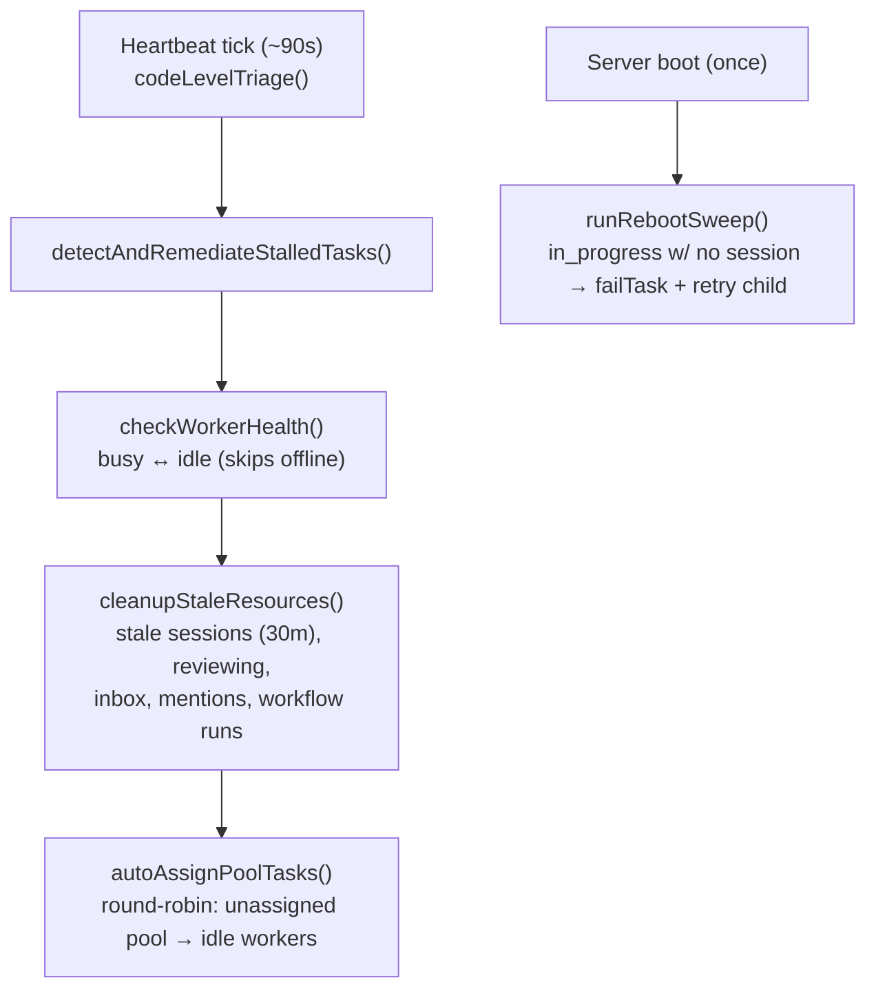
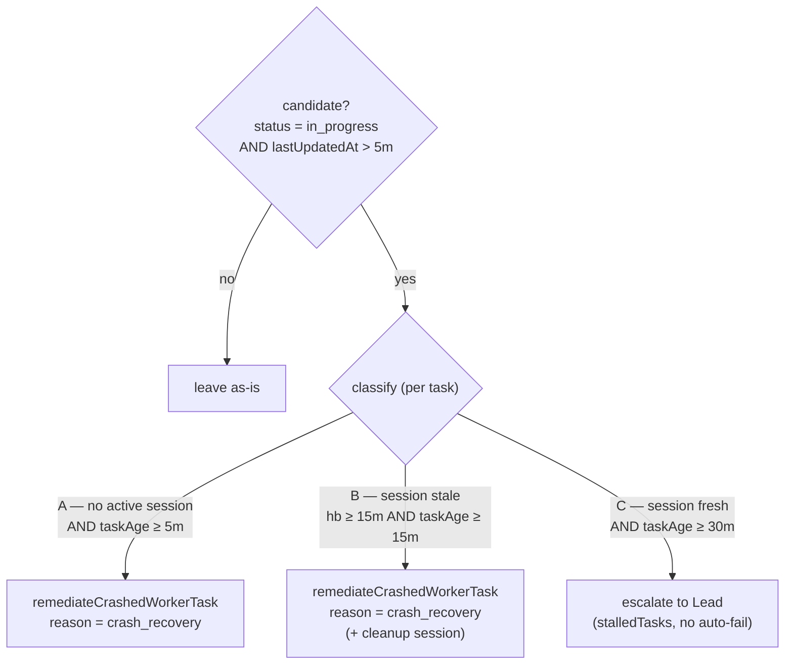
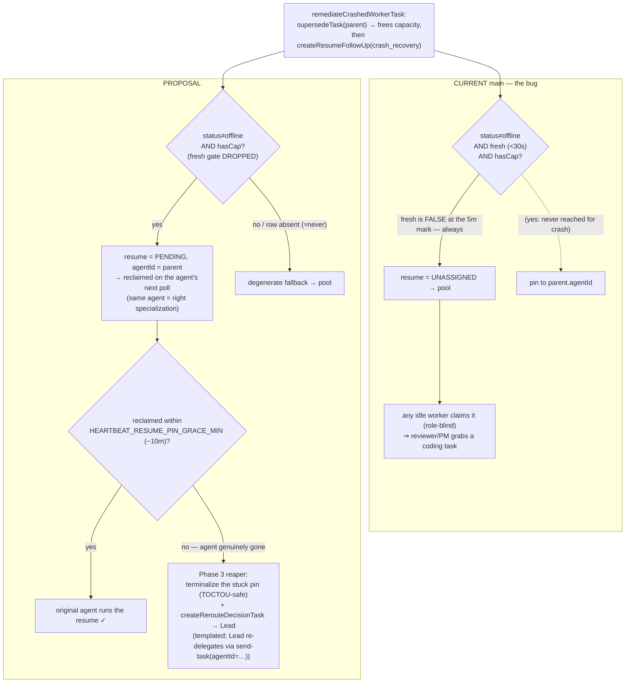

# Heartbeat Flow & Crash-Recovery Heuristic — main vs proposal

Companion to the plan `2026-06-18-heartbeat-crash-recovery-same-agent.md`. The heartbeat **sweep pipeline** and **stalled-task classifier** are *unchanged* by the proposal — only the **crash-recovery routing decision** (and a new reaper) change.

---

## 1. The heartbeat sweep (every ~90s) — unchanged



- `detectAndRemediateStalledTasks` is step 1; `autoAssignPoolTasks` (the role-blind round-robin that lets *any* idle worker get a pooled task) is the last step. **The proposal does not touch either of these** — it only changes what a crash *produces* (a pinned resume vs an unassigned pool task), so a crash resume never reaches `autoAssignPoolTasks` in the first place.
- `checkWorkerHealth` only flips `busy↔idle` and never sets `offline`. The **lead stays `idle`** because the busy-flip lives in the worker-only `poll-task` tool and the lead is excluded from assignment (`isLead=0` filters). Only graceful `POST /close` ever writes `offline`.

## 2. The stalled-task classifier (inside `detectAndRemediateStalledTasks`) — unchanged



- An **active_session** = one worker-*run* process for a task (created lazily after the provider spawns, heartbeated by **tool activity** ~every 5s — no wall-clock ping). "No active session" is therefore AND-gated with `lastUpdatedAt > 5m`; it means *"no live run **and** no task progress in 5 min"* — reasonable, but can false-positive on a long-but-quiet live worker (bounded by `MAX_RESUME_GENERATIONS`).
- Cases **A and B** both funnel into `remediateCrashedWorkerTask → createResumeFollowUp(reason=crash_recovery)` — which is the only thing the proposal changes.

## 3. Crash-recovery routing decision — **main vs proposal** (the actual change)



**One-line difference:** main routes a crash resume to the **role-blind pool** because the 30s freshness gate can never pass at the 5-minute detection mark; the proposal **drops only that freshness gate**, pinning the resume back to its own (stable-ID) agent, and a new reaper hands the Lead a *decision* only if the agent never comes back.

---

## 4. Pseudocode

### Current `main`

```text
# detector (unchanged) → on Case A / B:
supersedeTask(parent)                      # frees the agent's in_progress slot
resume = createResumeFollowUp(parent, reason = crash_recovery):
    preferredAgentId = undefined
    if parent.agentId and reason != graceful_shutdown:
        cand = getAgentById(parent.agentId)
        if cand and cand.status != "offline"
           and now - cand.lastActivityAt < 30s          # ← FRESH gate
           and activeCount(cand) < cand.maxTasks:
            preferredAgentId = cand.id
    createTaskExtended(resume, agentId = preferredAgentId)
    #   agentId set  → status = pending  (pinned to agent)
    #   agentId none → status = unassigned (POOL)
    # For crash_recovery, lastActivityAt is ~5m stale → fresh = false
    #   → preferredAgentId stays undefined → ALWAYS pool.

# later, autoAssignPoolTasks / worker poll:
#   any idle worker claims the unassigned resume (claimTask guards only status='unassigned')
#   → role-blind: a reviewer / PM / researcher can grab a coding resume.   ← Daniel's bug
```

### Proposal

```text
# detector UNCHANGED → on Case A / B:
supersedeTask(parent)                      # ordering invariant: MUST precede the capacity check
resume = createResumeFollowUp(parent, reason = crash_recovery):
    preferredAgentId = undefined
    if parent.agentId:
        cand = getAgentById(parent.agentId)
        if cand and cand.status != "offline"             # keep offline guard
           and activeCount(cand) < cand.maxTasks:         # passes: supersede freed the slot
            preferredAgentId = cand.id                     # ← DROP the 30s fresh gate
    createTaskExtended(resume, agentId = preferredAgentId)
    #   pinned → status = pending on the SAME agent; reclaimed on its next poll
    #   agentId none only if the row is absent (≈never; rows persist) → pool

# NEW Phase-3 reaper, inside cleanupStaleResources (every sweep):
for r in resumes where taskType = 'resume'
         and status = 'pending'
         and createdAt < now - HEARTBEAT_RESUME_PIN_GRACE_MIN     # ~10m grace
         and assigned-agent still absent:
    # TOCTOU-safe: only escalate if we win the race to terminalize the pin
    if UPDATE r SET status='failed' WHERE id=r.id AND status='pending' affected 1 row:
        createRerouteDecisionTask(parent → Lead)   # templated, idempotent
        # template INFORMS which agent crashed + its identity; Lead decides who,
        # and MUST pass an explicit agentId (send-task default would target the dead worker)
```

### Heuristic, in one breath

| | main | proposal |
|---|---|---|
| crash resume default | **unassigned pool** (role-blind) | **pending on the same agent** |
| gate that decides | `status≠offline ∧ fresh<30s ∧ hasCap` | `status≠offline ∧ hasCap` (drop `fresh`) |
| agent gone? | pool grabs it (wrong specialization) | reaper → templated Lead decision after ~10m |
| recovery latency | seconds (to *wrong* agent) | seconds (same agent restart) / ~10m (Lead, if gone) |
| heartbeat sweep / pool / self-claim | — | **unchanged** |

---

*Refs (verify line numbers against `main`, not the PR branch): `src/heartbeat/heartbeat.ts` (sweep, classifier, `remediateCrashedWorkerTask`, `cleanupStaleResources`), `src/tasks/worker-follow-up.ts` (`createResumeFollowUp` liveness block), `src/be/db.ts` (`createTaskExtended` status derivation, `getStalledInProgressTasks`, `getPendingTaskForAgent`), `src/http/poll.ts` (claim), `src/http/core.ts:427` (the only `offline` writer).*
