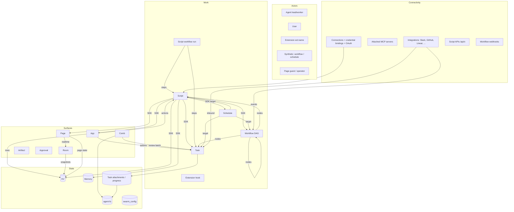

# Research: Ontology of the swarm building blocks

**Date**: 2026-10-10 14:31 CEST
**Researcher**: Claude (Opus 5.5)
**Git Commit**: `1d5897af9`
**Branch**: main

## Research Question

Do a deep thinking session on the ontology of the system: the "building blocks" the swarm offers to build on top of it (pages, KV, scripts / code-mode, agent-fs, and so on). Understand how they fit together, so that we can see what is missing, what is not, and what could change.

Taras asked for gaps and change candidates explicitly. Sections 1 to 6 document what exists. Section 7 is interpretation and is marked as such.

## Summary

The swarm has about 25 user-facing building blocks. They sort into six layers: **actors** (who acts), **work** (what runs), **state** (what persists), **surfaces** (what humans see), **connectivity** (how the outside world plugs in) and **packaging** (what shapes an agent). Three cross-cutting axes tie them together: the **context key** (which conversation a thing belongs to), the **asset key** (which folder it belongs to) and the **owner scope** (who owns it). Each primitive adopts a different subset of these three axes.

The main structural facts are these:

- **KV is the hidden substrate.** App rows, room snapshots, page state, MCP overflow, Comb claims, extension state and script idempotency outputs all live in `kv_entries`. KV itself has no events, no versioning and no compare-and-swap.
- **The script SDK is the composition bus.** Scripts, script workflows and extensions all call one `SDK_TOOL_NAME_MAP` allowlist through the in-process MCP registry. Anything not in that map cannot be composed from code. agent-fs, asset keys, raw LLM and app actions are not in it.
- **The event bus is the weakest link.** It carries task, approval, VCS, Slack, AgentMail, Kapso and room events. But a workflow can start only on `slack.message`, and no state primitive (KV, memory, pages, app rows, agent-fs) emits an event. Reactive composition ("when X changes, run Y") is mostly impossible without polling.
- **There are four durable-execution shapes** with four different wait, retry and human-in-the-loop models: tasks (`defer-task` + `wakeOn`), workflows (DAG, `wait_states`), script workflows (journal) and schedules (error backoff).
- **There are three human surfaces on a spectrum**: Page (free HTML snapshot, public share), App (typed live records, dashboard-only), Artifact (arbitrary server, tunnel, being de-emphasized). Rooms (realtime) are wired only into Pages.
- **Compared with Palantir (section 8)**, the swarm has two ontologies that do not meet: hard-coded system entities with MCP tools as verbs, and user-defined app models sealed inside one app. It is strong on the kinetic side (agents, scripts, workflows) and weak on the semantic side (no swarm-wide typed records, no typed links, no object-change automations).
- **Run-as identity is not modelled.** Compute that is not an agent session runs as the creator, the owner, the caller, a lead-equivalent `ext:<name>`, or the string placeholders `"workflow"` / `"schedule"`.

## 1. The map

## 2. The six layers

### 2.1 Actors (who acts)

| Actor | Identity mechanism | Notes |
|---|---|---|
| Agent (lead / worker) | API key + `X-Agent-ID`, or `aseph_` session token | One lead only (`src/tools/join-swarm.ts:100`). 11 harness providers (`src/types.ts:414`). |
| User | `aswt_` user token, dashboard session | First-class since 2026-05. Has its own MCP server with 5 tools (`src/server-user.ts`). |
| Operator | Shared swarm API key, no agent id | Principal kind in `src/utils/request-auth-context.ts:6`. |
| Extension | `ext:<name>` system agent + `X-Extension-Token` | Lead-equivalent via `src/rbac/elevated-agents.ts`. Bypasses tool hooks. |
| Synthetic callers | Strings `"workflow"`, `"schedule"` | Used as script run-as when no owner exists. The connection proxy treats them as global-only. |
| Page guest | Signed `page_session` cookie | Password pages: guest limited to KV + own page record (`src/http/page-proxy.ts:160`). |

### 2.2 Work (what runs)

| Primitive | What it is | Max duration | Durability | Typed I/O |
|---|---|---|---|---|
| Task | One harness session doing judgment work | Unbounded | Heartbeat resume generations, reboot sweep | Optional `outputSchema` checked by `store-progress` |
| Script | `export default async (args, ctx)` in a ulimit sandbox | 30 s default, 300 s max | None (inline). `idempotencyKey` stores output in KV, does not dedupe | `signatureJson` args schema. Result is `unknown` |
| Script workflow run | Script with journaled `ctx.step.*` | 24 h, 1000 steps, 50 agent tasks | Journal replay, supervisor respawn every 15 s | Step configs are TS types |
| Workflow | DAG of 14 node types | Unbounded | Per-node retry policy, recovery, wait poller, sealed replay | `inputSchema` / `outputSchema` / `triggerSchema` (JSON Schema subset) |
| Schedule | Cron, interval, or one-shot clock trigger | n/a | Occurrence claim, one missed-run catch-up, error backoff | n/a |
| Extension hook | Trusted in-process TS on pre / post events | 5 s | Fail-open, auto-disable after 5 failures | Event contract in `src/extensions/contract.ts` |

`raw-llm` is a workflow node and a script-workflow step only (`src/workflows/executors/raw-llm.ts`). It is not in the SDK allowlist, so plain scripts and extensions cannot call it.

**Invocation matrix** (row calls column):

| Caller \ Callee | Task | Script | Script-workflow | Workflow | Schedule |
|---|---|---|---|---|---|
| Task (agent) | `send-task`, `defer-task` | `script-run` | `launch-script-run` | `trigger-workflow` | `create-schedule` |
| Script / extension | `task_send` | `script_run` | `script_launchRun` | `workflow_trigger` | `schedule_*` |
| Script workflow | `ctx.step.agentTask` | `ctx.step.swarmScript` | via SDK | via SDK | via SDK |
| Workflow | `agent-task` node | `swarm-script` node | none | `sub-workflow` node | none |
| Schedule | default target | `targetType: script` | none | `targetType: workflow` | n/a |
| Page (browser SDK) | `tasks.create` | none | none | raw `/api/*` proxy only | `schedules.*` |
| App action | `task` action | `script` action | none | none | none |
| Integration | Slack, GitHub, GitLab, ADO, AgentMail, Kapso, Linear, Jira, Comb | `POST /api/x/script/{id}` | none | webhook, `slack.message` event | none |

### 2.3 State (what persists)

| Primitive | Keyed by | Scope model | Versioned | TTL | Events | Script SDK | Browser SDK |
|---|---|---|---|---|---|---|---|
| KV | `(namespace, key)` | Namespace = context key, `task:agent:<id>`, `task:page:<id>`, or reserved (`apps:*`, `comb:*`, `_room/*`) | No | Per row, lazy | None | Yes | Yes (page-pinned) |
| Memory | `(scope, agentId, key, chunk)` | `agent` or `swarm` + `/longterm` key paths | Yes (`agent_memory_version`) | By source | None | Yes | Read + rate |
| agent-fs | org / drive / path | One shared org + drive. Task-owned uploads at `tasks/<id>/` | Yes (agent-fs native) | No | None | **No** | **No** |
| swarm_config | `(scope, scopeId, key)` | global / agent / repo layered | No | No | Reload only | Yes | No |
| Task attachments | task id | Task | No | Task cascade | None | Via `store-progress` | No |
| Profile files | agent + field | Agent | Yes (`context_versions`) | Keep-latest-N | None | History / diff only | No |
| App rows | KV `apps:<appId>` | App | Definition only | No | None | `app_query` | Via SPA |
| Room | KV `_room/<name>` | Page namespace or explicit | `schemaVersion` + generation | No | `room.changed` | `room_*` | Yes |
| Metrics | `(agentId, slug)` | Agent | Yes | No | None | `metric_create` | No |

Delineation rules the skills already state (from `templates/skills/kv-storage/content.md`): "find it without knowing the key" is memory, "know the exact key" is KV, secrets are `swarm_config`, files are agent-fs.

### 2.4 Surfaces (what humans see)

| | Page | App | Artifact | Comb | Approval |
|---|---|---|---|---|---|
| Purpose (own words) | "Snapshot" | "View and change live records" | "Running program" | Review agent-fs files | Ask a human a question |
| Authored as | HTML / JSON / SVG body | Validated definition (models, queries, actions, json-render pages) | Hono app or dir via CLI | Humans comment | Tool / workflow node / SDK |
| State | Page KV + rooms | KV rows | Process disk | agent-fs comments | Row |
| Server logic | Only through `/api/*` proxy | script / task / sync actions | Arbitrary | Review batch makes a task | Resolution makes a follow-up task |
| Realtime | Rooms, channels, cursors | None (5 s polling) | Broken (no `/@swarm/realtime.js` route) | Presence rooms | No |
| Sharing | public / authed / password | Dashboard only | Basic auth with swarm API key | Dashboard | Dashboard |
| Versioning | `page_versions` | `app_versions` + diff + rollback + migrations | None | agent-fs | n/a |
| Asset key | Yes | Yes | No | Via agent-fs mappings | No |

Notes:
- The page proxy forwards any `/api/*` path for user and operator sessions. This is deliberate (`src/http/page-proxy.ts:127,189`).
- Pages run as the viewer. Artifacts run as the authoring agent with the full swarm key.
- App "pages" (json-render trees in an app definition) are not the Pages primitive.

### 2.5 Connectivity (how the outside plugs in)

- **Connections** (`script_connections`: raw / openapi / graphql / mcp) plus **credential bindings** plus **OAuth apps / authorizations**. Only scripts consume them (`ctx.api`, `ctx.mcp`, patched `fetch`). Lead-only management.
- **Attached MCP servers** (`mcp_servers`, global / swarm / agent). Only harness sessions consume them.
- **Integrations** turn inbound events into tasks with a context key (`src/tasks/context-key.ts`). Some also emit bus events. Kapso uses `source: "system"` and has no context-key family. X has no inbound path.
- **Script APIs** (`/api/x/script/{id}`) expose a script as a public or bearer HTTP endpoint.
- **Workflow webhooks** (`/api/webhooks/{workflowId}`) start workflows.

Two consumer worlds exist: harness sessions use MCP servers. Scripts use connections. The same external system (for example Linear) can need both.

### 2.6 Packaging (what shapes an agent)

| Primitive | Scope vocabulary | Self-modifiable by agent | Delivery |
|---|---|---|---|
| Profile files (SOUL, IDENTITY, TOOLS, CLAUDE.md, HEARTBEAT, setup) | agent | Yes, freely | System prompt + `/workspace` files |
| Skills | global / swarm / agent | Personal yes; swarm needs lead or approval | Signature poll + FS writer |
| Prompt templates | global / agent / repo | Lead / operator; capability off by default | Rendered over HTTP |
| Agent templates | remote registry | No | `TEMPLATE_ID` fetch at boot |
| Extensions | global | Lead (activation flag) | In-process, 30 s DB poll |
| Capabilities | deployment env | No | MCP tool list |

## 3. The three cross-cutting axes

| Axis | Meaning | Primitives that carry it |
|---|---|---|
| **Context key** (`task:slack:...`, `task:trackers:...`, `task:page:<id>`) | Which conversation or thread this came from | Tasks, KV namespace, memory (`contextKey` column, stored only), rooms (page namespace) |
| **Asset key** (`shared/...`, `personal/<user>/...`) | Which folder it is filed under | Tasks, workflows, schedules, pages, apps, scripts, mapped agent-fs files |
| **Owner scope** | Who owns it | Several incompatible vocabularies: global/agent/repo (config, prompt templates, connections), global/swarm/agent (skills, MCP servers), agent/swarm (memory), global/agent (scripts, budgets), per-user (`inbox_item_state` only) |

No primitive carries all three. KV is the only real consumer of the context key. KV, memory, config and agent-fs (outside task mappings) have no asset key.

## 4. Event bus coverage

Emitted today (from a grep of `emit("...")`): `task.created|completed|failed|cancelled|progress|superseded|budget_refused`, `approval.resolved`, `github.*`, `gitlab.*`, `agentmail.message.received`, `kapso.message.received`, `slack.message`, `workflow.child.finished`, `room.changed`.

| Consumer | What it can listen to |
|---|---|
| Workflow start trigger | `slack.message` only (`src/types.ts:2274`) |
| Workflow `wait` node | Any bus event |
| Extension post hooks | task.*, slack, email, kapso, vcs, approval, tool calls |
| `defer-task` `wakeOn` | task completed / failed / settled |

Not emitted by anything: KV writes, memory writes, page create / update, app row changes, agent-fs file or comment changes, script run completion, schedule firing, workflow run completion (outside sub-workflow).

## 5. Naming collisions and drift (factual)

- **"capabilities"** means MCP tool groups (`CAPABILITIES` env), free routing tags (`agents.capabilities`), and worker tags in the same env var (`src/server.ts:263`).
- **"channels"** means internal chat channels (`channels` table) and realtime pub/sub channels.
- **"inbox"** means `inbox_messages` (per-agent Slack intake) and `inbox_item_state` (per-user UI inbox).
- **"apps"** means Swarm Apps, `oauth_apps`, and app pages vs Pages.
- **"artifacts"** means the agent-fs + tunnel skill and "Published Artifacts" (release images).
- **"template"** means `task_templates`, the `agent-task` node `config.template`, and the `templates/` catalog.
- **Dead route.** The dashboard chat (`/chat`, `apps/ui/src/api/client.ts:904`) calls `/api/channels`. No handler exists in `src/http/` and `openapi.json` has no match. Verified at `1d5897af9`.
- **Doc drift.** `architecture/overview.mdx` says 8 workflow executor types. `concepts/workflows.mdx` says 13. The registry has 14. `guides/scripts-only-mode.mdx` calls code-mode a viable default. The 2026-07-13 Round 2 experiment says it loses on every axis. `src/oauth/README.md` documents the pre-migration-117 table shape.
- **No concepts page** exists in docs for KV, pages, rooms, memory paths or asset keys. The only taxonomy is the capability list in `MCP.md`, and the only decision tree is the prompt-v2 branch rule (`thoughts/taras/plans/2026-08-20-system-prompt-v2-design.md` L104-112).

## 6. Timeline (first add)

Tasks 2025-12 → scheduler 2026-01 → memory 02-20 → workflows 03-06 → prompt templates, skills, HITL, MCP servers 03-20..26 → context key 04-23 → KV + pages 05-13 → scripts 05-19 → script workflows 06-04 → agent-fs first-class 07-02 → script APIs + schedule targets 07-01 → RBAC 07-07 → connections 07-09 → asset keys 07-11 → apps 08-05 → rooms 09-09 → extensions 09-16 → Comb 10-02 → sub-workflow node 10-10. A "computer" primitive brainstorm opened 2026-10-10 (`thoughts/taras/brainstorms/2026-10-10-computer-primitive.md`).

The primitives arrived roughly one per two weeks, each with its own scope vocabulary, versioning choice and SDK exposure. Most of the asymmetries in this doc are artifacts of that order, not deliberate choices.

## 7. Analysis: what is missing, what is not, what could change

This section is interpretation. Taras asked for it.

### 7.1 What is missing

1. **A general trigger.** The bus already carries many events, but only `slack.message` can start a workflow, and state changes emit nothing. A single rule "event pattern + filter → task / script / workflow" would close most holes in the invocation matrix. Candidate events: `app.row.changed`, `fs.comment.created`, `page.updated`, `kv.changed` (opt-in per namespace), `script_run.finished`, `workflow_run.finished`, `schedule.fired`. Extensions partly fill this role today, but they are trusted in-process code with a 5 s budget. They are not a user-level trigger.
2. **A service identity for non-session compute.** Scripts, workflows, schedules, app actions, extensions and artifacts each pick a different run-as rule. The string principals `"workflow"` / `"schedule"` and the lead-equivalent `ext:<name>` are the symptoms. A "run-as principal" on every compute definition (owner agent, a named service principal, or the triggering user) with RBAC verbs would make the composition matrix safe to widen.
3. **Files inside compute.** agent-fs is the human-facing durable store, and the prompt rule says "agent-fs for files humans review". Yet scripts and the browser SDK cannot read or write it, and scripts have no FS at all (`workspace-rw` returns 501). An `fs_read` / `fs_write` / `fs_list` SDK slice over the existing `FileStorageProvider` would let scripts produce the artifacts that pages and Comb already consume.
4. **SDK parity for the composition bus.** Missing from `SDK_TOOL_NAME_MAP`: raw LLM (only reachable from workflow nodes and journaled steps), app actions, asset-key moves, agent-fs. Because extensions and script workflows reuse this map, each missing verb is missing in three places at once.
5. **Typed records outside Apps.** App rows are the only typed, queryable store. They live in KV under a reserved namespace with a stated ceiling near 50k rows. Pages, scripts and workflows that want a small table must either build an app or hand-roll KV keys. A "collection" primitive (schema + rows + named queries) that Apps consume would separate the data layer from the UI layer.
6. **One scope story.** Context key, asset key and owner scope are each sound. The gap is that each primitive took a different subset. The most valuable single change is likely letting KV and memory carry an asset key, and adding `repo` / `swarm` consistently to the owner vocabularies.
7. **An ontology page.** Users and agents learn the primitives from 10+ skills with "use X, NOT Y" rules. A docs concept page that states the six layers, the three axes and the decision rules would remove most mis-routing.

### 7.2 What is not missing (leave alone)

- **The KV / memory / config / agent-fs split is sound.** The decision rules are sharp and consistent across skills. Do not merge them.
- **Pages as cheap snapshots** are worth keeping separate from Apps. They are the fastest path from agent output to a shareable link, with public and password sharing that Apps lack.
- **Tasks as the judgment unit** and scripts as the deterministic unit are a clean split. The "schedule an agent-task that says run script X is wrong" rule in the scheduling skill encodes it well.
- **Capabilities as surface-only gating** (not kill switches) is a coherent choice.

### 7.3 What could change

1. **Collapse durable execution to one engine with two authoring styles.** Workflows (DAG JSON) and script workflows (code with `ctx.step`) solve the same problem with different tables, wait models, retry models and HITL support (HITL is stubbed in script workflows). One run / step / journal store, with DAG and code as two front ends, would remove the matrix holes (workflow cannot launch a script workflow, schedule cannot target one) and give both the same waits, events and HITL.
2. **Make Pages and Apps two ends of one surface.** Apps could gain the Page share modes and rooms. Pages could gain declared data bindings. Artifacts are already `systemDefault: false` in the prompt-v2 design. They could be retired once Apps cover "custom server logic" through script actions, which also removes the "Basic auth with the swarm API key" sharing model.
3. **Promote rooms from a pages feature to a general primitive.** The 2026-08-04 brainstorm already calls rooms a platform primitive. Today only pages and Comb presence use them. Apps poll every 5 s.
4. **Unify connections and attached MCP servers.** Harness sessions get MCP servers. Scripts get connections (which can also wrap an MCP server). One "connection" record with two consumers (session and script) would stop operators configuring Linear twice.
5. **Untangle overloaded names.** Rename one side of each collision in section 5. `capabilities` is the one that costs the most, because it mixes tool gating and routing.
6. **Delete or restore internal chat.** The UI route calls a server route that does not exist, and the `messaging` capability is deprecated. Pick one.

### 7.4 Where the "computer" brainstorm fits

The open brainstorm proposes a human-owned machine with presence, consent and operations. In this ontology it is a new **actor-resource** hybrid. It would need: an identity (actor layer), a connection (connectivity layer), events (bus), and probably rooms for presence. It would hit gaps 1, 2 and 4 above directly. Fixing the trigger and run-as gaps first would make it cheaper to build.

## 8. Comparison: the Palantir Ontology

Added after review (Taras asked how Palantir does it). Sources are Palantir Foundry docs and blog. **Caveat:** the web agent could not fetch full pages. Every Palantir claim below comes from search-result summaries of the cited pages, so treat exact wording as unverified. Source URLs are listed at the end of this section.

### 8.1 What Palantir's Ontology is

Palantir calls the Ontology "an operational layer for the organization" and a "digital twin of the organization". It sits on top of datasets and models and maps them to real-world things. Its own framing is **nouns and verbs**: data elements are the nouns (semantic layer), actions and logic are the verbs (kinetic layer). Human or AI reasoning "brings the nouns and verbs together into complete sentences". The stated goal is to model **decisions** (data + logic + action), not only data, and to write executed decisions back so that they compound.

| Concept | Meaning |
|---|---|
| Object type / object / object set | Schema of a real-world entity, one instance, a collection (static list of keys or a saved filter, with set operations) |
| Property, shared property, value type | A column; a column definition reused across types; a semantic type with constraints (for example an email regex) |
| Derived / time-series / media properties | Computed at read time from links or aggregates; series IDs; pointers into media sets |
| Link type | Typed, bidirectional relationship between object types. Backed by a foreign key or a join table. Can carry metadata. |
| Interface | The "shape" of an object type (properties, link and action constraints). Gives polymorphism. Types implement many interfaces. |
| Action type | A transactional set of edits (create / modify / delete objects and links) with typed parameters. Can be backed by a function. |
| Submission criteria | Declarative conditions on the user, the parameters and the context. If they fail, nothing runs. |
| Side effects | Pre-commit "writeback webhook" (failure aborts the edits) and post-commit webhooks and notifications |
| Action log | Optional `[LOG]` object type per action type, one object per submission, linked to every edited object |
| Function | Read or compute logic (TS / Python). Edit functions only *return* edits. Edits apply only through an action or an automation. |
| OSDK | Typed SDK generated per ontology (TS, Python, Java) for objects, actions and functions |
| Automate | Conditions (time, or object-set changes: added, removed, modified, threshold) trigger effects (actions, Logic, functions, notifications). Runs as the automation owner. |
| AIP Logic / AIP agents | LLM blocks and agents whose tools are actions (auto-run or confirm-first), object queries and functions. They run under the invoking user's permissions. |
| Ontology MCP | GA around mid-2026. Each action type becomes an MCP tool. Object types are queryable through a SQL tool. |
| Security | Row- and property-level policies attached to the type (cell-level together). Markings travel with data. |
| Branching / proposals | Ontology changes on a branch, reviewed through a PR-like proposal with merge checks |

Public criticism, mostly from competitors: proprietary lock-in, no RDF / OWL standards or inference, high maintenance cost, and "it is just database modelling" (type = table, link = foreign key, action = stored procedure). That last point is half fair. The table side is ordinary. The value is in the action, permission and writeback layer around it.

### 8.2 Mapping onto the swarm

| Palantir | Closest swarm equivalent | Gap |
|---|---|---|
| Object type | App model (`src/apps/definition.ts`) | App-local. No swarm-wide types. Built-in entities (task, page, agent, memory, file) are hard-coded tables, not objects in the same model. **Yes, this is the "collection" idea from 7.1.5:** a swarm-level typed record store that Apps, pages, scripts and workflows all share, where an App becomes one UI over some collections. |
| Property / value type | App column kinds `string, number, boolean, date, enum` (`definition.ts:18`) | No semantic types, no derived properties, no file or media reference kind |
| Link type | None in Apps. Ad hoc elsewhere: `parentTaskId`, `memory_link`, attachments, context-key strings, asset keys | **No relations at all, not even between two models in the same app.** Column kinds are scalar only. The only "join" is `source.joinKey` (`definition.ts:676`), which maps a synced external record onto a row. Cross-app sharing is UI only (exported elements), not data. |
| Interface | None | Built-in entities share traits (has asset key, is commentable, is linkable) but nothing names them |
| Object set | App named queries (equality filter + `$param`) | No saved filters, set operations or link traversal |
| Action type | App actions (`script` / `task` / `sync`) and MCP tools | App actions are not transactional edits, have no submission criteria and no log. They are not exposed as MCP tools or SDK verbs (no `app_action*` in the allowlist). |
| Submission criteria | Global RBAC verbs (`app.use`, `app.manage`) | Per-action, per-parameter conditions do not exist |
| Pre / post side effects | Extension `pre.*` / `post.*` hooks | Hooks cover tasks, Slack, tools and inbound events. They do not cover app actions or row writes. |
| Action log | Scattered: `permission_audit`, `events`, `extension_runs`, session logs | No per-action audit record linked to the edited records |
| Function | Named scripts with `signatureJson` | Close match. Scripts mutate directly. There is no "return edits, apply via action" split. |
| OSDK | Per-app `App_<Name>` typegen and connection typegen into scripts | Close match. It is per app, not per swarm. |
| Automate | Schedules (time only) | **Object-change triggers do not exist.** This is gap 7.1.1. |
| AIP agents with ontology tools | Agents with the MCP surface | Agents see built-in verbs only. User-defined app actions are not tools. |
| Ontology MCP | Swarm MCP + user MCP | Same idea for built-in verbs. User-defined verbs are missing. |
| Row / property security | None (app-level gate only) | Not needed yet at current scale |
| Branches / proposals | `app_versions` with diff and rollback; skill-publish approval tasks; `approval_requests` | Versioning exists. Review-before-merge of definitions does not. |
| Datasets / Funnel / indexing | App `sources` + sync through connections | Lightweight equivalent. Fine for the scale. |

### 8.3 The structural difference

Palantir has **one** ontology. Every noun is an object type and every verb is an action type. Workshop, OSDK apps, Automate, Logic and agents all sit on that one layer, under one permission model and one action log.

The swarm has **two** ontologies that do not meet:

1. **The system ontology.** Tasks, agents, pages, workflows, memory, files and so on are hard-coded tables. Their verbs are MCP tools. Each has its own scope model, versioning rule and event coverage (sections 2 to 4).
2. **The user ontology.** App models, named queries and actions, defined at run time, but sealed inside one app.

The swarm is strong on the kinetic side: agents, scripts, workflows and schedules are richer than Palantir's Logic and Automate for open-ended work. It is weak on the semantic side: state is split across untyped KV, free-text memory, files and app-local rows, with no typed links between them.

### 8.4 What to borrow, in order

Interpretation, as in section 7.

1. **One action definition, three surfaces.** Today an app action is reachable only from its button in the app UI. The idea: the author declares the action once, and the swarm projects it to every caller with the same input schema, permission check and log. This is Palantir's Ontology MCP idea, and it matches the "action-exposure" next step already noted for Apps. It is the cheapest high-value change. Example, a "Triage" app with model `issues` and action `close-issue` (a script action with args `{ issueId, reason }`):
   - **Today, UI:** a person clicks "Close" on a row. This works.
   - **Today, agent:** a person in Slack says "close the stale triage issues". The agent has no `close-issue` tool. It must find the backing script and call `script-run` with guessed args. That path skips the app's action contract.
   - **Today, script:** a cleanup script cannot call the action, because the SDK allowlist has no `app_action*` verb.
   - **Proposed:** the same declaration also yields an MCP tool (for example `app-action` with `app: "triage", action: "close-issue"`, or a generated per-action tool) for agents, and a typed `ctx.swarm.app_triage.closeIssue({ issueId, reason })` verb for scripts through the existing `App_<Name>` typegen. All three callers go through one code path.
2. **Object-change automations.** "When rows in this query are added / modified / cross a threshold, run this action / script / task, as this owner." This is Automate, and it is gap 7.1.1 plus 7.1.2 (trigger and run-as identity) in one feature. Examples:
   - **Triage app:** when an `issues` row gets `status = "needs-repro"`, create a task for the QA agent with the row as context. Runs as the app owner.
   - **Deals app:** when a `deals` row moves to stage `negotiation` with `amount > 50000`, run a script that posts to a Slack channel and publishes a summary page.
   - **Incidents app (threshold):** when the count of open `incidents` with `severity = "high"` crosses 3, trigger the incident-response workflow once, not once per row.
   - **Comb:** when someone comments on a file under `specs/`, create a review task. Today this needs the manual "Send to swarm" button.
   - **Built-in entities (later, once they are object types):** when a task with source `linear` completes, run the extract-learnings script. When a page gets more than 20 views, notify its author.
3. **Swarm-wide object types with link types.** Lift app models out of a single app, so that apps, pages, scripts and workflows share them. Add a `ref` column kind. This is gap 7.1.5 ("collections") with links added. A later step lets built-in entities (task, page, file, memory) appear as read-only object types, which closes the "two ontologies" split.
4. **Action log as data.** One record per action submission, linked to the edited rows, with actor, parameters and outcome. It becomes "decision data" for memory and dreaming to learn from. **Yes, this is the next step of the Apps auditability work.** The 2026-08-03 apps brainstorm defined auditability as auto row provenance, and rows now carry system `createdBy` / `updatedBy` columns (`src/apps/definition.ts:209`). Provenance records only the last writer of a row. An action log adds the history: which action ran, with what inputs, by whom, and what it changed. `permission_audit` today records RBAC decisions, not operations.
5. **Propose, then apply, for agent edits.** Palantir's edit functions return edits, and only an action or automation applies them. A swarm equivalent: scripts and agents can return a proposed change set, and an `approval_requests` row gates it. The HITL primitive already exists.
6. **Interfaces for built-in traits.** Name the shared traits (has asset key, has context key, commentable, linkable). It is the formal version of the "one scope story" gap (7.1.6).

Do not borrow: dataset pipelines and indexing (Funnel), markings and classification-based access, branch-and-merge of ontology data, or a no-code app builder beyond json-render. These solve enterprise-data-integration problems the swarm does not have.

### 8.5 Sources

- Overview and core concepts: https://www.palantir.com/docs/foundry/ontology/overview, https://www.palantir.com/docs/foundry/ontology/core-concepts, https://www.palantir.com/docs/foundry/ontology/why-ontology
- Links, interfaces, value types, derived properties: https://www.palantir.com/docs/foundry/object-link-types/link-types-overview, https://www.palantir.com/docs/foundry/interfaces/interface-overview, https://www.palantir.com/docs/foundry/object-link-types/value-types-overview, https://www.palantir.com/docs/foundry/ontology/derived-properties
- Actions, criteria, side effects, log: https://www.palantir.com/docs/foundry/action-types/overview, https://www.palantir.com/docs/foundry/action-types/submission-criteria, https://www.palantir.com/docs/foundry/action-types/side-effects-overview, https://www.palantir.com/docs/foundry/action-types/action-log
- Functions and edits: https://www.palantir.com/docs/foundry/functions/overview, https://www.palantir.com/docs/foundry/functions/edits-overview
- OSDK, Automate, Logic, agents, MCP: https://www.palantir.com/docs/foundry/ontology-sdk/typescript-osdk, https://www.palantir.com/docs/foundry/automate/overview, https://www.palantir.com/docs/foundry/logic/blocks, https://www.palantir.com/docs/foundry/agent-studio/tools, https://www.palantir.com/docs/foundry/ontology-mcp/overview
- Security and branching: https://www.palantir.com/docs/foundry/object-permissioning/object-security-policies, https://www.palantir.com/docs/foundry/global-branching/core-concepts
- Philosophy: https://blog.palantir.com/connecting-ai-to-decisions-with-the-palantir-ontology-c73f7b0a1a72
- Criticism: https://vonng.com/en/db/ontology-bullshit/, https://www.puppygraph.com/blog/palantir-ontology, https://hash.ai/blog/the-problem-with-palantir

## Code References

| File | Line | Description |
|---|---|---|
| `src/scripts-runtime/sdk-allowlist.ts` | 1-184 | The composition bus allowlist for scripts, script workflows and extensions |
| `src/http/mcp-bridge.ts` | 56 | `invokeToolInProcess`, the in-process SDK bridge |
| `src/tasks/context-key.ts` | 14-41, 204 | Context-key families and `pageContextKey` |
| `src/http/kv.ts` | 37, 298-340 | KV namespace resolution order |
| `src/kv-reserved-namespaces.ts` | 6-22 | Reserved `apps`, `comb`, `_room/` |
| `src/apps/row-store.ts` | 71 | App rows stored in KV `apps:<id>` |
| `src/realtime/rooms.ts` | 14, 219 | Room snapshots in KV, `room.changed` event |
| `src/http/page-proxy.ts` | 127, 160, 189 | Page `/api/*` proxy, guest allowlist |
| `src/artifact-sdk/browser-sdk.ts` | 24-150 | Browser SDK surface |
| `src/types.ts` | 2274 | Workflow event trigger accepts only `slack.message` |
| `src/workflows/executors/registry.ts` | 60-85 | 14 workflow node types |
| `src/workflows/executors/sub-workflow.ts` | n/a | New sub-workflow node |
| `src/script-workflows/workflow-ctx.ts` | 135-146, 431 | Step types, stubbed `humanInTheLoop` |
| `src/scheduler/scheduler.ts` | 207 | `dispatchScheduleTarget` |
| `src/extensions/contract.ts` | 340-377 | Pre / post event list |
| `src/rbac/elevated-agents.ts` | n/a | `ext:<name>` lead-equivalence |
| `src/fs/registry.ts` | 11-21 | agent-fs vs local provider selection |
| `src/server.ts` | 205, 233, 263 | Capability groups, defaults, overloaded `CAPABILITIES` |
| `apps/ui/src/api/client.ts` | 904 | Chat client calling missing `/api/channels` |

Permalink base: `https://github.com/desplega-ai/agent-swarm/blob/1d5897af91674daa589a6cd1a318a6dfdfe9d97e/`

## Open Questions

- Is the page proxy's open `/api/*` forwarding for user sessions still the intended posture now that pages can be authed by user tokens? It is documented as deliberate.
- Should workflow runs pin the workflow version, the way `swarm-script` nodes can pin a script hash?
- Are app actions reachable from scripts today? The 2026-08-06 typegen plan said no. The allowlist has no `app_action*` entry, which suggests the answer is still no.
- What is the intended ownership model for agent-fs beyond task-scoped uploads (org / agent / shared scopes were deferred)?

## Appendix

- **Architecture notes**: API server owns SQLite. Workers reach everything through HTTP / MCP. The script SDK is generated from the MCP tool registry, so MCP tools are the canonical verb set and every other surface is a projection of it (script SDK, browser SDK subset, user MCP subset).
- **Historical context (from thoughts/)**:
  - `thoughts/taras/plans/2026-08-20-system-prompt-v2-design.md`: the "script, schedule, publish, direct" branch rule.
  - `thoughts/taras/design-docs/swarm-apps.md`: the only formal glossary and invariants for a primitive.
  - `thoughts/taras/brainstorms/2026-08-04-realtime-collab-primitive.md`: rooms as a platform primitive, deferred items.
  - `thoughts/taras/brainstorms/2026-07-21-swarm-extensibility-routing.md`: routing edges, parked.
  - `thoughts/taras/brainstorms/2026-10-10-computer-primitive.md`: in progress.
- **Related research**:
  - `thoughts/taras/research/2026-06-25-agent-fs-first-class.md`
  - `thoughts/taras/research/2026-08-20-prompt-v2-fs-model.md`
  - `thoughts/taras/research/2026-08-03-swarm-apps-spike5-lifecycle-research.md`
  - `thoughts/taras/research/2026-08-04-realtime-collab-primitive-open-questions.md`
